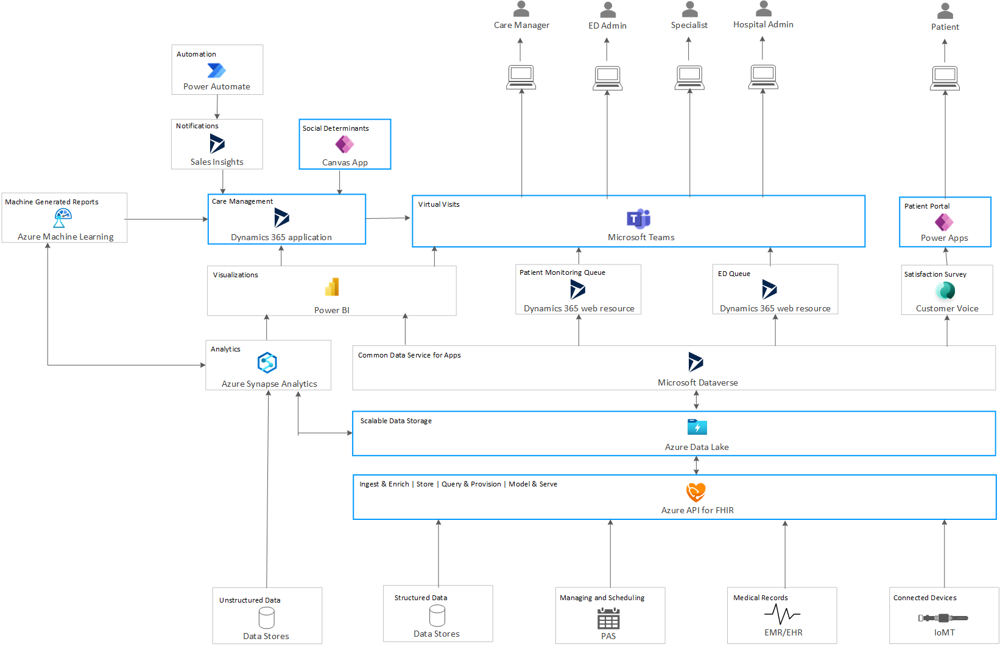

By using [Microsoft Cloud for Healthcare](/industry/healthcare/overview), you can build solutions to improve clinical and operational insights. This article discusses one such potential solution, and builds on the knowledge learned from [Virtual health on Microsoft Cloud for Healthcare](virtual-health-mch.yml).

## Architecture

*Download a [Visio file](https://arch-center.azureedge.net/clinical-insights-solution.vsdx) that contains this architecture diagram.*

In the architecture diagram and in this article the term **ED** refers to the emergency department of a healthcare facility—the department that specializes in emergency medicine and acute care of patients. 

As in [Virtual health on Microsoft Cloud for Healthcare](virtual-health-mch.yml), the blue-lined boxes in this architecture diagram represent the Microsoft services that are either the underlying services or add-ons required for [Microsoft Cloud for Healthcare](https://www.microsoft.com/industry/health/microsoft-cloud-for-healthcare?rtc=1). Each of these services is licensed separately.

As in the previous solution, data flows into this architecture through external medical systems, such as patient and provider schedules, medical records, wearable devices, and so on, and is then ingested by using Azure. This process can also ingest other structured data required for specific insights, such as financial data. This data is then stored in Microsoft Dataverse in the [Common Data Model (CDM)](/common-data-model) format, to be consumed by [Dynamics 365](https://dynamics.microsoft.com) and [Power BI](https://powerbi.microsoft.com) components in this solution.

### Dataflow

This solution supports the following data flows for each of the user groups shown in the diagram:

1. **Care manager**. Continuing from the virtual visit flow, the care manager can review current patient records through Teams, with the help of the patient monitoring queue. This Dynamics 365 application provides a list of patients along with an index score for each that indicates the urgency of attending to them. The care manager can select the patient with the highest index score, and view information such as medical records, care plan, and appointments, in the care management app. This app is also able to show insights into the patient's daily lifestyle by pulling in data such as heart rate from their registered IoMT device, in near real time. The app tracks the incoming device data and displays it with custom Power BI visualizations. Thresholds are set for each device metric and, if exceeded, Power Automate triggers a sales insights alert within the app. These thresholds and alerts can be set for each patient individually. If necessary, the care manager can call the patient directly from Teams, using the contact information stored in Dataverse.

1. **ED admin**. A patient that needs to visit the ED can coordinate the transportation with the care manager. An ED admin is responsible for the resources and schedules in the department. Resources such as bed usage, rooms, and personnel, as well as trends in intake and readmission events, are monitored with Power BI reports that are customized for the department and integrated with Teams. These reports are created using hospital and patient data stored in Dataverse, and analyzed by Azure Synapse. The ED queue, a custom Dynamics 365 web resource, displays a queue of incoming patients at various stages such as in-transit, check-in, intake, room assignment, and so on. The ED admin can use this information to triage patients based on their arrival times and medical conditions. A decision tree is created with Power Automate flows, which automate tasks required for patient care. Examples of such tasks are room or ICU assignment, medical equipment setup, ordering of required tests, and assignment to available medical staff. These reports and automated tasks support efficient patient care and ED management.

1. **Specialist physician**. The ED admin assigns a specialist physician to review the tests that are recommended for the patient. For example, if X-ray tests are required, a pulmonologist is assigned to review them. Saving the test results triggers Power Automate, which displays a Sales Insights alert in the physician's view of the care management app. Tests such as X-rays are considered unstructured data. This data is pulled into Azure Synapse through Azure Data Lake, and fed into a custom machine learning model to interpret the results. These interpretations can help the physician make the diagnosis and plan the care.

    The social determinants app, a [canvas app](/powerapps/maker/canvas-apps/getting-started) that's custom-built for this solution, provides insights into the patient's socio-economic conditions. This data can help the physician to prescribe a care plan that the patient is likely to follow. Power BI visualizations in the care management app display the treatment success trends for the patient's medical condition, using aggregated population health metrics, demographics, social factors, and other data available in the hospital records.  The app can be designed to use publicly available medical data from government-funded researches. These visualizations can help the physician choose the care plan with the best success rate. The data fed into these visualizations is pulled in through Azure Data Lake. The selected care plan is stored in Dataverse for later reference.

1. **Patient**. When discharged with the care plan, the patient is asked to answer a satisfaction survey on the patient portal. This is a [Customer Voice](/dynamics365/customer-voice/help-hub) form. The survey result is stored in Dataverse to generate operational insights about the healthcare facility.

    The patient uses the patient portal to view the care plan that the physician recommends. The portal can also provide educational material to help the patient understand the care plan.

1. **Hospital admin**. Power BI reports that are customized for the hospital admin provide insights on key healthcare metrics, such as patient readmission rates, length of stay, staff-to-patient ratio, patient satisfaction, and costs. These insights can help improve healthcare management. These reports are created using data aggregated by Azure Synapse from multiple systems, such as patient visit records, financial data, and sentiment scores gathered from patient surveys. The reports can assist the hospital admin in detecting operational shortages. For example, if a hospital has high readmission rates, the admin can use these reports to find the departments that have the most readmissions, and then troubleshoot and fix the underlying issues.

   The Power BI reports are integrated with Microsoft Teams so that they can easily be shared with other departments by using [Teams channels](/microsoftteams/teams-channels-overview), resulting in faster communication and better collaboration. Access to these reports can be controlled by setting permission levels by department or user.

### Components

Most of the components used in this solution are detailed in [Virtual health on Microsoft Cloud for Healthcare](virtual-health-mch.yml). The following components are also used:

- **Azure Synapse Analytics**. [Azure Synapse Analytics](https://azure.microsoft.com/services/synapse-analytics) is used to demonstrate how unstructured medical data such as diagnostic test results, patient data such as medical history, and day-to-day health metrics can be interpreted by machine learning algorithms. These machine-generated findings assist medical providers in diagnosing and treating patients.
- **Azure Data Lake Storage**. [Azure Data Lake Storage](https://azure.microsoft.com/services/storage/data-lake-storage) provides a fast and secure data warehouse for Azure Synapse Analytics. Unlike traditional data warehouses, once the large amount of data required for analytics is stored in Azure Data Lake, it's ready to be queried. This eliminates repeated loading.
- **Azure Machine Learning**. This solution uses [Azure Machine Learning](https://azure.microsoft.com/services/machine-learning) to demonstrate a potential use as a medical provider's assistant. It can be modeled to use [publicly available medical data](https://guides.lib.berkeley.edu/publichealth/healthstatistics/rawdata) and diagnostic test results to provide additional insights into the medical conditions of patients. The final diagnostic responsibility lies with the medical professional.
- **Power BI**. With [Power BI](https://powerbi.microsoft.com), visualizing large amounts of data makes it easier to assimilate insights and identify patterns or trends. See [Visualization types in Power BI](/power-bi/visuals/power-bi-visualization-types-for-reports-and-q-and-a) and [Visualizations in Power BI reports](/power-bi/visuals/power-bi-report-visualizations) to learn how to create different Power BI visualizations. You can use Microsoft Teams to share the visuals across departments to improve collaboration. See [Collaborate with Power BI in Microsoft Teams, Outlook, and Office](/power-bi/collaborate-share/service-collaborate-microsoft-teams) for more information.

  This solution uses Azure Synapse Analytics to create the following Power BI visualizations:
  - A [Power BI dashboard integrated with Teams](/workplace-analytics/tutorials/power-bi-teams#set-up-the-dashboard) for the ED that provides a snapshot of the following:
    - Number of patients waiting
    - Wait times
    - Bed status
    - Projected bed occupancy
    - Other ED metrics.
  - A population health dashboard that helps providers compare the effectiveness of treatment plans with similar demographics and conditions.
  - Cross-department analytics and reports for hospital administration.
- **Power Automate**. [Power Automate](https://powerplatform.microsoft.com/power-automate) provides a no-code and low-code platform to automate repetitive manual tasks. Every workflow that's created is specific to a business or scenario and, as such, is inherently customized. In this solution, Power Automate ingests data that's stored in Dataverse and runs automated flows to act on it, such as sending notifications when data changes. See [Create a cloud flow that uses Microsoft Dataverse](/power-automate/common-data-model-intro) for information about creating customized data-based flows.

  Power Automate flows are also used to automate procedures in the ED, such as room and staff assignments.
- **Dynamics 365 Sales Insights**. This solution uses [Sales Insights](/dynamics365/ai/sales/overview), a Dynamics 365 add-in, to provide alerts and notifications for the following events:
  - A patient's wearable device exceeds preset thresholds for health metrics, such as heart rate.
  - New diagnostic test results are available.

  These notifications are triggered from a [Power Automate flow](/power-automate/flow-types). See [Create custom insight cards](/dynamics365/ai/sales/create-insight-cards-flow) for information about creating automation flows that integrate with Sales Insights.
- **Patient monitoring queue**. This is a custom [Dynamics 365 web resource](/dynamics365/customerengagement/on-premises/customize/create-edit-web-resources), and isn't a part of Microsoft Cloud for Healthcare. It provides the care manager with aggregated patient data from multiple sources, and is a customized entry point for the care management app to access individual patient information. It's integrated with [Microsoft Teams](https://www.microsoft.com/microsoft-teams/group-chat-software) to provide a consistent platform. It also displays the urgency of medical attention for each patient, in the form of an index score. This score can be derived from the patient's device data and known medical conditions.
- **ED queue**. This is a custom Dynamics 365 web resource, and isn't a part of Microsoft Cloud for Healthcare. The ED admin uses this queue to retrieve medical information and arrival times of incoming patients, and also the urgency of their treatment. This helps the admin triage more efficiently and start automated workflows by using Power Automate to assign resources based on patient medical conditions.
- **Social determinants**. This is a [Power BI Canvas app](/powerapps/maker/canvas-apps/get-started-test-drive) that displays a patient's socio-economic factors to medical providers. This information is gathered using a standardized questionnaire, and helps predict how well the patient will adhere to the care plan. This data is gathered during a patient visit, and is stored in Dataverse to inform future decisions.
- **Customer voice**. [Dynamics 365 Customer Voice](/dynamics365/customer-voice/about) is an enterprise feedback management application. It's used to get patient feedback after an emergency hospital visit. This feedback can provide insights into the management of ED processes. The survey results are stored in Dataverse for use by the hospital admin for process improvements.
- **Unstructured data**. This block in the architecture diagram represents unstructured binary data such as X-ray results. This data may be stored in the existing EHR systems. It's ingested by Azure Data Lake for use by Azure Synapse.
- **Structured data**. This block represents any structured data not typically considered part of EMR/EHR or PAS systems that can be used to create insights for the hospital management. An example is the financial records of the healthcare organization.

### Alternatives

The alternatives listed in [Virtual health on Microsoft Cloud for Healthcare](virtual-health-mch.yml) are applicable to this architecture as well.

- The Dynamics 365 and Power BI applications used in this architecture are tightly integrated with Dataverse as their data source. If these are replaced by third-party applications, such as built-in EHR tools for patient monitoring and ED triages, they can interact with Dataverse by using its RESTful [API interface](/powerapps/developer/data-platform/work-with-data). Dataverse is a convenient data source for aggregated data and is used by multiple components such as Power BI, Power Automate, Synapse Analytics, Patient Portal, Teams, and so on.

- The components shown in the architecture diagram that don't have blue outlines need to be created or replaced by available tools, according to the needs of the healthcare organization.

## Scenario details

The healthcare industry has traditionally struggled to effectively use the vast amount of data it creates. Most of the medical data is unstructured and inaccessible for data driven decisions. When looking for insights, providers spend a considerable amount of time on data ingestion and unification. Healthcare organizations also face security and compliance pressures and risks of data breaches.

This solution uses Azure Data Lake to store the large amounts of data required for reporting and analytics. This data is analyzed by using Azure Synapse, for use by the machine learning module and Power BI visualizations. Synapse can also pull in unstructured data, such as X-ray images, and feed it into the machine learning algorithm to generate interpretations. These interpretations are stored in a Microsoft Word document, along with a snapshot of the image. This document is stored as a blob or file in Dataverse, for future reference.

### Potential use cases

This solution is ideal for the healthcare industry. The scenario also demonstrates the following capabilities, which are applicable to many industries:

- Gather structured and unstructured data from multiple sources, and visualize trends and insights using Power BI.
- Set up automated operational tasks based on these insights.
- Interpret the data from disparate systems by using machine learning, and assist various roles in the system.
- Share the data and insights securely, and collaborate with different departments and roles by using Microsoft Teams.

## Considerations

These considerations implement the pillars of the Azure Well-Architected Framework, which is a set of guiding tenets that can be used to improve the quality of a workload. For more information, see [Microsoft Azure Well-Architected Framework](/azure/architecture/framework).

### Security

Security provides assurances against deliberate attacks and the abuse of your valuable data and systems. For more information, see [Overview of the security pillar](/azure/architecture/framework/security/overview).

The security considerations for any architecture that uses Microsoft Cloud for Healthcare apply here. For example, see the security considerations discussed in [Virtual health on Microsoft Cloud for Healthcare](virtual-health-mch.yml#security).

### Cost optimization

Cost optimization is about looking at ways to reduce unnecessary expenses and improve operational efficiencies. For more information, see [Overview of the cost optimization pillar](/azure/architecture/framework/cost/overview).

Pricing considerations for this architecture are similar to those in [Virtual health on Microsoft Cloud for Healthcare](virtual-health-mch.yml#cost-optimization).

## Deploy this scenario

To deploy this solution, do steps one through four of [Virtual health on Microsoft Cloud for Healthcare](virtual-health-mch.yml#deploy-this-scenario).

The following are the additional components that are created specifically for this solution. You can choose to create similar applications, or to use tools provided by your current EHR system.

1. Patient monitoring queue
1. ED queue
1. Power BI reports and visualizations
1. Power Automate notifications for device thresholds and diagnostic test availability
1. Machine learning algorithms such as the machine-generated diagnostic findings
1. Social determinants and satisfaction survey apps

## Contributors

*This article is maintained by Microsoft. It was originally written by the following contributors.* 

Principal authors:

 - [Slavica Frljanic](https://www.linkedin.com/in/slavica-frljanic-91007b103) | Principal Group Program Manager
 - [Dhanashri Kshirsagar](https://www.linkedin.com/in/dhanashrikr) | Senior Content PM - 
 
*To see non-public LinkedIn profiles, sign in to LinkedIn.*

## Next steps

- [What is Microsoft Cloud for Healthcare?](/industry/healthcare/overview)
- [Azure for Healthcare—Healthcare Solutions](https://azure.microsoft.com/industries/healthcare)
- [Questionnaire to detect the socioeconomic conditions of patients](https://icd.who.int/browse10/2016/en#/Z55-Z65)
- [Azure Data Lake overview](/azure/storage/blobs/data-lake-storage-introduction)
- [Azure Machine Learning documentation](/azure/machine-learning)
- [Power Automate overview](/power-automate/getting-started)

## Related resources

- [Virtual health on Microsoft Cloud for Healthcare](virtual-health-mch.yml)
- [Consumer health portal on Azure](../digital-health/health-portal.yml)
- [HIPAA and HITRUST compliant health data AI](../../solution-ideas/articles/security-compliance-blueprint-hipaa-hitrust-health-data-ai.yml)
- [Health data consortium on Azure](..//data/azure-health-data-consortium.yml)
- [Confidential computing on a healthcare platform](../confidential/healthcare-inference.yml)
- [Baseline architecture for an Azure Kubernetes Service (AKS) cluster](/azure/architecture/reference-architectures/containers/aks/baseline-aks)
- [Predict hospital readmissions with traditional and automated machine learning techniques](../ai/predict-hospital-readmissions-machine-learning.yml)
- [Predict length of stay and patient flow](/azure/architecture/example-scenario/digital-health/predict-patient-length-of-stay)
- [Population health management for healthcare](../../solution-ideas/articles/population-health-management-for-healthcare.yml)
- [Precision medicine pipeline with genomics](../precision-medicine/genomic-analysis-reporting.yml)
- [IoT device connectivity for healthcare facilities](../../solution-ideas/articles/healthcare-network.yml)
- [Medical data storage solutions](../../solution-ideas/articles/medical-data-storage.yml)
- [Build a telehealth system on Azure](../apps/telehealth-system.yml)
- [IoT Connected Platform for COVID-19 detection and prevention](../../solution-ideas/articles/iot-connected-platform.yml)
- [Remote patient monitoring](/azure/architecture/example-scenario/digital-health/remote-patient-monitoring)