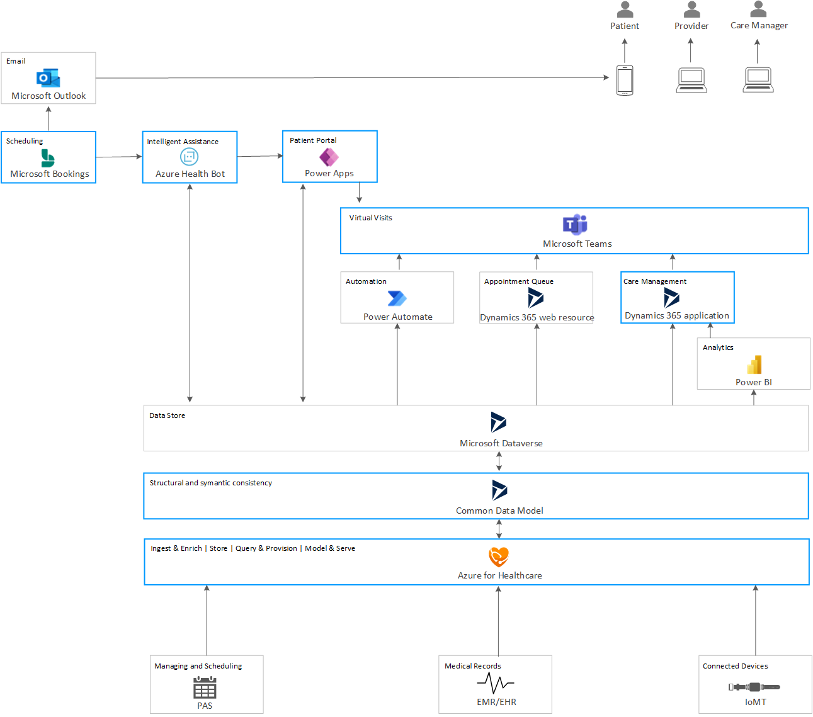

This article discusses a potential solution for scheduling and following up on virtual visits between patients, providers, and care managers.

## Architecture

_Download a [Visio file](https://arch-center.azureedge.net/virtual-health-solution.vsdx) that contains this architecture diagram._

In this architecture diagram, the blue-lined boxes represent the Microsoft services that are either the underlying services or add-ons required for [Microsoft Cloud for Healthcare](https://www.microsoft.com/industry/health/microsoft-cloud-for-healthcare?rtc=1), each of which must be licensed separately. These components together help speed up development of integrated healthcare solutions for patient engagement, health team collaboration, and improvement of clinical and operational data insights.

The data flows into the system through various external medical systems, such as patient and provider schedules, medical records, wearable devices, and so on. This data is ingested using Azure. It is then stored in the Microsoft Dataverse, a data store powered by the Power Apps Platform. This data is formatted to use entities and relationships between them, created using the [Common Data Model (CDM)](/common-data-model/), an industry standard to represent medical data. All interactions between patient, provider, and the care manager happen using this CDM data stored in Dataverse.

An established patient can log in securely to the Patient Portal, a website hosted in the Power Apps Portals. In this portal, the patient can talk to an *Intelligent Assistant*. This is an instance of the [Azure Health Bot service](/azure/health-bot/), which gathers their symptoms, provides suggestions, and recommends calling to the practitioner, if needed. If the patient chooses to connect to their medical provider, the health bot instance gets the data on providers available for virtual visits and their schedules, from the Dataverse. Once the patient selects a provider and a time, the bot presents their contact information, obtained from the *EMR/EHR* data stored in Dataverse. The patient can validate or change this information, and save the data using the bot.

To schedule an appointment, the health bot instance connects to the Bookings App using the [Microsoft Graph API](/graph/overview) and books an appointment on the provider's calendar. An email with the appointment information is sent to both the parties using Microsoft Outlook. The patient is given instructions to log in to the Patient Portal for the intake process. This process involves confirming or changing their contact, payment, and insurance information, and then signing a consent form for the virtual visit. Once they sign the consent, they are provided the Microsoft Teams link for the appointment.

The provider logs into Teams to check their appointment schedule and summary information for each. Teams presents this information using the *Appointment Queue* application. The provider is then able to start the virtual visit on Teams for the scheduled appointment. During the call, the provider can take notes and add them to the patient's records.

A new note on the patient's medical records triggers a review notification for the care manager assigned to the patient. When the care manager receives this notification, they can log in to Teams, where they are able to see the patients assigned to them, and view the notes. Through the Care Management app, they can make required changes to the patient's care plan.

### Components

The architecture consists of the following components:

- **PAS**. Patient Administration Systems (PAS) are systems that automate the administrative paperwork in healthcare organizations, such as hospitals. They are the core components of the IT infrastructure of such an organization. A PAS records the patient's demographics, such as name, home address, date of birth, and so on. It also records detailed information of all contact the patient had with the hospital, both outpatient and inpatient. With the help of PAS, modern hospitals are able to report and schedule resources across the organization. PAS is a key source of scheduling data in this solution. Since this data is external and may be in a non-standard format, it is important to convert it into a format that is understood by all components of this solution.

- **EMR/EHR**. [Electronic Medical Records (EMR)](https://digital.ahrq.gov/key-topics/electronic-medical-record-systems) and [Electronic Health Records (EHR)](https://www.healthit.gov/faq/what-electronic-health-record-ehr) provide the digital records of a patient's medical and health information, including diagnoses, medications, immunizations, and so on. They can be scoped to a single practice office, such as EMRs, or designed to scope much larger, traveling with the patients to whichever facility they go, such as the EHRs. These are important external data sources in this solution, and may be unstructured non-standard format. As such, this data needs to be converted to a format that can be used by the components in this solution.

- **Azure API for FHIR**. Azure is the first step in the process of bringing data into the Microsoft ecosystem and the Microsoft Cloud for Healthcare. This layer provides a secure interface between external data and internal components of this architecture. The Azure API for FHIR ingests the data coming from disparate sources such as EMR, PAS, devices, whether structured or unstructured, converts it into FHIR and persists in Azure. This data can then be used across the Microsoft Cloud for Healthcare for different services. The Azure API for FHIR is built with security and compliance in mind and designed for PHI (Protected Health Information) data. For more information on this layer, see [Azure for healthcare](https://azure.microsoft.com/industries/healthcare/) and the [Azure API for FHIR](https://azure.microsoft.com/services/health-data-services/)

- **Common Data Model**. With [Common Data Model](/common-data-model/), Microsoft provides a standardized metadata definition system that is extensible and customizable for specific business needs. CDM entities are available for subject areas such as, CRM, Healthcare, Talent, and so on. For details, read the [Common Data Model usage information](/common-data-model/use). In addition to these entities, customers can pull in proprietary data by defining that entity table and the underlying fields in the Common Data Model, which can then seamlessly be used with other entities throughout their solution.

- **Microsoft Dataverse**. [Dataverse](https://powerplatform.microsoft.com/dataverse), a relational database that powers Microsoft Dynamics 365, is the repository for the data represented in the Common Data Model. It holds databases for patient information, containing details about their names, family information, medical conditions, medication history, and so on. It also holds the information obtained from any wearable devices used and registered by the patients, as well as, scheduling and management data from the healthcare organization. This data is defined using the Common Data Model.

- **Patient Portal**. This [Power Apps portal](/dynamics365/industry/healthcare/use-patient-access#patient-portal) lets patients view their medical records, book appointments, chat with the health bot instance, and so on. This portal can be extended to support other data. This portal is part of Microsoft Cloud for Healthcare, and allows you to easily spin up a portal, which can connect with entities in Dataverse, pulling in data such as patient information, care plans, appointments, and so on.

- **Intelligent Assistance**. This is an instance of the [Azure Health Bot Service](https://azure.microsoft.com/services/bot-services/health-bot/), accessible to patients through the Patient Portal. This health bot instance is loaded within an Azure App Service website. It is customizable, and can be programmed using the scenarios required by the customers. For more information, read [Embed a health bot instance in your application](/azure/health-bot/integrations/embed).

- **Bookings App**. Bookings App is a Microsoft 365 service, included in the Microsoft Cloud for Healthcare. It facilitates scheduling of calendar events, and allows creating Teams meetings.

- **Microsoft Outlook**. This solution uses [Microsoft Outlook](https://www.outlook.com) as the email client. The Bookings App that sends the email notification is integrated with Outlook. Alternatively, the healthcare provider's preferred email client may be used.

- **Microsoft Teams**. [Microsoft Teams](https://www.microsoft.com/microsoft-teams) is a component of Microsoft Cloud for Healthcare, and provides the front end for interactions between the patients, providers, and care managers. Users can use a locally installed version or the web version. For more information on Teams, read the [Microsoft Teams documentation](/microsoftteams/).

- **Appointment Queue**. This tool generates an HTML page with data pulled out of the Dataverse, using the [Dynamics 365 Web API](/dynamics365/customer-engagement/web-api/about?view=dynamics-ce-odata-9). It presents the provider with information about the appointments scheduled for the day and summary about each. It also provides a link to access the patient information through the Care Management application. The Appointment Queue was developed to support this scenario, and is not a part of Microsoft Cloud for Healthcare. The data sources for this tool are mainly the PAS systems and EMR/EHR records. If these systems have tools integrated to present this data, those tools may be a replacement for this component in an actual deployment.

- **Care Management**. The Care Management tool is a component of Microsoft Cloud for Healthcare. It is a Power Apps application deployed through Dynamics 365. It pulls in the EMR/EHR patient data stored in the Dataverse in CDM format, and presents an aggregated view in Teams. A care center's solution might choose to use their own system for their functionality, depending on how they want to present this information.

- [**Power BI Analytics**](https://powerbi.microsoft.com). This is an analytics tool created for this scenario, and is not available with Microsoft Cloud for Healthcare. In this solution, it generates information derived from the patient's IoMT devices. This could be data such as heart rate, blood oxygen level, and so on. The Care Management app uses this data to present medical providers with additional insights about their patients based on their daily activities.

- **Connected devices**. These are *Internet of Medical Things (IoMT)* devices, which are smart devices for medical or healthcare use. Examples of IoMT devices include wearables such as Apple Watch or Fitbit, medical or vital monitors, and so on. Patients can provision their devices through Azure, and choose to allow their health care management system to gather this IoMT data for use by their providers. Providers can gain additional insights from such devices, in near real time, and link anomalies such as an elevated heart rate for a period of time, with patient's current symptoms.

- **Automation with Power Automate**. This is a custom tool created to support this scenario, and is not available with Microsoft Cloud for Healthcare. Since this is a virtual visit scenario, the provider might just be an on-call physician and not the patient's regular physician. This tool allows the provider's notes to trigger a Teams notification to the *care manager*. A care manager is the member of the medical team that works as the liaison between the primary care physician (PCP) and the patient, and takes care of long-term care management. A notification sent to the care manager, indicating new notes added for the patient, enables them to review and make appropriate changes in the patient's care management after the visit.

### Alternatives

Azure for healthcare services such as Azure API for FHIR and Azure Health Bot, Common Data Model interface, Microsoft Dataverse, and Microsoft Teams form the core components of this solution. Most other components of this system can be replaced by systems currently used by the healthcare facility:

- If the EMR/EHR system comes with built-ins for booking, scheduling, and care management, these built-ins can be used instead of the corresponding components in this solution.

- Bookings and Outlook scheduling and email notification could be swapped out by the systems used by the healthcare facility. These could be done via the EHR system, or using a third-party application. The application should provide an API that the health bot instance can use to create and schedule appointments, along with the capability to create virtual meetings.

- If the provider already has a patient portal implemented through their EMR/EHR system, it may be used instead of the Patient Portal. It is easy to integrate such an external component with this solution, since these components used standard interfaces, for example, an [iFrame](https://html.com/tags/iframe/) interface to communicate with the health bot instance. Components that support this flow can be created on the proprietary portal, such as the consent form that the patient needs to sign before joining the Teams meeting.

- It's worth noting that an actual deployment will need replacement tools for some components in this solution, such as the Appointment Queue, automated notifications, and Power BI analytics tools. These components will need to be created and customized for the healthcare provider's business needs.

## Scenario details

In the current COVID-19 (coronavirus) pandemic, a large number of patients might prefer to visit their medical providers virtually rather than in person, whenever possible. Improving clinical and operational insights in healthcare becomes important in such a virtual world. This includes connecting data from across systems, creating insights to predict risk and help improve patient care, quality assurance, and operational efficiencies.

The foundation for this solution is the [Microsoft Cloud for Healthcare](/industry/healthcare/overview). Microsoft Cloud for Healthcare brings together trusted capabilities from Microsoft 365, Azure, Dynamics 365, Power Platform, and Microsoft's extensive partner ecosystem to help healthcare organizations create fast, efficient, and secure healthcare solutions.

### Potential use cases

This solution is targeted to provide virtual patient care in the current pandemic. However, health care providers can easily apply it to the following scenarios:

- Scheduling virtual follow-ups to in person visits.

- Providing non-emergency medical guidance to patients while traveling.

## Considerations

These considerations implement the pillars of the Azure Well-Architected Framework, which is a set of guiding tenets that can be used to improve the quality of a workload. For more information, see [Microsoft Azure Well-Architected Framework](/azure/architecture/framework).

### Security

Security provides assurances against deliberate attacks and the abuse of your valuable data and systems. For more information, see [Overview of the security pillar](/azure/architecture/framework/security/overview).

Since the system is built around patient data, basic security considerations for private information should be applied when developing this solution:

- Only the required data should flow through the system at any given time. For example, pull in only that data from the EMR/EHR systems that is required to surface for the virtual visit scheduling and management. Review the established [HIPAA compliance rules](https://www.hhs.gov/hipaa/index.html) for guidance on where the patient data should be stored, what can be done with it, and who should have access to it. Be aware of the importance of compliance in healthcare while developing your solution. For further guidance, read [Compliance in Microsoft Cloud for Healthcare](/industry/healthcare/compliance-overview).

- Only authorized personnel should have access to patient data, and only to the data required for their role. At various points in the system, such as the Care Management and the analytics feeding into it, the Appointment Queue, or the notification systems, care should be taken to authenticate and authorize personnel, and limit their access to only the required patient information.

- Modules interacting with patients, such as the Intelligent Assistance and Bookings app, take in, store, and use patient data. Proper access control and authentication at these modules ensures privacy concerns are addressed.

Because of the nature of private data involved, [security](/industry/healthcare/security-overview) and [compliance](/industry/healthcare/compliance-overview) form the basic tenets of Microsoft Cloud for Healthcare.

This example also relies on the security rules set by Dynamics 365 and Teams:

- [Dynamics 365 security](/training/modules/recognize-dynamics-365-security/)
- [Microsoft Teams security](/microsoftteams/security-compliance-overview)

Individual services included in Microsoft Cloud for Healthcare provide their own layer of security and compliance:

- [Power Platform compliance and data privacy](/power-platform/admin/wp-compliance-data-privacy)
- [Dataverse security](/power-platform/admin/wp-security)

For custom security controls, consider using [Azure Active Directory](/azure/active-directory/fundamentals/active-directory-whatis) and [role-based access control](/azure/role-based-access-control/best-practices).

Finally, when implementing this solution, keep in mind the [best practices and guidance for developing secure Azure solutions](/azure/security/fundamentals/overview).

### Cost optimization

Cost optimization is about looking at ways to reduce unnecessary expenses and improve operational efficiencies. For more information, see [Overview of the cost optimization pillar](/azure/architecture/framework/cost/overview).

For detailed pricing information on Microsoft Cloud for Healthcare, see [How to buy Microsoft Cloud for Healthcare](/industry/healthcare/buy). The components that form the Microsoft Cloud for Healthcare, have their own licensing requirement, such as:

- [Microsoft 365 pricing plans](https://www.microsoft.com/microsoft-365/compare-microsoft-365-enterprise-plans)

- [Microsoft Dynamics 365 pricing](https://dynamics.microsoft.com/pricing/)

To recreate components in this architecture that were custom-made, consider the pricing information for the underlying services that you choose to use.

## Deploy this scenario

The solution should be deployed in stages:

1. Some products/services must be installed as the prerequisites for Microsoft Cloud for Healthcare. See the detailed list on [this article on licensing requirements](/dynamics365/industry/healthcare/licensing).

1. Microsoft Cloud for Healthcare can be deployed using instructions provided in the [Deploy Microsoft Cloud for Healthcare solutions powered by Dynamics 365](/dynamics365/industry/healthcare/deploy).

1. Microsoft Cloud for Healthcare provides basic components to jumpstart building a virtual health solution, such as, Patient Portal, Teams, Bookings, and so on. The data that will be used to power these building blocks, should be customized as per the business needs.

1. The components available in Microsoft Cloud for Healthcare and its prerequisites, should be customized to support the business needs:

    1. Power Automate flows should be created to support the care manager notifications.

    1. Patient Portal should be configured. Additional forms might need to be created for elements such as the check-in/consent forms. Read [Set up and configure a Patient Access portal](/dynamics365/industry/healthcare/configure-portals) for more information.

    1. Azure Health Bot service should be connected to the Dataverse database, and customized for its communication with patients. Read [Configure automatic chats using Microsoft Health Bot](/dynamics365/industry/healthcare/configure-chatbots) for more information.

    1. See [Configure sync with clinical data using Azure FHIR Sync Agent](/dynamics365/industry/healthcare/configure-sync-clinical-data) and [Embed Power BI reports for analytics](/dynamics365/industry/healthcare/configure-powerbi-reports) to understand some other configurations that may be required.

1. The additional components that were specifically created for this solution, are not available for production-grade usage. The healthcare facility may need to create its own version of these applications:

    1. Appointment Queue

    1. Automated notifications using Power Automate

    1. Reporting application using Power BI

## Contributors

*This article is maintained by Microsoft. It was originally written by the following contributors.*

Principal authors:

* [Slavica Frljanic](https://www.linkedin.com/in/slavica-frljanic-91007b103) | Principal Group Program Manager
* [Dhanashri Kshirsagar](https://www.linkedin.com/in/dhanashrikr) | Senior Content PM

*To see non-public LinkedIn profiles, sign in to LinkedIn.*

## Next steps

- [What is Microsoft Cloud for Healthcare?](/industry/healthcare/overview)
- Learn more about Azure for healthcare offerings at [Azure for Healthcare—Healthcare Solutions](https://azure.microsoft.com/industries/healthcare/)
- [Difference between EMR and EHR](https://www.healthit.gov/buzz-blog/electronic-health-and-medical-records/emr-vs-ehr-difference)
- [HIPAA compliance rules](https://www.hhs.gov/hipaa/index.html)
- [What is Azure API for FHIR?](/azure/healthcare-apis/fhir/overview)
- [What is Microsoft Dataverse?](/powerapps/maker/data-platform/data-platform-intro)
- [What is the Azure Health Bot Service?](/azure/health-bot/overview)
- [What is Power BI?](/power-bi/fundamentals/power-bi-overview)
- Learn how you can use [Microsoft Dynamics 365](/training/dynamics365/)

## Related resources

- [Clinical and medical insights using Microsoft Cloud for Healthcare](./medical-data-insights.yml)
- [Consumer health portal on Azure](../../example-scenario/digital-health/health-portal.yml)
- [HIPAA and HITRUST compliant health data AI](../../solution-ideas/articles/security-compliance-blueprint-hipaa-hitrust-health-data-ai.yml)
