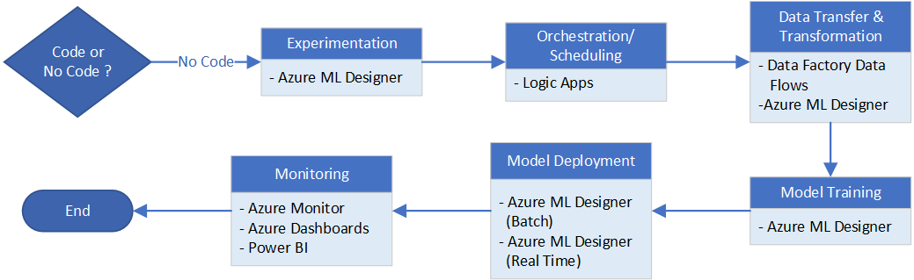
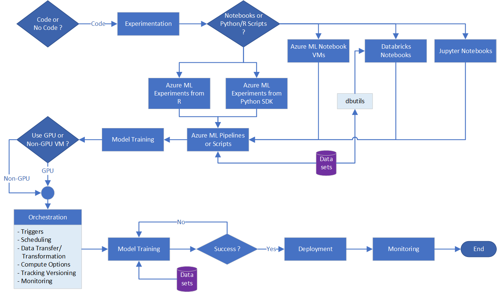

---
ms.custom:
  - devx-track-python
---
Microsoft Azure offers a myriad of services and capabilities. Building an end-to-end machine learning pipeline from experimentation to deployment often requires bringing together a set of services from across Azure. While it may be possible to have one pipeline do it all, there are tradeoffs when you don't use the services for what they're best at.

So, then you have to ask the question: When is it worth it to adopt each service for your use case? The answer often depends on different details that are not necessarily related to the functional requirements. The main factors are:

* The skillsets on your team.

* How the Azure service plugs into your existing architecture.

* The maintainability of the solution that you build using the service.

* The cost of these services at scale.

This document focuses on Azure services that you can use to support data or machine learning workloads. While not exhaustive, this document covers the most popular Azure service options for supporting the end-to-end workflow:

1. Experimentation

1. Overall Orchestration/Scheduling

1. Data Transfer

1. Data Transformation

1. Model Training

1. Model Deployment

1. Monitoring

## Services for each stage

Listed below are the service options that you should consider for each stage of an end-to-end machine learning pipeline:

### Service options

| Stage | Service options |
| ----- | --------------------- |
| Experimentation | [Azure Machine Learning Notebook VMs](https://azure.microsoft.com/blog/three-things-to-know-about-azure-machine-learning-notebook-vm/) [Databricks Notebooks](https://docs.databricks.com/notebooks/index.html) [Azure Machine Learning Experiment for Python SDK](/python/api/overview/azure/ml/) [Azure Data Science Virtual Machine (DSVM)](/azure/machine-learning/data-science-virtual-machine/) |
| Overall Orchestration / Scheduling | [Azure Logic Apps](/azure/logic-apps/logic-apps-overview) [Azure Data Factory](/azure/data-factory/introduction) [Azure Machine Learning Pipelines](/azure/machine-learning/concept-ml-pipelines) [Azure DevOps](/azure/devops/)  |
| Data Transfer | [Azure Data Factory Copy Activity](/azure/data-factory/copy-activity-overview) [Azure Machine Learning DataTransferStep](/python/api/azureml-pipeline-steps/azureml.pipeline.steps.data_transfer_step.datatransferstep) |
| Compute | [Databricks](/azure/azure-databricks/what-is-azure-databricks) [Azure Machine Learning Compute](/azure/machine-learning/concept-compute-instance) |
| Tracking / Versioning options | Experiment/Hyper-tuning Tracking: <ul>[Azure Machine Learning Experiments](/azure/machine-learning/studio/create-experiment) [Databricks and MLFLow Tracking](https://docs.databricks.com/applications/mlflow/quick-start.html)</ul> [Data Versioning/Data Drift: Azure Machine Learning Datasets](/azure/machine-learning/how-to-version-track-datasets)  Model Versioning:<ul>[Azure Machine Learning Model Management Service](/azure/machine-learning/concept-model-management-and-deployment) [Databricks and MLFlow Model Registry](https://databricks.com/blog/2019/10/17/introducing-the-mlflow-model-registry.html) </ul> |
| Model Training | [Azure Machine Learning Pipelines](/azure/machine-learning/concept-ml-pipelines) [Databricks](https://docs.databricks.com/data/index.html) |
| Model Deployment | [Batch Scoring in Azure Machine Learning Pipeline](/azure/machine-learning/tutorial-pipeline-batch-scoring-classification) [Real-time Deployment in Azure Machine Learning Service](/azure/machine-learning/how-to-deploy-managed-online-endpoints)<ul>[Azure Kubernetes Service (AKS)](/azure/aks/intro-kubernetes) [Azure Container Instance](/azure/container-instances/) [Azure App Service](/azure/app-service/) [Azure Functions](/azure/azure-functions/) [IoT Edge](/azure/iot-edge/about-iot-edge) [Azure Machine Learning Model Deployment](/azure/machine-learning/how-to-deploy-managed-online-endpoints)</ul> |
| Monitoring | [Azure Monitor](/azure/azure-monitor/overview)<ul>[Application Insights](/azure/azure-monitor/app/app-insights-overview) [Azure Dashboards](/azure/azure-monitor/learn/tutorial-app-dashboards)</ul>[Power BI](/power-bi/service-azure-and-power-bi) |

## Use No Code or Code implementation approach

The first decision you need to make is whether to use a *No Code* implementation approach or the traditional *Code* implementation approach. Each has its own benefits and tradeoffs.

### No Code

If you don't want to code your own solutions, a set of tools is available for building workflows without writing any code:

* For experimentation, use Azure Machine Learning Designer.

* For overall orchestration/scheduling, use Logic Apps, especially if integrating to Microsoft 365 suite.

* For data transfer and data transformation, use Data Factory Data Flows. If datasets are simple and on a small scale, Azure Machine Learning Designer can also handle them.

* For model training and model deployment, use Azure Machine Learning Designer. It supports both real-time and batch deployments.

* For monitoring, use Azure Monitor with Azure Dashboards, which lets you click to pin visuals and set up alerts without code. For more configuration, you can use Power BI to create historical dashboards.

The primary issue you'll come across here is that you must work within the constraints of the services. However, if your use case fits within these limitations, these services could be a good solution for you. They're always evolving and their capabilities will expand over time. So you should familiarize yourself with their latest features at the time you consider them. This diagram summarizes the process for the No Code option.

### Code

If you want to code or need the flexibility that a coded solution offers, all of the options described have a "code-like" interface. The options also have a representation of processing logic that you can export to JSON or YAML format and check in the exported files to a code repository. From there, deployment is handled through Azure DevOps or scripts. This diagram summarizes the Code option process.

## Experimentation: Notebooks vs. Python/R scripts

Depending on the skillsets or comfort level of your team's data scientists/engineers with notebooks or plain scripts, there are choices for experimentation that support both options.

### Notebooks

| Type | Description |
| ---- | ----------- |
| Azure Machine Learning Notebook VMs | Azure Machine Learning manages them. The data scientist only navigates to the link to interact with Jupyter notebooks. 1 VM backs them. You can stop and start the VM at will. The Notebook VM uses Azure Machine Learning SDKs to interact with data stored in Azure. This option allows you to pick the **Compute instance** option needed for experimentation based on memory, CPU, or GPU needs. |
| Databricks Notebooks | Azure Databricks workspace stores them with the help of Git integration. To use it, set up a cluster to run Databricks Notebooks. They use built-in _dbutils_ to access data stored in Azure. They cost more than Azure Machine Learning Notebook VMs. |
| Jupyter Notebook | See _Azure Machine Learning Notebook VMs_ above. |

### Python/R scripts

| Type | Description |
| ---- | ----------- |
| Azure Machine Learning Experiment from Python SDK | If you're using Python or scripts, you can submit them directly to Azure Machine Learning as steps in a pipeline. You can also run a Databricks Notebook or another method of stepping through this method, but you still need to create the actual pipeline using scripts of some kind. If you go this route, you'll have to upskill your engineers in Azure Machine Learning Pipelines. A benefit is that you can leverage dataset connections to existing data in Azure.  Note that pipeline startup cost can be prohibitive to iterating quickly. |
| DSVM | A *catch all* for teams who want to have a GPU or non-GPU VM with standard machine learning frameworks pre-installed, but full flexibility in what tooling to use for coding. There's a low amount of upskilling needed. |
| Local experimentation | If you don't require compute power in the cloud, local experimentation is also an option. |

## Overall Orchestration and Scheduling

### Trigger Options

The next table lists which Azure services are best for supported trigger options.

| Triggered by | Service/System |
| ------------ | -------------- |
| Code | Azure DevOps |
| Schedule | Azure Machine Learning Pipelines (can only trigger itself) |
| Data/schedule | Azure Data Factory |
| Events/alerts/other non-Azure products | Azure Logic Apps |

### Trigger options with scheduling

This table adds scheduling options to the triggers.

|   | Azure DevOps | Azure Machine Learning Pipeline | Azure Data Factory | Logic Apps |
| - | ------------ | ------------------------------- | ------------------ | ---------- |
| **Schedule** | Cron schedule | Recurrence-Based (run at these hours on these days) | Recurrence-Based + Additional Support for Tumbling Windows| Recurrence-based |
| **Event-based Trigger** | Pull request, branch, and build completion triggers. Artifact triggers not available in new YAML builds. | None. | Blob creation and blob deletion events only. | Many triggers from Microsoft and non-Microsoft services. Twitter, Dropbox, SharePoint, and so on. |
| **Manual Intervention or Approval Based** | Yes, limited. | No. | No. | No. |
| **Integration with Other Orchestrators** | Yes, limited. Supports deployment to most Azure Services. Can call and wait Azure Machine Learning Pipeline from Agentless task. | No built-in support for Azure DevOps, Azure Data Factory, or Logic Apps. | Yes, limited. Can run Azure Machine Learning Pipeline. | Yes, limited. Can trigger Azure DevOps build. Can fire and forget trigger Azure Data Factory. No integration with Azure Machine Learning Pipeline. |

### Data Transfer Options

| Type | Description |
| ---- | ----------- |
| Azure Data Factory Copy Activity | Large Scale (GBs to TBs) with many options for source and sinks. |
| Azure Machine Learning DataTransferStep | Small Scale (MBs to GBs) with limited options for source and sinks. |

### Compute Options

| Type | Description |
| ---- | ----------- |
| Azure Machine Learning Compute Instance| Scalable compute instances that work for GPU or non-GPU clusters. You run Python or R code in configurable [Conda environments](https://docs.conda.io/projects/conda/en/latest/user-guide/concepts/environments.html) managed by Azure Machine Learning. It helps scale out multiple jobs but doesn't handle distributed data partitioning/execution except in unique cases. |
| Databricks | A scalable compute instance that handles distributed data partitioning/job execution on top of Spark. Big data jobs will likely execute faster on Databricks. You have to manage dependencies and environments. Compute for Databricks is more expensive. |
| Azure Synapse (preview) | Open-source Spark/RDD processing, distributed. (Big Data Analytics) |
| Big Data Cluster/SQL 2019 | Big Data Analytics |

### Tracking and Versioning options

| Type | Description |
| ---- | ----------- |
| Experiment/Hyper-tuning Tracking | Azure Machine Learning Experiments Databricks and MLFLow Tracking |
| Data Versioning/Data Drift | Azure Machine Learning Datasets |
| Model Versioning | Azure Machine Learning Model Management Service Databricks and MLFlow Model Registry |

### Model Training options

| Type | Description |
| ---- | ----------- |
| Option 1 | Azure Machine Learning Pipelines |
| Option 2 | Databricks |

### Model deployment options

| Type | Description |
| ---- | ----------- |
| Batch Scoring in Azure Machine Learning Pipeline | Batch Deployment and Scoring in Azure Machine Learning Pipeline |
| Real-time Deployment in Azure Machine Learning Service | Azure Machine Learning Service supports real-time deployment and scoring using:<ul>AKS Azure Container Instance Azure App Service Azure Functions IoT Edge and more </ul>

### Monitoring options

| Type | Description |
| ---- | ----------- |
| Azure Monitor | Application Insights Azure Dashboards |
| Power BI | Analytics and Reports |

## Next steps

- [Training: Introduction to machine learning](/training/modules/introduction-to-machine-learning)
- [Azure Machine Learning documentation](/azure/machine-learning)
- [What is Azure Machine Learning?](/azure/machine-learning/overview-what-is-azure-machine-learning)
- [Tutorial: Azure Machine Learning in a day](/azure/machine-learning/tutorial-azure-ml-in-a-day)

## Related resources

- [Technical Paper: MLOps framework to upscale machine learning lifecycle with Azure Machine Learning](mlops-technical-paper.yml)
- [MLOps maturity model](mlops-maturity-model.yml)
- [Compare Microsoft machine learning products and technologies](../../data-guide/technology-choices/data-science-and-machine-learning.md)
- [MLflow and Azure Machine Learning](/azure/machine-learning/concept-mlflow)
- [Artificial intelligence (AI) architecture design](../../data-guide/big-data/ai-overview.md)
- [How Azure Machine Learning works: resources and assets](/azure/machine-learning/concept-azure-machine-learning-v2)
