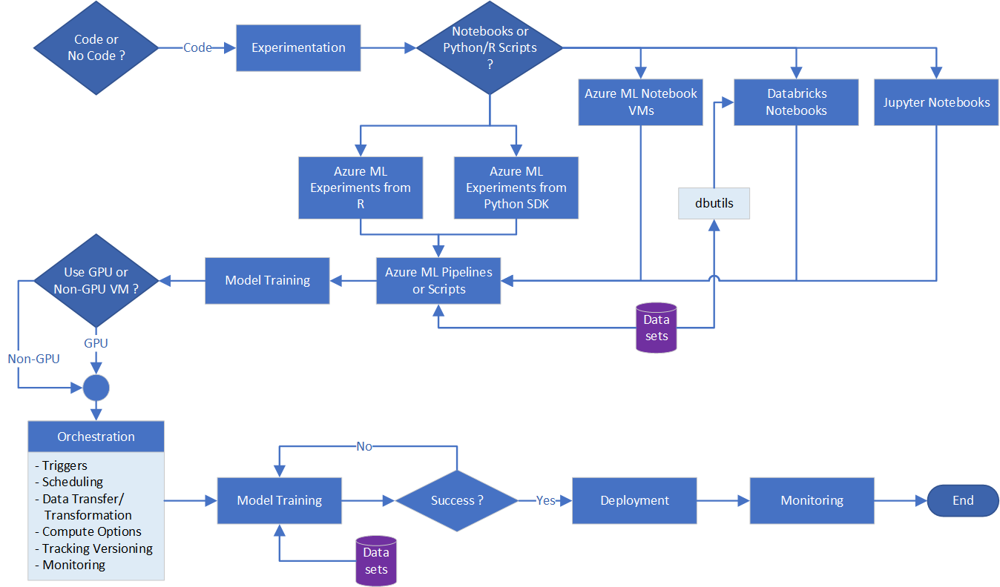

# Azure Machine Learning Development: Decision Guide for Optimal Tool Selection

## Introduction

Microsoft Azure offers a myriad of services and capabilities. Building an end-to-end machine learning pipeline from experimentation to deployment often requires bringing together a set of services from across Azure. While it may be possible to have one pipeline “do it all,” so to speak, there are tradeoffs when not utilizing the services for what they are best at.

So, when is it worth it to adopt each service for your use case? The answer is that it often depends on a variety of factors that are not necessarily related to the functional requirements. The main factors are:

* The skill sets on the team

* How the Azure service plugs into the existing architecture in place

* The maintainability of the solution build using this service

* The cost of these services at scale

### Scope

The scope of this document is focused on Azure services that are used to support data or machine learning workloads. This document does not consider third-party solutions available through Azure Marketplace. While not exhaustive, this document covers the most popular options on Azure for supporting the end to end workflow:

1. Experimentation

1. Overall Orchestration/Scheduling

1. Data Transfer

1. Data Transformation

1. Model Training

1. Model Deployment

1. Monitoring

## Options Considered

As mentioned, Azure offers many services and capabilities but this document is not exhaustive. Listed below are the Azure services options that were considered under each category.

### TABLE 1 - OPTIONS CONSIDERED

| Category | Options |
| -------- | ------- |
| Experimentation | [Azure Machine Learning Notebook VMs](https://azure.microsoft.com/blog/three-things-to-know-about-azure-machine-learning-notebook-vm/) [Databricks Notebooks](https://docs.databricks.com/notebooks/index.html) [Azure Machine Learning Experiment for Python SDK](/python/api/overview/azure/ml/) [DSVM](/azure/machine-learning/data-science-virtual-machine/) |
| Overall Orchestration / Scheduling | [Logic Apps](/azure/logic-apps/logic-apps-overview) [Azure Data Factory](/azure/data-factory/introduction) [Azure Machine Learning Pipelines](/azure/machine-learning/concept-ml-pipelines) [Azure DevOps](/azure/devops/)  |
| Data Transfer | [Azure Data Factory Copy Activity](/azure/data-factory/copy-activity-overview) [Azure Machine Learning DataTransferStep](/python/api/azureml-pipeline-steps/azureml.pipeline.steps.data_transfer_step.datatransferstep) |
| Compute | [Databricks](/azure/azure-databricks/what-is-azure-databricks) [Azure Machine Learning Compute](/azure/machine-learning/concept-compute-instance) |
| Tracking / Versioning options | Experiment/Hyper-tuning Tracking: <ul>[Azure Machine Learning Experiments](/azure/machine-learning/studio/create-experiment) [Databricks & MLFLow Tracking](https://docs.databricks.com/applications/mlflow/quick-start.html)</ul> [Data Versioning/Data Drift: Azure Machine Learning Datasets](/azure/machine-learning/how-to-version-track-datasets)  Model Versioning:<ul>[Azure Machine Learning Model Management Service](/azure/machine-learning/concept-model-management-and-deployment) [Databricks & MLFlow Model Registry](https://databricks.com/blog/2019/10/17/introducing-the-mlflow-model-registry.html) </ul> |
| Model Training | [Azure Machine Learning Pipelines](/azure/machine-learning/concept-ml-pipelines) [Databricks](https://docs.databricks.com/data/index.html) |
| Model Deployment | [Batch Scoring in Azure Machine Learning Pipeline](/azure/machine-learning/tutorial-pipeline-batch-scoring-classification) [Real-time Deployment in Azure Machine Learning Service](/azure/machine-learning/how-to-deploy-and-where)<ul>[AKS (Azure Kubernetes Service)](/azure/aks/intro-kubernetes) [Azure Container Instance](/azure/container-instances/) [Azure App Service](/azure/app-service/) [Azure Functions](/azure/azure-functions/) [IoT Edge](/azure/iot-edge/about-iot-edge) [and more](/azure/machine-learning/how-to-deploy-and-where)</ul> |
| Monitoring | [Azure Monitor](/azure/azure-monitor/overview)<ul>[Application Insights](/azure/azure-monitor/app/app-insights-overview) [Azure Dashboards](/azure/azure-monitor/learn/tutorial-app-dashboards)</ul>[Power BI](/power-bi/service-azure-and-power-bi) |

## Decision Tree

### Code or No Code

The first decision is whether to use a No Code implementation approach or the traditional Code approach. Each has its own tradeoffs.

### No Code

For those who do not want to code their own solutions, a set of tools is available for building workflows without writing any code. These include:

* For Experimentation, use Azure Machine Learning Designer.

* For Overall Orchestration/Scheduling, use Logic Apps, especially if integrating to Office 365 suite (Outlook, etc.)

* For Data Transfer and Data Transformation, use Data Factory Data Flows. If datasets are very simple and smaller scale, they can also be handled in Azure Machine Learning Designer.

* For Model Training and Model Deployment, use Azure Machine Learning Designer. It supports both real-time and batch deployments.

* For Monitoring, use Azure Monitor with Azure Dashboards, which lets you click to pin visuals and set up alerts without code. For more configuration, Power BI can also be used to create historical dashboards.

The primary issue you’ll encounter here is that you must work within the constraints of the tools. However, if your use case fits within these limitations, this could be a good solution.
These tools are evolving, and their capabilities will expand over time. So you should familiarize yourself with their latest features at the time you consider them. Figure 1 summarizes the process for the No Code option.

*FIGURE 1 - NO CODE OPTION*

### Code

For those who want to code or need the flexibility that a coded solution offers, all the options described have a “code-like” interface. Or, at least a representation of processing logic that can be exported to JSON or YAML format and can be checked into a code repository. From there, deployment can be handled through Azure DevOps or scripts. Figure 2 summarizes the Code option process.

*FIGURE 2 - CODE OPTION*

## Experimentation: Notebooks vs. Python/R Scripts

Based on the skillsets or comfort level of your team’s data scientists/engineers with notebooks or plain scripts, there are choices for experimentation that support both options.

### TABLE 2 - NOTEBOOKS

| Type | Description |
| ---- | ----------- |
| Azure Machine Learning Notebook VMs | These are managed by Azure ML, and the data scientist only navigates to the link to interact with Jupyter notebooks. Backed by 1 VM that can be stopped and started. Use Azure ML SDKs to interact with data stored in Azure. This option allows you to pick the _compute instance_ needed for experimentation based on memory, CPU, or GPU needs. |
| Databricks Notebooks | These are stored in Azure Databricks workspace with Git integration. Requires setting up cluster to run notebooks. Use built-in _dbutils_ to access data stored in Azure. Costs more. |
| Jupyter Notebook | See _Azure Machine Learning Notebook_ VMs above. |

### TABLE 3 - PYTHON/R SCRIPTS

| Type | Description |
| ---- | ----------- |
| Azure Machine Learning Experiment from Python SDK | If using Python or scripts, they can be directly submitted to Azure ML as steps in a pipeline. You can technically also run a Databricks Notebook or other method of stepping through this method, but the actual pipeline creation still needs to be done using scripts of some kind. Requires upskilling engineer in Azure ML Pipelines. Can leverage dataset connections to existing data in Azure.  Pipeline startup cost can be prohibitive to iterating quickly.
| DSVM | This is a *catch all* for those who want to have a GPU or non-GPU VM with standard machine learning frameworks pre-installed, but full flexibility in what tooling to use for coding. Low amount of upskilling needed. |
| Locally | If not requiring compute power in the cloud, local experimentation is also an option. |

## Overall Orchestration/Scheduling

Table 4 lists which systems are best for supported trigger options while Table 5 adds scheduling options.

### TABLE 4 - TRIGGER OPTIONS

| Triggered by | Service/System |
| ------------ | -------------- |
| Code | Azure DevOps |
| Schedule | Azure Machine Learning Pipelines (can only trigger itself) |
| Data/schedule | Azure Data Factory |
| Events/alerts/other non-Azure products | Logic Apps |

### TABLE 5 - TRIGGERS/SCHEDULING

|   | Azure DevOps | Azure ML Pipeline | Azure Data Factory | Logic Apps |
| - | ------------ | ----------------- | ------------------ | ---------- |
| **Schedule** | Cron schedule | Recurrence-Based (run at these hours on these days) | Recurrence-Based + Additional Support for Tumbling Windows| Recurrence-based |
| **Event Based Trigger** | Pull request, branch and build completion triggers. Artifact triggers not available in new YAML builds. | None. | Blob creation and blob deletion events only. | Many triggers from Microsoft and non-Microsoft services. Twitter, Dropbox, SharePoint, etc. |
| **Manual Intervention or Approval Based** | Yes, limited. | No. | No. | No. |
| **Integration with Other Orchestrators** | Yes, limited. Supports deployment to most Azure Services. Can call and wait Azure ML Pipeline from Agentless task. | No built-in support for Azure DevOps, Azure Data Factory, or Logic Apps. | Yes, limited. Can run Azure ML Pipeline. | Yes, limited. Can trigger Azure DevOps build. Can fire and forget trigger Azure Data Factory. No integration with Azure ML Pipeline. |

### TABLE 6 - DATA TRANSFER OPTIONS

| Type | Description |
| ---- | ----------- |
| Azure Data Factory Copy Activity | Large Scale (GBs to TBs) & more options for source and sinks. |
| Azure Machine Learning DataTransferStep | Smaller Scale (MBs to GBs) with limited options for source and sinks. |

### TABLE 7 - COMPUTE OPTIONS

| Type | Description |
| ---- | ----------- |
| Azure Machine Learning Compute | Scalable compute that works for GPU or non-GPU cluster. Python or R code is run in configurable Conda environments managed by Azure ML. Helps scale out multiple jobs but does not handle distributed data partitioning/execution except in unique cases. |
| Databricks | Scalable compute that handles distributed data partitioning/job execution on top of Spark. Big data jobs will likely execute faster on Databricks. Dependency and environments are managed by user. Compute for Databricks is more expensive. |
| Azure Synapse (preview) | Open source Spark/RDD processing, distributed. (Big Data Analytics) |
| Big Data Cluster/SQL 2019 | Big Data Analytics |

### TABLE 8 - TRACKING/VERSIONING

| Type | Description |
| ---- | ----------- |
| Experiment/Hyper-tuning Tracking| Azure Machine Learning Experiments Databricks & MLFLow Tracking |
| Data Versioning/Data Drift | Azure Machine Learning Datasets |
| Model Versioning | Azure Machine Learning Model Management Service Databricks & MLFlow Model Registry |

### TABLE 9 - MODEL TRAINING OPTIONS

| Type | Description |
| ---- | ----------- |
| Option 1 | Azure Machine Learning Pipelines |
| Option 2 | Databricks |

### TABLE 10 - MODEL DEPLOYMENT OPTIONS

| Type | Description |
| ---- | ----------- |
| Batch Scoring in Azure ML Pipeline | Batch Deployment & Scoring in Azure Machine Learning Pipeline |
| Real-time Deployment in Azure ML Service | Azure Machine Learning Service supports real-time deployment and scoring using:<ul>AKS (Azure Kubernetes Service) Azure Container Instance Azure App Service Azure Functions IoT Edge and more </ul>

### TABLE 11 - MONITORING

| Type | Description |
| ---- | ----------- |
| Azure Monitor | Application Insights Azure Dashboards |
| Power BI | Analytics & Reports |

## Resources

* [Technical White Paper: MLOps Framework for Upscaling ML Lifecycle with Azure ML](./mlops-white-paper.md)
* Reference Architecture Document: MLOps Framework for Upscaling ML Lifecycle with Azure ML
* [MLOps Maturity Model](./mlops-maturity-model.md)

## Credits

Xinyi Joffre  
