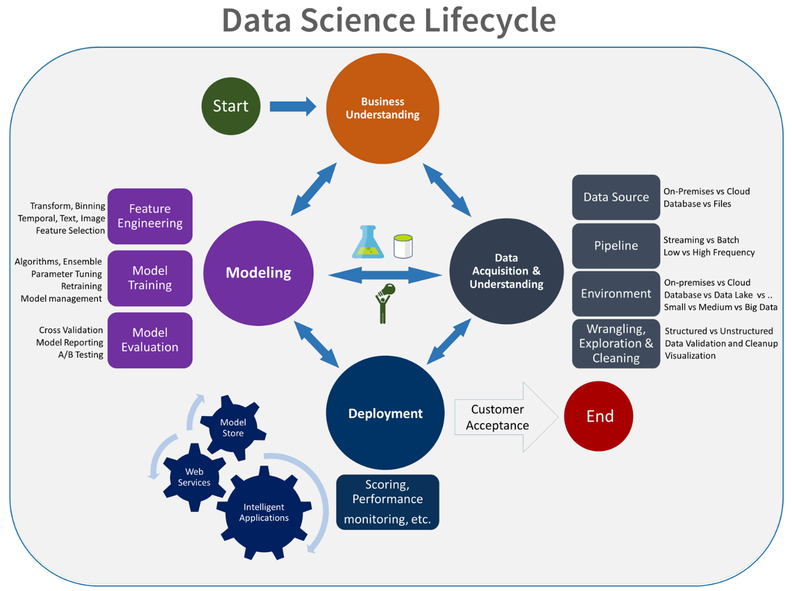
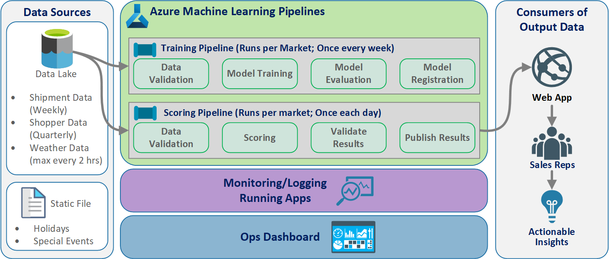

This client project helped a Fortune 500 food company improve its demand forecasting. The company ships products directly to multiple retail outlets. The improvement helped them optimize the stocking of their products in different stores across several regions of the United States. To achieve this, Microsoft's Commercial Software Engineering (CSE) team worked with the client's data scientists on a pilot study to develop customized machine learning models for the selected regions. The models take into account:

* Shopper demographics
* Historical and forecasted weather
* Past shipments
* Product returns
* Special events

The goal to optimize stocking represented a major component of the project and the client realized a significant sales lift in the early field trials. Also, the team saw a 40% reduction in forecasting mean absolute percentage error (MAPE) when compared with a historical average baseline model.

A key part of the project was figuring out how to scale up the data science workflow from the pilot study to a production level. This production-level workflow required the CSE team to:

* Develop models for many regions.
* Continuously update and monitor performance of the models.
* Facilitate collaboration between the data and engineering teams.

The typical data science workflow today is closer to a one-off lab environment than a production workflow. An environment for data scientists must be suitable for them to:

* Prepare the data.
* Experiment with different models.
* Tune hyperparameters.
* Create a build-test-evaluate-refine cycle.

Most tools that are used for these tasks have specific purposes and aren't well suited to automation. In a production level machine learning operation, there must be more consideration given to application lifecycle management and DevOps.

The CSE team helped the client scale up the operation to production levels. They implemented various aspects of continuous integration (CI)/continuous delivery (CD) capabilities and addressed issues like observability, and integration with Azure capabilities. During the implementation, the team uncovered gaps in existing MLOps guidance. Those gaps needed to be filled so that MLOps was better understood and applied at scale.

Understanding MLOps practices helps organizations ensure that the machine learning models that the system produces are production quality models that improve business performance. When MLOps is implemented, the organization no longer has to spend as much of their time on low-level details relating to the infrastructure and engineering work that's required to develop and run machine learning models for production level operations. Implementing MLOps also helps the data science and software engineering communities to learn to work together to deliver a production-ready system.

The CSE team used this project to address machine learning community needs by addressing issues like developing an MLOps maturity model. These efforts were aimed at improving MLOps adoption by understanding the typical challenges of the key players in the MLOps process.

## Engagement and technical scenarios

The engagement scenario discusses the real-world challenges that the CSE team had to solve. The technical scenario defines the requirements to create an MLOps lifecycle that's as reliable as the well established DevOps lifecycle.

### Engagement scenario

The client delivers products directly to retail market outlets on a regular schedule. Each retail outlet varies in its product usage patterns, so product inventory needs to vary in each weekly delivery. Maximizing sales and minimizing product returns and lost sales opportunities are the goals of the demand forecasting methodologies that the client uses. This project focused on using machine learning to improve the forecasts.

The CSE team divided the project into two phases. Phase 1 focused on developing machine learning models to support a field-based pilot study on the effectiveness of machine learning forecasting for a selected sales region. The success of Phase 1 led to Phase 2, in which the team scaled up the initial pilot study from a minimal group of models that supported a single geographic region to a set of sustainable production-level models for all of the client's sales regions. A primary consideration for the scaled up solution was the need to accommodate the large number of geographic regions and their local retail outlets. The team dedicated the machine learning models to both large and small retail outlets in each region.

The Phase 1 pilot study determined that a model dedicated to one region's retail outlets could use local sales history, local demographics, weather, and special events to optimize the demand forecast for the outlets in the region. Four ensemble machine learning forecasting models served market outlets in a single region. The models processed data in weekly batches. Also, the team developed two baseline models using historical data for comparison.

For the first version of the scaled up Phase 2 solution, the CSE team selected 14 geographic regions to participate, including small and large market outlets. They used more than 50 machine learning forecasting models. The team expected further system growth and continued refinement of the machine learning models. It quickly became clear that this wider-scaled machine learning solution is sustainable only if it's based on the best practice principles of DevOps for the machine learning environment.

| Environment | Market Region | Format | Models | Model Subdivision | Model Description |
| ----------- | ------------- | ------ | ------ | ----------------- | ----------------- |
| Dev environment | Each geographic market/region (for example North Texas) | Large format stores (supermarkets, big box stores, and so on) | Two ensemble models | Slow moving products | Slow and fast both have an ensemble of a least absolute shrinkage and selection operator (LASSO) linear regression model and a neural network with categorical embeddings |
|  |  |  |  | Fast moving products | Slow and fast both have an ensemble of a LASSO linear regression model and a neural network with categorical embeddings
|  |  |  | One ensemble model | N/A | Historical average |
|  |  | Small format stores (pharmacies, convenience stores, and so on) | Two ensemble models | Slow moving products | Slow and fast both have an ensemble of a LASSO linear regression model and a neural network with categorical embeddings |
|  |  |  |  | Fast moving products | Slow and both have an ensemble of a LASSO linear regression model and a neural network with categorical embeddings
|  |  |  | One ensemble model | N/A | Historical average |
|  | Same as above for an additional 13 geographic regions |  |  |  |  |
| Same as above for the prod environment |  |  |  |  |  |

The MLOps process provided a framework for the scaled up system that addressed the full lifecycle of the machine learning models. The framework includes development, testing, deployment, operation, and monitoring. It fulfills the needs of a classic CI/CD process. However, because of its relative immaturity compared to DevOps, it became evident that existing MLOps guidance had gaps. The project team worked to fill in some of those gaps. They wanted to provide a functional process model that insures the viability of the scaled up machine learning solution.

The MLOps process that was developed from this project made a significant real-world step to move MLOps to a higher level of maturity and viability. The new process is directly applicable to other machine learning projects. The CSE team used what they learned to build a draft of an [MLOps maturity model](mlops-maturity-model.yml) that anyone can apply to other machine learning projects.

### Technical scenario

MLOps, also known as DevOps for machine learning, is an umbrella term that encompasses philosophies, practices, and technologies that are related to implementing machine learning lifecycles in a production environment. It's still a relatively new concept. There have been many attempts to define what MLOps is and many people have questioned whether MLOps can subsume everything from how data scientists prepare data to how they ultimately deliver, monitor, and evaluate machine learning results. While DevOps has had years to develop a set of fundamental practices, MLOps is still early in its development. As it evolves, we discover the challenges of bringing together two disciplines that often operate with different skill sets and priorities: software/ops engineering, and data science.

Implementing MLOps in real-world production environments has unique challenges that must be overcome. Teams can use Azure to support MLOps patterns. Azure can also provide clients with asset management and orchestration services for effectively managing the machine learning lifecycle. Azure services are the foundation for the MLOps solution that we describe in this article.

## Machine learning model requirements

Much of the work during the Phase 1 pilot field study was creating the machine learning models that the CSE team applied to the large and small retail stores in a single region. Notable requirements for the models included:

* Use of the Azure Machine Learning service.
* Initial experimental models that were developed in Jupyter notebooks and implemented in Python.

    > [!NOTE]
    > Teams used the same machine learning approach for large and small stores, but the training and scoring data depended on the size of the store.
* Data that requires preparation for model consumption.
* Data that's processed on a batch basis rather than in real time.
* Model retraining whenever code or data changes, or the model goes stale.
* Viewing of model performance in Power BI dashboards.
* Model performance in scoring that's considered significant when MAPE <= 45% when compared with a historical average baseline model.

## MLOps requirements

The team had to meet several key requirements to scale up the solution from the Phase 1 pilot field study, in which only a few models were developed for a single sales region. Phase 2 implemented custom machine learning models for multiple regions. The implementation included:

* Weekly batch processing for large and small stores in each region to retrain the models with new datasets.
* Continuous refinement of the machine learning models.
* Integration of the development/test/package/test/deploy process common to CI/CD in a DevOps-like processing environment for MLOps.

  > [!NOTE]
  > This represents a shift in how data scientists and data engineers have commonly worked in the past.
* A unique model that represented each region for large and small stores based on store history, demographics, and other key variables. The model had to process the entire dataset to minimize the risk of processing error.
* The ability to initially scale up to support 14 sales regions with plans to scale up further.
* Plans for additional models for longer term forecasting for regions and other store clusters.

## Machine learning model solution

The machine learning lifecycle, also known as the data science lifecycle, fits roughly into the following high-level process flow:

*Deploy Model* here can represent any operational use of the validated machine learning model. Compared to DevOps, MLOps presents the additional challenge of integrating the machine learning lifecycle into the typical CI/CD process.

The [data science lifecycle](/azure/machine-learning/team-data-science-process/overview#data-science-lifecycle) doesn't follow the typical software development lifecycle. It includes the use of Azure Machine Learning to train and score the models, so these steps had to be included in the CI/CD automation.

Batch processing of data is the basis of the architecture. Two Azure Machine Learning pipelines are central to the process, one for training and the other for scoring. This diagram shows the data science methodology that was used for the initial phase of the client project:

The team tested several algorithms. They ultimately chose an ensemble design of a LASSO linear regression model and a neural network with categorical embeddings. The team used the same model, defined by the level of product that the client could store on site, for both large and small stores. The team further subdivided the model into fast-moving and slow-moving products.

The data scientists train the machine learning models when the team releases new code and when new data is available. Training typically happens weekly. Consequently, each processing run involves a large amount of data. Because the team collects the data from many sources in different formats, it requires conditioning to put the data into a consumable format before the data scientists can process it. The data conditioning requires significant manual effort and the CSE team identified it as a primary candidate for automation.

As mentioned, the data scientists developed and applied the experimental Azure Machine Learning models to a single sales region in the Phase 1 pilot field study to evaluate the usefulness of this forecasting approach. The CSE team judged that the sales lift for the stores in the pilot study was significant. This success justified applying the solution to full production levels in Phase 2, starting with 14 geographic regions and thousands of stores. The team could then use the same pattern to add additional regions.

The pilot model served as the basis for the scaled up solution, but the CSE team knew that the model needed further refinement on a continuing basis to improve its performance.

## MLOps solution

As MLOps concepts mature, teams often discover challenges in bringing the data science and DevOps disciplines together. The reason is that the principal players in the disciplines, software engineers and data scientists, operate with different skill sets and priorities.

But there are similarities to build on. MLOps, like DevOps, is a development process implemented by a toolchain. The MLOps toolchain includes such things as:

* Version control
* Code analysis
* Build automation
* Continuous integration
* Testing frameworks and automation
* Compliance policies integrated into CI/CD pipelines
* Deployment automation
* Monitoring
* Disaster recovery and high availability
* Package and container management

As noted above, the solution takes advantage of existing DevOps guidance, but is augmented to create a more mature MLOps implementation that meets the needs of the client and of the data science community. MLOps builds on DevOps guidance with these additional requirements:

* **Data and model versioning isn't the same as code versioning**: There must be versioning of datasets as the schema and origin data changes.
* **Digital audit trail requirements**: Track all changes when dealing with code and client data.
* **Generalization**: Models are different than code for reuse, since data scientists must tune models based on input data and scenario. To reuse a model for a new scenario, you may need to fine-tune/transfer/learn on it. You need the training pipeline.
* **Stale models**: Models tend to decay over time and you need the ability to retrain them on demand to ensure they remain relevant in production.

## MLOps challenges

### Immature MLOps standard

The standard pattern for MLOps is still evolving. A solution is typically built from scratch and made to fit the needs of a particular client or user. The CSE team recognized this gap and sought to use DevOps best practices in this project. They augmented the DevOps process to fit the additional requirements of MLOps. The process the team developed is a viable example of what an MLOps standard pattern should look like.

### Differences in skill sets

Software engineers and data scientists bring unique skill sets to the team. These different skill sets can make finding a solution that fits everyone's needs difficult. Building a well-understood workflow for model delivery from experimentation to production is important. Team members must share an understanding of how they can integrate changes into the system without breaking the MLOps process.

### Managing multiple models

There's often a need for multiple models to solve for difficult machine learning scenarios. One of the challenges of MLOps is managing these models, including:

* Having a coherent versioning scheme.
* Continually evaluating and monitoring all the models.

Traceable lineage of both code and data is also needed to diagnose model issues and create reproducible models. Custom dashboards can make sense of how deployed models are performing and indicate when to intervene. The team created such dashboards for this project.

### Need for data conditioning

Data used with these models comes from many private and public sources. Because the original data is disorganized, it's impossible for the machine learning model to consume it in its raw state. The data scientists must condition the data into a standard format for machine learning model consumption.

Much of the pilot field test focused on conditioning the raw data so that the machine learning model could process it. In an MLOps system, the team should automate this process, and track the outputs.

## MLOps maturity model

The purpose of the MLOps maturity model is to clarify the principles and practices and to identify gaps in an MLOps implementation. It's also a way to show a client how to incrementally grow their MLOps capability instead of trying to do it all at once. The client should use it as a guide to:

* Estimate the scope of the work for the project.
* Establish success criteria.
* Identify deliverables.

The MLOps maturity model defines five levels of technical capability:

| Level | Description |
| ----- | ----------- |
| 0 | No Ops |
| 1 | DevOps but no MLOps |
| 2 | Automated training |
| 3 | Automated model deployment |
| 4 | Automated operations (full MLOps) |

For the current version of the MLOps maturity model, see the [MLOps maturity model](mlops-maturity-model.yml) article.

## MLOps process definition

MLOps includes all activities from acquiring raw data to delivering model output, also known as scoring:

* Data conditioning
* Model training
* Model testing and evaluation
* Build definition and pipeline
* Release pipeline
* Deployment
* Scoring

Multiple pipelines were used to meet all process requirements. For more information, see the [MLOps Process Decision Tree](aml-decision-tree.yml) article.

## Basic machine learning process

The basic machine learning process resembles traditional software development, but there are significant differences. This diagram illustrates the major steps in the machine learning process:

The Experiment phase is unique to the data science lifecycle, which reflects how data scientists traditionally do their work. It differs from how code developers do their work. The following diagram illustrates this lifecycle in more detail.

Integrating this data development process into MLOps poses a challenge. Here you see the pattern that the team used to integrate the process into a form that MLOps can support:

The role of MLOps is to create a coordinated process that can efficiently support the large-scale CI/CD environments that are common in production level systems. Conceptually, the MLOps model must include all process requirements from experimentation to scoring.

The CSE team refined the MLOps process to fit the client's specific needs. The most notable need was batch processing instead of real-time processing. As the team developed the scaled up system, they identified and resolved some shortcomings. The most significant of these shortcomings led to the development of a bridge between Azure Data Factory and Azure Machine Learning, which the team implemented by using a built-in connector in Azure Data Factory. They created this component set to facilitate the triggering and status monitoring necessary to make the process automation work.

Another fundamental change was that the data scientists needed the capability to export experimental code from Jupyter notebooks into the MLOps deployment process rather than trigger training and scoring directly.

Here is the final MLOps process model concept:

> [!IMPORTANT]
> Scoring is the final step. The process runs the machine learning model to make predictions. This addresses the basic business use case requirement for demand forecasting. The team rates the quality of the predictions using the MAPE, which is a measure of prediction accuracy of statistical forecasting methods and a loss function for regression problems in machine learning. In this project, the team considered a MAPE of <= 45% significant.

## MLOps process flow

The following diagram describes how to apply CI/CD development and release workflows to the machine learning lifecycle:

* When a pull request (PR) is created from a feature branch, the pipeline runs [code validation tests](#code-validation-tests) to validate the quality of the code via unit tests and code quality tests. To validate quality upstream, the pipeline also runs [basic model validation tests](#basic-model-validation-tests) to validate the end-to-end training and scoring steps with a sample set of mocked data.
* When the PR is merged into the main branch, the CI pipeline will run the same code validation tests and basic model validation tests with increased epoch. The pipeline will then package the artifacts, which include the code and binaries, to run in the machine learning environment.
* After the artifacts are available, a [model validation CD pipeline](#model-validation-cd-pipeline) is triggered. It runs end-to-end validation on the development machine learning environment. A scoring mechanism is published. For a batch scoring scenario, a scoring pipeline is published to the machine learning environment and triggered to produce results. If you want to use a real-time scoring scenario, you can publish a web app or deploy a container.
* Once a milestone is created and merged into the release branch, the same CI pipeline and model validation CD pipeline are triggered. This time, they run against the code from the release branch.

You can consider the MLOps process data flow shown above as an archetype framework for projects that make similar architectural choices.

### Code validation tests

Code validation tests for machine learning focus on validating the quality of the code base. It's the same concept as any engineering project that has code quality tests (linting), unit tests, and code coverage measurements.

### Basic model validation tests

Model validation typically refers to validating the full end-to-end process steps required to produce a valid machine learning model. It includes steps like:

* **Data validation**: Ensures that the input data is valid.
* **Training validation**: Ensures that the model can be successfully trained.
* **Scoring validation**: Ensures that the team can successfully use the trained model for scoring with the input data.

Running this full set of steps on the machine learning environment is expensive and time consuming. As a result, the team did basic model validation tests locally on a development machine. It ran the steps above and used the following:

* **Local testing dataset**: A small dataset, often one that's obfuscated, that's checked in to the repository and consumed as the input data source.
* **Local flag**: A flag or argument in the model's code that indicates that the code intends the dataset to run locally. The flag tells the code to bypass any call to the machine learning environment.

This goal of these validation tests isn't to evaluate the performance of the trained model. Rather, it's to validate that the code for the end-to-end process is of good quality. It assures the quality of the code that's pushed upstream, like the incorporation of model validation tests in the PR and CI build. It also makes it possible for engineers and data scientists to put breakpoints into the code for debugging purposes.

### Model validation CD pipeline

The goal of the model validation pipeline is to validate the end-to-end model training and scoring steps on the machine learning environment with actual data. Any trained model that's produced will be added to the model registry and tagged, to await promotion after validation is completed. For batch prediction, promotion can be the publishing of a scoring pipeline that uses this version of the model. For real-time scoring, the model can be tagged to indicate that it has been promoted.

### Scoring CD pipeline

The scoring CD pipeline is applicable for the batch inference scenario, where the same model orchestrator that's used for model validation triggers the published scoring pipeline.

### Development vs. production environments

It's a good practice to separate the development (dev) environment from the production (prod) environment. Separation allows the system to trigger the model validation CD pipeline and scoring CD pipeline on different schedules. For the described MLOps flow, pipelines targeting the main branch run in the dev environment, and the pipeline that targets the release branch runs in the prod environment.

### Code changes vs. data changes

The previous sections deal mostly with how to handle code changes from development to release. However, data changes should follow the same rigor as code changes to provide the same validation quality and consistency in production. With a data change trigger or a timer trigger, the system can trigger the model validation CD pipeline and the scoring CD pipeline from the model orchestrator to run the same process that's run for code changes in the release branch prod environment.

## MLOps personas and roles

A key requirement for any MLOps process is that it meet the needs of the many users of the process. For design purposes, consider these users as individual personas. For this project, the team identified these personas:

* **Data scientist**: Creates the machine learning model and its algorithms.
* **Engineer**
  * **Data engineer**: Handles data conditioning.
  * **Software engineer**: Handles model integration into the asset package and the CI/CD workflow.
* **Operations or IT**: Oversees system operations.
* **Business stakeholder**: Concerned with the predictions made by the machine learning model and how they help the business.
* **Data end user**: Consumes model output in some way that aids in making business decisions.

The team had to address three key findings from the persona and role studies:

* Data scientists and engineers have a mismatch of approach and skills in their work. Making it easy for the data scientist and the engineer to collaborate is a major consideration for the design of the MLOps process flow. It requires new skill acquisitions by all team members.
* There's a need to unify all of the principal personas without alienating anyone. A way to do this is to:
  * Make sure they understand the conceptual model for MLOps.
  * Agree on the team members that will work together.
  * Establish working guidelines to achieve common goals.
* If the business stakeholder and data end user need a way to interact with the data output from the models, a user-friendly UI is the standard solution.

Other teams will certainly come across similar issues in other machine learning projects as they scale up for production use.

## MLOps solution architecture

### Logical architecture

The data comes from many sources in many different formats, so it's conditioned before it's inserted into the data lake. The conditioning is done by using microservices operating as Azure Functions. The clients customize the microservices to fit the data sources and transform them into a standardized csv format that the training and scoring pipelines consume.

### System architecture

There were many design options available for the system architecture. The following diagram shows the end result of the decision-making process described in [Azure Machine Learning decision guide for optimal tool selection](aml-decision-tree.yml).

### Batch processing architecture

The team devised the architectural design to support a batch data processing scheme. There are alternatives, but whatever is used must support MLOps processes. Full use of available Azure services was a design requirement. The following diagram shows the architecture:

## Solution overview

Azure Data Factory does the following:

- Triggers an Azure Function to start data ingestion and a run of the Azure Machine Learning pipeline.
- Launches a durable function to poll the Azure Machine Learning pipeline for completion.

Custom dashboards in Power BI display the results. Other Azure dashboards that are connected to SQL Azure, Azure Monitor, and App Insights via OpenCensus Python SDK, track Azure resources. These dashboards provide information about the health of the machine learning system. They also yield data that the client uses for product order forecasting.

### Model orchestration

Model orchestration follows these steps:

1. When a PR is submitted, DevOps triggers a code validation pipeline.
1. The pipeline runs unit tests, code quality tests, and model validation tests.
1. When merged into the main branch, the same code validation tests are run, and DevOps packages the artifacts.
1. DevOps collecting of artifacts triggers Azure Machine Learning to do:
    1. Data validation.
    1. Training validation.
    1. Scoring validation.
1. After validation completes, the final scoring pipeline runs.
1. Changing data and submitting a new PR triggers the validation pipeline again, followed by the final scoring pipeline.

### Enable experimentation

As mentioned, the traditional data science machine learning lifecycle doesn't support the MLOps process without modification. It uses different kinds of manual tools and experimentation, validation, packaging, and model handoff that can't be easily scaled for an effective CI/CD process. MLOps demands a high level of process automation. Whether a new machine learning model is being developed or an old one is modified, it's necessary to automate the lifecycle of the machine learning model. In the Phase 2 project, the team used Azure DevOps to orchestrate and republish Azure Machine Learning pipelines for training tasks. The long-running main branch performs basic testing of models, and pushes stable releases through the long-running release branch.

Source control becomes an important part of this process. Git is the version control system that's used to track notebook and model code. It also supports process automation. The basic workflow that's implemented for source control applies the following principles:

* Use formal versioning for code and datasets.
* Use a branch for new code development until the code is fully developed and validated.
* After new code is validated, it can be merged into the main branch.
* For a release, a permanent versioned branch is created that's separate from the main branch.
* Use versions and source control for the datasets that have been conditioned for training or consumption, so that you can maintain the integrity of each dataset.
* Use source control to track your Jupyter Notebook experiments.

### Integration with data sources

Data scientists use many raw data sources and processed datasets to experiment with different machine learning models. The volume of data in a production environment can be overwhelming. For the data scientists to experiment with different models, they need to use management tools like Azure Data Lake. The requirement for formal identification and version control applies to all raw data, prepared datasets, and machine learning models.

In the project, the data scientists conditioned the following data for input into the model:

* Historical weekly shipment data since January 2017
* Historical and forecasted daily weather data for each zip code
* Shopper data for each store ID

### Integration with source control

To get data scientists to apply engineering best practices, it's necessary to conveniently integrate the tools they use with source control systems like GitHub. This practice allows for machine learning model versioning, collaboration between team members, and disaster recovery should the teams experience a loss of data or a system outage.

### Model ensemble support

The model design in this project was an ensemble model. That is, data scientists used many algorithms in the final model design. In this case, the models used the same basic algorithm design. The only difference was that they used different training data and scoring data. The models used the combination of a LASSO linear regression algorithm and a neural network.

The team explored, but did not implement, an option to carry the process forward to the point where it would support having many real-time models running in production to service a given request. This option can accommodate the use of ensemble models in A/B testing and interleaved experiments.

### End-user interfaces

The team developed end-user UIs for observability, monitoring, and instrumentation. As mentioned, dashboards visually display the machine learning model data. These dashboards show the following data in a user-friendly format:

* Pipeline steps, including pre-processing the input data.
* To monitor the health of the machine learning model processing:
  * What metrics do you collect from your deployed model?
    * **MAPE**: Mean absolute percentage error, the key metric to track for overall performance. (Target a MAPE value of <= 0.45 for each model.)
    * **RMSE 0**: Root-mean-square error (RMSE) when the actual target value = 0.
    * **RMSE All**: RMSE on the entire dataset.
  * How do you evaluate if your model is performing as expected in production?
  * Is there a way to tell if production data is deviating too much from expected values?
  * Is your model performing poorly in production?
  * Do you have a failover state?
* Track the quality of the processed data.
* Display the scoring/predictions produced by the machine learning model.

The application populates the dashboards according to the nature of the data and how it processes and analyzes the data. As such, the team must design the exact layout of the dashboards for each use case. Here are two sample dashboards:

The dashboards were designed to provide readily usable information for consumption by the end user of the machine learning model predictions.

> [!NOTE]
> Stale models are scoring runs where the data scientists trained the model used for scoring more than 60 days from when scoring took place. the **Scoring** page of the **ML Monitor** dashboard displays this health metric.

## Components

* [Azure Machine Learning](https://azure.microsoft.com/services/machine-learning)
  * [Azure Machine Learning Compute](/azure/machine-learning/concept-compute-instance)
  * [Azure Machine Learning Pipelines](/azure/machine-learning/concept-ml-pipelines)
  * [Azure Machine Learning Model Registry](/azure/machine-learning/concept-model-management-and-deployment#register-package-and-deploy-models-from-anywhere)
* [Azure Blob Storage](https://azure.microsoft.com/services/storage/blobs)
* [Azure Data Lake Storage](https://azure.microsoft.com/services/storage/data-lake-storage)
* [Azure Pipelines](https://azure.microsoft.com/services/devops/pipelines)
* [Azure Data Factory](https://azure.microsoft.com/services/data-factory)
* [Azure Functions for Python](https://azure.microsoft.com/services/functions)
* [Azure Monitor](https://azure.microsoft.com/services/monitor)
  * [Logs](/azure/azure-monitor/log-query/log-query-overview)
  * [Application Insights](/azure/azure-monitor/app/app-insights-overview)
* [Azure SQL Database](https://azure.microsoft.com/services/sql-database)
* [Azure Dashboards](/azure/azure-portal/azure-portal-dashboards)
* [Power BI](https://powerbi.microsoft.com)

> [!NOTE]
> To learn how to select the correct pipeline services to use for a specific process, see [Azure Machine Learning decision guide for optimal tool selection](aml-decision-tree.yml).

## Considerations

Here you'll find a list of considerations to explore. They're based on the lessons the CSE team learned during the project.

### Environment considerations

* Data scientists develop most of their machine learning models by using Python, often starting with Jupyter notebooks. It can be a challenge to implement these notebooks as production code. Jupyter notebooks are more of an experimental tool, while Python scripts are more appropriate for production. Teams often need to spend time refactoring model creation code into Python scripts.
* Make clients who are new to DevOps and machine learning aware that experimentation and production require different rigor, so it's good practice to separate the two.
* Tools like the [Azure Machine Learning Visual Designer](/azure/machine-learning/concept-designer) or AutoML can be effective in getting basic models off the ground while the client ramps up on standard DevOps practices to apply to the rest of the solution.
* Azure DevOps has plug-ins that can integrate with Azure Machine Learning to help trigger pipeline steps. The [MLOpsPython repo](https://github.com/Microsoft/MLOpsPython) has a few examples of such pipelines.
* Machine learning often requires powerful GPU machines for training. If the client doesn't already have such hardware available, Azure Machine Learning compute clusters can provide an effective path for quickly provisioning cost-effective powerful hardware that autoscales. If a client has advanced security or monitoring needs, there are other options such as standard VMs, Databricks, or local compute.
* For a client to be successful, their model building teams (data scientists) and deployment teams (DevOps engineers) need to have a strong communication channel. They can accomplish this with daily stand-up meetings or a formal online chat service. Both approaches help in integrating their development efforts in an MLOps framework.

### Data preparation considerations

* The simplest solution for using Azure Machine Learning is to store data in a supported data storage solution. Tools such as Azure Data Factory are effective for piping data to and from those locations on a schedule.

* It's important for clients to frequently capture additional retraining data to keep their models up to date. If they don't already have a data pipeline, creating one will be an important part of the overall solution. Using a solution such as Datasets in Azure Machine Learning can be useful for versioning data to help with traceability of models.

### Model training and evaluation considerations

* It's overwhelming for a client who is just getting started in their machine learning journey to try to implement a full MLOps pipeline. If necessary, they can ease into it by using Azure Machine Learning to track experiment runs and by using Azure Machine Learning compute as the training target. These options might create a lower barrier of entry solution to begin integrating Azure services.
* Going from a notebook experiment to repeatable scripts is a rough transition for many data scientists. The sooner you can get them writing their training code in Python scripts the easier it will be for them to begin versioning their training code and enabling retraining.

  That isn't the only possible method. Databricks supports scheduling notebooks as jobs. But, based on current client experience, this approach is difficult to instrument with full DevOps practices because of testing limitations.
* It's also important to understand what metrics are being used to consider a model a success. Accuracy alone is often not good enough to determine the overall performance of one model versus another.

### Compute considerations

* Customers should consider using containers to standardize their compute environments. Nearly all Azure Machine Learning compute targets support using [Docker](https://www.docker.com). Having a container handle the dependencies can reduce friction significantly, especially if the team uses many compute targets.

### Model serving considerations

* The Azure Machine Learning SDK provides an option to deploy directly to Azure Kubernetes Service from a registered model, creating limits on what security/metrics are in place. You can try to find an easier solution for clients to test their model, but it's best to develop a more robust deployment to AKS for production workloads.

## Next steps

* [Learn more about MLOps](/azure/machine-learning/service/concept-model-management-and-deployment)
* [MLOps on Azure](https://github.com/microsoft/MLOps)
* [Azure Monitor Visualizations](/azure/azure-monitor/visualizations)
* [Machine Learning Lifecycle](/shows/AI-Show/MLOps-for-managing-the-end-to-end-life-cycle-with-Azure-Machine-Learning-service?term=MLOpsandlang-en=true)
* [Azure DevOps Machine Learning extension](https://marketplace.visualstudio.com/items?itemName=ms-air-aiagility.vss-services-azureml)
* [Azure Machine Learning CLI](/azure/machine-learning/reference-azure-machine-learning-cli)
* [Trigger applications, processes, or CI/CD workflows based on Azure Machine Learning events](/azure/machine-learning/service/how-to-use-event-grid)
* [Set up model training and deployment with Azure DevOps](/azure/devops/pipelines/targets/azure-machine-learning)
* [Set up MLOps with Azure Machine Learning and Databricks](https://github.com/Azure-Samples/MLOpsDatabricks)

## Related resources

* [MLOps maturity model](mlops-maturity-model.yml)
* [Orchestrate MLOps on Azure Databricks using Databricks Notebook](../../reference-architectures/ai/orchestrate-mlops-azure-databricks.yml)
* [MLOps for Python models using Azure Machine Learning](../../reference-architectures/ai/mlops-python.yml)
* [Data science and machine learning with Azure Databricks](../../solution-ideas/articles/azure-databricks-data-science-machine-learning.yml)
* [Citizen AI with the Power Platform](../../example-scenario/ai/citizen-ai-power-platform.yml)
* [Tune hyperparameters for machine learning models in Python](/azure/architecture/example-scenario/ai/training-python-models)
* [Deploy AI and machine learning computing on-premises and to the edge](/azure/architecture/hybrid/deploy-ai-ml-azure-stack-edge)
* [Real-time scoring of machine learning models in Python](../../reference-architectures/ai/real-time-scoring-machine-learning-models.yml)