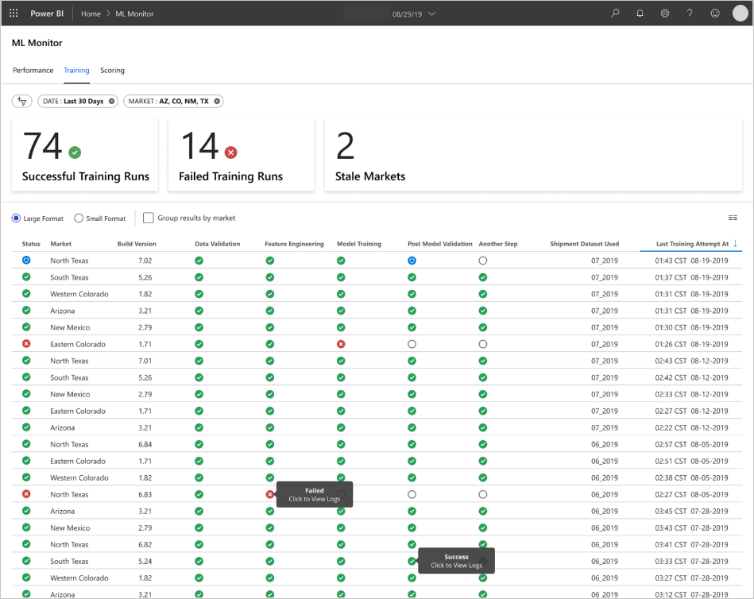

This client engagement (or project) focused on helping a Fortune 500 food company that ships products directly to multiple retail outlets to improve their demand forecasting. The improvement helped them optimize the stocking of their products in different stores across several regions of the US. To achieve this, Microsoft's Commercial Software Engineering (CSE) team worked with the client's data scientists to develop customized machine learning models for the selected regions for a pilot study. These models considered variables that had to do with:

* Shopper demographics

* Historical and forecasted weather

* Past shipments

* Product returns

* Special events

This specific goal represented a major component of the project and the client realized a significant sales lift in the early field trials. Also, the team saw a 40% reduction in forecasting Mean Absolute Percentage Error (MAPE) when compared with a historical average baseline model.

A key part of the project involved how to scale up the data science workflow from the pilot study to a production level. This production-level workflow required the CSE team to:

* Develop models for many regions.

* Continuously update and monitor the models' performance.

* Enable data and engineering teams to collaborate on all of these aspects.

The traditional data science workflow, as it exists today, is closer to a one-off lab environment than a production workflow. This lab environment inherently has requirements that include the need to:

* Prepare the data.

* Experiment with different models.

* Tune hyper parameters.

* Create a build/test/evaluate/refine cycle.

Most existing tools are only used for specific purposes and aren't well disposed to automation. In a production level machine learning operation, there must be more consideration given to Application Lifecycle Management and DevOps.

The CSE team did extensive work in this area to help the client scale up the operation to production levels. The process had to be made more effective by implementing different aspects of Continuous Integration/Continuous Delivery (CI/CD) capabilities and items like observability and integration with Azure capabilities. In doing so, the team uncovered gaps in existing MLOps guidance. Those gaps needed further refinement so MLOps was better understood and applied at scale. Understanding MLOps practices helps organizations ensure the machine learning models the system produces are production quality models that improve business performance. The organization no longer has to focus the majority of the time on the associated low-level details relating to infrastructure and engineering work required to develop and run machine learning models for production level operations. It also helps incorporate the communities of data science and software engineering. Team members learn how to work together to deliver a production-ready system.

The CSE team used this project to address machine learning community needs by addressing items like developing an MLOps maturity model (and perhaps leading to the creation of "MLOps in a Box"). These efforts target improving MLOps adoption through understanding common challenges facing key players in the MLOps process.

## Engagement and Technical scenarios

The Engagement scenario discusses the real-world challenges that the CSE team had to solve. The Technical scenario defines the requirements to create an MLOps lifecycle that is as reliable as the established DevOps lifecycle.

### Engagement scenario

The client delivers products directly to retail market outlets on a regular schedule. However, each retail outlet varies in its product usage patterns so that product inventory needs to vary in each weekly delivery. Maximizing sales, and minimizing product returns and lost sales opportunities, are the goals of the demand forecasting methodologies used by the client. The project focused on improving their forecasting by applying machine learning to the problem.

The CSE team divided the project into two phases. Phase 1 focused on developing working machine learning models to support a field-based pilot study on the effectiveness of machine learning forecasting in a selected sales region. The success of Phase 1 led to Phase 2. The team upscaled the initial pilot study from a minimal group of models that supported a single geographic region to a set of sustainable production-level models that they could apply to all of the client's sales regions. A primary consideration for the upscaled solution was the need to accommodate the large number of geographic regions and their local retail outlets. The team dedicated the machine learning models to both large and small retail outlets in each region.

The pilot study determined that a model dedicated to one region's retail outlets could use local sales history, local demographics, weather, and special events to optimize the demand forecast for each sales outlet. Four ensemble machine learning forecasting models serviced market outlets in a single region. The models processed data in weekly batches. Also, the team developed two baseline models using historical data for comparison.

In the initial requirement for the upscaled solution, the CSE team selected 14 geographic regions, including small and large market outlets, to participate. They used more than 50 machine learning forecasting models. The team expected further system growth and continued refinement of the machine learning models. It quickly became clear this wider-scaled machine learning solution could only be sustainable if the team based it on the best practice principles of DevOps for the machine learning environment.

| Environment | Market Region | Format | Models | Model Subdivision | Model Description |
| ----------- | ------------- | ------ | ------ | ----------------- | ----------------- |
| Dev Environment | Each geographic market/region (for example North Texas) | Large format stores (supermarkets, big box stores, and so on.) | 2 ensemble models | Slow moving products | Slow and Fast each has an ensemble of a Least Absolute Shrinkage and Selection Operator (LASSO) linear regression model and a neural network with categorical embeddings |
|  |  |  |  | Fast moving products | Slow and Fast each has an ensemble of a LASSO linear regression model and a neural network with categorical embeddings
|  |  |  | 1 ensemble model | N/A | Historical average |
|  |  | Small format stores (pharmacies, convenience stores, and so on.) | 2 ensemble models | Slow moving products | Slow and Fast each has an ensemble of a LASSO linear regression model and a neural network with categorical embeddings |
|  |  |  |  | Fast moving products | Slow and Fast each has an ensemble of a LASSO linear regression model and a neural network with categorical embeddings
|  |  |  | 1 ensemble model | N/A | Historical average |
|  | Same as above for additional 13 geographic regions |  |  |  |  |
| Same as above for PROD environment |  |  |  |  |  |

The MLOps process would provide a framework for the upscaled system that addressed the full lifecycle of the machine learning models. This framework includes development, testing, deployment, and monitoring that fulfills the needs of a classic CI/CD process and operation of the deployed machine learning system. However, because of its relative immaturity compared to DevOps, it became evident that existing MLOps guidance had gaps. The project teams worked to fill in some of those gaps. They wanted to provide a functional process model that insures the viability of the upscaled machine learning solution.

The MLOps process developed from this project made a significant real-world step to move MLOps to a higher level of maturity and viability. The new process is directly applicable to other machine learning projects. The CSE team has even taken their collective learnings to build a draft of an [MLOps maturity model](mlops-maturity-model.yml) that anyone can apply to other machine learning projects.

### Technical scenario

MLOps, also known as DevOps for machine learning, is an umbrella term. It encompasses a wide range of philosophies, practices, and technologies involved in moving machine learning lifecycles into a production environment. It's still a relatively new concept. There are many definitions trying to address the question, "What is MLOps?" Many people have wondered if MLOps can cover the whole space from how data scientists prepare data to how they ultimately deliver, monitor, and evaluate machine learning results. While DevOps has had years to stabilize and include a set of fundamental practices, MLOps is still early in its existence. As MLOps concepts mature, we often discover the challenges in bringing two disciplines together that often operate with different skillsets and priorities: Software/Ops Engineering and Data Science.

Implementing MLOps in real-world production environments has unique challenges that must be overcome. Teams can use Azure's capabilities to support MLOps patterns. Azure can also provide clients with asset management and orchestration services to enable effective machine learning lifecycle management. Azure services are the foundation for the MLOps solution discussed in this technical paper.

## Machine learning model requirements

Much of the work during the pilot field study involved creating the machine learning models that the CSE team would apply to the large and small retail stores in a single study region. Notable requirements for the model included:

* Use of Azure Machine Learning Services.

* Initial experimental models developed in Jupyter Notebook and implemented in Python.

    > [!NOTE]
    > Teams would use the same machine learning approach for large and small stores, but the training and scoring data was different depending on the size of the store.

* Data requires preparation for model consumption.

* Data processed on a batch basis rather than in real time.

* Model training done when code changes, data changes, or there is evidence that the model has become stale.

* Model performance must be viewable in Power BI dashboards.

* Model performance in scoring considered significant when MAPE <= 45% when compared with a historical average baseline model.

## MLOps requirements

The team had to meet several key requirements to scale up the solution from the pilot field study. Originally, only a few models were developed for a single sales region. They had to deploy a wider-scale implementation that enabled the development of custom machine learning models for all sales regions that included:

* Weekly batch processing for large and small stores in each region including retraining of each model with new datasets.

* Continuous refinement of the machine learning models.

* Integration of the development/test/package/test/deploy process common to CI/CD in a DevOps-like processing environment for MLOps.

  > [!NOTE]
  > This represents a shift in how data scientists and data engineers have commonly worked in the past.

* A unique model that represented each region for large and small stores based on the stores' history, demographics, and other key variables. The model had to process the whole dataset to minimize the risk of processing error.

* The ability to initially upscale to support 14 sales regions with plans to upscale further.

* Plans for additional models for longer term forecasting for regions and other store clusters.

## Machine learning model solution

The machine learning lifecycle, also known as the Data Science lifecycle, fits roughly into the following high-level process flow:

*Deploy Model* here can represent any operational use of the validated machine learning model. Compared to DevOps, MLOps presents the additional challenge of how to integrate this machine learning lifecycle into the typical CI/CD process.

This [data science lifecycle](/azure/machine-learning/team-data-science-process/overview#data-science-lifecycle) doesn't follow the typical software development lifecycle. The team had to preserve the basic process whether they did it manually or via CI/CD automation, so the Azure Machine Learning Service solution had to satisfy two functional tasks:

* Train the model.

* Run scoring to obtain the forecast results.

Ultimately, batch processing of data is the basis of the architecture. Two Azure Machine Learning pipelines are central to the process, one for training and the other for scoring. This diagram shows the data science methodology used for the initial phase of the client project:

The team tested several algorithms. They ultimately chose an ensemble design of a LASSO linear regression model and a Neural Network with categorical embeddings. The team used the same model, defined by the level of product that the client could store on site, for both large and small stores. The team further subdivided the model into fast-moving and slow-moving products.

Data scientists train machine learning models when the team releases new code and when new data is available. Training typically happens on a weekly cadence. Consequently, each processing run involves a large amount of data. And, because the team collects that data from many sources in different formats, it requires *conditioning* to put the data into a consumable format before data scientist can process it. This data conditioning requirement needed significant manual effort and the CSE team identified it as a primary candidate for automation.

As mentioned, the data scientists developed and applied the experimental Azure Machine Learning models to a single sales region in a pilot field study to evaluate the usefulness of this forecasting approach. The CSE team considered the observed sales lift for the stores in the pilot study significant. The team considered the pilot study a success, justifying the need to upscale the solution to full production levels starting with 14 geographic regions and thousands of stores. The team could then use the same pattern to add additional regions.

The pilot model served as the basis for the upscaled solution, but the CSE team knew that the model would need further refinement on a continuing basis to improve its performance.

## MLOps solution

As MLOps concepts mature, teams often discover challenges in bringing two disciplines together that often operate with different skillsets and priorities between the principal players: software engineers and data scientists. And yet, there are similarities that we can build on.

MLOps, like DevOps is a development process implemented by a *toolchain*. The toolchain includes such things as:

* Version control

* Code analysis

* Build automation

* Continuous Integration

* Testing frameworks and automation

* Compliance policies integrated into CI/CD pipelines

* Deployment automation

* Monitoring

* Disaster recovery/High availability

* Package/Container management

As noted above, the solution takes advantage of existing DevOps guidance, but it's augmented to create a more mature MLOps implementation that meets the needs of the client and the Data Science community. MLOps builds on DevOps guidance with these additional requirements:

* **Data/model versioning isn't the same as code versioning**: There must be versioning of datasets as the schema and origin data changes.
* **Digital audit trail requirements**: Track all changes when dealing with code and client data.
* **Generalization**: Models are different than code for reuse, since data scientist must tune models based on input data/scenario.
  * To reuse a model for a new scenario, you may need to fine-tune/transfer/learn on it. You need the training pipeline.
* **Stale models**: Models tend to decay over time and you need the ability to retrain them on demand to ensure they remain relevant in production.

## MLOps challenges

### Immature MLOps standard

The standard pattern for MLOps is still evolving. It's typically built from scratch and made to fit the needs of a particular client or user. The CSE team recognized this gap and sought to use DevOps best practices in this project. They augmented the DevOps process to fit the additional requirements of MLOps. The process the team developed is a viable example of what an MLOps standard pattern should look like.

### Differences in skillsets

Software engineers and data scientists bring unique skillsets to the team. These different skillsets can make finding a solution that fits everyone's needs difficult. Building a well-understood workflow for model delivery from experimentation to production is important. Each team member must share an understanding of how they can integrate changes into the system without breaking the MLOps process.

### Managing multiple models

The team may need multiple models to solve for many difficult machine learning scenarios. One of the challenges of MLOps is managing these models, including:

* A coherent versioning scheme.

* A continuous evaluation and monitoring of all models.

Traceable code and data lineage is also needed to diagnose model issues and create reproducible models. Investing in custom dashboards can make sense of how deployed models are performing and when to intervene. The team created such dashboards for this project.

### Need for data conditioning

Data used with these models comes from many private and public sources. Because the original data is disorganized, it makes it impossible for the machine learning model to consume the data in its raw state. The data scientist must condition the data into a standard format for machine learning model consumption.

Much of the pilot field test focused on conditioning  the raw data so that the machine learning model could process it. In an MLOps system, the team should automate this process, and track the outputs.

## MLOps maturity model

The purpose of the MLOps maturity model is to help clarify the principles and practices and identify gaps in an existing organization's attempt to implement MLOps. It's also a way to show a client how to incrementally grow their MLOps capability instead of overwhelming them with everything at once. The client should use it as a guide to:

* Estimate the scope of the work for the project.

* Establish success criteria.

* Identify deliverables that the team hands over at the conclusion of the project.

The team built the MLOps maturity model on five levels of technical capability:

| Level | Description |
| ----- | ----------- |
| 0 | No Ops |
| 1 | DevOps but no MLOps |
| 2 | Automated Training |
| 3 | Automated Model Deployment |
| 4 | Automated Operations (full MLOps) |

For the current version of the MLOps maturity model, see the [MLOps maturity model](mlops-maturity-model.yml) article.

## MLOps process definition

MLOps includes the whole space between acquiring raw data and delivering model output, also known as scoring:

* Data conditioning

* Model training

* Model testing and evaluation

* Build definition and pipeline

* Release pipeline

* Deployment

* Scoring

Multiple pipelines were ultimately used to meet all process requirements. See the [MLOps Process Decision Tree](aml-decision-tree.yml) article.

## Basic machine learning process

The basic machine learning process is somewhat like traditional software development, but there are significant differences. This diagram illustrates the major steps in the machine learning process:

The Experiment phase is unique to the Data Science Lifecycle. How data scientists traditionally do their work is the basis of this lifecycle. It isn't based on how code developers do their job. The following diagram illustrates this lifecycle in more detail.

Integrating this data development process into MLOps poses a challenge. Here, you see the pattern that the team used to integrate the process into a form supportable by MLOps:

The role of MLOps is to create a coordinated process that can efficiently support larger scale CI/CD environments common in production level systems. Conceptually, the MLOps model must include all process requirements from experimentation to scoring.

The CSE team refined the MLOps process developed for this project to fit the client's specific needs. The most notable was the need for batch processing instead of real-time processing. As the team developed the upscaled system, they identified and resolved some shortcomings. The most significant of these shortcomings resulted in the development of a bridge between Azure Data Factory and Azure Machine Learning, which the team incorporated as a built-in connector in Azure Data Factory. They created this component set to facilitate the triggering and status monitoring necessary to make the process automation work.

Another fundamental change is that the data scientist needed the capability to export experimental code from Jupyter notebooks into the MLOps deployment process rather than trigger training and scoring directly.

Here is the final MLOps process model concept:

> [!IMPORTANT]
> Scoring is the final step. The process runs the machine learning model against data that the system uses to make predictions based on the data used to train the model. This addresses the basic business use case requirement for *demand forecasting*. The team rates the quality of the predictions using the MAPE. MAPE is short for *mean absolute percentage deviation*. It is a measure of prediction accuracy of statistical forecasting methods and a loss function for regression problems in machine learning. In this project, the team considered a MAPE of <= 45% significant.

## MLOps process flow

The following diagram describes how to apply CI/CD development and release workflows to the machine learning lifecycle:

* When a PR is created from a Feature branch, the pipeline runs [code validation tests](#code-validation-tests) to validate the quality of the code via unit tests and code quality tests. To validate quality upstream, the pipeline also runs [basic model validation tests](#basic-model-validation-tests) to validate the end-to-end training and scoring steps with a sample set of mocked data.

* When the PR is merged into the main branch, the CI pipeline will run the same code validation tests and basic model validation tests with increased epoch. The pipeline will then package the *artifacts*, which include the code and binaries, to run in the machine learning environment.

* After the artifacts are available, a [model validation CD pipeline](#model-validation-cd-pipeline) will be triggered. It runs end-to-end validation on the development machine learning environment. A scoring mechanism will be published. For a batch scoring scenario, a scoring pipeline is published to the machine learning environment and triggered to produce results. If you wanted to use a real-time scoring scenario, you can publish a web app or deploy a container.

* Once a milestone is created and merged into the Release branch, the same CI pipeline and model validation CD pipeline are triggered. This time, they run against the code based in the Release branch.

You can consider the MLOps process data flow shown above as an archetype framework for projects that might make similar architectural choices.

### Code validation tests

Code validation tests for machine learning focus on validating the quality of the code base. It's the same concept as any engineering project involving code quality tests (linting), unit tests, and determining code coverage.

### Basic model validation tests

Model validation typically refers to validating the full end-to-end process steps required to produce a valid machine learning model. Including steps like:

* **Data validation**: Ensures that the input data is valid.

* **Training validation**: Ensures that the model can be successfully trained.

* **Scoring validation**: Ensures that the team can successfully use the trained model for scoring with the input data.

Running this full set of steps on the machine learning environment is expensive and time consuming. As a result, the team focused basic model validation tests to run all the steps above locally on a development machine by using the following:

* **Local testing dataset**: Check in a small and often obfuscated dataset to the repository and consume it as the input data source.

* **Local flag**: A flag or argument in the model's code that indicates that the code intends the dataset to run locally. The flag allows the code to bypass any required call to the machine learning environment.

This goal of these validation tests isn't to evaluate the performance of the trained model. The goal is to validate that the code for the end-to-end process is of good quality. It not only enables pushing quality code upstream, like the incorporation of model validation tests in the PR and CI build. It also enables engineers and data scientists to put a breakpoint into the code for debugging purposes.

### Model validation CD pipeline

The goal of the model validation pipeline is to validate the end-to-end model training and scoring steps on the machine learning environment with actual data. Any trained model that is produced will be added to the model registry, tagged, and will await to be promoted once validation is completed. For batch prediction, promotion can be publishing a scoring pipeline, where the pipeline is using this version of the model. For real-time scoring, the model can be tagged to indicate that it has been promoted.

### Scoring CD pipeline

The scoring CD pipeline is applicable for the batch inference scenario, where the same model orchestrator as the model validation triggers the published scoring pipeline.

### Development vs. production environments

It's a good practice to separate the development (dev) and the production (prod) environments. It allows the system to trigger the model validation CD pipeline and scoring CD pipeline at a different cadence. For the described MLOps flow, pipelines targeting the main branch will run on the dev environment, and the pipeline targeting the Release branch will run on the prod environment.

### Code changes vs. data changes

The previous sections have mostly dealt with how to handle code changes from development to release. However, data changes should also follow the same rigor as code changes to provide the same validation quality and consistency in production. With a data change trigger or a timer trigger, the system should trigger the model validation CD pipeline and the scoring CD pipeline from the model orchestrator to run the same process as code changes in the Release branch prod environment.

## MLOps personas and roles

A key requirement for any MLOps process is that it meets the needs of the many users of the process. Consider these users as individual personas for design purposes. For this project, the team identified the user personas like this:

* **Data scientist**: Creates the machine learning model and its algorithms.
* **Engineer**
  * **Data engineer**: Handles data conditioning.
  * **Software engineer**: Handles model integration into the asset package and the CI/CD workflow.
* **Operations or IT**: Oversees system operations.
* **Business stakeholder**: Concerned with the predictions made by the machine learning model and how well they help the business.
* **Data end user**: Consumes model output in some way that aids in making business decisions.

The team had to address three key findings from the persona and role studies:

* Data scientists and engineers have a mismatch of approach and skills in their work. Making it easy for the data scientist and the engineer to work collaboratively becomes a major consideration in the MLOps process flow. It does require new skill acquisitions by all team members.

* There's a need to unify all of the principle personas without alienating anyone. A way to do this is to:

  * Make sure they share a common understanding of the conceptual model for MLOps.

  * Agree on clear expectations of how all the team members will work together.

  * Discuss working guidelines to achieve common goals.

* The business stakeholder and data end user may require a way to interact with the data output from the models. A user-friendly UI is the most common solution.

Other teams will certainly come across similar issues in other machine learning projects as they scale up for production use.

## MLOps solution architecture

### Logical architecture

What isn't shown in this diagram is the data conditioning that must occur before you insert data into the Azure Data Lake. Conditioning is necessary to convert the datasets that clients get from many sources using microservices operating as Azure Functions. The clients customize the microservices to fit the data sources and transform them into a standardized csv format that the training and scoring pipelines can consume.

### System architecture

There were many design options available for the system architecture. The following diagram shows the end result of the decision-making process described in [Azure Machine Learning decision guide for optimal tool selection](aml-decision-tree.yml).

### Batch processing architecture

The team devised the architectural design to support a batch data processing scheme. Alternate architectures are possible but must support MLOps processes. Full use of available Azure services was a design requirement. The following diagram shows the architecture:

## Solution overview

The Azure Data Factory:

1. Triggers an Azure Function to start data ingestion with parameters and Azure Machine Learning Pipeline run.

1. Launches a Durable Function to poll the Azure Machine Learning Pipeline for completion.

Custom dashboards in Power BI display the results. Other Azure dashboards, connected to SQL Azure, Azure Monitor, and App Insights via OpenCensus Python SDK, track Azure resources. These dashboards provide information about the health of the machine learning system. They also yield data the client used for product order forecasting.

### Model orchestration

Model orchestration follows these steps:

1. When a pull request is submitted, DevOps triggers a code validation pipeline.

1. That pipeline runs unit tests, code quality tests, and model validation tests.

1. When merged into the main branch, the same code validation tests are run and DevOps packages the artifacts.

1. When DevOps collected artifacts, that triggered Azure Machine Learning to begin:

    1. Data validation.

    1. Training validation.

    1. Scoring validation.

1. Once the validation completes, the final scoring pipeline is run.

1. When data changes and a new pull request is submitted, it retriggers the validation pipeline and then the final scoring pipeline.

### Enable experimentation

As mentioned, the traditional data science machine learning lifecycle doesn't support the MLOps process without modification. It uses different kinds of manual tools and experimentation, validation, packaging, and model hand-off that can't be easily scaled for an effective CI/CD process. MLOps demands a high level of process automation. Whether a new machine learning model is being developed or an old one is modified, it's necessary to automate the machine learning model's lifecycle. In the Phase 2 project, the team uses Azure DevOps to orchestrate and republish Azure Machine Learning pipelines for training tasks. The long running main branch performs basic testing of models, and pushed stable releases through the long running release branch.

Source control becomes an important part of this process. Git is the version control system used to track notebook and model code. It also supports process automation. The basic workflow implemented for using source control applies the following principles:

* Use formal code and dataset versioning.

* New code development must use a branch until the code is fully developed and validated.

* When you've validated the new code, you can merge it into the main branch.

* Handle releases by establishing a permanent versioned branch separate from the main branch.

* Version and use source control for the datasets that you conditioned for training or consumption so that you can preserve the integrity of each dataset.

* Use source control to track your Jupyter Notebook experiments.

### Integration with data sources

Data scientists use many raw data sources and processed datasets to experiment with different machine learning models. The volume of data in a production environment can be overwhelming. For the data scientists to experiment with different models, they needed to use management tools like Azure Data Lake. The requirement for formal identification and version control applies to all raw data, prepared datasets, and to machine learning models.

In the project, the data scientists conditioned historical weekly shipment data since January 2017, historical and forecasted daily weather data for each zip code, and shopper data for each store ID for input into the model.

### Integration with source control

As part of getting data scientists to apply engineering best practices, it's necessary to easily integrate the tools they use with source control systems like GitHub. It allows for machine learning model versioning, collaboration between team members, and disaster recovery should the teams come across a loss of data or a disruption of any systems.

### Model ensemble support

The model design in this project was an ensemble model. That is, data scientists used many algorithms in the final model design. In this case, the models used the same basic algorithm design. The only difference was that they used different training data and scoring data. The models used the combination of a LASSO linear regression algorithm and a neural network.

While not used in this project, the team explored an option to carry the process forward to the point where it would support having many real-time models running in production servicing a given request. It could have enabled the use of ensemble models in A/B testing and interleaved experiments.

### End-user interfaces

The team developed end-user UIs for observability, monitoring, and instrumentation. As mentioned, dashboards visually display the machine learning model data. These dashboards show the following data in a user-friendly format:

* Provide a means of observing pipeline steps, including pre-processing the input data.

* To monitor the health of the machine learning model processing:

  * What metrics do you collect from your deployed model?

    * **MAPE**: Mean Absolute Percentage Error (the key metric to track for overall performance. Target a MAPE value of <= 0.45 for each model.)

    * **RMSE 0**: Root Mean Squared Error (RMSE) when the actual target value = 0

    * **RMSE All**: RMSE on the entire dataset

  * How do you evaluate if your model is performing as expected in production?

  * Is there a way to tell if production data is deviating too much from expected values?

  * Is your model performing poorly in production?

  * Do you have a failover state?

* Track the quality of the processed data.

* Display the scoring/predictions produced by the machine learning model.

The application populates the dashboards according to the nature of the data and how it processes and analyzes the data. As such, the team must design the exact layout of the dashboards for each use case. Here are two sample dashboards:

The overarching criteria for the design of these dashboards is that they provide readily usable information for consumption by the end user of the machine learning model predictions.

> [!NOTE]
> Stale models are scoring runs where the data scientist trained the model used for scoring more than 60 days from when scoring took place. the **Scoring** page of the **ML Monitor** dashboard displays this health metric.

## Components

* [Azure Machine Learning Service](https://azure.microsoft.com/services/machine-learning/)

  * [Azure Machine Learning Compute](/azure/machine-learning/concept-compute-instance)

  * [Azure Machine Learning Pipelines](/azure/machine-learning/concept-ml-pipelines)

  * [Azure Machine Learning Model Registry](/azure/machine-learning/concept-model-management-and-deployment#register-package-and-deploy-models-from-anywhere)

* [Azure Blob Storage](https://azure.microsoft.com/services/storage/blobs/)

* [Azure Data Lake Storage](https://azure.microsoft.com/services/storage/data-lake-storage/)

* [Azure DevOps Pipelines](https://azure.microsoft.com/services/devops/pipelines/)

* [Azure Data Factory (ADF)](https://azure.microsoft.com/services/data-factory/)

* [Azure Functions for Python](https://azure.microsoft.com/services/functions/)

* [Azure Monitor](https://azure.microsoft.com/services/monitor/)

  * [Logs](/azure/azure-monitor/log-query/log-query-overview)

  * [Application Insights](/azure/azure-monitor/app/app-insights-overview)

* [Azure SQL Database](https://azure.microsoft.com/services/sql-database/)

* [Azure Dashboards](/azure/azure-portal/azure-portal-dashboards)

* [Power BI](https://powerbi.microsoft.com/)

> [!NOTE]
> To learn how to select the correct pipeline services to use for a specific process, see [Azure Machine Learning decision guide for optimal tool selection](aml-decision-tree.yml).

## Considerations

Here you'll find a list of considerations to explore. They're based on the lessons the CSE team learned during the project.

### Environment Considerations

* Data scientists develop most machine learning models using Python, often starting in Jupyter Notebooks. It can be a challenge to implement these notebooks as production code. Jupyter notebooks are more of an experimental tool, while Python scripts are more appropriate for production. Teams often need to spend time refactoring model creation code into Python scripts.

* If the client is new to DevOps and machine learning, be aware that experimentation and production require different rigor. It's a good practice to separate the two.

* Tools like the [Azure Machine Learning Visual Designer](/azure/machine-learning/concept-designer) or AutoML can be effective in getting basic models off the ground while the client ramps up on standard DevOps practices around the rest of their solution.

* Azure DevOps has plug-ins that can integrate with the Azure Machine Learning service to help trigger pipeline steps. The [MLOpsPython repo](https://github.com/Microsoft/MLOpsPython) has a few examples of such pipelines.

* Machine learning often requires powerful GPU machines for training. If the client doesn't already have such hardware available, using Azure Machine Learning Compute clusters is an effective path for quickly provisioning cost-effective powerful hardware that autoscales. If a client requires advanced security and/or monitoring needs, they may wish to explore other options, such as standard VMs, Databricks, or using local compute.

  * For a client to be successful, their model building teams (data scientists) and deployment teams (DevOps engineers) need to have a strong communication channel. They can accomplish this with daily stand-ups or a formal online chat service. Either would help with the standard integration of their development efforts in an MLOps framework.

### Data Preparation Considerations

* The simplest solution for using Azure Machine Learning is to store data in a supported data storage solution.  Tools such as Azure Data Factory are effective for piping data to and from those locations on a schedule.

* It's important for clients to set up a cadence for capturing additional retraining data to keep their models up to date. If they don't already have a data pipeline, creating one will be an important part of the overall solution. Using a solution such as Datasets in Azure Machine Learning can be useful for versioning data to help with traceability of models.

### Model Training and Evaluation Considerations

* It's overwhelming for a client, who is just getting started in their machine learning journey, to jump straight in to a full MLOps pipeline. If necessary, they can ease into it by using Azure Machine Learning to track experiment runs and using Azure Machine Learning Compute as the training target. These options might create a lower barrier of entry solution to begin integrating Azure services.

* Going from a notebook experiment to repeatable scripts is currently still a rather rough transition for many data scientists. The sooner we can get them writing their training code in Python scripts, the easier it will be for them to begin versioning their training code and enabling retraining.

* That isn't the only possible method. Databricks supports scheduling notebooks as jobs. But based on current client experience, it's difficult to instrument with full DevOps practices because of testing limitations.

* It's also important to understand what metrics are being used to consider a model a success. Accuracy alone is often not good enough to determine the overall performance of one model versus another.

### Compute Considerations

* Customers should consider using containers to standardize their compute environments. Nearly all Azure Machine Learning Compute targets support using [Docker](https://www.docker.com/). Having a container handle the dependencies reduces a significant amount of friction. Especially if the team uses many compute targets.

### Model Serving Considerations

* The Azure Machine Learning SDK does provide an option to deploy directly to Azure Kubernetes Service from a registered model creating limits on what security/metrics are in place. There may be an easier solution for clients to test their model, but it's best to develop a more robust deployment to AKS for production workloads.

## Related resources

* [MLOps maturity model](mlops-maturity-model.yml)

* [Learn more about MLOps](/azure/machine-learning/service/concept-model-management-and-deployment)

* [MLOps on Azure](https://github.com/microsoft/MLOps)

* [Azure Monitor Visualizations](/azure/azure-monitor/visualizations)

* [Machine Learning Lifecycle](/shows/AI-Show/MLOps-for-managing-the-end-to-end-life-cycle-with-Azure-Machine-Learning-service?term=MLOpsandlang-en=true)

* [Azure DevOps Machine Learning extension](https://marketplace.visualstudio.com/items?itemName=ms-air-aiagility.vss-services-azureml)

* [Azure Machine Learning CLI](/azure/machine-learning/reference-azure-machine-learning-cli)

* [Trigger applications, processes, or CI/CD workflows based on Azure Machine Learning events](/azure/machine-learning/service/how-to-use-event-grid)

* [Set up model training and deployment with Azure DevOps](/azure/devops/pipelines/targets/azure-machine-learning?view=azure-devops)

* [Set up MLOps with Azure Machine Learning and Databricks](https://github.com/Azure-Samples/MLOpsDatabricks)
