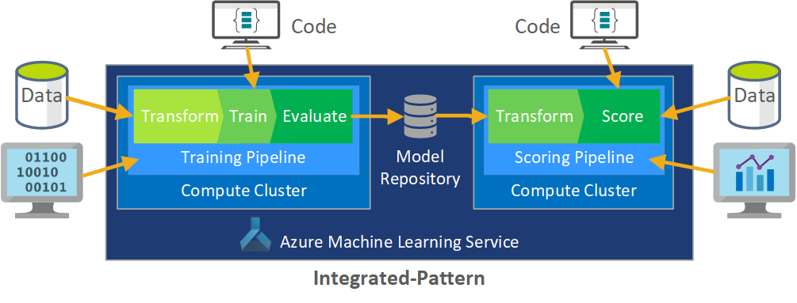
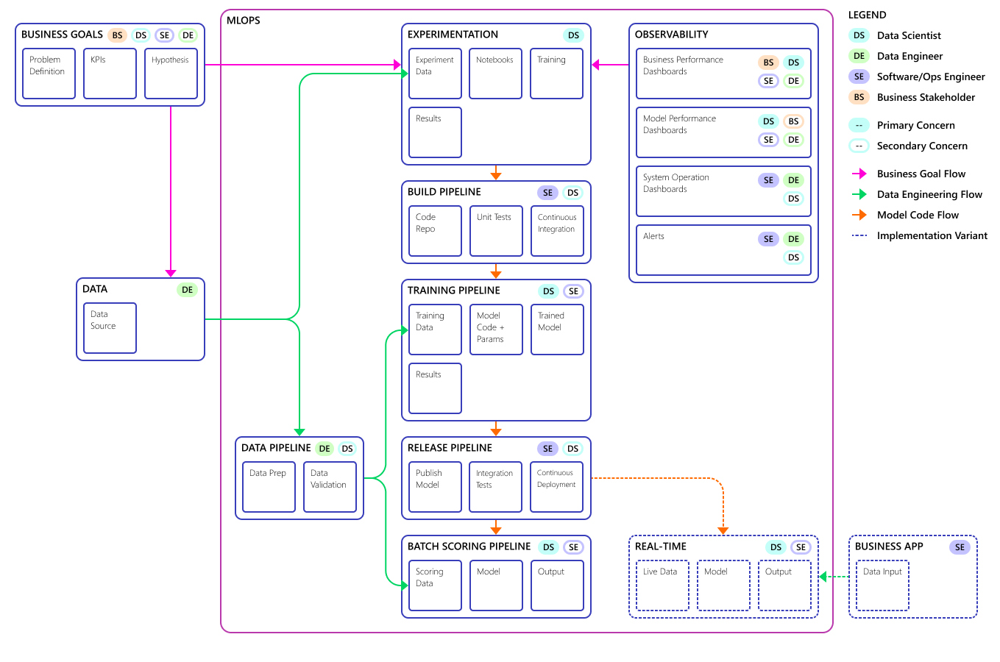
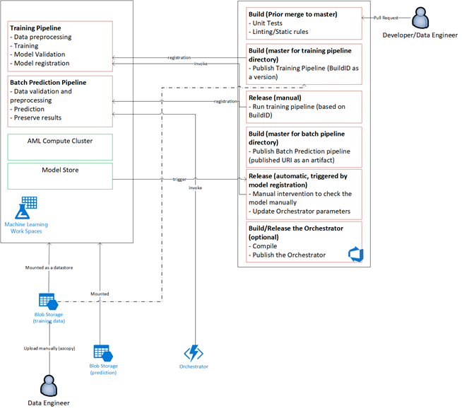
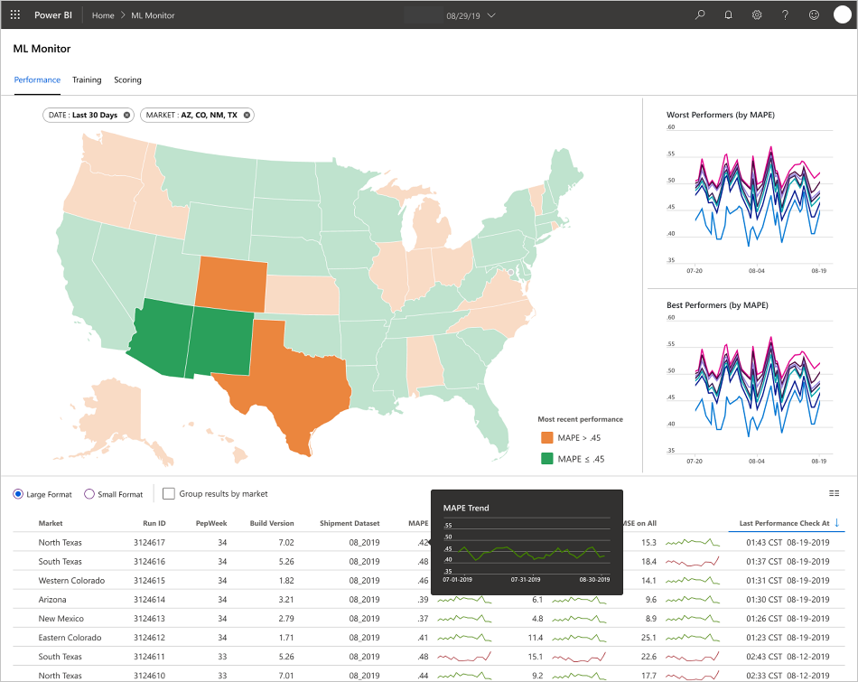

# MLOps Framework for Upscaling ML Life Cycle with Azure ML

## Overview

The client in this engagement is a Fortune 500 food company that ships products directly to multiple retail outlets. This customer engagement (or project) focused on helping the client improve their demand forecasting so they can stock products optimally in different stores across several regions of the U.S. To achieve this, Microsoft’s CSE team worked with the client’s data scientists to develop customized Machine Learning (ML) models for the selected regions for a pilot study. These models considered variables that had to do with shopper demographics, historical and forecasted weather, past shipments, product returns, and special events. This specific objective represented a major component of the engagement and the client realized a significant sales lift in the early field trials. Also, a 40% reduction in forecasting Mean Absolute Percentage Error (MAPE) when compared with a historical average baseline model.

A key part of the engagement involved how to scale up the data science workflow from the pilot study to a production level. This production level required meeting the needs of developing models for multiple regions, continuously updating and monitoring their performance, and enabling teams to collaborate on all of these aspects. The traditional data science workflow as it exists today is closer to a one-off lab environment than it is to a production workflow. This lab environment inherently has requirements that include the need to prepare the data, experiment with different models, tune hyper parameters, as well as a build/test/evaluate/refine cycle. Most existing tools are only used for specific purposes and not well disposed to automation. In a production level ML operation, there must be more consideration given to Application Life Cycle Management and DevOps.

The team did extensive work in this area to help the client scale up the operation to “production” levels. The process had to be more effective by implementing different aspects of Continuous Integration/Continuous Delivery (CI/CD) capabilities and items such as observability and integration with Azure capabilities. In doing so, the CSE team uncovered gaps in existing MLOps guidance needing further refinement so MLOps is better understood and applied at scale. Understanding MLOps practices in depth will help organizations ensure the ML models the system produces are at production quality. Thus improving business performance rather than having to focus the majority of the time on the associated low-level details relating to infrastructure and engineering work required to develop and run ML models for production level operations. It will also help bridge the communities of data science and software engineering through learning how to work together to deliver a production-ready system.

This engagement has been leveraged to address ML community level needs by addresses items such as developing an MLOps Maturity Model (and perhaps leading to the creation of “MLOps-in-a-Box”). These efforts target improving MLOps adoption through understanding common challenges facing key players in the MLOps process. This topic is covered later in the *MLOps Personas and Roles* section.

## Engagement Scenario

The client delivers products directly to retail market outlets on a regular schedule. However, each retail outlet varies in its product usage patterns so that product inventory needs vary in each weekly delivery. Maximizing sales, minimizing product returns and lost sales opportunities are the goals of the demand forecasting methodologies used by the client. The engagement focused on improving their forecasting by applying ML and associated technologies to the problem.

The engagement was divided into two phases. Phase 1 focused on developing viable machine learning models to support a field-based pilot study on the effectiveness of ML forecasting in a selected sales region. The success of Phase 1 led to Phase 2, where the initial pilot study was upscaled from a single geographic region to a sustainable production level that could be applied to all of the client’s sales regions.

A primary consideration for the upscaled solution was the need to accommodate the large number of geographic regions and their local retail outlets with ML models dedicated to both large and small retail outlets in each region.

The pilot study determined that a model dedicated to one region’s retail outlets could use local sales history, local demographics, weather, and special events to optimize the demand forecast for each sales outlet. In the pilot study, market outlets in a single region were serviced by 4 ensemble ML forecasting models processing data in weekly batches. Two baseline models using historical data were used for comparison.

In the initial requirement for the upscaled solution, 14 geographic regions, including small and large market outlets, were selected to participate, using more than 50 ML forecasting models. Anticipation of further system growth was clearly expected as well as further refinement of the ML models. It quickly became clear that this wider-scaled ML solution could only be sustainable if based on best practice principles of DevOps for the ML environment; also known as MLOps.

| Environment | Market Region | Format | Models | Model Subdivision | Model Description |
| ----------- | ------------- | ------ | ------ | ----------------- | ----------------- |
| Dev Environment | Each geographic market/region (for example North Texas) | Large format stores (Walmart, Target, etc.) | 2 ensemble models | Slow moving products | Slow and Fast each has an ensemble of a Least Absolute Shrinkage and Selection Operator (LASSO) linear regression model and a neural network with categorical embeddings |
|  |  |  |  | Fast moving products | Slow and Fast each has an ensemble of a LASSO linear regression model and a neural network with categorical embeddings
|  |  |  | 1 ensemble model | N/A | Historical average |
|  |  | Small format stores (Walgreens, 7-Eleven, etc.) | 2 ensemble models | Slow moving products | Slow and Fast each has an ensemble of a LASSO linear regression model and a neural network with categorical embeddings |
|  |  |  |  | Fast moving products | Slow and Fast each has an ensemble of a LASSO linear regression model and a neural network with categorical embeddings
|  |  |  | 1 ensemble model | N/A | Historical average |

The info in this table applies to all 14 geographic regions. It also applies to Production environments.

The MLOps process would provide a framework for the upscaled system that addressed the full life cycle of the ML models. This framework includes development, testing, deployment, and monitoring that fulfills the needs of a classic CI/CD process and operation of the deployed ML system. However, it became evident that existing MLOps guidance has gaps because of its relative immaturity compared to DevOps. The engagement teams worked to fill in some of those gaps and to provide a functional process model that insures the viability of the upscaled ML solution.

The MLOps process developed from this engagement made a significant real-world step to move MLOps to a higher level of maturity and viability that is directly applicable to other ML engagements/projects. The CSE team has even taken their collective learnings to build a draft of an MLOps Maturity Model that can be applied to other ML engagements.

### Technical Scenario

MLOps (also known as DevOps for Machine Learning) is an umbrella term, encompassing a wide range of philosophies, practices, and technologies involved in moving Machine Learning life cycles into a production environment. Still a relatively new concept, there are many definitions trying to address "What is MLOps?" Much has been speculated on how MLOps can cover the whole space between how data is prepared to how machine learning results are ultimately delivered, monitored, and evaluated (the ML life cycle). While DevOps has had years to stabilize and include a set of fundamental practices, MLOps is still early in its existence. As MLOps concepts mature, we often discover the challenges in bringing two disciplines together that often operate with different skillsets and priorities: Software/Ops Engineering and Data Science.

Implementing MLOps in real-world production environments has unique challenges that must be overcome, as the lessons from this engagement demonstrated. Azure's capabilities can be used to support MLOps patterns and provide customers with asset management and orchestration services to enable effective ML life cycle management. Fundamentally, the MLOps solution discussed in this white paper is based on Azure services.

## Engagement ML Models Requirements

Much of the pilot field study involved creating the ML models that would be applied to the large and small retail stores in a single study region. Notable requirements for the model included:

* Use of Azure Machine Learning (Azure ML) services
* Initial experimental models developed in Jupyter Notebook and implemented in Python
* The same ML approach would be used for large and small stores, but the training and scoring data were different for the small and large stores
* Data requires preparation for model consumption
* Data to be processed on a batch basis rather than in real time
* Model training to be done upon code changes, data changes, or evidence that the model has become stale
* Model performance should be viewable in Power BI Report
* Model performance in scoring is considered significant when MAPE <= 45%, compared with a historical average baseline model

## Engagement MLOps Requirements

Several key requirements had to be met to scale up the solution from the pilot field study, where only a few models where developed for a single sales region, to a wider-scale implementation that enables developing custom ML models for all sales regions:

* Weekly batch processing for large and small stores in each region (includes retraining of each model with new data sets)
* Continuous refinement of the ML models
* Integration of the development/test/package/test/deploy process common to CI/CD in a DevOps like processing environment (MLOps)
  * Note: This represents a shift in how data scientists and data engineers have commonly worked in the past
* Each region is represented by a unique model for large and small stores based on the stores' history, demographics, and other key variables that must be processed as a whole dataset to minimize processing error
* Initial upscaling to support 14 sales regions; with plans for further upscaling
* Additional models are planned for longer term forecasting for regions and other store clusters as needed for demand forecasting

## ML Model Solution Description

The ML life cycle (also known as the Data Science life cycle) fits roughly into the following high-level process flow:

*Figure 1 - Data Science Life Cycle Process Flow*

*Deployment* here can represent any operational use of the validated ML model.

Compared to DevOps, MLOps presents the additional challenge of how to integrate this ML life cycle into the typical CI/CD process in DevOps. The following figure is a more detailed look at the normal Data Science life cycle:

From: [What is the Team Data Science Process?](/azure/machine-learning/team-data-science-process/overview#tools-and-utilities-for-project-execution)

*Figure 2 - Data Science Team Process*

This life cycle does not follow the typical software development life cycle. Yet, the basic process had to be preserved whether it is done manually or via CI/CD automation. In this instance, the Azure ML Service solution had to satisfy two functional tasks: training the model and then running scoring to obtain the forecast results. Ultimately, the architecture used is based on batch processing of data as shown below. Two Azure ML pipelines are central to the process, one for training and the other for scoring.

*Figure 3 - AML Service for Training and Scoring*

The data science methodology used for the initial phase of the customer engagement is described in Figure 4.

*Figure 4 - Phase 1 Data Science Process*

The actual algorithms developed here for the ML model are beyond the scope of this paper. Several were tested and an ensemble design of a LASSO linear regression model and a Neural Network with categorical embeddings was the ultimate approach chosen. The same model was used for both large and small stores (defined by the level of product that could be stored on site) and further subdivided into fast-moving and slow-moving products.

ML models are trained when new code is released and when new data is available, typically on a weekly cadence. Consequently, each processing run involves a large amount of data. And because that data was collected from multiple sources in different formats required *preconditioning* to put the data into a consumable format. This data preconditioning requirement needed significant manual effort and was identified as a primary candidate for automation.

As mentioned, the experimental Azure ML models were developed and applied to a single sales region in a pilot field study to evaluate the usefulness of this forecasting approach. The observed sales lift for the stores in the pilot study was considered significant. Thus, the pilot study was judged a success, justifying upscaling the solution to full production levels starting with 14 geographic regions and thousands of stores. The same pattern could then be used to add additional regions.

The pilot model served as the basis for the upscaled solution, but it was acknowledged that the model would need further refinement on a continuing basis to improve its performance.

## MLOps Solution Description

MLOps is a relatively new concept. It encompasses a wide range of philosophies, practices, and technologies involved in executing machine learning life cycles in production. Still evolving, MLOps covers from how data is prepared to how machine learning results are ultimately delivered, evaluated, and monitored.

While DevOps has had years to stabilize and include a set of fundamental practices, MLOps is still early in its existence. As MLOps concepts mature, we often discover challenges in bringing two disciplines together that often operate with different skillsets and priorities between the principal players: Engineers and Data Scientists. And yet, there are similarities that we can build on.

MLOps, like DevOps is a development process implemented by a toolchain. The toolchain includes such things as:

* Version control
* Code analysis  
* Build automation
* Continuous Integration  
* Testing frameworks & automation
* Compliance policies integrated into CI/CD pipelines 
* Deployment automation  
* Monitoring
* Disaster Recovery / high availability
* Package / container management

As noted above, the solution leverages existing DevOps guidance, but has been augmented to make for a more mature MLOps implementation that meets the needs of the customer and the Data Science community. MLOps has these additional requirements from DevOps:

* __Data/model versioning is not equal to code versioning__ – there must be versioning of data sets as the schema and origin data do change.
* __Digital audit trail requirements__ – all changes must be tracked when dealing with code and customer data.
* __Generalization__ - models are different than code for reuse, as models must be tuned based on input data / scenario.
  * To reuse a model for a new scenario, you may need to fine-tune/transfer/learn on it (meaning you need the training pipeline).
* __Stale Models__ - models tend to decay over time (become stale) and you need the ability to retrain them on demand to ensure they remain relevant in a production context.

## MLOps Challenges

### Immature MLOps Standards

Because the “standard pattern” for MLOps is still evolving, it is (where implemented) typically built from scratch and made to fit the needs of a particular customer or user. The CSE team recognized this gap and sought to use DevOps best practices in this engagement, augmented to fit the additional requirements of ML. The process CSE developed is a viable example of what an MLOps standard pattern should look like.

### Differences in Skillsets

Today, software engineers and data scientists bring unique skillsets to the team. These different skillsets can make finding a solution that fits everyone's needs difficult. Building a well understood workflow for model delivery from experimentation to production is important. Each team member must share an understanding of how they can integrate changes into the system without breaking the MLOps process.

### Managing Multiple Models

Multiple models may be needed to solve for many difficult machine learning scenarios. One of the challenges of MLOps is managing these models, including a coherent versioning scheme and continuous evaluation and monitoring of all models.

Traceable code and data lineage is also needed to diagnose model issues and create reproducible models. Investing in custom dashboards can make sense of how deployed models are performing and when to intervene. Such dashboards were created for this engagement.

### Need for Data Conditioning

Data used with these models comes from multiple private and public sources. Because of this, the original data is disorganized and impossible for the ML model to consume in its raw state. Thus, the data must be conditioned for ML model consumption.

Much of the pilot field test focused on harmonizing this raw data so that it could be processed by the ML model. In an MLOps system, this process should be automated, and the outputs tracked.

## MLOps Maturity Model

The purpose of the MLOps maturity model is to help clarify the principles, practices, and identify gaps in an existing organization's attempt to implement MLOps. It is also a way to show a customer how to incrementally grow their MLOps capability rather than overwhelming them with everything at once. And, it should be used as a guide to estimate the scope of the work for the engagement, establish success criteria, and identify deliverables to be handed over at the conclusion of the engagement.

The MLOps Maturity Model is built upon the following levels of technical capability:

| Level | Description | 
| 0 | No Ops |
| 1 | DevOps but no MLOps |
| 2 | Automated Training |
| 3 | Automated Model Deployment |
| 4 | Automated Operations (full MLOps) |

The current version of the MLOps Maturity Model at the time of this writing is summarized in the technical reference document [MLOps Maturity Model](./mlops-maturity-model.md). And, since this model is still evolving, you can see the [<cite>MLOps Maturity Model</cite>](https://csefy19.visualstudio.com/CSECodeShare/_git/CSECodeShare?path=%2Fbest-practices%2Fml-ops%2Fmlops-maturity-model.md&version=GBmaster) for the latest working version with community contributions to help refine the model (authorization is required).

A questionnaire is available for use with the maturity model in new engagements and can be obtained [here](https://csefy19.visualstudio.com/CSECodeShare/_git/CSECodeShare?path=%2Fbest-practices%2Fml-ops%2Fmlops-maturity-model.md&version=GBmaster&_a=preview).

## MLOps Process Definition

MLOps includes the whole space between acquiring raw data and delivering model output (also known as scoring). This includes:

* Data Prep
* Model Training
* Model Testing & Evaluation
* Build Definition & Pipeline
* Release Pipeline
* Deployment
* Scoring

Multiple pipelines were ultimately used to meet all process requirements. How this selection was made in discussed in detail in the document MLOps Process Decision Tree.

## The Basic ML Process

The basic ML process is like traditional software development but has significant differences. Figure 5 illustrates the major steps in the ML process.

The Experiment phase is unique to the Data Science Life cycle. This life cycle is based on how data scientists (as opposed to code developers) traditionally do their work. The diagram in Figure 6 illustrates this life cycle in more detail.

*Figure 5 - Basic ML Process Flow*

*Figure 6 - Data Science Lifecycle*

Integrating this data development process into MLOps poses a challenge. In this engagement, the following pattern was used to integrate the process into a form supportable by MLOps.

*Figure 7 - Pattern for integrating Data Development Process and MLOps*

The role of MLOps is to create a coordinated process that can efficiently support larger scale development/deployment environments common in production level systems. Conceptually, the MLOps model must include all process requirements from Experimentation to Scoring.

The MLOps process developed for this engagement was refined to fit the client’s specific needs (most notable being the batch processing requirement instead of real-time processing). As the upscaled system was developed, some shortcomings were identified and resolved. The most significant of these shortcomings resulted in the development of a bridge between Azure Data Factory and Azure Machine Learning, which has since been incorporated as a built-in connector in Azure Data Factory. This component set was created to facilitate the triggering and status monitoring necessary to make the process automation work.

Another fundamental change is that the data scientist needs the capability to export experimental code from Jupyter notebooks (or similar tools) into the MLOps deployment process rather than trigger training and scoring directly.

The final MLOps process model is shown conceptually in Figure 8.

*Figure 8 - Final Conceptual MLOps Model*

> [!IMPORTANT]
> “Scoring” is the final step where the ML model is run against data that is used to make predictions based on the data used to train the model. This addresses the basic business use case requirement for *demand forecasting*. The quality of the predictions is rated using the MAPE. MAPE is also known as *mean absolute percentage deviation (MAPD)*, which is a measure of prediction accuracy of statistical forecasting methods and as a loss function for regression problems in machine learning. In this engagement, a MAPE <= 45% was considered significant.

<!-- For more information about the MLOps process flow used in this engagement and the automation trigger plan, see the companion Reference Architecture Document. -->

## MLOps Process Flow

Applying CI/CD development and release workflows to the ML life cycle can be described with the following steps for code changes:

* When a PR is created from a Feature branch, like the development CI/CD workflow, the pipeline runs **Code Validation Tests** to validate the quality of the code via unit tests and code quality tests. In addition, to validate quality upstream, the pipeline also runs **Basic Model Validation Tests** to validate the end-to-end training and scoring steps with a sample set of mocked data.
* When PR is merged into Master branch, the CI pipeline will run the same Code Validation Tests and Basic Model Validation Tests with increased epoch. The pipeline will then package the **Artifacts, which include the code and binaries to run in the ML environment.
*After the Artifacts are available, a **Model Validation** CD pipeline will be triggered, which runs end-to-end validation on the development ML environment. A scoring mechanism will be published. For a batch scoring scenario, a scoring pipeline is published to the ML environment and triggered to produce results. On the other hand, for a real-time scoring scenario, a web app or a container can be published.
* Once a milestone is created and merged into the Release branch, the same CI pipeline and Model Validation CD pipeline are triggered accordingly but against the code based in the Release branch.

The MLOps process flow shown in Figure 9 should be considered as an archetype framework for other engagements that might make similar architectural choices.

*Figure 9 - MLOps Archypical Process Flow

### Code Validation Tests

Code validation tests for ML focus on validating the quality of the code base. This is the same concept as any non-ML engineering project, which involves code quality tests (linting), unit tests, and determine code coverage. To learn more about who to write unit tests for ML, please refer to Unit Tests for MLOps and Unit Testing Example.

### Basic Model Validation Tests (Local Testing)

Model validation typically referrs to validating the full end-to-end process steps required to produce a valid ML model. This includes steps such as:

* __Data validation__: Ensure that the input data is valid.
* __Training validation__: Ensure that the model can be successfully trained.
* __Scoring validation__: Ensure that the trained model can successfully be used for scoring with the input data.

However, running this full set of steps on the ML environment is expensive and time consuming. As a result, Basic Model Validation Tests are focused on running all the above steps locally on a development machine. The following enables these validation tests to run locally:

* __Local testing dataset__: A small sample and often obfuscated dataset that is checked-in into the repository and to be consumed as the input data source.
* __Local flag__: A flag or argument within each of the model code to indicate that the run is intended to run locally. This allows the code to bypass any required code calling to the ML environment and make adjustment to run locally.

This goal of these validation tests is not to evaluate the performance of the trained model but to validate that the code for the end-to-end process is valid. This not only enables pushing quality upstream, such as model validation tests can now be part of the PR and CI build, but also enables engineers and data scientists to put a breakpoint into the code for debugging purposes.

### Model Training/Validation CD Pipeline

The goal of the model validation pipeline is to validate the end-to-end model training and scoring steps on the ML environment with actual data. Any trained model that is produced will be registered into the model registry, tagged, and await to be promoted once validation is completed. For batch prediction, promotion can be publishing a scoring pipeline, where the pipeline is using this version of the model. For real-time scoring, the model can be tagged to indicate that it has been promoted.

In order to measure the performance of the developed model, it goes through the validation phase. One typical technique involves splitting the data into testing and validation datasets. The validation phase involves running the model against the validation data sets. Some of the techniques used for validation are:

* Train/test split
* k-Fold Cross-Validation
* Leave-one-out Cross-Validation
* Leave-one-group-out Cross-Validation
* Nested Cross-Validation 

### Scoring CD Pipeline

The Scoring CD pipeline is applicable for the batch inferencing scenario, where the published scoring pipeline is triggered by the same model orchestrator as the model validation.

### Dev vs. Prod Environments

It is a good practice to separate the development (dev) and the production (prod) environments. This allows the Model Validation CD pipeline and Scoring CD pipeline to be triggered at a different cadence. For the described MLOps flow, pipelines targeting the Master branch will run on dev environment, where as the pipeline targeting the Release branch will run on prod environment.

### Code Changes vs Data Changes

The previous sections have mostly dealt with how to handle code changes from development to release. However, data changes should also follow the same rigor as code changes to provide the same quality validation and consistency in production. Thus, with a data change trigger or a timer trigger, Model Validation CD pipeline and Scoring CD pipeline should be triggered from the model orchestrator to run the same process as code changes in the Release branch / prod environment.

## MLOps Personas and Roles

A key requirement for any MLOps process is that it meets the needs of the many users of the process. These users can be considered as individual personas for design purposes. In this case, the user personas were identified as follows:

* __Data Scientist__ – creates the ML Model and its algorithms
* __Engineer__
  * _Data Engineer_ – handles data conditioning
  * _Software Engineer_ – handles model integration into the asset package and the CI/CD workflow
* __Operations or IT__ – oversees system operations
* __Business Stakeholder__ – concerned with the predictions made by the ML Model and how well they help the business
* __Data End-User__ - consumes model output in some way that aids in making business decisions

Three key findings from the persona and role studies had to be addressed.

1. Data Scientist & Engineers have a mismatch of approach & skills in their work. Thus, facilitating the Data Scientist and Engineer to be able to work collaboratively becomes a major consideration in the MLOps process flow. This generally requires new skill acquisitions by all players.
2. The need to unify ML and DevOps without alienating either of the principle personas, is to share a common understanding of the conceptual model for MLOps, establish a clear consensus for expectations of how all team members will work together, and discuss working guidelines to achieve common goals.
3. The Business Stakeholder and Data End-User may require a “friendly” way to interact with the data output from the models. A user-friendly UI is the most common solution.

Similar issues will certainly be encountered in other ML engagements as they are scaled up for production use.

## MLOps Solution Architecture

### Logical Architecture

*Figure 10 - Data Orchestration*

What is not depicted in the Logical Architecture diagram (Figure 10) is the Data conditioning that must occur prior to data insertion into the Azure Data Lake. This preconditioning is necessary to resolve the data sets that are derived from multiple sources using microservices operating as Azure Functions. These microservices are customized to fit the data sources and transform them into a standardized csv format that can be consumed by the training and scoring pipelines.

### System Architecture

There were many design options available for the system architecture. What is shown here is the end result of a decision making process described in [*Azure Machine Learning Development: Decision Guide for Optimal Tool Selection*](./aml-decision-tree.md)

<!-- A detailed discussion of the resulting system architecture and design that fit the customer’s needs can be found in the Reference Architecture Document that accompanies this whitepaper. -->

*Figure 11 - System Architecture Supported by MLOps*

### Batch Processing Architecture

The architectural design was devised to support a batch data processing scheme as illustrated in Figure 12. Alternate architectures are possible but must support MLOps processes. Full use of available Azure services was a design requirement.

*Figure 12 - Batch Processing Architecture Requirement*

## Solution Overview

The Azure Data Factory triggers:

1. An Azure Function to initiate data ingestion with parameters and Azure ML Pipeline run, and
2. Launches a Durable Function to poll the Azure ML Pipeline for completion

The results are visualized via custom dashboards in Power BI. Other Azure Dashboards, connected to SQL Azure, Azure Monitor, and App Insights via OpenCensus Python SDK, were used to track Azure resources. These dashboards provide information about the health of the ML system and yield data used for product order forecasting by product SKU for each included store.

### Model Orchestration

Model orchestration follows these steps:

1. DevOps triggers a code validation pipeline when a pull request is submitted.
    1. That pipeline runs unit test/code quality tests and model validation tests.
1. When merged into the master branch, the same code validation tests are run and DevOps packages the artifacts.
1. When artifacts are collected, that triggers Azure ML to then trigger data validation, training validation, and scoring validation. Once the validation completes successfully, then the final scoring pipeline is run.
1. When data changes, it retriggers the validation pipeline and then the final scoring pipeline.

### Enablement of Experimentation

As mentioned, the traditional data scientist ML life cycle does not support the MLOps process without modification. It uses a variety of manual tools and experimentation, validation, packaging, and model hand-off that cannot be easily scaled for an effective CI/CD process. MLOps demands a high level of process automation. Whether a new ML model is being developed or an old one modified, it is necessary that the ML model’s life cycle is automated. In the Phase 2 engagement, AzDO is used to orchestrate and republish Azure ML pipelines for training tasks. The long running master branch performs basic testing of models, and stable releases are pushed through the release branch (also long running).

Source control becomes an important part of this process. Git is the version control system used here and supports process automation. Notebook and model code must be tracked. The basic workflow implemented for using source control applies the following principles:

* Use formal code and dataset versioning
* New code development should use a branch until the code is fully developed and validated. Only then should the code be merged into the master branch.
* Releases should be handled by establishing a permanent versioned branch separate from the master branch.
* Datasets that have been conditioned for training or consumption by the model must be versioned and use source control so that the integrity of each dataset can be preserved.
* Jupyter Notebooks were also source controlled for tracking of experiments

### Integration with Data Sources

Data scientists use multiple raw data sources and processed datasets to experiment with different ML models. The volume of data in a production environment can be easily overwhelming. For the data scientists to experiment with different models, they needed to use management tools for these sources such as Azure Data Lake. This requirement for formal identification and version control applies to all raw data, prepared data sets, and to ML models.

In the engagement, historical weekly shipment data since January 2017; historical (and 2-weeks ahead forecasted) daily weather data for each zip code; and shopper data for each store ID is pre-processed for input into the model.

### Integration with Source Control

As part of enabling Data Scientists to apply engineering best practices, it is necessary to enable easy integration of the tools they use with source control systems (like GitHub) to enable ML model versioning, collaboration, and disaster recovery.

### Model Ensemble Support

The model design in this engagement was actually an ensemble model. That is, multiple algorithms were used in the final model design. In this case, the models all used the same basic algorithm design, differing in only the training data and scoring data applied. The models used the combination of a LASSO linear regression algorithm and a neural network.

While not targeted in this project, an option was explored to carry the process forward to the point where it would support the having multiple real-time models running in production servicing a given request. This could enable the use of ensemble models in A/B testing and interleaved experiments.

### End User Interfaces for Observability, Monitoring, and Instrumentation

As mentioned, dashboards were used to visually display the ML model data. These dashboards are intended to meet the following functional criteria:

* Provide a means of observing pipeline steps, including pre-processing the input data
* To monitor the health of the ML model processing
  * What metrics do you collect from your deployed model?
    * __MAPE__: Mean Absolute Percentage Error (the key metric to be tracked for overall performance; target MAPE value of <= 0.45 for each model.)
    * __RMSE_0__: Root Mean Squared Error (RMSE) when the actual target value = 0
    * __RMSE_All__: RMSE on the entire dataset
  * How do you evaluate if your model is performing as expected in production?
  * Is there a way to tell if production data is deviating too much from expected values?
  * If your model is performing poorly in production? (Do you have a failover state?)
* Tracking the quality of the processed data
* Display the scoring/predictions produced by the ML model
  * Developed independently by the client in this engagement

Because these kinds of dashboards are populated according to the nature of the data and how it is being processed and analyzed, the exact layout of the dashboards must be designed for each individual use case. Two sample dashboards are shown below in Figures 13 and 14.

*Figure 13 - ML Training Dashboard*

*Figure 14 - ML Monitoring Dashboard*

The overriding criteria for the design of these dashboards is that they provide readily usable information for consumption by the end user of the ML model predictions. For more information, see [*Observability*](https://csefy19.visualstudio.com/CSECodeShare/_git/CSECodeShare?path=%2Fengagements%2F2019%2Fpepsico-storedna%2Fdocs%2Fobservability.md&version=GBmaster) and [*Model Health*](https://csefy19.visualstudio.com/CSECodeShare/_git/CSECodeShare?path=%2Fengagements%2F2019%2Fpepsico-storedna%2Fdocs%2Fmodel-health.md&version=GBmaster).

> [!NOTE]
> *Stale Models* are defined in this engagement as scoring runs where the model used for scoring was trained more than 60 days from when scoring is taking place. This health metric is displayed in the Scoring page of the ML Monitoring Dashboard.

### ML Model Performance Measurement

As discussed earlier, there are three main metrics used to evaluate ML Model performance:

* **MAPE**: Mean Absolute Percentage Error (the key metric to be tracked for overall performance; target MAPE value of <= 0.45 for each model.)
* **RMSE_0**: Root Mean Squared Error (RMSE) when the actual target value = 0
* **RMSE_All**: RMSE on the entire dataset

See the earlier section *End User Interfaces for Observability, Monitoring, and Instrumentation* for further discussion.

### Technologies Used

* [Azure Machine Learning Service](https://azure.microsoft.com/services/machine-learning/)
  * Azure ML Compute
  * Azure ML Pipelines
  * Azure ML Model Registry
* [Azure DevOps Pipelines](https://azure.microsoft.com/services/devops/pipelines/)
* [Azure Data Factory (ADF)}(https://azure.microsoft.com/services/data-factory/)
* {Azure Functions for Python](https://azure.microsoft.com/services/functions/)
* [Azure Monitor](https://azure.microsoft.com/services/monitor/)
  * Logs
  * Application Insights
* [Azure SQL Database](https://azure.microsoft.com/services/sql-database/)
* [Azure Dashboards](/azure/azure-portal/azure-portal-dashboards)
* [Power BI](https://powerbi.microsoft.com/)

The selection of which kind of pipeline service to use for a specific process step is discussed in detail in the companion document [*Azure Machine Learning Development: Decision Guide for Optimal Tool Selection*](./aml-decision-tree.md).

### Assets

| Asset | Overview | Type |
| ----- | -------- | ---- |
| MLOps in a Box | MLOps in a Box is designed to help kick-start CSE customer engagements related to managing production machine learning life cycle with the best practices of DevOps. | Guidance Document |
| MLOps Maturity Model | Maturity model helps clarify the DevOps principles and practices that should be applied, estimate the scope of the required work, define some success criteria and identify which deliverables will be handed over at the conclusion of the engagement. | Guidance Document |
| MLOps for Batch Prediction | Guidance on implementing Batch Inferencing is solutions that do not require real time predictions. | Guidance Document |
| MLOps Customer Engagements User Research | HX conduced 1st party research across CSE SEs based on past MLOps customer engagements to determine roles, asks and issues across personas. | User Research |
| Observability User Research | HX conducted 1st party research to validate our current understanding of observability requirements, as well as dive deeper to identify any previously unarticulated needs | User Research |
| MLOps Project Folder Structure | Template Folder structure to implement DevOps best practices in Azure DevOps. | Template |
| MLOpsPython Code Template | We look to MLOpsPython as the best starting place as a code template and code structure for most ML projects. | Code |
| Azure ML Functions Connector | This module contains the azure functions for triggering an Azure ML pipeline and getting the current status of the Azure ML run. | Code |
| Logger | This module contains the logger library which allows logging into various services. | Code |
| MLOps - Model Orchestration with DevOps and Azure ML | This module contains the Python Azure ML code, model utilities, and infrastructure files to build the model orchestration portion of the MLOps architecture. | Code |
| Azure ML Functions Connector | This module contains the azure functions for triggering an Azure ML pipeline and getting the current status of the Azure ML run. | Code |

## Conclusions

### Lessons Learned

1. Environment Considerations

    a. Most Machine Learning models are developed using Python, often starting in Jupyter Notebooks. It can be a challenge to implement these notebooks as production code because Jupyter notebooks are aimed at more of an experimental usage, while Python scripts are more appropriate for production. Teams often need to spend time refactoring model creation code into Python scripts.

    b. If the customer is new to DevOps and ML, be aware that experimentation and production requires different rigor and it is a good practice to separating the two.

    c. Tools such as the Azure ML Visual Designer or AutoML can be effective in getting basic models off the ground while the customer ramps up on standard DevOps practices around the rest of their solution.

    d. Azure DevOps has plug-ins which can integrate with the Azure ML service, to help trigger pipeline steps. The MLOpsPython repo has a few examples of such pipelines.

    e. Machine Learning often requires powerful GPU machines for training. If the customer does not already have such hardware available, using Azure Machine Learning Compute clusters is an effective path for quickly provisioning cost-effective powerful hardware which auto scales. However, these are fairly “black box” compute nodes. For advanced security and/or monitoring needs, customers may wish to explore other options, such as standard VMs, Databricks, or using local compute.

    f. It will be important for customer success for their model building teams (Data Scientists) and deployment teams (DevOps Engineers) to have a strong communication channel (like daily standups or a formal online chat service) to facilitate the standard integration of their development efforts in an MLOps framework.

2. Data Preparation Considerations

    a. The simplest solution for using Azure Machine Learning (Azure ML) is to store data in a Datastore supported storage solution. Up-to-date lists of supported destinations can be found in docs. Tools such as Azure Data Factory are effective for piping data to/from those locations on a schedule.

    b. It is important for customers to set up a cadence for capturing additional data for retraining to keep their models up to date. If they do not already have a data pipeline, creating one will be an important part of the overall solution. Using a solution such as Datasets in Azure ML can be useful for versioning data to help with traceability of models.

3. Model Training and Evaluation Considerations

    a. Customers just getting started in their ML journey can be overwhelmed by jumping straight into a full MLOps pipeline. If necessary, they can ease into it by using Azure ML to track experiment runs and using Azure ML Compute as the training target. This might be a lower barrier of entry solution to begin integrating Azure services.

    b. Going from a notebook experiment to repeatable scripts is currently still a rather rough transition for many Data Scientists. The sooner we can get them writing their training code in python scripts, the easier it will be for them to begin versioning their training code and enabling retraining.

    c. That is certainly not the only possible method. Databricks supports scheduling notebooks as jobs. But based on current customer experience, this is difficult to instrument with full DevOps practices because of testing limitations.
  d. It is also important to understand what metrics are being used to consider a model a “success”. Accuracy alone is often not good enough to determine the overall performance of one model vs another.

4. Compute Considerations

    a. Customers should consider using containers to standardize their compute environments. Nearly all Azure ML compute targets support using Docker, and having a container handle the dependencies reduces a significant amount of friction. Especially if multiple compute targets are involved.

5. Model Serving Considerations

    a. The Azure ML SDK does provide an option to deploy directly to Azure Kubernetes Service from a registered model creating limits on what security/metrics are in place. There may be a simple solution for customers to test their model, but a more robust deployment (to AKS or elsewhere) is recommended for production workloads.

### Highlights

* MLOps provides a realistic framework for developing a production level ML system.
* The MLOps process is new and must include education for the players who will be using it.
* MLOps represents a level of change that can be intimidating to traditional ML development life cycle practices; though necessary for ML technology to meet mainstream business requirements.
* Azure can support the full requirements of a maintainable and effective production level ML application environment.

### Recommendations

* Use the [MLOps Questionnaire](https://csefy19.visualstudio.com/CSECodeShare/_git/CSECodeShare?path=%2Fbest-practices%2Fml-ops%2Fmlops-maturity-model.md&_a=preview&anchor=questionnaire) for a new engagement
* Use the MLOps Maturity Model as a focal tool for planning any production level ML application environment.

### Identified Patterns

* Use MLOps for Forecasting Model Resources
* Use MLOps as a Framework for Upscaling an Azure ML Solution: Reference Architecture Document

### Engagement related

* [MLOps in a Box](https://csefy19.visualstudio.com/_git/CSECodeShare?path=%2Fbest-practices%2Fml-ops%2FREADME.md&version=GBmaster&_a=preview)
* [MLOps Maturity Model]()
* [MLOps Maturity Questionnaire](https://csefy19.visualstudio.com/CSECodeShare/_git/CSECodeShare?path=%2Fbest-practices%2Fml-ops%2Fmlops-maturity-model.md&_a=preview&anchor=questionnaire)
* [Azure ML Model Logging](https://csefy19.visualstudio.com/CSECodeShare/_git/CSECodeShare?path=%2Fbest-practices%2Fml-ops%2Faml-model-logging-alerting.md&version=GBmaster)
* [MLOps for Batch Prediction](https://csefy19.visualstudio.com/CSECodeShare/_git/CSECodeShare?path=%2Fbest-practices%2Fml-ops%2Fmlops-batch-prediction.md&version=GBmaster)
* [MLOps Customer Engagements User Research](https://csefy19.visualstudio.com/CSECodeShare/_git/CSECodeShare?path=%2Fbest-practices%2Fml-ops%2Fmlops-engagement-user-research.md&version=GBmaster)
* [Azure ML Pipeline Logging Architecture](https://csefy19.visualstudio.com/CSECodeShare/_git/CSECodeShare?path=%2Fengagements%2F2019%2Fpepsico-storedna%2Fdocs%2Fdecision-logging-aml.md&version=GBmaster)
* [Local Testing and Debugging](https://csefy19.visualstudio.com/CSECodeShare/_git/CSECodeShare?path=%2Fengagements%2F2019%2Fpepsico-storedna%2Fdocs%2Flocal-testing-debugging.md&version=GBmaster)
* [Running Long-Running Jobs from an Agentless Azure DevOps Job](https://csefy19.visualstudio.com/CSECodeShare/_git/CSECodeShare?path=%2Fengagements%2F2019%2Fpepsico-storedna%2Fdocs%2Faml-trigger-wait-devops.md&version=GBmaster)
* [Trigger/Wait for Long-Running Azure ML Pipeline](https://csefy19.visualstudio.com/CSECodeShare/_git/CSECodeShare?path=%2Fengagements%2F2019%2Fpepsico-storedna%2Fdocs%2Faml-trigger-wait-adf.md&version=GBmaster)
* [Azure ML Model Versioning](https://csefy19.visualstudio.com/CSECodeShare/_git/CSECodeShare?path=%2Fengagements%2F2019%2Fpepsico-storedna%2Fdocs%2Faml-model-versioning.md&version=GBmaster)
* [Azure Function for Azure ML Trigger and Status]('https://dev.azure.com/ryanslions/Pepsi%20-%20Sharing/_git/azure_function_aml?path=%2F&version=GBmaster')
* [MLOps for Everyone](https://csefy19.visualstudio.com/CSECodeShare/_git/CSECodeShare?path=%2Fbest-practices%2Fml-ops%2Fmlops-for-everyone.md&version=GBmaster)

### Background information

* [Learn more about MLOps](/azure/machine-learning/service/concept-model-management-and-deployment)
* [MLOps on Azure](https://github.com/microsoft/MLOps)
* [Azure Monitor Visualizations](/azure/azure-monitor/visualizations)
* [ML Lifecycle](https://channel9.msdn.com/Shows/AI-Show/MLOps-for-managing-the-end-to-end-life-cycle-with-Azure-Machine-Learning-service?term=MLOps&lang-en=true)
* [Azure DevOps Machine Learning extension](https://marketplace.visualstudio.com/items?itemName=ms-air-aiagility.vss-services-azureml)
* [Azure ML CLI](https://aka.ms/azmlcli)
* [Create event driven workflows using Azure Machine Learning and Azure Event Grid for scenarios such as triggering retraining pipelines](https://docs.microsoft.com/azure/machine-learning/service/how-to-use-event-grid)
* [Set up model training & deployment with Azure DevOps](/azure/devops/pipelines/targets/azure-machine-learning?view=azure-devops)
* [Set up MLOps with Azure ML and Databricks](https://github.com/Azure-Samples/MLOpsDatabricks)

## Credits

Jerry Nixon (SE/I), Dhaval Shah (CTE PM), Xinyi Joffre (Tech Lead), Hang Zhang (Data Science Lead), Wilson Lee (MLOps Feature Lead, Software Engineer), Anna Burek (Observability Feature Lead, Software Engineer), Bryan Smith (Data Scientist), Chenhao Yang (Data Scientist), Tingting Zhao (Data Scientist), Larry Koch (Dev Crews PM), Jacopo Mangiavacchi (ML Engineer)
