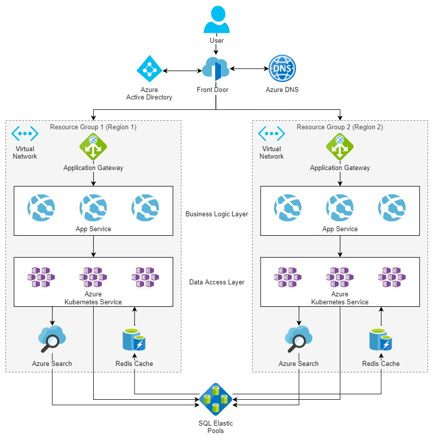

When you identify a portion of your business's software solution that you can unbrand and market to other businesses, it adds an entire new revenue stream for a company. However, configuring the solution to account for the load that a slew of tenants brings is often a challenging obstacle to tackle. This solution tours a suite of Azure technologies that secure and balance the traffic.

## Architecture

*Download a [Visio file](https://arch-center.azureedge.net/multitenant-saas.vsdx) of this architecture.*

### Workflow

A suite of Azure technologies secure and load balance the traffic.

1. Microsoft Azure Front Door handles a few initial tasks:

    * Processing the initial request

    * Load balancing across the regions

    * SSL(HTTPS) termination and offloading

    * Failing over if there's a regional outage

1. Azure DNS manages DNS records and ensures routing to the correct Azure Front Door endpoint.

1. The architecture uses Azure Active Directory (Azure AD) as the identity provider for authentication.

1. Once routed to the appropriate region, Application Gateway routes and load balances, directing requests to the appropriate Azure App Service.

1. For this architecture, using App Service is the preferred service for:

    * Any HTTP-based application.

    * Serving web content.

    * Exposing RESTful APIs.

    * Implementing business logic behind the front-end application.

    You can configure App Service to scale up and out automatically. It makes App Service a good fit for scaling a host of tenant HTTP-driven requests on demand.

1. The data-access layer services are also independently scaled based on load. Data services manage data models, connection clients, and drivers. The services also provide a consistent data interface for all higher-level services wishing to consume data in the application. You can deploy and scale these data services using the Azure Kubernetes Service (AKS). Each AKS cluster is responsible for a set of related features in the layer. AKS can implement a microservice architecture, which features a series of containers that each encapsulate specific functionality within the cluster. This allows for a high degree of abstraction and de-coupling within the code. It also allows for clusters to scale out individually to account for increased load from multiple tenants. Each cluster can scale up its resources if load increases on the cluster. The scale up doesn't affect the other clusters in the resource group as long as they aren't experiencing the same increase.

1. Store and manage relational data outside of the application framework. Doing so provides a single point of data entry for either region. You can achieve replication, availability, scalability, and security by leveraging the strength of Azure SQL Elastic Pools. Provision each tenant a database in a pool. Allocate the resources available in the pool to databases on-demand as load and requests come in. This optimizes database resources available for tenants against your budget.

### Components

The primary components are the suggested components for the architecture in this solution. If any of the primary components don't fit your architecture, see the list of alternative components.

#### Primary components

* [Azure Front Door](https://azure.microsoft.com/services/frontdoor/): A regional load balancer that routes client traffic to the correct region. It can fail over to the second region if a regional failure happens, and it can secure the internet-facing entry point via [Azure Web Application Firewall](/azure/web-application-firewall/ag/ag-overview).

* [Azure Active Directory (Azure AD)](https://azure.microsoft.com/services/active-directory/): Acts as the identity provider for the entire application, enforcing authentication and end-to-end authorization of the request in the application.

* [Azure DNS](https://azure.microsoft.com/services/dns/): A hosting service in Azure for domain name resolution. In a multitenant solution, multiple clients access the solution via their own individual domains. Use Azure DNS to configure and resolve client requests to their correct application stack.

* [Application Gateway](https://azure.microsoft.com/services/application-gateway/): Routes and load-balances traffic internally in the application to the various services that satisfy client business needs. While Azure Front Door balances load across high-level regions, it's Application Gateway that has awareness of the load on individual services within a group. Azure Front Door and Application Gateway combine to provide complex load-balancing at all levels in a multitenant solution. For more information on load-balancing options in Azure, visit this [overview on Azure load-balancing](../../guide/technology-choices/load-balancing-overview.yml).

* [App Service](https://azure.microsoft.com/services/app-service/): Azure's premier service for web applications and web-based APIs. Security integrates with services like Azure AD and [Azure Key Vault](https://azure.microsoft.com/services/key-vault/). You can configure automatic scaling. Also, the amount of resources available to scale to is flexible between the various App Service plans on which the app can run. App Service can also leverage integrated DevOps capabilities for continuous integration and deployment to multiple environments. These and other supporting features of the Azure platform allow for developers to focus on the development of their applications.

* [Azure Kubernetes Service (AKS)](https://azure.microsoft.com/services/kubernetes-service/): Orchestrates instances of container images deployed to a cluster. Managing multiple clients' data often involves implementing a suite of components to manage:

  * Data modeling

  * Data source connectivity

  * Extract, transform, load (ETL)

  * Import/export activities

  Developing these many smaller components as container-based microservices creates an ideal scenario for the deployment to an AKS cluster. Tools for autoscaling, load balancing, and upgradeability are built into the framework. AKS integrates well with a continuous integration/continuous delivery (CI/CD) strategy using the available DevOps features and Azure Container Registry.

* [Azure SQL Elastic Pools](/azure/sql-database/sql-database-elastic-pool): Provides a solution for managing a set of databases flexibly with a pool of resources. The service allocates resources on demand to the databases. It gives the developer of a multitenant SaaS architecture the power to deliver database resources to clients as they need it. The service also reduces the budget and overhead of maintaining multiple SQL Servers with large chunks of unused compute resources.

* [Azure Cognitive Search](https://azure.microsoft.com/services/search/) (formerly known as Azure Search): A service that adds a powerful indexing and query engine to your application. It gives clients access to strong query functionality. They can also use Azure's AI capabilities to enrich and enhance the query functionality. Azure Cognitive Search can account for multitenancy using an index-per-tenant or service-per-tenant strategy.

* [Azure Cache for Redis](https://azure.microsoft.com/services/cache/): Applies a caching layer as a service to the solution, providing an in-memory managed cache to reduce latency and increase performance for the clients. High throughput allows for a high volume of requests to handle multiple tenants accessing the system. You can flexibly scale up the service as application loads increase. It also supports encryption at rest to protect and isolate cached tenant data.

### Alternatives components

* [Azure Virtual Machine Scale Sets](https://azure.microsoft.com/services/virtual-machine-scale-sets/): Allows for the deployment of services to a virtual machine (VM) environment that scales and grows automatically as needed. Virtual Machine Scale Sets integrate well with a [Load Balancer](/azure/load-balancer/load-balancer-overview) or Application Gateway to automatically rebalance load as the scale set grows. Virtual Machine Scale Sets provides the scalability this solution demands. In many cases though, it's unnecessary to manage the full VM environment, and we can defer that level of the stack to App Service or AKS.

* [Azure SQL Database](https://azure.microsoft.com/services/sql-database/): Implement as individual dedicated instances as a replacement for Elastic Pools. Using Azure SQL Database adds higher overhead in managing the instance directly and incurs more cost for allocated resources. That said, it's an acceptable alternative when the tenant requires a dedicated server. In particular, the client might require more control over the instance and dedicated available resources. Tenants that require a dedicated SQL Server can exist side by side with tenants on an Elastic Pool configuration. You can make a tier of SQL databases one of the pricing options available to tenants when purchasing licenses for the SaaS.

* [SQL Server on Virtual Machines](https://azure.microsoft.com/services/virtual-machines/sql-server/): Another option for the deployment of SQL databases. The tenant might have pre-existing IT infrastructure and existing SQL Servers on premises. In that case, the tenant might want to use their current licenses, either as a full migration or in a hybrid scenario. The decoupled nature of the SaaS allows for the data layer of the application to target any SQL Database via configuration.

## Scenario details

When you identify a portion of your business's software solution that you can unbrand and market to other businesses, it adds an entire new revenue stream for a company. However, configuring the solution to account for the load that a slew of tenants brings is often a challenging obstacle to tackle.

Azure offers a range of services for managing a software solution that:

* Flexibly maintains databases for all clients.

* Scales the business and logic tier of the solution to prevent bottlenecks at the compute layer.

* Integrates availability and regional failover.

* Provides end-to-end security at all levels of the solution.

### Potential use cases

These use cases have design patterns that can benefit from a multitenant SaaS solution hosted on Azure:

* Develop a customer relationship management (CRM) solution that clients can market and sell to customers.

* Implement a content management system (CMS) system and deliver it to multiple users using this architecture.

## Considerations

These considerations implement the pillars of the Azure Well-Architected Framework, which is a set of guiding tenets that can be used to improve the quality of a workload. For more information, see [Microsoft Azure Well-Architected Framework](/azure/architecture/framework).

### Multitenancy

A multitenant solution is the key consideration in this solution. The solution handles a number of clients simultaneously. It also allocates enough resources to process all client requests effectively. While processing requests, the solution secures traffic from global endpoints and isolates client data to prevent breaches and cross-contamination. Deploy clients to a pair of regional resource groups based on their primary location. Doing so optimizes regional availability.

You can deploy many clients to a single compute group because the system isolates requests based on authentication and client keys, which differentiates requests based on these unique identifiers. The system can encrypt all client requests separately by their keys so that no client can decrypt any other client's data. Managing multiple clients on a single compute stack gives you the ability to optimize resource allocation to provide clients the responsiveness they need at cost.

You manage client databases in a similar way outside of the compute stack, because a client request could arrive from either of the regional stacks. Many client databases can exist on the same Elastic Pool, isolated and secured by transparent data encryption (TDE). You can configure each database to encrypt data using a client-managed key and decrypt the data just in time (JIT). Decrypting JIT protects client data from both the developer and other clients. The system leverages the Elastic Pool to provide resources on demand to the clients assigned to it while keeping costs low for you. You can assign replication policies to each Elastic Pool to provide backup and failover for client data. Bring more Elastic Pools online as you onboard more clients into the system.

For more information about multitenant solutions, see [Architect multitenant solutions on Azure](../../guide/multitenant/overview.md).

### Reliability

Reliability ensures your application can meet the commitments you make to your customers. For more information, see [Overview of the reliability pillar](/azure/architecture/framework/resiliency/overview)."

### Scalability and Availability

This solution is designed to account for a large number of tenants using the SaaS. It takes advantage of the large number of scalable components and services to grow based on load. This architecture isn't designed for solutions that service a few tenants, or a small load of requests and data. It could stress the budget of a solution targeting a single client or smaller load. It's also unnecessary to have the multiregion overhead where high global availability isn't a requirement, because it adds unnecessary complexity and cost.

### Security

Security provides assurances against deliberate attacks and the abuse of your valuable data and systems. For more information, see [Overview of the security pillar](/azure/architecture/framework/security/overview).

The system addresses security from end-to-end at each level of the application:

* Azure Front Door provides built-in HTTPS support for its domains. This means the system can encrypt all traffic to the SaaS application. Azure Front Door also implements Azure Web Application Firewall, protecting the SaaS stack from attacks at the edge, before the system routes requests to the application.

* Each application stack in each region lies within an Azure Virtual Network. The system restricts traffic into the virtual network accepting requests from Azure Front Door, protecting all application services from external traffic. Once inside the secure firewall, Application Gateway can terminate SSL and provide performant load balancing and routing within the application.

* You can securely manage all credentials, secrets, and connection strings by using Azure Key Vault. By managing this sensitive data as secrets, developers can inject credentials into the application at the time of deployment. Doing so makes sure that the code isn't polluted with sensitive information. Using secrets protects client data by ensuring that a breach in code or man-in-the-middle attack wouldn't gain access to tenant databases.

* In this scenario, the data of multiple tenants might exist side by side on the same database server, if not the same database. Using TDE and JIT decryption protects data on the database. The system encrypts all data on the database at rest, and only decrypts it when requested by the tenant. Clients can provide their own keys, and you can store all client keys in Azure Key Vault to manage encryption for multiple tenants. It protects client data end to end, prevents the developer from having access to client data, isolates data between tenants, and helps to meet compliance requirements for security and data.

### Cost optimization

Cost optimization is about looking at ways to reduce unnecessary expenses and improve operational efficiencies. For more information, see [Overview of the cost optimization pillar](/azure/architecture/framework/cost/overview).

Azure App Service provides many pricing tiers based on the expected compute resources required. For a multitenant SaaS, high availability and scale-out capabilities are key components in choosing the service plan. If you expect to host many tenants, choosing a premium or isolated tier might be necessary to provide the compute resources necessary to account for the high traffic. The standard, premium, and isolated tiers are all dedicated VM instances. You can calculate cost per unit of time by how many VMs of said tier you've specified. For more information, visit the [overview of App Service pricing plans](/azure/app-service/overview-hosting-plans).

Azure Kubernetes Service provides a cost-effective container service. Charges for AKS nodes only occur on usage, so you're only charged for:

* The VMs

* Consumed storage and network resources

* Scaling cost directly related to usage

Using AKS as the data-tier service is ideal if you're looking to reduce costs. For an estimate on pricing out a layer of AKS instances, visit the [Kubernetes service calculator](https://azure.microsoft.com/pricing/calculator/?service=kubernetes-service).

By design, the Azure SQL Elastic Pool pricing is highly cost-effective in a multitenant scenario. Tenant databases in an Elastic Pool will share the available resources. As demand shifts between tenants over time, resources will shift as well.  Azure SQL Elastic Pool provides the maximum available resources to demanded databases without the need for resource overhead on all databases. The service keeps cost low for the developer of the SaaS and the tenants. Use the [Azure SQL Database pricing calculator](https://azure.microsoft.com/pricing/details/sql-database/elastic/) to price out and determine the tier and amount of resources needed to serve your tenants and their data.

* Using a virtual core (vCore) pricing model provides greater flexibility in scaling to meet required resources. Also, you can take advantage of the Azure Hybrid Benefit. Existing SQL Server licenses provide a discount to vCore SQL resources in the cloud. Therefore, in an instance when on-premises servers are already part of the developer infrastructure, you can manage cost even more by using these discounts. You can estimate your potential savings by using the [Azure Hybrid Benefit savings calculator](https://azure.microsoft.com/pricing/hybrid-benefit/).

* You can also save cost on SQL Server resources by purchasing [Azure SQL Database reserved capacity](/azure/sql-database/sql-database-reserved-capacity). Purchasing reserved capacity marks a commitment of long-term SQL Database usage. The term is usually between one to three years. In return, you get discounts on the compute costs of the resources in reservation. For instance, you could reserve 32 general purpose vCores for a year, which reduces the cost of those 32 vCores for that year. Having multiple tenants purchasing licenses for a SaaS is a strong indicator that making use of Reserved capacity fits the solution, and an ideal cost saver in this workload.

You can find the pricing structure for Azure Cache for Redis on the [Azure Cache for Redis pricing](https://azure.microsoft.com/pricing/details/cache/) page. Adjust the cache tier at any time between a Basic, Standard, and Premium tier based on need. You'll see higher pricing on the larger cache limits and additional features such as replication and disaster recovery. Azure Cache for Redis also offers reserved capacity pricing for long-term usage commitments.

Azure Front Door's pricing depends on the amount of data transfer in and out of the service. For outbound data, the pricing is different based on zones. Different regions will incur different costs. If you come across a price differential, estimate the cost separately. The price includes some routing and domain capacity, but the system incurs costs past the initial limits. Azure Web Application Firewall incurs a small additional charge per policy or rule applied. You can find the pricing details for Azure Front Door on the [Azure Front Door pricing](https://azure.microsoft.com/pricing/details/frontdoor/) page.

The [pricing for Azure Cognitive Search](https://azure.microsoft.com/pricing/details/search/) is a fully tiered system. A free tier is available for development and testing. After that, each tier incurs a per-hour cost for each Cognitive Search instance allocated. As the tiers increase, the total storage, number of indexes, and scale-out limits also increase. Azure Cognitive Search provides image extraction as a service at the same rate to all paid tiers.

## Next steps

* [Application and service principal objects in Azure Active Directory](/azure/active-directory/develop/app-objects-and-service-principals) is about leveraging Azure Active Directory to implement multitenant apps.

* [Multitenant SaaS database tenancy patterns](/azure/azure-sql/database/saas-tenancy-app-design-patterns) covers implementing multitenancy patterns in SQL.

* [Tenancy in Azure Active Directory](/azure/active-directory/develop/single-and-multi-tenant-apps) is also about leveraging Azure Active Directory to implement multitenant apps.

## Related resources

* [Run a web application in multiple Azure regions for high availability](../../web-apps/app-services/architectures/multi-region.yml) is a reference for the multiregion requirement of the solution.

* [Multitier web application built for high availability and disaster recovery on Azure](../infrastructure/multi-tier-app-disaster-recovery.yml) is a similar example workload scenario. It describes many of the considerations for a large-scale application on Azure.
