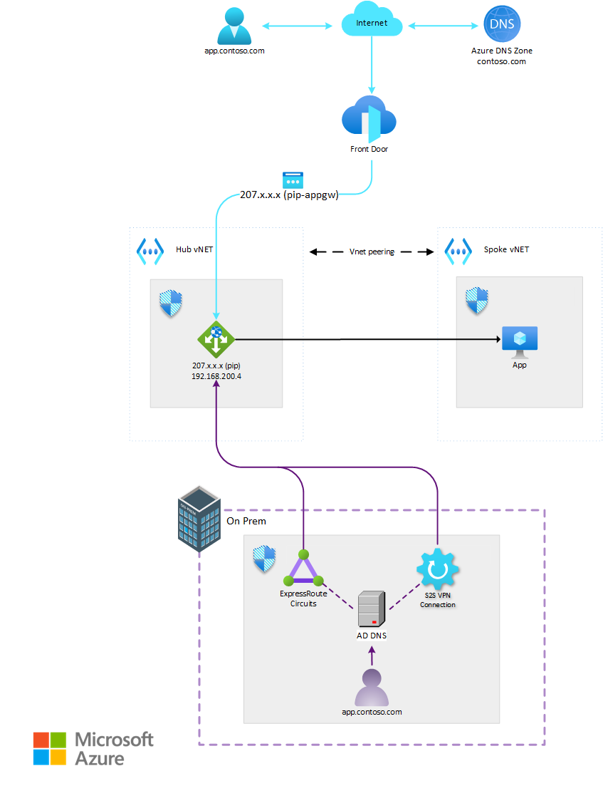
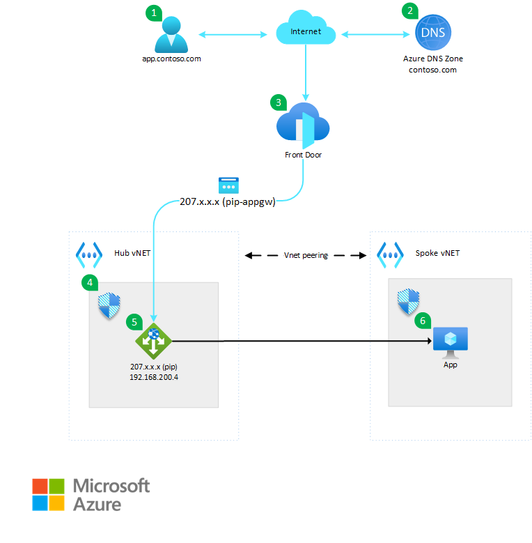
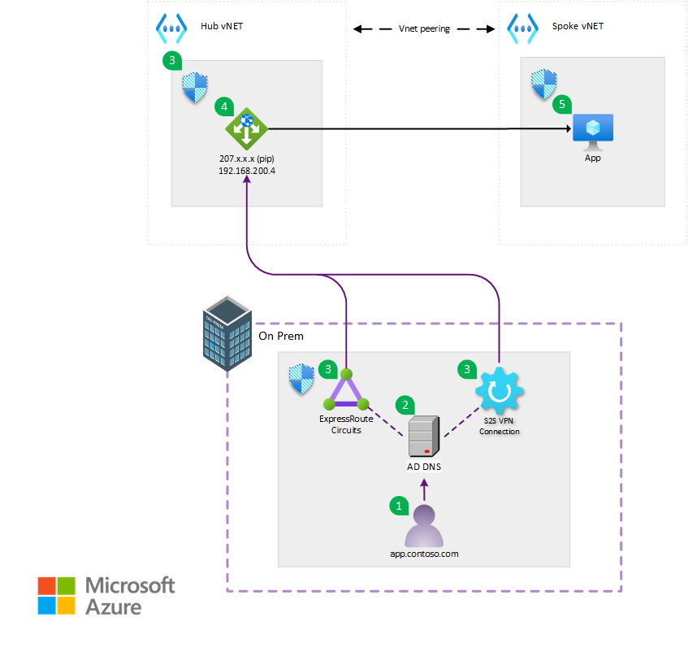
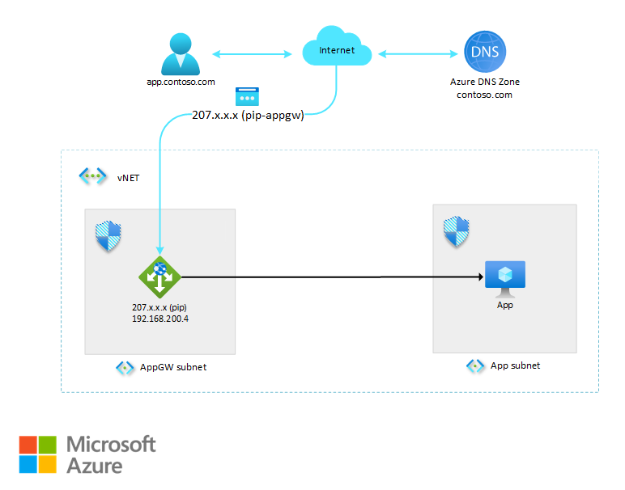

<!-- Use the aac-browse-header.yml   -->
Teams managing workloads often rely on Fully Qualified Domain Names (FQDNs) for client access, which is typically combined with TLS SNI. However, when a workload is accessible from both the public Internet and internally by enterprise users, the routing to the application can follow distinct paths and may receive varying levels of security or Quality of Service (QoS). This architecture demonstrates an approach to differentiate traffic treatment based on DNS, taking into account whether the client originates from the Internet or the corporate network.

## Architecture

*Download a [Visio file] of this architecture.*

The workload sections below are broken into two parts. One explains the public internet workflow and the other details the private workflow. Each section represents the entirety of the architecture allowing clients to utilize the split-brain hosting architecture.

### Public Internet workflow

1. Users send a request for the application `app.contoso.com` over the public internet.
2. An [Azure DNS Zone](/azure/dns/dns-zones-records) is configured for the `contoso.com` domain where the appropriate [CNAME entries](/azure/frontdoor/front-door-custom-domain#create-a-cname-dns-record) are configured for the Azure Front Door endpoints.
3. External users access the web application via Azure Front Door, which functions as a global load balancer and web application firewall.
   - Within Azure Front Door, the FQDN name of `app.contoso.com` is assigned via routes on a configured endpoint. It also hosts the TLS SNI certificates for the applications.

  > [!NOTE]
  > Azure Front Door does not support self-signed certificates.

   - Azure Front Door routes the requests to the configured Origin Group based on the client Host HTTP header.
   - The Origin Group is configured to point to the Application Gateway using the Application Gateway's public IP address.
4. A [Network Security Group (NSG)](/azure/application-gateway/configuration-infrastructure#network-security-groups) is configured on the Application Gateway subnet to allow inbound access on ports 80 and 443 from the *AzureFrontDoor.Backend* service tag, while disallowing inbound traffic on ports 80 and 443 from the Internet service tag.

  > [!NOTE]
  > Please note that this tag does not limit traffic solely to YOUR instance of Azure Front Door; validation occurs at the next stage.

5. The Application Gateway is set up with a [listener](/azure/application-gateway/configuration-listeners) on port (443). Traffic is routed to the backend by the hostname specified within the listener.
   - To ensure that traffic has originated from *YOUR* Front Door profile, you will configure a [custom WAF rule](/azure/web-application-firewall/ag/create-custom-waf-rules#example-7) to check the `X-Azure-FDID` header value. 
   - Azure generates a unique identifier for each Front Door profile and you can find the identifier in the Azure portal by looking for the *Front Door ID* value in the Overview page of your profile.
6. Traffic reaches the compute resource that is configured as a backend pool on the Application Gateway.

### Private (enterprise) workflow

The following workflow corresponds to the above diagram:

1. Users initiate a request for the application `app.contoso.com` from the on-premise environment.
2. Application FQDNs are configured on the on-premises DNS provider. This DNS provider could be on-premises Active Directory (AD) DNS servers or various other 3rd party solutions.
   - The DNS entries for each of the application FQDNs are configured to point to the private IP address of the Application Gateway.
3. The connection that facilitates access to the Application Gateway can be either an [ExpressRoute circuit](/azure/expressroute/expressroute-circuit-peerings) or a [site-to-site (S2S) VPN](/azure/vpn-gateway/design#s2smulti).
4. A [Network Security Group (NSG)](/azure/application-gateway/configuration-infrastructure#network-security-groups) is configured on the Application Gateway subnet to allow incoming private requests from on-premises user networks where traffic will be originating from. This ensures that other sources of private traffic cannot reach the private IP of the Application Gateway directly.
5. The Application Gateway is configured with a [listener](/azure/application-gateway/configuration-listeners) configured on ports 80 and 443. Traffic is routed to the backend by the hostname specified within the listener.
6. Traffic reaches the compute configured as a backend pool on the Application Gateway strictly over the private network.

### Components

- DNS (Domain Name System): Having [Azure public DNS](/azure/dns/dns-overview) configured with the proper CNAME of the Azure Front Door endpoint FQDN is a critical component for the public internet workflow. On the private (enterprise) side, configuring the local DNS provider (Active Directory DNS/3rd party) to point each application FQDN to the private IP of the Application Gateway is critical. [Azure DNS Private Resolver](/azure/architecture/networking/architecture/azure-dns-private-resolver) could also be utilized for the resolution of on-premise clients. This split-brain DNS situation allows the enterprise users to gain access to the applications without traversing the public internet.
- [Azure Front Door](/azure/well-architected/service-guides/azure-front-door): Azure Front Door is a global load balancer and web application firewall that provides fast and secure delivery of web applications to users around the world. It is used in this architecture to route the external users to the Application Gateway instance and provide caching/optimization options to enhace user experience.
- [Application Gateway](/azure/well-architected/service-guides/azure-application-gateway): Application Gateway is a regional load balancer and web application firewall that provides high availability, scalability, and security for web applications. It is used in this architecture to route the requests from both external and internal users to the back-end compute and protect the web application from common web attacks. Since Azure Front Door and Application Gateway provide WAF capabilities, it was decided to use the WAF functionality on the Application Gateway since both workflows (public/private) utilize this resource. 
- [Azure ExpressRoute](/azure/expressroute/expressroute-introduction): ExpressRoute lets you extend your on-premises networks into the Microsoft cloud over a private connection with the help of a connectivity provider. In this architecture it is one of the options to facilitate private connectivity to the Application Gateway for on premise users.
  
### Alternatives

The primary alternative to this architecture is to remove Front Door and simply have the public Azure DNS record point to the public IP (pip) of the Application Gateway. Based on the requirements, this architecture was not viable due to needing [caching/optimization](/azure/frontdoor/front-door-caching) done at the entry point into Azure. This is called out further in the Cost Optimization section later on in this document.

Other possible alternatives for the public ingress traffic in this architecture are:

- [Azure Traffic Manager](/azure/well-architected/service-guides/traffic-manager/reliability): Azure Traffic Manager is a DNS-based traffic routing service that distributes the traffic across different regions and endpoints. It could be used instead of Azure Front Door to route the external users to the closest Application Gateway instance. However, Azure Front Door provides additional features such as web application firewall, caching, and session affinity, which are not available in Azure Traffic Manager.
- [Azure Load Balancer](/azure/well-architected/service-guides/azure-load-balancer/reliability): Azure Load Balancer is a network load balancer that provides high availability and scalability for TCP and UDP traffic. It could be used instead of Application Gateway to distribute the requests from both external and internal users to the back-end web servers. However, Application Gateway provides additional features such as web application firewall, SSL termination, and cookie-based session affinity, which are not available in Azure Load Balancer.

## Scenario details

This scenario was built to solve the problem of hosting a web application that needs to serve both external and internal users ensuring the traffic follows the appropriate path given the user's point of origin. The customer's goals are to:

- Provide fast and reliable access to the web application for users around the world.
- Provide enterprise users the ability to access the application without traversing the public internet.
- Protect the web application from common web attacks and malicious traffic.

### Potential use cases

This architecture can be useful for scenarios that require:

- **Split-brain DNS**: The solution uses Azure Front Door for external users and Application Gateway for internal users, with different DNS records for each. This can help to optimize network performance, security, and availability for different types of users. 
- **Application scalability**: The solution uses Application Gateway which can distribute traffic among the backend configured compute resources. This can help to improve application performance and availability, as well as support horizontal scaling.

## Considerations

These considerations implement the pillars of the Azure Well-Architected Framework, which is a set of guiding tenets that can be used to improve the quality of a workload. For more information, see [Microsoft Azure Well-Architected Framework](/azure/well-architected/).

### Reliability

Reliability ensures your application can meet the commitments you make to your customers. For more information, see [Design review checklist for Reliability](/azure/well-architected/reliability/checklist).

**Reliability in Split-Brain DNS Architecture**

   - **Identifying Failure Points**: In this split-brain DNS architecture, reliability hinges on the correct functioning of key components such as Azure Front Door, Application Gateway, and DNS configuration. It’s crucial to identify potential failure points such as misconfigurations, SSL certificate issues, or capacity overloads.
   - **Assessing Impact**: The impact of any failure must be assessed. For external users, any disruption to Azure Front Door, which serves as the gateway, could affect global access. For internal users, Application Gateway is the pathway, and issues here could impede enterprise operations.
   - **Mitigation Strategies**: To mitigate risks, implement redundancy across [multiple zones](/azure/reliability/availability-zones-overview), use [health probes](/azure/frontdoor/health-probes) for real-time monitoring, and ensure DNS routing is correctly configured for both external and internal traffic. Ensure that DNS records are updated regularly and a disaster recovery plan is in place.
   - **Continuous Monitoring**: Employ [Azure Monitor](/azure/azure-monitor/overview) and [Azure Log Analytics](/azure/azure-monitor/logs/log-analytics-overview) to keep a vigilant eye on the system’s health. Set up alerts for anomalies and have an incident response plan ready to address potential issues promptly.

Adhering to these principles ensures a robust and reliable system that can withstand various challenges and maintain service continuity.

### Security

Security provides assurances against deliberate attacks and the abuse of your valuable data and systems. For more information, see [Design review checklist for Security](/azure/well-architected/security/checklist). 

1. **Zero-Trust Approach**: In our split-brain DNS setup, we must apply a [zero-trust](/azure/security/fundamentals/zero-trust) approach. We should explicitly verify the identity of a client, regardless of whether they originate from the Internet or the corporate network. This ensures that only trusted entities perform authorized actions.
   - **Implementation**: Implement Azure Active Directory (Azure AD) for robust identity management. Use [conditional access policies](/azure/architecture/guide/security/conditional-access-zero-trust) to enforce strict access controls based on user context, device health, and location.
3. **Assessing Security Efficacy**: The effectiveness of our security measures in this dual-access workload needs to be evaluated.
   **Implementation**:
      - **Defensive Investments**: Regularly assess the effectiveness of Azure Front Door and Application Gateway. Are they providing meaningful protection against threats?
      - **Blast Radius Restriction**: Ensure that any security breach is contained within a limited scope. For example, isolate external and internal traffic flows effectively.
4. **Least-Privilege Access**: Limit permissions to the minimum necessary. Unauthorized access could compromise the entire workload.
   - **Implementation**: Use [Azure Role-Based Access Control (RBAC)](/azure/role-based-access-control/overview) to assign permissions based on roles. Regularly review and revoke unnecessary privileges.
5. **Assume Breach**: Acknowledge that security controls can be breached. Prepare for such scenarios.
   - **Implementation**: Implement network segmentation, micro-segmentation, and network security groups (NSGs). Assume that an attacker might gain access and design compensating controls accordingly.
6. **Continuous Improvement**: Security is an ongoing effort, especially in a dynamic environment like ours.
   - **Implementation**: Regularly update security policies, conduct [penetration testing](/azure/security/fundamentals/pen-testing), and stay informed about emerging threats. Continuously enhance security posture.

By integrating these security principles into our split-brain DNS architecture, we create a robust and resilient system that safeguards both internal and external access to our workload.

### Other Potential Security Enhacements

  - **Application Gateway**: You can use [Web Application Firewall (WAF)](/azure/web-application-firewall/ag/ag-overview) to protect your web applications from common web vulnerabilities and exploits. You can also use [Application Gateway Private Link](/azure/application-gateway/private-link) to securely access your backend application servers from Application Gateway without exposing them to the public internet.
   - **Azure Firewall**: You can add an Azure Firewall to the hub vNET and use [Azure Firewall Threat Intelligence](/azure/firewall/threat-intel) to block malicious traffic from known malicious IP addresses and domains. You can also use [Azure Firewall DNS Proxy](/azure/firewall/dns-details) to intercept and inspect DNS traffic and apply DNS filtering rules. 
   - **Azure Front Door**: You can use [Azure Web Application Firewall](/azure/web-application-firewall/afds/afds-overview) to protect your web applications from common web vulnerabilities and exploits at the edge. You can also use [Azure Private Link](/azure/frontdoor/private-link) in Front Door Premium to securely access your backend application servers from Azure Front Door without exposing them to the public internet.    

### Cost optimization

Cost optimization is about looking at ways to reduce unnecessary expenses and improve operational efficiencies. For more information, see [Design review checklist for Cost Optimization](/azure/well-architected/cost-optimization/checklist).

  - **Backend compute**: The cost of running any backend compute service is driven by multiple factors. SKU selection, replica count, and region all play a part in chosing the right compute option. Ensure you take into account all elements of a [compute resource](/azure/architecture/guide/technology-choices/compute-decision-tree#choose-a-candidate-service) before selecting the option that works best for your workload. 
  - **Application Gateway**: The cost of Application Gateway is based on the number of instances, the size of the instances, and the amount of data processed. You can use [autoscaling](/azure/application-gateway/application-gateway-autoscaling-zone-redundant) to adjust the number of instances based on the traffic demand and optimize the cost. You can also use [zone-redundant SKUs](/azure/application-gateway/application-gateway-autoscaling-zone-redundant#autoscaling-and-high-availability) to deploy across Availability Zones and reduce the need for additional instances for high availability. 
  - **Azure Front Door**: The cost of Azure Front Door is based on the number of routing rules, the number of HTTP(S) requests, and the amount of data transferred. You can use [Azure Front Door Standard/Premium](/azure/frontdoor/understanding-pricing) to get a unified experience with Azure CDN, Azure Web Application Firewall, and Azure Private Link. You can also use [Azure Front Door Rules Engine](/azure/frontdoor/front-door-rules-engine?pivots=front-door-standard-premium) to customize how your traffic is handled and optimize the performance and cost. If global access is not a requirement, or the additional features of Front Door are not needed, the same architecture can work with only the Application Gateway. All public DNS records can be pointed to the Public IP address configured on the Application Gateway listener(s).

See an example of this solution in the [Azure Pricing Calculator](https://azure.com/e/e0b74472f72d48ce891b08b3af105872) approximating typical usage with the components showcased in the architecture. Adjust to fit your scenario.

## Contributors

*This article is maintained by Microsoft. It was originally written by the following contributors.* 

Principal authors:

- [Troy Hite](http://linkedin.com/in/digitalbydesign) | Senior Cloud Solution Architect

Other contributors:

- [Mays Algebary](https://www.linkedin.com/in/maysalgebary) | Senior Azure Networking Global Blackbelt
- [Adam Torkar](https://www.linkedin.com/in/at-10993764) | Senior Azure Networking Global Blackbelt
- [Michael McKechney](https://www.linkedin.com/in/michaelmckechney/) | Principal Azure Technology Specialist
 
*To see non-public LinkedIn profiles, sign in to LinkedIn.*

## Next steps

- [Use Azure Front Door in a multitenant solution](/azure/architecture/guide/multitenant/service/front-door)
- [Application Gateway infrastructure configuration](/azure/application-gateway/configuration-infrastructure)
- [End-to-end TLS with Azure Front Door](/azure/frontdoor/end-to-end-tls)
- [Add a custom domain to Azure Front Door](/azure/frontdoor/front-door-custom-domain)
- [What is geo-filtering on a domain for Azure Front Door](/azure/web-application-firewall/afds/waf-front-door-geo-filtering)
 
## Related resources

- [Firewall and Application Gateway for virtual networks](/azure/architecture/example-scenario/gateway/firewall-application-gateway#architecture-2)
