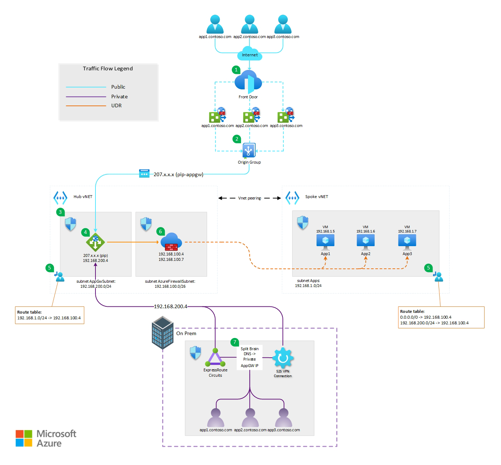
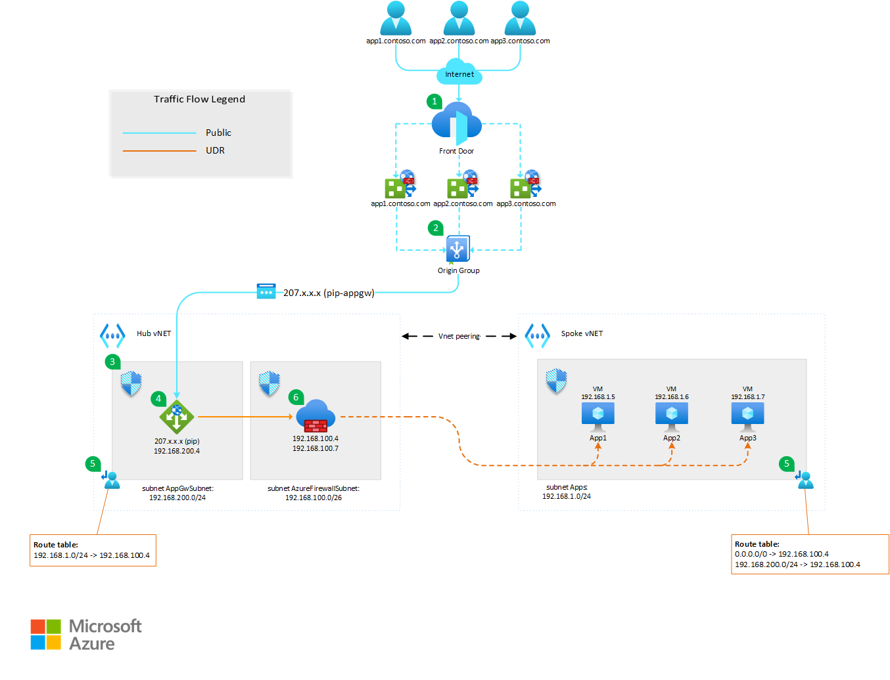
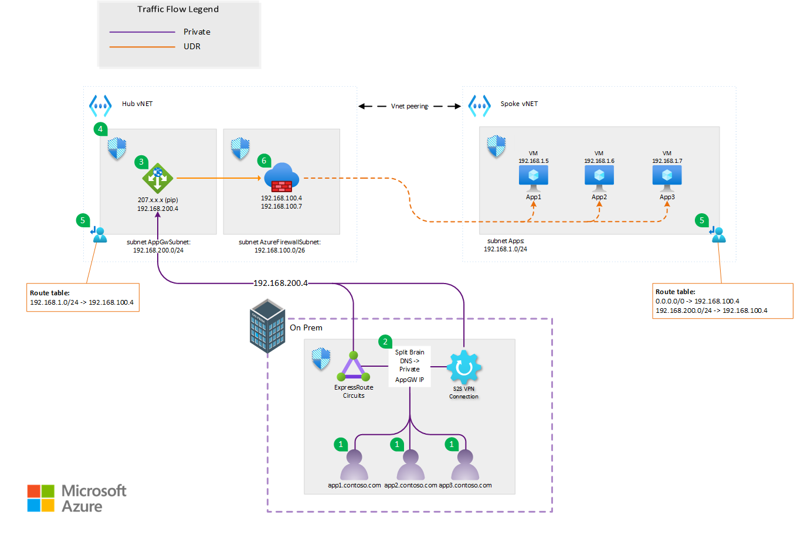
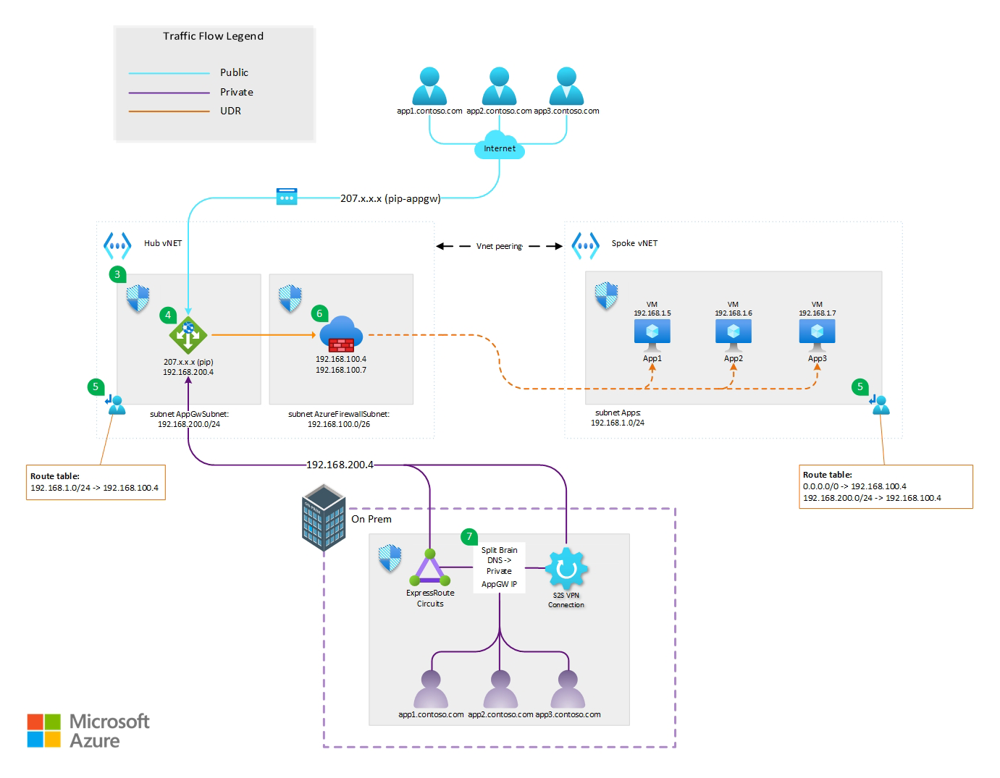

<!-- Use the aac-browse-header.yml   -->
Workload teams often rely on Fully Qualified Domain Names (FQDNs) for client access, typically combined with TLS SNI. However, when a workload is accessible both from the public Internet and internally by enterprise users, routing to the application can follow distinct paths and receive varying security or Quality of Service (QoS) treatment. This architecture demonstrates an approach to differentiate traffic treatment based on DNS, considering whether the client originates from the Internet or the corporate network.

In this example architecture, applications are hosted on distinct virtual machines, each machine is configured to respond to a unique subdomain derived from a primary apex domain. A primary focus will be on secure management of network traffic. The goals are that all communication between the Application Gateway and the backend application servers (VMs) is routed through an Azure Firewall. For user access and caching/optimization needs, Azure Front Door is employed for external users, but is bypassed for internal users. The primary solution to support this architecture will be controlling DNS results based on the network location of the client.

This architectural approach offers high availability, scalability, and enhanced security for web applications hosted on Azure.

## Architecture

*Download a [Visio file](https://arch-center.azureedge.net/[file-name].vsdx) of this architecture.*

### Public Internet workflow

The following workflow corresponds to the above diagram:

1. External users access the web application through Azure Front Door, which acts as a global load balancer and web application firewall.
   - Within Azure Front Door you assign the FQDN names of app1.contoso.com, app2.contoso.com, and app3.contoso.com via individual routes on a configured endpoint. It also hosts the TLS SNI certificates for the applications.
   - Azure Front Door routes the requests based on the client `Host` HTTP header to the configured Origin Group.
2. The Origin Group is configured to point to the Application Gateway by the Application Gateway's public IP address.

> [!IMPORTANT]
> You must ensure that the Origin Group is configured to leave the `Host` HTTP header unaltered. This is required so the Application Gateway can properly route the incoming requests to the various backend pools.

3. A [Network Security Group (NSG)](/azure/application-gateway/configuration-infrastructure#network-security-groups) is configured to allow inbound access on ports 80 and 443 from the *AzureFrontDoor.Backend* service tag, and disallow inbound traffic on ports 80 and 443 from the Internet service tag. This ensures that other sources of public traffic cannot reach the Public IP of the Application Gateway directly.

> [!NOTE]
> Be aware that this tag does not limit traffic from just *YOUR* instance of Azure Front Door, that validation happens at the next stage.

4. The Application Gateway is configured with multiple [multisite listeners](/azure/application-gateway/multiple-site-overview) all configured on the same port (443). Traffic is routed to the appropriate backend by the hostname specified within the multisite listener. Each listener represents a unique subdomain off the apex domain that is configured to point to the appropriate backend pool.
   - To ensure that traffic has originated from *YOUR* Front Door profile, you will configure a [custom WAF rule](/azure/web-application-firewall/ag/create-custom-waf-rules#example-7) to check the `X-Azure-FDID` header value. 
   - Azure generates a unique identifier for each Front Door profile and you can find the identifier in the Azure portal by looking for the *Front Door ID* value in the Overview page of your profile.
5. Route tables are implemented on the 'AppGwSubnet' and 'Apps' subnet to facilitate the requirement of having all traffic flow through the Azure Firewall.
6. Azure Firewall is configured to allow traffic between the Application Gateway and the backend pools. Optionally additional features can be enabled to analyze and inspect the traffic.

### Private (enterprise) workflow

The following workflow corresponds to the above diagram:

1. Application FQDNs are configured on the on-premises DNS provider. This DNS provider could be on-premises Active Directory (AD) DNS servers or various other 3rd party solutions.
2. The DNS entries for each of the application FQDNs are configured to point to the private IP address of the Application Gateway.
   - The connection that facilitates access to the Application Gateway can be either an ExpressRoute circuit or a site-to-site (S2S) VPN.
3. A [Network Security Group (NSG)](/azure/application-gateway/configuration-infrastructure#network-security-groups) is configured on the Application Gateway subnet to only allow incoming private requests from on-premises user networks where traffic will be originating from. This ensures that other sources of private traffic cannot reach the private IP of the Application Gateway directly.
4. The Application Gateway is configured with multiple [multisite listeners](/azure/application-gateway/multiple-site-overview) all configured on the same port (443). Traffic is routed to the appropriate backend by the hostname specified within the multisite listener. Each listener represents a unique subdomain off the apex domain that is configured to point to the appropriate backend pool.
5. Route tables are implemented on the 'AppGwSubnet' and 'Apps' subnet to facilitate the requirement of having all traffic flow through the Azure Firewall.
6. Azure Firewall is configured to allow traffic between the Application Gateway and the backend pools. Optionally additional features can be enabled to analyze and inspect the traffic.

### Components

- [Azure Front Door](/azure/well-architected/service-guides/azure-front-door): Azure Front Door is a global load balancer and web application firewall that provides fast and secure delivery of web applications to users around the world. It is used in this architecture to route the external users to the Application Gateway instance and provide caching/optimization options to enhace user experience.
- [Application Gateway](/azure/well-architected/service-guides/azure-application-gateway): Application Gateway is a regional load balancer and web application firewall that provides high availability, scalability, and security for web applications. It is used in this architecture to route the requests from both external and internal users to the back-end web servers and protect the web application from common web attacks. Since Azure Front Door and Application Gateway provide WAF capabilities, it was decided to use the WAF functionality on the Application Gateway since both workflows (public/private) utilize this resource. 
- [Azure Firewall](/azure/well-architected/service-guides/azure-firewall): Azure Firewall is a cloud-based network security service that filters and logs the traffic between different subnets and networks. It is used in this architecture to control and monitor the traffic between Application Gateway and the back-end web servers, and to perform NAT for the outbound traffic from the web servers to the internet.
- [Route Table](/azure/virtual-network/virtual-networks-udr-overview#user-defined): Route tables let you create custom, or user-defined(static), routes in Azure to override Azure's default system routes, or to add more routes to a subnet's route table. In this architecture they are used to define User-defined Routes (UDR) to direct all traffic leaving the AppGWsubnet destined for the individual backend pools to first go through the Azure Firewall. A route table with a UDR is also required on the backend pool subnet to direct return traffic to the Application Gateway to first go through the Azure Firewall. These route tables are attached at the subnet level.
- [Azure Virtual Machines](/azure/well-architected/service-guides/azure-expressroute): Azure Virtual Machines are on-demand, scalable, and configurable compute resources that run the web application code. They are used in this architecture to host the back-end web servers in an availability set, which provides high availability and fault tolerance.
- [Azure ExpressRoute](/azure/expressroute/expressroute-introduction): ExpressRoute lets you extend your on-premises networks into the Microsoft cloud over a private connection with the help of a connectivity provider. In this architecture it is one of the options to facilitate private connectivity to the Application Gateway for on premise users.
- DNS (Domain Name System): Having public DNS configured with the proper CNAME of the Azure Front Door endpoint FQDN is a critical component for the public internet workflow. On the private (enterprise) side, configuring the local DNS provider (Active Directory DNS/3rd party) to point each application FQDN to the private IP of the Application Gateway is critical. This split-brain DNS situation allows the enterprise users to gain access to the applications without traversing the public internet.
  
### Alternatives

The primary alternative to this architecture is to remove Front Door and simply have external users configured to hit the public IP (pip) of the Application Gateway. Based on the requirements, this architecture was not viable due to needing [caching/optimization](https://learn.microsoft.com/en-us/azure/frontdoor/front-door-caching?pivots=front-door-standard-premium) done at the entry point into Azure. This is called out further in the Cost Optimization section later on in this document.

Other possible alternatives for the ingress traffic in this architecture are:

- [Azure Traffic Manager](/azure/well-architected/service-guides/traffic-manager/reliability): Azure Traffic Manager is a DNS-based traffic routing service that distributes the traffic across different regions and endpoints. It could be used instead of Azure Front Door to route the external users to the closest Application Gateway instance. However, Azure Front Door provides additional features such as web application firewall, caching, and session affinity, which are not available in Azure Traffic Manager.
- [Azure Load Balancer](/azure/well-architected/service-guides/azure-load-balancer/reliability): Azure Load Balancer is a network load balancer that provides high availability and scalability for TCP and UDP traffic. It could be used instead of Application Gateway to distribute the requests from both external and internal users to the back-end web servers. However, Application Gateway provides additional features such as web application firewall, SSL termination, and cookie-based session affinity, which are not available in Azure Load Balancer.

> [!TIP]
> Virtual machines in this architecture are a stand-in for any application platform that supports private IP based access. The applications could have been hosted in [Azure App Service](/azure/well-architected/service-guides/azure-app-service/reliability), [Azure Container Apps](/azure/container-apps/overview), or [Azure Kubernetes Service (AKS)](/azure/well-architected/service-guides/azure-kubernetes-service), for example, as they all support private IP based access.

## Scenario details

This scenario was built to solve the problem of hosting a web application that needs to serve both external and internal users with high availability, scalability, and security. The customer's goals are to:

- Provide fast and reliable access to the web application for users around the world.
- Use the same apex domain name and URL for both external and internal users, without exposing the internal IP addresses to the Internet while routing subdomains to different applications hosted on separate virtual machines.
- Protect the web application from common web attacks and malicious traffic.
- Control and monitor all network traffic between the Application Gateway and the backend virtual machines.
- Ensure the availability and fault tolerance of the web application.

### Potential use cases

This architecture can be useful for scenarios that require:

- **Multi-site hosting**: The solution enables hosting multiple applications on separate virtual machines, each with a unique subdomain off a primary apex domain. This can help to isolate and manage different workloads, such as development, testing, and production environments.
- **Split-brain DNS**: The solution uses Azure Front Door for external users and Application Gateway for internal users, with different DNS records for each. This can help to optimize network performance, security, and availability for different types of users. 
- **Network security**: The solution ensures that network traffic between the Application Gateway and the backend application servers (VMs) flows through an Azure Firewall. This can help to protect the applications from malicious attacks and enforce network policies. 
- **Application scalability**: The solution uses Application Gateway to distribute traffic among the backend VMs. This can help to improve application performance and availability, as well as support horizontal scaling.

## Considerations

These considerations implement the pillars of the Azure Well-Architected Framework, which is a set of guiding tenets that can be used to improve the quality of a workload. For more information, see [Microsoft Azure Well-Architected Framework](/azure/well-architected/).

### Reliability

Reliability ensures your application can meet the commitments you make to your customers. For more information, see [Design review checklist for Reliability](/azure/well-architected/reliability/checklist).

**Identify Failure Points**

In our architecture, several critical components require careful consideration:

   - **Application Gateway**: The entry point for all internal user requests. Potential failure points include misconfigurations, SSL certificate expiration, or capacity limits.
   - **Azure Firewall**: Responsible for securing communication between the Application Gateway and backend VMs. Failures could occur due to rule conflicts, unexpected traffic spikes, or misconfigured network rules.
   - **Azure Front Door**: Primarily used for external user access and caching/optimization. Failure points may involve DNS misconfigurations, regional outages, or SSL termination issues.

**Assess Impact**
   - **External Users**: If the Application Gateway fails, external users won’t be able to access the subdomains associated with our primary apex domain. This directly impacts user experience and business continuity.
   - **Internal Users**: Backend VMs are critical for internal users (e.g., financial analysts). A failure in communication between the Application Gateway and VMs disrupts data retrieval and analysis.

**Mitigation Strategies**
   - **Redundancy and Scaling**:
      - Deploy multiple Application Gateways across availability zones to ensure high availability.
      - Autoscale backend VMs based on demand to handle varying loads.
   - **Health Probes and Monitoring**:
      - Regularly check the health of VMs and services. Use Azure Monitor to trigger scaling events or failover.
      - Set up alerts for critical metrics (e.g., CPU, memory, response time).
   - **DNS Control**:
      - Implement DNS-based routing based on client network location:
         - For external users, Azure Front Door handles DNS resolution and caching.
         - For internal users, bypass Azure Front Door and route directly to the Application Gateway.
      - Ensure DNS records are up-to-date and correctly configured. 
         - In the event of a diaster, plan for the need to keep both public and private DNS records accurate post any required failover.

**Continuous Monitoring and Incident Response**
   - **Logging and Analysis**:
      - Collect logs from all components (Application Gateway, Azure Firewall, VMs).
      - Use Azure Log Analytics or Azure Monitor Logs for centralized analysis.
   - **Incident Response Plan**:
      - Define procedures for handling failures.
      - Establish communication channels to inform users promptly during outages.

By following these strategies, we can maintain a reliable and secure network traffic management system for our web applications, meeting the goals of our example workload.

### Security

Security provides assurances against deliberate attacks and the abuse of your valuable data and systems. For more information, see [Design review checklist for Security](/azure/well-architected/security/checklist). 

**Network Security**: Define Network Boundaries

In our architecture, we have distinct network boundaries for external and internal users:
   - **External Users**: Azure Front Door serves as the entry point for external traffic. It provides SSL termination, caching, and DDoS protection. Ensure proper network segmentation between external and internal components.
   - **Internal Users**: Direct communication between the Application Gateway and backend VMs. Restrict network access to authorized IP ranges for internal users.

**Data Security**: Encrypt Data in Transit and at Rest
   - **Data in Transit**:
      - Implement [end-to-end TLS on Azure Front Door](/azure/frontdoor/end-to-end-tls) to ensure traffic traverses the Application Gateway and on to your backend VMs in a secure manner.
      - Configure Azure Front Door to enforce HTTPS for external users.
> [!NOTE]
> Self-signed certificates are not supported on Azure Front Door.
      
   - **Data at Rest**:
      - Encrypt sensitive data stored in backend VMs using Azure Disk Encryption or Azure SQL Transparent Data Encryption (TDE).

**Identity and Access Management (IAM)**: Implement Least Privilege Access
   - **Role-Based Access Control (RBAC)**:
      - Assign minimal permissions to service accounts and users.
      - Use custom roles to limit access to specific resources.
   - **Managed Identities**:
      - Leverage managed identities for VMs to avoid storing credentials.
      - Limit access to Azure services using managed identities.

**Threat Detection and Monitoring**: Set Up Logging and Monitoring
   - **Azure Monitor**:
      - Enable diagnostic settings for all components (Application Gateway, Azure Firewall, VMs).
      - Collect logs and metrics for analysis.
   - **Security Center**:
      - Enable threat detection and vulnerability assessments.
      - Monitor security recommendations and apply necessary fixes.

By addressing these security considerations, we can enhance the security of our subdomain-based web application.

### Other Potential Security Enhacements

  - **Application Gateway**: You can use [Web Application Firewall (WAF)](/azure/web-application-firewall/ag/ag-overview) to protect your web applications from common web vulnerabilities and exploits. You can also use [Application Gateway Private Link](/azure/application-gateway/private-link) to securely access your backend application servers from Application Gateway without exposing them to the public internet.
   - **Azure Firewall**: You can use [Azure Firewall Threat Intelligence](/azure/firewall/threat-intel) to block malicious traffic from known malicious IP addresses and domains. You can also use [Azure Firewall DNS Proxy](/azure/firewall/dns-details) to intercept and inspect DNS traffic and apply DNS filtering rules. 
   - **Azure Front Door**: You can use [Azure Web Application Firewall](/azure/web-application-firewall/afds/afds-overview) to protect your web applications from common web vulnerabilities and exploits at the edge. You can also use [Azure Private Link](/azure/frontdoor/private-link) in Front Door Premium to securely access your backend application servers from Azure Front Door without exposing them to the public internet.    

### Cost optimization

Cost optimization is about looking at ways to reduce unnecessary expenses and improve operational efficiencies. For more information, see [Design review checklist for Cost Optimization](/azure/well-architected/cost-optimization/checklist).

  - **Backend compute**: The cost of running any backend compute service is driven by multiple factors. SKU selection, replica count, and region all play a part in chosing the right compute option. Ensure you take into account all elements of a compute resource before selecting the option that works best for your workload. 
  - **Application Gateway**: The cost of Application Gateway is based on the number of instances, the size of the instances, and the amount of data processed. You can use [autoscaling](/azure/application-gateway/application-gateway-autoscaling-zone-redundant) to adjust the number of instances based on the traffic demand and optimize the cost. You can also use [zone-redundant SKUs](/azure/application-gateway/application-gateway-autoscaling-zone-redundant#autoscaling-and-high-availability) to deploy across Availability Zones and reduce the need for additional instances for high availability. 
  - **Azure Firewall**: The cost of Azure Firewall is based on a fixed hourly rate and the amount of data processed. When optimizing costs for an Azure Firewall resource, consider resource consolidation by sharing a single firewall instance across multiple applications or teams. By doing so, you can benefit from amortized costs through chargeback or showback. This approach ensures efficient utilization of the firewall while distributing expenses transparently among the relevant stakeholders. 
  - **Azure Front Door**: The cost of Azure Front Door is based on the number of routing rules, the number of HTTP(S) requests, and the amount of data transferred. You can use [Azure Front Door Standard/Premium](/azure/frontdoor/understanding-pricing) to get a unified experience with Azure CDN, Azure Web Application Firewall, and Azure Private Link. You can also use [Azure Front Door Rules Engine](/azure/frontdoor/front-door-rules-engine?pivots=front-door-standard-premium) to customize how your traffic is handled and optimize the performance and cost. If global access is not a requirement, or the additional features of Front Door are not needed, the same architecture can work with only the Application Gateway. All public DNS records can be pointed to the Public IP address configured on the Application Gateway listener(s).
  - **Use available discounts**: You can use [Azure Reserved Virtual Machine Instances](/azure/cost-management-billing/reservations/save-compute-costs-reservations) to save up to 72% compared to pay-as-you-go prices. You can also use [Azure Hybrid Benefit](/windows-server/get-started/azure-hybrid-benefit) to reuse your existing Windows Server licenses and save up to 40%.

See an example of this solution in the [Azure Pricing Calculator](https://azure.com/e/e0b74472f72d48ce891b08b3af105872) approximating typical usage with the components showcased in the architecture. Adjust to fit your scenario.

### Operational Excellence

Operational excellence is about delivering and supporting reliable and efficient solutions that align with business objectives. For more information, see [Design review checklist for Operational Excellence](/azure/well-architected/operational-excellence/checklist).

Deploying the resources used in this workload should be done via pipelines and Infrastructure as Code (IaC). To implement IaC for this architecture, you can use [Azure Bicep templates](/azure/templates/#bicep) to define the desired state of your cloud resources.

You can also use Azure DevOps to manage the source control, testing, and deployment of your Bicep templates.

#### Handling Operational Changes via IaC:
In this specific workload we can consider the following steps:
   - **Azure Firewall Integration**:
      - Use Bicep templates to define and deploy your [VMs](/azure/templates/microsoft.compute/virtualmachines?pivots=deployment-language-bicep), [Application Gateway](/azure/templates/microsoft.network/applicationgateways), and [Azure Firewall](/azure/templates/microsoft.network/azurefirewalls?pivots=deployment-language-bicep).
      - Ensure that all communication between the Application Gateway and backend application servers (VMs) is routed through the Azure Firewall.
      - Define network security rules within the Azure Firewall configuration to enforce the required communication path.
   - **Azure Front Door Configuration**:
      - Again, use IaC to define and deploy your [Azure Front Door](/azure/templates/microsoft.network/frontdoors?pivots=deployment-language-bicep).
      - Configure Front Door to handle external user access and caching/optimization needs.
      - Implement routing rules to bypass Front Door for internal users (based on client network location).
   - **Shared Resources**:
      - Plan your Azure DevOps IaC pipelines carefully between initial greenfield deployments and operational changes such as adding new applications.
         - Breakout pipelines in a manner that makes adding new applications and deploying new resources easier for operations teams.

When managing Infrastructure as Code (IaC) alongside the application life cycle, it’s crucial to recognize their differences. IaC resources require specific life cycle management, addressing versioning, testing, deployment, and updates. Additionally, IaC security and compliance must be considered separately from application code. To achieve operational excellence, organizations should use a common source control system, a unified CI/CD pipeline, and a shared monitoring and auditing system for both code and IaC resources. 

## Contributors

*This article is maintained by Microsoft. It was originally written by the following contributors.* 

Principal authors:

- [Troy Hite](http://linkedin.com/in/digitalbydesign) | Senior Cloud Solution Architect

Other contributors:

- [Mays Algebary](https://www.linkedin.com/in/maysalgebary) | Senior Azure Networking Global Blackbelt
- [Adam Torkar](https://www.linkedin.com/in/at-10993764) | Senior Azure Networking Global Blackbelt
- [Michael McKechney](https://www.linkedin.com/in/michaelmckechney/) | Principal Azure Technology Specialist
 
*To see non-public LinkedIn profiles, sign in to LinkedIn.*

## Next steps

- [Tutorial: Create and configure an application gateway to host multiple web sites using the Azure Portal](/azure/application-gateway/create-multiple-sites-portal)
- [Use Azure Front Door in a multitenant solution](/azure/architecture/guide/multitenant/service/front-door)
- [Application Gateway infrastructure configuration](/azure/application-gateway/configuration-infrastructure)
- [End-to-end TLS with Azure Front Door](/azure/frontdoor/end-to-end-tls)
- [Add a custom domain to Azure Front Door](/azure/frontdoor/front-door-custom-domain)
- [What is geo-filtering on a domain for Azure Front Door](/azure/web-application-firewall/afds/waf-front-door-geo-filtering)
 
## Related resources

- [Firewall and Application Gateway for virtual networks](/azure/architecture/example-scenario/gateway/firewall-application-gateway#architecture-2)
