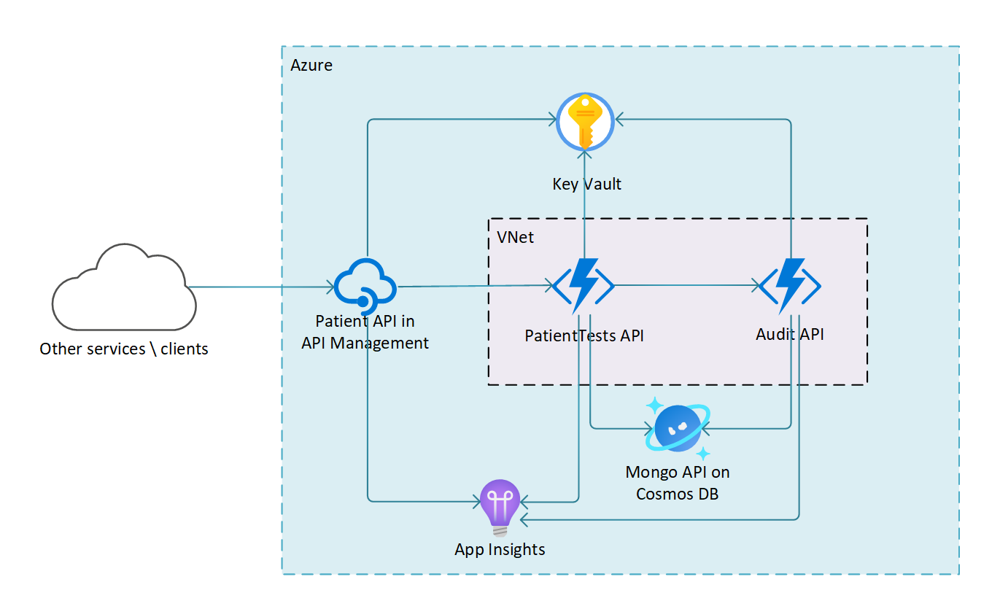

# Integrated microservices security and deployment

This article describes an integrated security and deployment solution for patient records management. A health organization needs to digitally store large amounts of highly-sensitive patient medical test data. Internal and third-party systems must be able to interact with the data through an application programming interface (API) that allows secure reading and writing. All interactions with the data must be recorded in an audit register.

In the Azure solution, [Azure API Management (APIM)](https://azure.microsoft.com/services/api-management/) controls public access to the API through a single managed endpoint. The application backend consists of two interdependent [Azure Functions](https://azure.microsoft.com/services/functions/) microservice apps that create the patient records and audit records. Each microservice function app stores its data in an independent [Azure Cosmos DB](https://azure.microsoft.com/services/cosmos-db/) database. APIM and the two function apps reside in a restricted-access [virtual network](https://azure.microsoft.com/services/virtual-network/).

For increased security, all keys, secrets, and connection strings associated with the apps and databases are maintained in [Azure Key Vault](https://azure.microsoft.com/services/key-vault/).

This article and the associated code project distill the example scenario down to the main technical components, to serve as a scaffold for specific implementations. The solution automates all code and infrastructure deployments, and includes automated integration, unit, and load testing.

## Potential use cases

- Highly-sensitive data that requires access from designated external endpoints
- Interdependent microservice apps that need to be integrated with common access and security

## Architecture

1. Outside services and clients make a POST request to the **Patient API** in APIM, with a data body that includes patient information.
1. **Patient API** uses its backend **PatientTests API** function app as its backend to call the `CreatePatient` function with the given patient information.
1. The `CreatePatient` function in **PatientTests API** calls the `CreateAuditRecord` function in the **Audit API** function app to create an audit record.
1. The `CreateAuditRecord` function creates the audit record in Cosmos DB, and returns a success response to the `CreatePatient` function.
1. The `CreatePatient` function creates the patient document in Cosmos DB, and returns a success response to APIM.
1. The outside services and clients receive the success response from APIM.
1. Application Insights distributed telemetry centralizes logging across the whole request pipeline.

## Components

The patient records management scenario uses the following components:

### API Management

In the Azure solution, [Azure API Management (APIM)](https://azure.microsoft.com/services/api-management/) controls internal and third-party interactions with the data via a **Patient** API that allows reading and/or writing the data. The API is publicly accessible only through a single managed endpoint. APIM allows for easy integration with different authentication mechanisms.

[Azure API Management](https://docs.microsoft.com/azure/api-management/api-management-key-concepts)

### Azure Functions

At the core of the solution is a set of API microservices built on Azure Functions with [Typescript](https://www.typescriptlang.org/). The **PatientTests API** microservice provides the *create, read, update, and delete (CRUD)* operations for patients and test results. The **Audit API** function app provides operations to create auditing entries.

The function apps are protected by service keys in the Azure Functions runtime. These keys are stored in Azure Key Vault and are only available to specified identities.

### Azure Virtual Network

To avoid exposing APIs and functions publicly, services integrate with other designated services within a *virtual network*. Both API Management and Azure Functions support access restriction and deployment in virtual networks. The current scenario uses network access restriction and virtual network deployment for the two serverless function apps, but not for APIM. The organization wants to expose the APIM endpoint publicly to allow clients to test it from anywhere.

The **Audit API** is locked down and configured to be accessible at a network level only from other services in the known subnet in the same virtual network. The **PatientTests API** is locked down to  be accessible only from known IP addresses assigned to API Management. The APIs reject traffic from other sources.

### Cosmos DB

Both microservices store data in Cosmos DB, using the [MongoDB Node.js driver](https://mongodb.github.io/node-mongodb-native/).

You can replace the Cosmos DB endpoint with another MongoDB service without changing the code. The services don't share data, and you can deploy each service to its own independent database.

### Key Vault

Although it's technically possible to keep host keys and connection strings in application settings, it's not good practice, because the keys and strings are then exposed to anyone who can access the app. The best practice, especially for production environments, is to keep sensitive information like host keys, secrets, and connection strings in Key Vault.

In this solution, in addition to network-level security, the function apps require service keys for access. The keys are maintained in Azure Key Vault along with other sensitive data like the Azure Cosmos DB connection strings, and are only available to specified identities.

The following components use an Azure [system-assigned managed service identity](https://docs.microsoft.com/azure/active-directory/managed-identities-azure-resources/), which is granted the following GET permissions:
- The **Patient API** app in APIM can get the host key of the **PatientTests API** function app. An advanced APIM inbound policy caches the key for better performance. For subsequent attempts, APIM looks for the key in its cache first.
- The **PatientTests API** function app can get the **Audit API** function app host key and the Cosmos DB connection string.
- The **Audit API** function app can get the **PatientTests API** function app host key and the Cosmos DB connection string.

Keys are also automatically rotated to make the system more secure.

More information on the security aspects can be found here. More information about key rotation can be found here.

### Application Insights

Failures in microservices based architecture are often distributed over a variety of components, and can't be diagnosed by looking at the services in isolation. The ability to correlate telemetry across components is vital to diagnosing these issues.

This solution uses Application Insights telemetry to centralize logging across the whole request pipeline, including APIM and the APIs running on Azure Functions. APIM and the Azure Functions runtime have built-in support for Application Insights to generate and correlate a wide variety of telemetry, including standard application output. The telemetry shares a common operation ID, allowing it to be correlated across components.

More information about this distributed telemetry tracing can be found [here](https://github.com/Azure-Samples/project-newcastle/blob/master/docs/distributed_telemetry.md). The Function apps use the Application Insights Node.js SDK to manually track dependencies and other custom telemetry.

The telemetry sent to Application Insights can feed into a wider Azure Monitor workspace. Components such as Cosmos DB can send telemetry to Azure Monitor, where it can be correlated with telemetry from Application Insights.

## Deploy the solution

The source code for this solution is at [integrated-serverless-microservices](https://github.com/mspnp/vnet-integrated-serverless-microservices).

The source code for the [PatientTests API](https://github.com/mspnp/vnet-integrated-serverless-microservices/blob/main/src/PatientTestsApi/readme.md) and the [Audit API](https://github.com/mspnp/vnet-integrated-serverless-microservices/blob/main/src/AuditApi/readme.md) are in the `/src` folder. Each API's source includes a [dev container](https://code.visualstudio.com/docs/remote/containers) that has all the prerequisites installed, to help you get going quicker.

Both the **PatientTests API** and the **Audit API** have a full suite of automated integration and unit tests to help prevent regressions when you make changes. The project is also configured for *linting* with ESLint, to maintain code styles and help guard against unintentional errors. The services' respective README files contain information on how to run the tests and linting.

### Terraform deployment

The code project's [/env](https://github.com/mspnp/vnet-integrated-serverless-microservices/tree/main/env) folder includes scripts and templates for [Terraform](https://www.terraform.io/) deployment. Terraform deploys APIM and the function apps, configures them to use the deployed Application Insights instance, and provisions all resources and configurations, including networking lockdown and the access key security pattern.

The deployment [readme](https://github.com/mspnp/vnet-integrated-serverless-microservices/tree/main/env) explains how to deploy the environment in your own Azure subscription. The  `/env` folder also includes a [dev container](https://github.com/mspnp/vnet-integrated-serverless-microservices/tree/main/env/.devcontainer) for Terraform deployment.

You can also automate deployment with a system like Azure DevOps or GitHub Actions.

### Locust load testing

To gauge API performance, you can run load testing against the APIs. The project contains a [Locust load test](https://github.com/mspnp/vnet-integrated-serverless-microservices/tree/main/src/LoadTest). [Locust](https://locust.io/) is an open-source load testing tool, and the tests are written in Python. You can run the load tests locally, or remotely in an Azure Kubernetes Service (AKS) cluster. The tests perform a variety of operations against the APIM endpoint, and verify behaviors against success and failure criteria.

