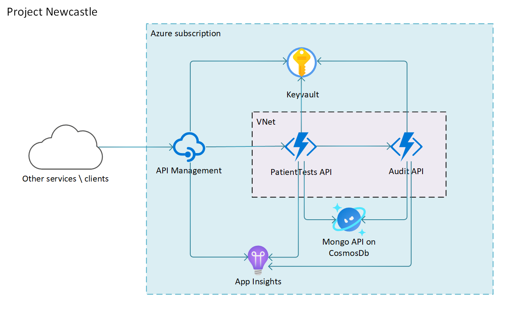

# Reference Architecture for VNet Integrated Serverless Microservices

This reference architecture is an end-to-end sample derived from a customer engagement. We've distilled it down to the main technical lessons learned to serve as a scaffold for future work. The majority of business logic and detail related to data models have been removed to simplify the solution; this extends to security and infrastructure elements.

The sample shows:

- inter-dependent services using Azure Functions
- deployment using Terraform
- distributed telemetry using App Insights
- secret management using Key Vault
- networking lockdown using Azure Functions networking features
- load testing using Locust
- database access using Mongo API on Cosmos DB

## Scenario

The organisation needs to digitally store the results of patient medical tests. Other internal and third-party systems will need to interface with this data via an API that allows reading and writing of the data. These interactions need to be recorded in an audit register. Access to the API needs to be managed by a system that allows for easy integration with different authentication mechanisms. APIs should not be publically accessible outside of a single managed endpoint. Services should be able to integrate with other services within a designated vnet. All code and infrastructure deployment should be automated.

## Solution Architecture

The following diagram represents the architecture of the solution.

At the core of the solution is a set of micro-services. The first service (PatientTests API) provides the CRUD operations for patients and their associated tests. The second service (Audit API) provides operations to create auditing entries. Both of these services store data in Cosmos DB, using the Mongo API and the Mongo driver for NodeJs. The Cosmos DB endpoint can be replaced with another Mongo DB service, without changing code. The services don't share data, and each service may be deployed to it's own independent database.

## API Source

The APIs are built using Typescript on Azure Functions. Both the PatientTests API and the Audit API have a full suite of automated integration and unit tests. This helps to prevent regressions when any changes are made. It is also configured for linting using ESLint to maintain code styles and help guard against unintentional errors. The services' respective readme's contain information on how to run the tests and linting.

The source code for this sample may be found [here](https://github.com/Azure-Samples/project-newcastle/). The [PatientTests API](https://github.com/Azure-Samples/project-newcastle/blob/master/src/PatientTestsApi/readme.md) and the [Audit API](https://github.com/Azure-Samples/project-newcastle/blob/master/src/AuditApi/readme.md) may be found in the `/src` folder. The API's source includes a [dev container](https://code.visualstudio.com/docs/remote/containers), which will have all the prerequisites installed, to help you get going quicker.

## Deployment

This reference architecture includes scripts for deployment using Terraform. The terraform templates and code is available in the `/env` folder. The deployment [readme](https://github.com/Azure-Samples/project-newcastle/blob/master/env/readme.md) explains how to deploy the environment into your own Azure subscription. This can be automated using a system such as Azure DevOps or Github Actions. The `/env` folder also includes a [dev container](https://code.visualstudio.com/docs/remote/containers).

## Security

### Network

The Audit API is configured to only be accessible at a network level from other systems in a known subnet. The PatientTests API is similarly configured to only be accessible from known IPs assigned to API Management. The APIs will reject traffic from other sources. Only the API Management instance is publicly accessible.

### Application

The function apps are also protected using service keys in the Azure Functions runtime. These keys are stored in Azure Key Vault, along with other sensitive data such as connection strings, and is only available to specified identities. More information on the security aspects can be found [here](https://github.com/Azure-Samples/project-newcastle/blob/master/docs/security_pattern.md).

Keys can also be rotated to make the system more secure. More information about key rotation can be found [here](https://github.com/Azure-Samples/project-newcastle/blob/master/docs/key_rotation.md).

## Distributed Telemetry

Telemetry is captured across the whole request pipeline from API Management and the Functions. Telemetry shares a common operation id, allowing it to be correlated across these components. More information about this distributed telemetry tracing can be found [here](https://github.com/Azure-Samples/project-newcastle/blob/master/docs/distributed_telemetry.md).

## Load Test

The project contains a [Locust load test](https://github.com/Azure-Samples/project-newcastle/blob/master/src/LoadTest/README.md) in the `/src/LoadTest` folder. [Locust](https://locust.io/) is an open source load testing tool and the tests are written in Python. The load tests can be run locally and remotely in AKS cluster. The tests will perform a variety of operations against the API Management endpoint, verifying behaviours against sucess and failure expectations.
