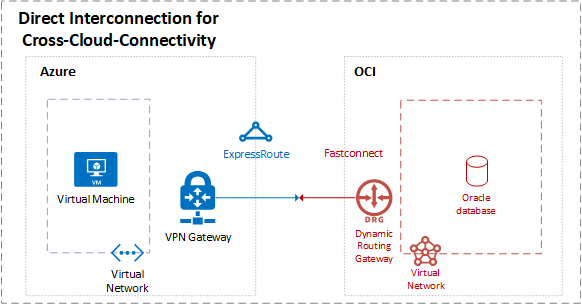

To support a [multicloud experience](/azure/virtual-machines/workloads/oracle/oracle-oci-overview), you can create a direct interconnection between Azure and Oracle Cloud Infrastructure (OCI) by using [Azure ExpressRoute](https://azure.microsoft.com/services/expressroute/) and [FastConnect](https://www.oracle.com/cloud/networking/fastconnect.html). The connection between the services allows applications hosted on Azure to communicate with Oracle database hosted on OCI. You can expect low latency and high throughput by connecting an ExpressRoute circuit in Azure with a FastConnect circuit in OCI.

## Architecture

### Workflow

1. Establish a connection between Azure ExpressRoute and OCI FastConnect.

1. Your Azure application can communicate with your OCI-hosted Oracle database.

### Components

* [Azure Virtual Machines](https://azure.microsoft.com/services/virtual-machines) lets you migrate your business and important workloads to Azure to increase operational efficiencies.

* [Azure Virtual Network](https://azure.microsoft.com/services/virtual-network) is your private network in your Azure environment.

* [Azure VPN Gateway](https://azure.microsoft.com/services/vpn-gateway) connects your infrastructure to the cloud.

* [Azure ExpressRoute](https://azure.microsoft.com/services/expressroute) creates a faster private connection to Azure.

## Contributors

*This article is maintained by Microsoft. It was originally written by the following contributors.* 

Principal author:

 - [Amber Zhao](https://www.linkedin.com/in/amberzhao/) | Principal Customer Engineer
 
*To see non-public LinkedIn profiles, sign in to LinkedIn.*

## Next steps

See [Set up a direct interconnection between Azure and Oracle Cloud Infrastructure](/azure/virtual-machines/workloads/oracle/configure-azure-oci-networking) for step-by-step configuration instructions. Refer to the **Important** alert at the beginning of the article. It shows a list of Oracle applications that Oracle has certified to run in Azure when using the Azure/Oracle Cloud interconnect solution.

> [!NOTE]
> If this migration path doesn't seem like the right one for your business needs, refer back to the [Migration decision tree](oracle-migration-overview.yml#migration-decision-tree).
