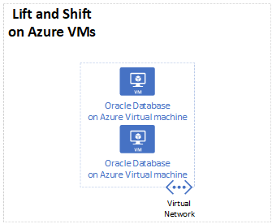

Azure provides Oracle database images with a "bring your own license" model. If you're properly licensed to use Oracle software, you're allowed to migrate Oracle databases to Azure Virtual Machines (VMs).

See [Oracle and Microsoft Strategic Partnership FAQ](https://www.oracle.com/cloud/azure-interconnect-faq.html) to figure out if Oracle certifies and supports your Oracle database on Azure.

## Architecture

### Workflow

1. Create Azure VMs with the correct specifications to support your Oracle database.

1. Migrate your Oracle database to the Azure VMs.

### Components

* [Azure Virtual Machines](https://azure.microsoft.com/services/virtual-machines/) lets you migrate your business and important workloads to Azure to increase operational efficiencies.

## Considerations

### Oracle licensing

If you are using hyper-threading enabled technology in your Azure VMs, count two vCPUs as equivalent to one Oracle Processor license. See [Licensing Oracle Software in the Cloud Computing Environment](http://www.oracle.com/us/corporate/pricing/cloud-licensing-070579.pdf) for details.

### Backup strategy

One backup strategy is to use Oracle [Recovery Manager (RMAN)](https://www.oracle.com/database/technologies/high-availability/rman.html). You can also use the [Azure backup method](/azure/virtual-machines/workloads/oracle/oracle-backup-recovery).

### Business continuity and disaster recovery

For business continuity and disaster recovery, consider  deploying the following software:

* Oracle Data Guard [Fast-Start Failover (FSFO)](https://www.oracle.com/technical-resources/articles/smiley-fsfo.html) for database availability

* Oracle Data Guard [Far Sync](https://docs.oracle.com/database/121/SBYDB/create_fs.htm) for zero data loss protection.

* Oracle [GoldenGate](https://www.oracle.com/middleware/technologies/goldengate.html) for multi-primary or active-active mode on Azure availability set or availability zone depends on SLA requirements.

Refer to these articles for supporting info:

* [Implement Oracle Data Guard on an Azure Linux virtual machine](/azure/virtual-machines/workloads/oracle/configure-oracle-dataguard)

* [Implement Oracle Golden Gate on an Azure Linux VM](/azure/virtual-machines/workloads/oracle/configure-oracle-golden-gate)

* [Reference architectures for Oracle Database Enterprise Edition on Azure](/azure/virtual-machines/workloads/oracle/oracle-reference-architecture)

You can't use Oracle Real Application Cluster (RAC) by itself in Azure. If you use FlashGrid Cluster, then you can host RAC on Azure. Follow these links for more information:

* [FlashGrid Cluster for Oracle RAC on Azure](https://www.flashgrid.io/products/flashgrid-for-oracle-rac-on-azure/)
* [FlashGrid Cluster for Oracle RAC on Azure Marketplace](https://azuremarketplace.microsoft.com/marketplace/apps/flashgrid-inc.flashgrid-skycluster)

## Contributors

*This article is maintained by Microsoft. It was originally written by the following contributors.* 

Principal author:

 - [Amber Zhao](https://www.linkedin.com/in/amberzhao/) | Principal Customer Engineer

*To see non-public LinkedIn profiles, sign in to LinkedIn.*

## Next steps

To begin migrating your Oracle database to Azure VMs, see [Oracle VM images and their deployment on Microsoft Azure](/azure/virtual-machines/workloads/oracle/oracle-vm-solutions).

> [!NOTE]
> If this migration path doesn't seem like the right one for your business needs, refer back to the [Migration decision tree](oracle-migration-overview.yml#migration-decision-tree).
