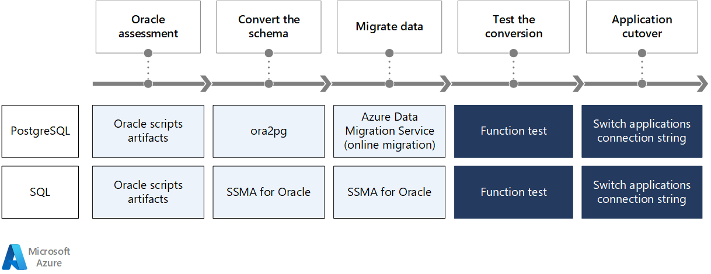
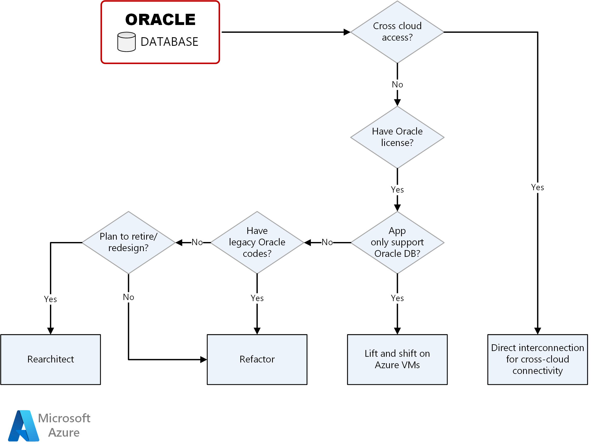

This series of articles provides a way for you to assess your current Oracle database environment, figure out your best migration path to Azure, and links to documents that help you make your migratory move. Your migration path can be to an Azure Virtual Machine (VM). It might also be to an Azure Managed Database that is running on an Azure VM.

To migrate an Oracle database to an Azure environment, you have to:

* Choose Azure resources as target database.

* Decide data migration method to evaluate downtime window.

* Figure out how to achieve business continuity and disaster recovery requirements.

## Architecture

This flow chart shows you the steps to move an Oracle database to either a PostgreSQL or a SQL database in Azure. The steps and the details are similar for both migration paths. Pay attention to the schema conversion and the data migration sections.

*Download a [Visio file](https://arch-center.azureedge.net/oracle-migration-overview.vsdx) of this architecture.*

### Workflow

1. Use Oracle script artifacts to evaluate Oracle database.

1. Schema conversion is different for both database types:

    * PostgreSQL: Use ora2pg to convert your Oracle schema.

    * SQL: Use SQL Server Migration Assistant (SSMA) to convert your Oracle schema.

1. Data migration is different for both database types:

    * PostgreSQL: Use Azure Data Migration Service to migrate your Oracle data.

    * SQL: Use SSMA to migrate your Oracle data.

1. Test the conversion using functional tests.

1. Switch the application's connection strings to complete the application cutover.

## Oracle database discoveries

You can create and run scripts on your Oracle databases to evaluate how many tables, stored procedures, views, and packages exist in the environment. This table shows an example of the assessment principles:

| Category | Simple | Medium | Large | Complex | Custom |
| ---------| ------ | ------ | ----- | ------- | ------ |
| Number of tables in schema | <500 | 501-1000 | 1001-2000 | 2001-3000 | >3000 |
| Total number of SP, Trigger, Functions, Views | <100 | 101-200 | 201-400 | 401-800 | >800 |
| Collection Types per schema | <10 | 11-20 | 21-40 | 41-80 | >80 |
| Packages per schema | <10 | 11-25 | 26-50 | 51-100 | >100 |
| Schema Data Size | <10 GB | 11-75 GB | 76-500 GB | 501-2000 | >2000 |

Use the [Microsoft Assessment and Planning (MAP) Toolkit](https://go.microsoft.com/fwlink/?LinkID=316883) to evaluate the existing Oracle database and schemas. For more information, refer to the [Oracle to SQL Server: Migration guide](/sql/sql-server/migrate/guides/oracle-to-sql-server).

## Migration decision tree

The migration decision tree helps you find the appropriate path of your Oracle database migration.

## Contributors

*This article is maintained by Microsoft. It was originally written by the following contributors.* 

Principal author:

 - [Amber Zhao](https://www.linkedin.com/in/amberzhao/) | Principal Customer Engineer

*To see non-public LinkedIn profiles, sign in to LinkedIn.*

## Related resources

What you do next depends on where you wind up on the decision tree:

* **Cross-cloud connectivity**: If you already use Oracle Cloud Infrastructure (OCI), the easy migration path for you is direct interconnection between Azure and OCI. Go to [Oracle database migration: Cross-cloud Connectivity](oracle-migration-cross-cloud.yml).

* **Lift and shift on Azure VMs**: You can deploy your Oracle databases in Azure based on a "bring your own license" model. Go to [Oracle database migration: Lift and Shift](oracle-migration-lift-shift.yml).

* **Refactor**: You have legacy Oracle code and you prefer using an Azure Managed Service. Go to [Oracle database migration: Refactor](oracle-migration-refactor.yml).

* **Rearchitect**: If you're planning to retire your old code and redesign your architecture, Azure SQL Database Managed Instance is a good option. Go to [Oracle database migration: Rearchitect](oracle-migration-rearchitect.yml).
