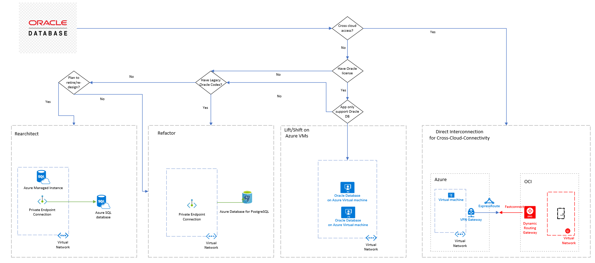

# Oracle database migration overview

This article provides a reference for decision tree of Oracle database migration, migration path to virtual machine, or Azure managed database(such as: PostgreSQL, SQL Database/Managed Instance), migration guidance and docs relative.

## Migration Decision Tree

Since restriction of applications (i.e. application only support Oracle database) or technologies preference, there are some options for Oracle database migrate to Azure, refer below migration decision tree:

<!--  -->

Select one of these links to go to the migration section that interests you:

| [Rearchitect](#scenario-3-rearchitect) | [Refactor](#scenaio-2-refactor) | [Lift/shift on Azure VMs](#scenario-1-liftshift-to-azure-vms) | [Cross-Cloud-Connectivity](#scenario-4-cross-cloud-connectivity) |
| ----------- | -------- | ----------------------- | ------------------------ |

## Migration Process

Below migration guidance provide Oracle database migrate to Azure Managed Instance and Azure database for PostgreSQL including existing Oracla Database environment assessment, Oracle schemas and objects conversion to SQL or PostgreSQL, and data migration.

For Oracle database migrate to Azure virtual Machines(VMs), it's mainly about choose Azure VMs size, Disk type, data migration and how to archive business continuity and disaster recovery requirements.

## Oracle database discoveries

### Discovery Oracle environment

Microsoft Data Migration Jumpstart Team maintain Oracle Scripts to run on Oracle Database to evaluate how many tables, stored procedures, views, packages etc. in existing Oracle environment, it will give a assessment if the existing Oracle Database is very complex.

The assessment principles as below table:

| | Simple | Medium | Large | Complex | Custom |
|-| ------ | ------ | ----- | ------- | ------ |
| Number of Tables in schema | <500 | 501-1000 | 1001-2000 | 2001-3000 | >3000 |
| Total number of SP, Trigger, Functions, Views | <100 | 101-200 | 201-400 | 401-800 | >800 |
| Collection Types per schema | <10 | 11-20 | 21-40 | 41-80 | >80 |
| Packages per schema | <10 | 11-25 | 26-50 | 51-100 | >100 |
| Schema Data Size | <10GB | 11-75 GB | 76-500GB | 501-2000 | >2000 |

Download the [Assessment Calculator Template](https://github.com/microsoft/DataMigrationTeam/blob/master/Oracle%20Inventory%20Script%20Artifacts/Oracle%20Inventory%20Script%20Artifacts/Customer%20Assessment%20CalculatorTemplate2.xlsx) and run [Oracle PL\SQL](https://github.com/microsoft/DataMigrationTeam/blob/master/Oracle%20Inventory%20Script%20Artifacts/Oracle%20Inventory%20Script%20Artifacts/Oracle_PreSSMA_Pre_v12.sql) [Oracle PL\SQL 2](https://github.com/microsoft/DataMigrationTeam/blob/master/Oracle%20Inventory%20Script%20Artifacts/Oracle%20Inventory%20Script%20Artifacts/Oracle_PreSSMA_v12_Plus.sql) in existing Oracle database.

For how to run the both tools, see [Assessment guide](https://github.com/microsoft/DataMigrationTeam/blob/master/Oracle%20Inventory%20Script%20Artifacts/Oracle%20Inventory%20Script%20Artifacts/OraclePre-SSMA%20Query%20Guidance.pptx)

## Migration paths

Oracle database would migrate to Azure Virtual Machines, Azure Database for PostgreSQL, Azure Managed Instance/Azure SQL Database, or direct interconnection between Azure and Oracle Cloud Infrastructure (OCI).