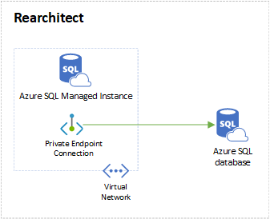

Are you comfortable working with Microsoft SQL Server? If so, you can use Azure SQL Managed Instance to rearchitect your database. It's a good option because it:

* Provides built-in [business continuity and disaster recovery capabilities](/azure/sql-database/sql-database-business-continuity).

* Offers [high level security and stability](/azure/sql-database/sql-database-security-overview).

* Interfaces with [SQL Server Migration Assistant for Oracle (SSMA)](https://aka.ms/ssmafororacle). This tool allows for easy conversion of Oracle objects and migration of data to SQL Managed Instance.

## Architecture

### Workflow

1. Use SSMA to convert your Oracle schema to SQL schema.

1. Migrate the new schema to Azure SQL Managed Instance.

1. Connect the SQL Managed instance to your Azure SQL database.

### Components

* [Azure SQL Managed Instance](https://azure.microsoft.com/services/azure-sql/sql-managed-instance/) is the intelligent, scalable, cloud database service that combines the broadest SQL Server engine compatibility with all the benefits of a fully managed and evergreen platform as a service (PAAS).

* [Azure SQL](https://azure.microsoft.com/services/azure-sql/) gives you a unified experience across your entire SQL portfolio and a full range of deployment options.

* [Azure Virtual Network](https://azure.microsoft.com/services/virtual-network/) is your private network in your Azure environment.

## Deploy this scenario

### Evaluate your Oracle database

Use the [Microsoft Assessment and Planning (MAP) Toolkit](https://go.microsoft.com/fwlink/?LinkID=316883) to evaluate the existing Oracle database and schemas. For more information, refer to the [Oracle to SQL Server: Migration guide](/sql/sql-server/migrate/guides/oracle-to-sql-server).

### Oracle objects conversion results

Download SSMA and use it for Oracle schema and data migration:
[Microsoft SQL Server Migration Assistant for Oracle](https://aka.ms/ssmafororacle).

This table shows the conversion results of Oracle objects to SQL Server objects carried out by SSMA.

| Oracle objects | Resulting SQL Server objects |
| -------------- | ---------------------------- |
| Functions | If the function can be directly converted to Transact-SQL, SSMA creates a function. In some cases, the function must be converted to a stored procedure. In this case, SSMA creates a stored procedure and a function that calls the stored procedure. |
| Procedures | If the procedure can be directly converted to Transact-SQL, SSMA creates a stored procedure.   In some cases, a stored procedure must be called in an autonomous transaction. In this case, SSMA creates two stored procedures: one that implements the procedure, and another that is used for calling the implementing stored procedure. |
| Packages | SSMA creates a set of stored procedures and functions that are unified by similar object names. |
| Sequences | SSMA creates sequence objects (SQL Server 2012 or SQL Server 2014) or emulates Oracle sequences. |
| Tables with dependent objects such as indexes and triggers | SSMA creates tables with dependent objects. |
| View with dependent objects, such as triggers | SSMA creates views with dependent objects. |
| Materialized Views | **SSMA creates indexed views on SQL server with some exceptions. Conversion will fail if the materialized view includes one or more of the following constructs**:  User-defined function  Non-deterministic field / function / expression in SELECT, WHERE, or GROUP BY clauses  Usage of Float column in SELECT*, WHERE, or GROUP BY clauses (special case of previous issue)  Custom data type (incl. nested tables)  COUNT(distinct &lt;field&gt;)  FETCH OUTER joins (LEFT, RIGHT, or FULL) Subquery, other view OVER, RANK, LEAD, LOG MIN, MAX UNION, MINUS, INTERSECT HAVING |
| Trigger | **SSMA creates triggers based on the following rules**:  BEFORE triggers are converted to INSTEAD OF triggers.  AFTER triggers are converted to AFTER triggers.  INSTEAD OF triggers are converted to INSTEAD OF triggers. Multiple INSTEAD OF triggers defined on the same operation are combined into one trigger.  Row-level triggers are emulated using cursors.  Cascading triggers are converted into multiple individual triggers. |
| Synonyms | **Synonyms are created for the following object types**:  Tables and object tables Views and object views Stored procedures Functions  **Synonyms for the following objects are resolved and replaced by direct object references**:  Sequences  Packages  Java class schema objects  User-defined object types Synonyms for another synonym can't be migrated and will be marked as errors.  Synonyms aren't created for Materialized views. |
| User-Defined Types | **SSMA does not provide support for conversion of user-defined types. User-Defined Types, including its usage in PL/SQL programs are marked with special conversion errors guided by the following rules**:  Table column of a user-defined type is converted to VARCHAR(8000).  Argument of user-defined type to a stored procedure or function is converted to VARCHAR(8000). Variable of user-defined type in PL/SQL block is converted to VARCHAR(8000).  Object Table is converted to a Standard table.  Object view is converted to a Standard view.|

For more info, see [Converting Oracle Schemas (OracleToSQL)](/sql/ssma/oracle/converting-oracle-schemas-oracletosql).

### Convert Oracle objects conversion and migrate data

Once you've installed SSMA, create a report to convert Oracle schema and migrate the data to Azure SQL Managed Instance. For a step-by-step guide, see [Migrate an Oracle schema to SQL Server 2017 on Linux with the SQL Server Migration Assistant](/sql/ssma/oracle/sql-server-linux-convert-from-oracle).

### Post-migration tasks

After the whole migration, uninstall the client components to remove the **ssma_oracle** schema.

> [!NOTE]
> Don't uninstall the extension pack from SQL Server unless your migrated database no longer uses functions in the **ssma_oracle** schema of the **sysdb** database.
>
> For more information, see [Removing SSMA for Oracle Components](/sql/ssma/oracle/removing-ssma-for-oracle-components-oracletosql?view=sql-server-ver15).

## Contributors

*This article is maintained by Microsoft. It was originally written by the following contributors.* 

Principal author:

 - [Amber Zhao](https://www.linkedin.com/in/amberzhao/) | Principal Customer Engineer

*To see non-public LinkedIn profiles, sign in to LinkedIn.*

## Next steps

To begin migrating your Oracle database to SQL, see [SQL Server Migration Assistant for Oracle (OracleToSQL)](/sql/ssma/oracle/sql-server-migration-assistant-for-oracle-oracletosql).

> [!NOTE]
> If this migration path doesn't seem like the right one for your business needs, refer back to the [Migration decision tree](oracle-migration-overview.yml#migration-decision-tree).
