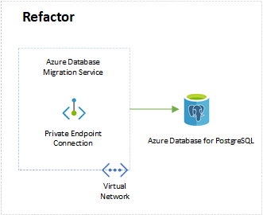

Do you have legacy Oracle code and prefer using a managed service on Azure? If so, you can use the Azure Database Migration Service to migrate your Oracle database to Azure Database for PostgreSQL. It's the option for you because it:

* Provides built-in [business continuity](/azure/postgresql/concepts-business-continuity) and [disaster recovery](/azure/postgresql/concepts-backup) capacity.

* Allows you to [replicate data](/azure/postgresql/concepts-read-replicas) from an Azure Database for PostgreSQL server to a read-only server.

* Lets you easily [migrate data to PostgreSQL online](/azure/postgresql/howto-migrate-online).

## Architecture



### Workflow

1. Use Azure Database Migration Service to automate your Oracle database migration to Azure.

1. Migrate the database to Azure Database for PostgreSQL.

### Components

* [Azure Database Migration Service](https://azure.microsoft.com/services/database-migration/) is a tool that helps you simplify, guide, and automate your database migration to Azure.

* [Azure Database for PostgreSQL](https://azure.microsoft.com/services/postgresql/) lets you focus on application innovation instead of database management and scale your workload quickly and easily.

* [Azure Virtual Network](https://azure.microsoft.com/services/virtual-network/) is your private network in your Azure environment.

## Deploy this scenario

### Prerequisites

* Create an [Azure subscription](/azure/cost-management-billing/manage/create-subscription).
* Create an instance of the [Azure Database Migration Service by using the Azure portal](/azure/dms/quickstart-create-data-migration-service-portal).

### Microsoft Assessment and Planning (MAP) Toolkit

Use the [Microsoft Assessment and Planning (MAP) Toolkit](https://go.microsoft.com/fwlink/?LinkID=316883) to evaluate the existing Oracle database and schemas. For more information, refer to the [Oracle to SQL Server: Migration guide](/sql/sql-server/migrate/guides/oracle-to-sql-server).

### Assess the migration complexity

Download [Ora2Pg](http://ora2pg.darold.net/). Run the following command to get the migration complexity assessment:

```console
ora2pg -t SHOW_REPORT --estimate_cost
```

Here's an example of the output of a schema assessment:

```console
Migration levels:

    A - Migration that might be run automatically

    B - Migration with code rewrite and a human-days cost up to 5 days

    C - Migration with code rewrite and a human-days cost above 5 days

Technical levels:

    1 = trivial: no stored functions and no triggers

    2 = easy: no stored functions but with triggers, no manual rewriting

    3 = simple: stored unctions and/or triggers no manual rewriting

    4 = manual: no stored functions but with triggers or views with code rewriting

    5 = difficulty: stored functions and/or triggers with code rewriting
```

### Oracle Objects conversion and Data migration

Use ora2pg to convert Oracle tables, stored procedures, packages, and other database objects. After the conversion, they'll be PostgreSQL-compatible. Next, start a migration pipeline in Azure Database Migration Service.

### Convert Oracle objects

Install Ora2Pg on an Azure Virtual Machine (VM). Refer to the [Step-by-Step Guide to install ora2pg on Linux & Windows](https://github.com/microsoft/DataMigrationTeam/blob/master/Whitepapers/Steps%20to%20Install%20ora2pg%20on%20Windows%20and%20Linux.pdf).

Connect to Ora2pg to convert the schemas. Refer to the [Oracle to Azure Database for PostgreSQL Migration Cookbook](https://github.com/Microsoft/DataMigrationTeam/blob/master/Whitepapers/Oracle%20to%20Azure%20PostgreSQL%20Migration%20Cookbook.pdf).

### Migrate data online

You can migrate your data online to reduce downtime. Refer to [Create a DMS instance](/azure/dms/tutorial-oracle-azure-postgresql-online#create-a-dms-instance) for more info.

### Workaround list

Below you'll find a workaround list. It's useful when you're migrating Oracle database to PostgreSQL. Refer to the [Oracle migrate to PostgreSQL workaround list](https://github.com/Microsoft/DataMigrationTeam/blob/master/Whitepapers/Oracle%20to%20Azure%20Database%20for%20PostgreSQL%20Migration%20Workarounds.pdf) to get detailed scripts.

| Oracle | PostgreSGL |
| ------ | ---------- |
| Database Link | Foreign Data Wrapper |
| External Table | Foreign Table |
| Synonym | View / Set search_path |
| Global Temporary Table | Unlogged Table / Temp Table |
| Virtual column | View / Function / Trigger |
| Connected by | With Recursive |
| Reverse Index | Functional Index |
|Index Organized Table (IOT) | Cluster the table according to an Index |

## Contributors

*This article is maintained by Microsoft. It was originally written by the following contributors.* 

Principal author:

 - [Amber Zhao](https://www.linkedin.com/in/amberzhao/) | Principal Customer Engineer

*To see non-public LinkedIn profiles, sign in to LinkedIn.*

## Next steps

To begin migrating your Oracle database to Azure Database for PostgreSQL, see [Tutorial: Migrate Oracle to Azure Database for PostgreSQL online using DMS](/azure/dms/tutorial-oracle-azure-postgresql-online).

> [!NOTE]
> If this migration path doesn't seem like the right one for your business needs, refer back to the [Migration decision tree](oracle-migration-overview.yml#migration-decision-tree).
