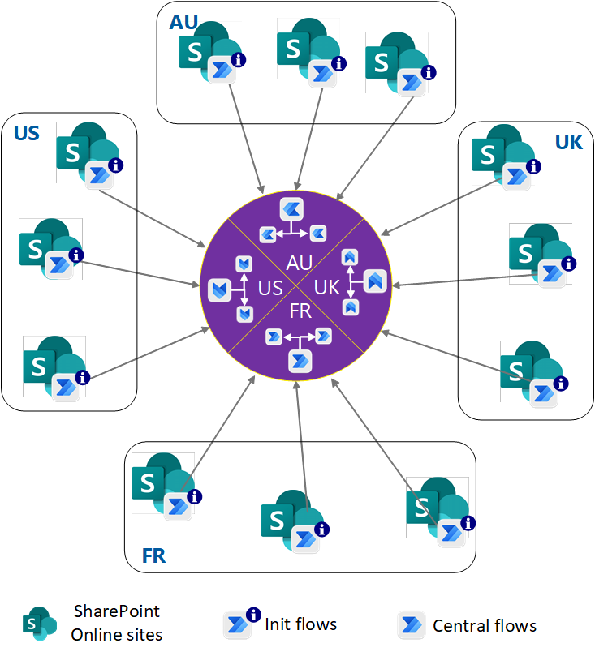

This architecture is for Power Automate workflows that replace SharePoint 2010 workflows, and for new SharePoint Online sites. With this solution, you can:

- Carefully plan your Power Automate deployment, governance, and operation strategy.
- Meet organizational needs like data residency requirements, data loss prevention (DLP), and flexible and minimal licensing requirements.
- Stay within the scalable thresholds of Power Platform.

## Architecture

*Download a [Visio file](https://arch-center.azureedge.net/Power%20Automate%20Hub%20and%20Spoke.vsdx) of this architecture.*

### Workflow

Azure hub-spoke network topology inspires this architecture. Power Platform [Solutions](/powerapps/maker/data-platform/solutions-overview) flows can invoke child flows from Solutions. Parent and child flows ease flow management by avoiding flows with hundreds of steps.

This solution provisions a Power Automate *init flow* workflow for each SharePoint site. In the init flow, either a user or an event *initiates* a workflow. The init flow calls a *central flow* workflow, which runs all the actions that meet a business need.

SharePoint Online and Power Platform support many geographic regions. Each region has a set of SharePoint Online sites. This *multi-geo* concept extends to the central flows.

1. The IT team provisions an init flow on each SharePoint Online site. Besides the trigger, the flow contains a single action that uses `Call Child Flow` to call a central flow workflow.

1. The team provisions the central flows in each geographical region, corresponding to the SharePoint Online regions.

1. A user initiates, or an event triggers, an init flow workflow. Depending on the trigger type, the init flow can execute in the user's context or in the [maker](/power-platform/admin/environments-overview#environment-permissions) context.

1. The init flow calls a central flow in the appropriate region. For a user context, the init flow can authoritatively pass along the user information to assert the user to the central flow.

1. The central flow can invoke more child flows if needed to keep the flow lightweight.

### Components

This scenario uses the following components:

- [Power Automate](https://flow.microsoft.com) uses flows to build automated processes.
- [SharePoint](https://www.microsoft.com/microsoft-365/sharepoint) Online sites help organizations share and manage content, knowledge, and applications.
- [Power Platform](https://powerplatform.microsoft.com) analyzes data, builds solutions, automates processes, and creates virtual agents.
  - [Power Platform environments](/power-platform/admin/environments-overview) store, manage, and share an organization's business data, apps, chatbots, and flows.
  - [Power Platform Solutions](/power-platform/alm/solution-concepts-alm) are the mechanism for implementing [application lifecycle management (ALM)](https://wikipedia.org/wiki/Application_lifecycle_management) in Power Apps and Power Automate.
- [Azure Active Directory (Azure AD)](https://azure.microsoft.com/services/active-directory) is a universal platform to manage and secure identities.

### Alternatives

- You can use this architecture with [Azure Logic Apps](/azure/logic-apps/logic-apps-overview) by replacing the central flows with logic apps. There are some triggers that Logic Apps doesn't have, like *SharePoint - For a Selected File*. In that case, the Power Automate init flow can use the trigger, and then call a logic app.

  Logic Apps supports the consumption model, where you pay for what you use. A hybrid model using both Power Automate and Logic Apps is also feasible. If you don't want to worry about thresholds, Logic Apps is the recommended solution.

- You can improve the hub-and-spoke model by using a single init flow per region instead of creating one flow per SharePoint Online site. This strategy is possible only if you trigger the flow manually. You can orchestrate the flow to be invoked from any SharePoint Online site in a tenant.

## Scenario details

Microsoft Power Automate is part of the no-code or low-code Microsoft Power Platform. Microsoft 365 customers use Power Automate for workflow automation and business process flows.

### Potential use cases

Customer-designed Power Automate workflows fall into two categories:

- SharePoint site owners usually create ad-hoc workflows. Site owners take full responsibility for workflow design, deployment, and maintenance.

- IT teams create workflows that they fully own, manage, and support over the workflow lifetime.

This architecture applies to workflows where IT teams fully control the workflow and component life cycles.

## Considerations

Here are some advantages of adopting this hub-and-spoke model for your Power Automate deployments:

- Centralized logic is easy to update in one place, and all the flows automatically get the latest updates.

- You can avoid assigning premium licenses to all the init flows for the SharePoint Online sites. Instead, you can assign premium licenses to the limited number of central flows.

- Segregating SharePoint Online sites and flows into their own regions meets data residency requirements.

- Depending on the init flow trigger, the flow can retain the user's context from initiation to central flow completion.

- To meet seasonal or periodic requirements, this model offers flexible central flow license upgrades and downgrades.

### DevOps

- Power Platform supports continuous integration and continuous delivery (CI/CD) for its components in Solutions. You can export and import Solutions as packages across Power Platform environments and across tenants.

- It's best to have a pre-production tenant to validate updates before you push updates and components to your production tenant. Since updating the central flows immediately impacts many init flows, it's important to have high-quality analysis and validation. When promoting to the production tenant, make sure to use environment variables for connections, so you can choose the endpoint corresponding to the target tenant.

- Power Platform supports component and workflow ALM with Azure Pipelines or GitHub Actions.

### Operations

Use the [Center of Excellence (CoE) toolkit for Power Platform](/power-platform/guidance/coe/starter-kit) to centrally manage flows and monitor them for failures. The CoE toolkit also shows the Power Platform components and dependencies between components. You can design each flow to catch and log failures or notify someone for better supportability.

### Security

- Entitlement management for flows you create under Solutions is different from flows outside Solutions. With flows outside Solutions, you can give permissions to a SharePoint site list or library to initiate the flow. Flows in Solutions tie permissions to a Dataverse Environment-based group called *Group Team*, which you can map to an Azure AD group. You can then manage users in the Azure AD group.

- All users except the environment administrator must be given read/execute-only permissions in Production environments, so end users can't create any components.

- You can apply DLP policies at the environment level, which allows more flexibility to meet business requirements.

### Cost optimization

You pay no extra costs for this scenario if you meet the following conditions:

- There's no dependency on Power Platform premium connectors.

- The flows can conform to the action executions thresholds of the Microsoft 365 seed license, such as E3 or E5.

Otherwise, you need to purchase premium licenses, per user or per flow plan, for the central flows only. Pricing may vary depending on how many central flows you need in each geographic region. You don't have to assign premium licenses to the init flows, which are higher in number.

## Contributors

*This article is maintained by Microsoft. It was originally written by the following contributors.* 

Principal author:

 - [Srinivas Varukala](https://www.linkedin.com/in/svarukala/) | Senior Technical Program Manager
 
*To see non-public LinkedIn profiles, sign in to LinkedIn.*

## Next steps

- [Use Child Flows in Power Automate](/power-automate/create-child-flows)
- [Define a Power Platform Environment Strategy](/microsoft-365/community/defining-a-power-platform-environment-strategy)
- [Microsoft Dataverse Group Teams](/power-platform/admin/manage-group-teams)
- [Use Environment Variables in Power Platform Solutions](/powerapps/maker/data-platform/environmentvariables)
- [ALM with Power Platform](/power-platform/alm)
- [Power Automate Pricing](https://flow.microsoft.com/pricing)
- [Power Automate Licensing FAQ](/power-platform/admin/powerapps-flow-licensing-faq)

## Related resources

- [CI/CD for Azure Power Platform](../../solution-ideas/articles/azure-devops-continuous-integration-for-power-platform.yml)
- [Citizen AI with the Power Platform](../ai/citizen-ai-power-platform.yml)
- [Hub-spoke network topology in Azure](../../reference-architectures/hybrid-networking/hub-spoke.yml)
