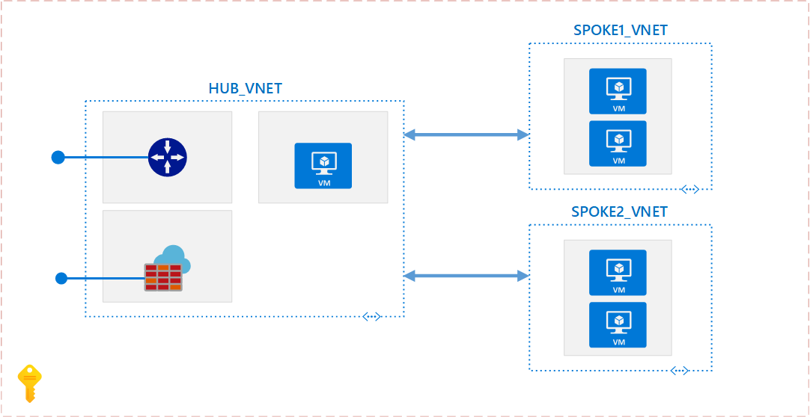
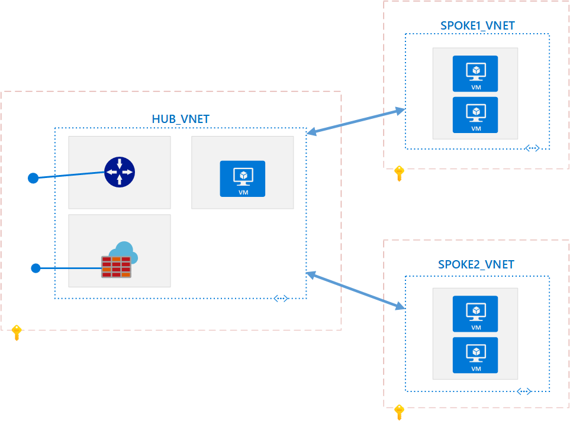

# Add IP Address spaces on Peered Virtual Networks in Azure

In this example scenario, we pursue a scenario where customers deploy a virtual networking architecture, such as a [Hub and Spoke](https://docs.microsoft.com/azure/architecture/reference-architectures/hybrid-networking/hub-spoke) model, and at some point in the future, this Hub virtual network needs additional IP Address spaces.  At this time, you can't add address ranges to, or delete address ranges from a virtual network's address space once a virtual network is peered with another virtual network. To add or remove address ranges, delete the peering, add or remove the address ranges, then re-create the peering manually.  To accommodate this scenario, we have developed a PowerShell script that can make this process easier.

## Relevant Use Cases

The following use cases have been tested with these scripts:

* Single subscription scenarios where both hub and all spoke virtual networks are in the same subscription.

* Single Azure Active Directory tenant, different subscription scenarios where the hub virtual network is in one subscription and all other spoke virtual networks are in different subscriptions.

## Architecture

* **Single Subscription**



* **Multiple Subscriptions**



## Components

* Virtual Networks
* Virtual Network Peerings

## Alternatives

Use one or a combination of the existing methods for removing Virtual Network peerings manually ([Azure Portal](https://docs.microsoft.com/azure/virtual-network/virtual-network-manage-peering#delete-a-peering), [Azure PowerShell](https://docs.microsoft.com/powershell/module/az.network/remove-azvirtualnetworkpeering), or [Azure CLI](https://docs.microsoft.com/cli/azure/network/vnet/peering)) before adding any new IP Address spaces.

## Considerations

* The script requires the Azure PowerShell module version 1.0.0 or later. Run `Get-Module -ListAvailable Az` to find the installed version. If you need to upgrade, see [Install Azure PowerShell module](https://docs.microsoft.com/powershell/azure/install-az-ps). Run `Connect-AzAccount` to create a connection with Azure.
* Performing this exercise will result in outage or disconnections between the Hub and Spoke virtual networks.  Perform this during an approved maintenance window.
* The accounts you use to work with virtual network peering must be assigned to the [Network Contributor](https://docs.microsoft.com/azure/role-based-access-control/built-in-roles?toc=%2fazure%2fvirtual-network%2ftoc.json#network-contributor) role or a [Custom Role](https://docs.microsoft.com/azure/role-based-access-control/custom-roles) containing the necessary actions found at https://docs.microsoft.com/azure/virtual-network/virtual-network-manage-peering#permissions.
* The accounts you use to add IP Address spaces must be assigned to the [Network Contributor](https://docs.microsoft.com/azure/role-based-access-control/built-in-roles?toc=%2fazure%2fvirtual-network%2ftoc.json#network-contributor) role or a [Custom Role](https://docs.microsoft.com/azure/role-based-access-control/custom-roles) containing the necessary actions found at https://docs.microsoft.com/azure/virtual-network/manage-virtual-network#permissions.
* The IP address space you wish to add to the Hub virtual network must not overlap with any of the IP address spaces of the Spoke virtual networks that you intend to peer with the Hub virtual network.

## Add the IP Address Range

This script automatically removes all Virtual Network peerings from the Hub Virtual Network, adds an IP address range prefix to the Hub Virtual Network based on Input parameters, adds the Virtual Network peerings back to the Hub Virtual Network, and reconnects the Hub virtual network peerings to the existing Spoke virtual network peerings. The script will work with single and multiple subscription hub and spoke topologies.

```powershell
param (
    # Address Prefix range (CIDR Notation, e.g., 10.0.0.0/24)
    [Parameter(Mandatory = $true)]
    [ValidatePattern('^(([0-9]|[1-9][0-9]|1[0-9]{2}|2[0-4][0-9]|25[0-5])\.){3}([0-9]|[1-9][0-9]|1[0-9]{2}|2[0-4][0-9]|25[0-5])(\/(3[0-2]|[1-2][0-9]|[0-9]))$')]
    [String[]]
    $IPAddressRange,

    # Address Prefix range (Subscription ID for Hub VNet)
    [Parameter(Mandatory = $true)]
    [String]
    $HubVNetSubsID,

    # Address Prefix range (Hub VNet Resource Group Name)
    [Parameter(Mandatory = $true)]
    [String]
    $HubVNetRGName,

    # Address Prefix range (Hub VNet Name)
    [Parameter(Mandatory = $true)]
    [String]
    $HubVNetName
)

#region Set context to Hub VNet Subscription
Set-AzContext -Subscription $HubVNetSubsID
#endregion

#region Get All Hub VNet Peerings and Hub VNet Object
$hubPeerings = Get-AzVirtualNetworkPeering -ResourceGroupName $HubVNetRGName -VirtualNetworkName $HubVNetName
$hubVNet = Get-AzVirtualNetwork -Name $HubVNetName -ResourceGroupName $HubVNetRGName
#endregion

#region Remove All Hub VNet Peerings
$hubPeerings | Remove-AzVirtualNetworkPeering -Force
#endregion

#region Add IP address range to the hub vnet
$hubVNet.AddressSpace.AddressPrefixes.AddRange($IPAddressRange)
Set-AzVirtualNetwork -VirtualNetwork $hubvnet
#endregion

foreach ($vNetPeering in $hubPeerings)
{
    # Get remote vnet name
    $vNetFullId = $vNetPeering.RemoteVirtualNetwork.Id
    $vNetName = $vNetFullId.Substring($vNetFullId.LastIndexOf('/') + 1)

    # Get subscription id
    $vNetSubscriptionId = $vNetFullId.Substring($vNetFullId.IndexOf('/', 1) + 1, 36)

    if ((Get-AzContext).Subscription.Id -ne $vNetSubscriptionId)
    {
        # Set the context so that we can modify the spokes
        Set-AzContext -Subscription $vNetSubscriptionId
    }

    # Pull remote vNet object
    $vNetObj = Get-AzVirtualNetwork -Name $vNetName

    # Get the peering from the remote vnet object
    $peeringName = $vNetObj.VirtualNetworkPeerings.Where({$_.RemoteVirtualNetwork.Id -like "*$($hubvnet.Name)"}).Name
    $peering = Get-AzVirtualNetworkPeering -ResourceGroupName $vNetObj.ResourceGroupName -VirtualNetworkName $vNetName -Name $peeringName

    # Reset to initiated state
    Set-AzVirtualNetworkPeering -VirtualNetworkPeering $peering

    if ((Get-AzContext).Subscription.Id -ne $HubVNetSubsID)
    {
        # Set context so that we can recreate the peering
        Set-AzContext -Subscription $HubVNetSubsID
    }
    # Recreate peering on hub
    Add-AzVirtualNetworkPeering -Name $vNetPeering.Name -VirtualNetwork $hubvnet -RemoteVirtualNetworkId $vNetFullId -AllowGatewayTransit

}

```

## Pricing

There is a nominal charge for ingress and egress traffic that utilizes a virtual network peering. There is no change to existing pricing when adding an additional IP address space to an Azure virtual network.  For more information, see the [pricing page](https://azure.microsoft.com/pricing/details/virtual-network).

## Next Steps

* Learn more about [managing Virtual Network peerings](https://docs.microsoft.com/azure/virtual-network/virtual-network-manage-peering)

* Learn more about [managing IP Address ranges](https://docs.microsoft.com/azure/virtual-network/manage-virtual-network#add-or-remove-an-address-range) on Virtual Networks