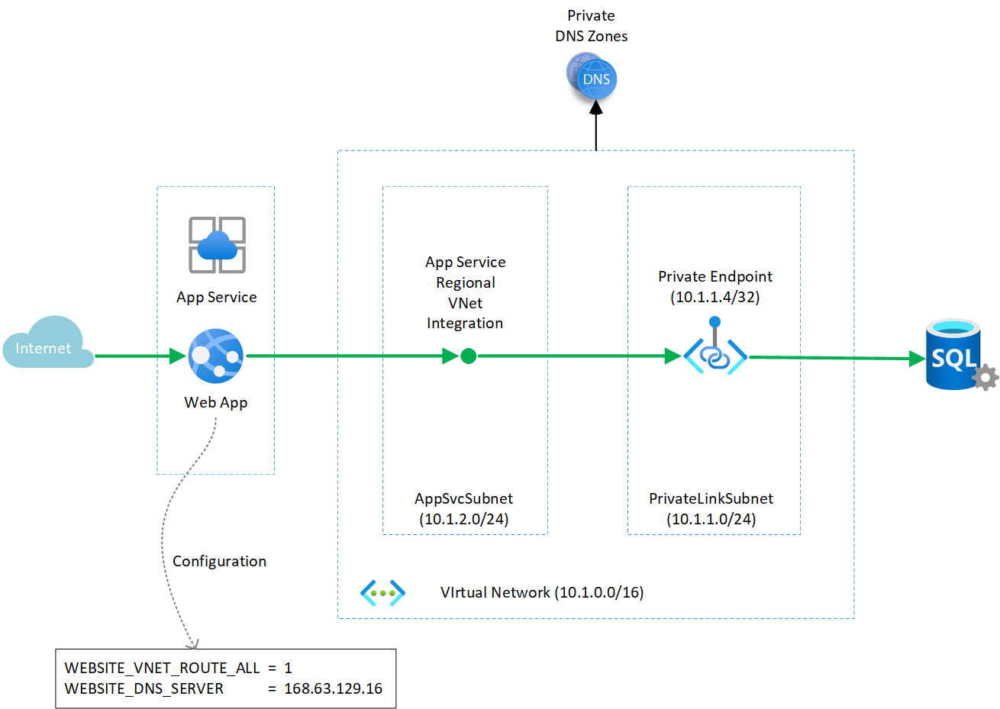
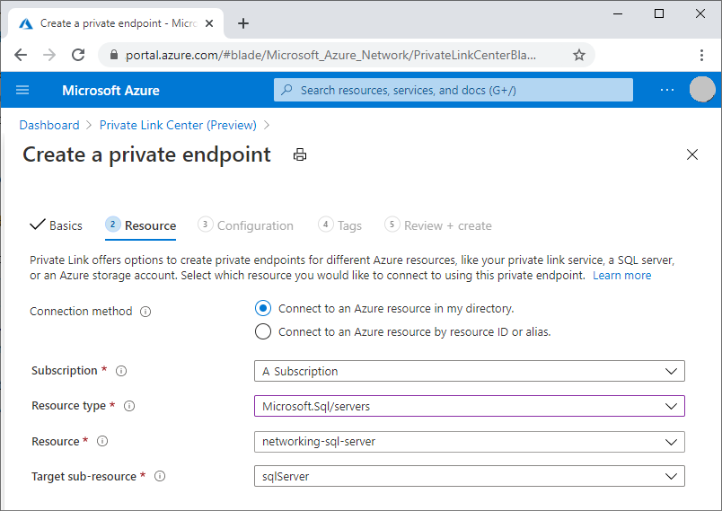
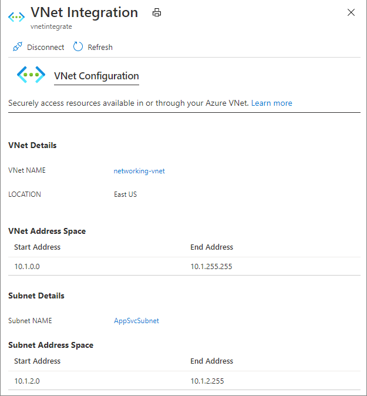

This example scenario describes how to set up private connectivity from an Azure Web App to Azure Platform-as-a-Service (PaaS) services, or between Azure PaaS services that aren't natively deployed in isolated Azure Virtual Networks. The example shows a typical combination of hosting a web application in [Azure App Service](/azure/app-service/) and connecting to [Azure SQL Database](/azure/azure-sql/database/).

The web app can securely connect to a backend database over a fully private connection. The public internet can't reach the database, which eliminates a common attack vector.

## Potential use cases

These similar design patterns are variations on the same underlying principle:

- Connect from a Web App to Azure Storage, Azure Cosmos DB, Azure Cognitive Search, Azure Event Grid, or any other service that supports an [Azure Private Endpoint](/azure/private-link/private-endpoint-overview#private-link-resource) for inbound connectivity.

- Connect from an [Azure Functions](/azure/azure-functions/functions-overview) App to any Azure service that supports an Azure Private Endpoint, as long as the Function App is deployed in a [pricing plan that supports Virtual Network integration](/azure/azure-functions/functions-networking-options#virtual-network-integration).

- Connect from a Web App or Functions App to another Web App, because App Service also supports [Private Endpoints](/azure/app-service/networking/private-endpoint) for inbound connectivity. For example, connect from a website to a REST API hosted in another Azure App Service instance.

## Architecture

1. Using Azure App Service [regional VNet Integration](/azure/app-service/web-sites-integrate-with-vnet#regional-vnet-integration), the web app connects to Azure through an **AppSvcSubnet** delegated subnet in an [Azure Virtual Network](/azure/virtual-network/).

   - In this example, the Virtual Network only routes traffic and is otherwise empty, but other subnets and workloads could also run in the Virtual Network.

   - The App Service and Private Link subnets could be in separate peered Virtual Networks, for example as part of a hub-and-spoke network configuration.

1. [Azure Private Link](/azure/azure-sql/database/private-endpoint-overview#how-to-set-up-private-link-for-azure-sql-database) sets up a [private endpoint](/azure/private-link/private-endpoint-overview) for the [Azure SQL Database](/azure/azure-sql/database/) in the **PrivateLinkSubnet** of the Virtual Network.

1. The web app connects to the SQL Database private endpoint through the **PrivateLinkSubnet** of the Virtual Network.

1. The database firewall allows only traffic coming from the **PrivateLinkSubnet** to connect, making the database inaccessible from the public internet.

### DNS configuration

The app code can still use the public hostname, for example `contoso.database.windows.net`, for the SQL Database connection string. However, regional VNet Integration routes traffic from the web app only to private addresses in the Virtual Network, and the SQL Database hostname DNS resolution still results in its public IP address. If the web app connects to the public IP address, the traffic won't pass through the Virtual Network, although the traffic remains within Azure.

Using the Private Link-specific hostname like `contoso.privatelink.database.windows.net` doesn't work, because SQL Database won't accept this hostname. The hostname still resolves to the public IP address, due to [how DNS works for private endpoints](/azure/private-link/private-endpoint-dns). To make DNS resolve the hostname to the SQL Database's private IP address, [enable the **Route All** setting on the web app's VNet integration](/azure/app-service/web-sites-integrate-with-vnet#application-routing).

Now `contoso.database.windows.net` no longer resolves to the public IP address, but to the private IP address in the **PrivateLinkSubnet**, as defined in the Azure Private DNS zone. Traffic flows privately over the Virtual Network.

## Components

This scenario uses the following Azure services:

- [Azure App Service](https://azure.microsoft.com/services/app-service) hosts web applications, allowing autoscale and high availability without having to manage infrastructure.

- [Azure SQL Database](https://azure.microsoft.com/products/azure-sql/database/) is a general-purpose relational database managed service that supports relational data, spatial data, JSON, and XML.

- [Azure Virtual Network](https://azure.microsoft.com/free/virtual-network) is the fundamental building block for private networks in Azure. Azure resources like virtual machines (VMs) can securely communicate with each other, the internet, and on-premises networks through Virtual Networks.

- [Azure Private Link](https://azure.microsoft.com/services/private-link/) provides a private endpoint in a Virtual Network for connectivity to Azure PaaS services like Azure Storage and SQL Database, or to customer or partner services.

## Alternatives

- An alternative approach for private connectivity is an [App Service Environment](/azure/app-service/environment/intro) for hosting the web application within an isolated environment, and [Azure SQL Managed Instance](/azure/azure-sql/managed-instance/sql-managed-instance-paas-overview) as the database engine. Both of these services are natively deployed within a Virtual Network, so there's no need for VNet Integration or private endpoints. These offerings are typically more costly, because they provide single-tenant isolated deployment and other features.

  If you have an App Service Environment but aren't using SQL Managed Instance, you can still use a Private Endpoint for private connectivity to a SQL Database. If you already have SQL Managed Instance but are using multi-tenant App Service, you can still use regional VNet Integration to connect to the SQL Managed Instance private address.

- As an alternative to the Private Endpoint, you can use a [Service Endpoint](/azure/virtual-network/virtual-network-service-endpoints-overview) to secure the database. With a Service Endpoint, the private endpoint, **PrivateLinkSubnet**, and configuring the **Route All** regional VNet integration setting are unnecessary. You still need regional VNet Integration to route incoming traffic through the Virtual Network.

  Compared to Service Endpoints, a Private Endpoint provides a private, dedicated IP address toward a specific instance, for example a logical SQL Server, rather than an entire service. Private Endpoints can help prevent data exfiltration towards other database servers. For more information, see [Comparison between Service Endpoints and Private Endpoints](/azure/virtual-network/vnet-integration-for-azure-services#compare-private-endpoints-and-service-endpoints).

## Considerations

The following considerations apply to this scenario.

### Security

This scenario secures the outbound connection from an App Service web app to a downstream dependency like a database. You can secure the inbound connection to the web app by fronting the app with a service like [Application Gateway](/azure/application-gateway/overview) or [Azure Front Door](/azure/frontdoor/front-door-overview), optionally with [Web Application Firewall](/azure/web-application-firewall/overview) capabilities.

To prevent users from bypassing the front-end service and accessing the web app directly, set [App Service access restrictions](/azure/app-service/app-service-ip-restrictions) like IP address rules or service endpoints. For an example scenario, see [Application Gateway integration with App Service (multi-tenant)](/azure/app-service/networking/app-gateway-with-service-endpoints#integration-with-app-service-multi-tenant).

#### SQL Database firewall options

The most important security consideration in this scenario is how to configure the SQL Database firewall.

Without using private connectivity, you can add [firewall rules](/azure/azure-sql/database/firewall-create-server-level-portal-quickstart) that allow inbound traffic from specified IP address ranges only. Another approach is to [allow Azure services](/azure/azure-sql/database/network-access-controls-overview#allow-azure-services) to access the server, which locks down the firewall to allow only traffic from within Azure. However, this traffic includes all Azure regions and other customers.

You can also add a more restrictive firewall rule to allow only your app's [outbound IP addresses](/azure/app-service/overview-inbound-outbound-ips#find-outbound-ips) to access the database. But because App Service is a multi-tenant service, these IP addresses are shared with and allow traffic from other customers on the same [deployment stamp](../../patterns/deployment-stamp.yml), which uses the same outbound IP addresses.

Using private connectivity through the Virtual Network provides the following firewall options to prevent others from accessing the database:

- Create a [virtual network rule](/azure/azure-sql/database/vnet-service-endpoint-rule-overview) that allows traffic only from the regional VNet Integration delegated subnet, **AppSvcSubnet** in this example. The delegated subnet must have a [Service Endpoint](/azure/virtual-network/virtual-network-service-endpoints-overview) configured for `Microsoft.Sql`, so the database can identify traffic from that subnet.

- Configure the firewall to [Deny public network access](/azure/azure-sql/database/connectivity-settings#deny-public-network-access), which turns off all other firewall rules and makes the database accessible only through its private endpoint.

The option of denying public network access is the most secure configuration, but means that database access is only possible by going through the Virtual Network that hosts the private endpoint. To connect to the database, anything other than the web app must have direct connectivity to the Virtual Network.

For example, deployments or urgent manual connections from SQL Server Management Studio (SSMS) on local machines can't reach the database except through VPN or ExpressRoute connectivity into the Virtual Network. You could also remotely connect to a VM in the Virtual Network and use SSMS from there. For exceptional situations, you could temporarily allow public network access, and reduce risk by using other configuration options.

### Availability

Azure Private Link supporting Azure SQL Database is available in all public and government regions.

Private Link introduces an additional component and availability consideration into the architecture. The Private Link service has an [availability SLA of 99.99%](https://azure.microsoft.com/support/legal/sla/private-link/), which must be taken into account when calculating the composite SLA of the entire solution.

#### Global peering

Any service in any Azure region that can connect through the Virtual Network can reach the database's private endpoint, for example through [Virtual Network peering](/azure/virtual-network/virtual-network-peering-overview) in hub-and-spoke topologies. The same is true when using App Service regional VNet Integration, which means you can use this solution for cross-region connectivity from App Service to a database or other private endpoint in another Azure region. For a specific use case, see [Multi-region web app with private connectivity to database](../sql-failover/app-service-private-sql-multi-region.yml) for an architecture that supports partial failovers when either the web app or the database fails over to another region.

### Cost

There's no additional cost for App Service regional VNet Integration in a supported pricing tier of Standard or above. Standard is a minimum recommendation for production workloads.

The Azure Private Link service that enables the database's private endpoint has an associated cost based on an hourly fee plus a premium on bandwidth. See the [Private Link pricing page](https://azure.microsoft.com/pricing/details/private-link/) for details.

To explore the cost of running this scenario, all the mentioned services are pre-configured in an [Azure pricing calculator estimate](https://azure.com/e/f25225ef92824212ae34f837c22d519c) with reasonable default values for a small scale application. To see how the pricing would change for your use case, change the appropriate variables to match your expected usage.

### Logging and monitoring

Azure Private Link is integrated with [Azure Monitor](/azure/azure-monitor/overview), which allows you to see if data is flowing and [troubleshoot connectivity problems](/azure/private-link/troubleshoot-private-endpoint-connectivity).

## Deploy this scenario

You can use the [Azure portal](#azure-portal) or an [Azure Resource Manager (ARM) template](#arm-template) to deploy this solution.

### Prerequisites
- An Azure App Service web app
- A deployed Azure SQL Database

### Azure portal

1. In the [Azure portal](https://portal.azure.com), [create a Virtual Network](/azure/virtual-network/quick-create-portal) using the address range `10.1.0.0/16`, and [create two subnets](/azure/virtual-network/virtual-network-manage-subnet#add-a-subnet) within it:
   - **PrivateLinkSubnet**, address range `10.1.1.0/24`, to expose the private endpoint of the database.
   - **AppSvcSubnet**, address range `10.1.2.0/24`, for the web app's regional VNet Integration.

1. To [create the private endpoint](/azure/private-link/create-private-endpoint-portal#create-a-private-endpoint), in the Azure SQL Server left navigation, under **Security**, select **Private endpoint connections**.

1. On the **Create a private endpoint** page, create the private endpoint in the **PrivateLinkSubnet**.

   1. For **Resource type** select **Microsoft.Sql/servers**, for **Resource** select the logical SQL Server to expose, and for **Target sub-resource** select **sqlServer**.

      

   1. On the **Configuration** page, select **Integrate with private DNS zone**, which will register the database server's private IP address in the `privatelink.database.windows.net` private Azure DNS zone.

      

1. To [enable VNet Integration](/azure/app-service/web-sites-integrate-with-vnet#enable-vnet-integration), in the web app's App Service left navigation, under **Settings**, select **Networking**.

1. On the **Networking** page, in the **Outbound Traffic** section, click **VNet integration**.

1. On the **VNet Integration** page, select **Add VNet**.

1. On the **Add VNet Integration** page, under **Virtual Network**, select your Virtual Network from the dropdown. Under **Subnet**, select **Select existing**, and then select **AppSvcSubnet** from the dropdown. Select **OK**.

1. Enable the **Route All** setting.

   The **VNet Integration** page now shows the Virtual Network configuration details.

   

   If you configure regional VNet Integration by using the portal **Networking** page, the required delegation of the subnet to `Microsoft.Web` happens automatically. If you don't use the **Networking** page, make sure to [delegate the subnet](/azure/virtual-network/manage-subnet-delegation#delegate-a-subnet-to-an-azure-service) to `Microsoft.Web` manually by following the instructions at [Delegate a subnet to an Azure service](/azure/virtual-network/manage-subnet-delegation#delegate-a-subnet-to-an-azure-service).

Your web application should now be able to connect to the database over the private IP address. To validate, set the database firewall to **Deny public network access**, to test that traffic is allowed only over the private endpoint.

Keep using the regular hostname for the SQL Database in the connection string, for example `contoso.database.windows.net`, not the `privatelink`-specific hostname.

If the web app can't connect, use **nameresolver.exe** to ensure that the hostname of the SQL Database resolves to its private IP address. For instructions, see [Troubleshooting](/azure/app-service/web-sites-integrate-with-vnet#troubleshooting).

### ARM template

A slightly more advanced version of this scenario is available as an [Azure Resource Manager QuickStart Template](https://azure.microsoft.com/resources/templates/web-app-regional-vnet-private-endpoint-sql-storage/). In this scenario, a web app accesses both a SQL Database and a Storage Account over private endpoints. These endpoints are in a different Virtual Network from the App Service integrated Virtual Network, to demonstrate how this solution works across peered Virtual Networks.

## Next steps

- For more information on inbound and outbound scenarios for App Service, and which features to use in which cases, see the [App Service networking features overview](/azure/app-service/networking-features).

Product documentation:

- [Azure App Service overview](/azure/app-service/app-service-web-overview)
- [What is Azure SQL Database?](/azure/sql-database/sql-database-technical-overview)
- [What is Azure Virtual Network?](/azure/virtual-network/virtual-networks-overview)
- [What is Azure Private Link?](/azure/private-link/private-link-overview)

Learn modules:

- [Introduction to Azure Private Link](/learn/modules/introduction-azure-private-link/)
- [Deploy PaaS solutions with Azure SQL](/learn/modules/deploy-paas-solutions-with-azure-sql/)
- [Secure network connectivity on Azure](/learn/modules/secure-network-connectivity-azure/)

## Related resources

- [Multi-region web app with private connectivity to database](../sql-failover/app-service-private-sql-multi-region.yml)
- [Security architecture design](../../guide/security/security-start-here.yml)
- [Design great API developer experiences using API Management and GitHub](../web/design-api-developer-experiences-management-github.yml)
- [Azure Private Link in a hub-and-spoke network](../../guide/networking/private-link-hub-spoke-network.yml)
