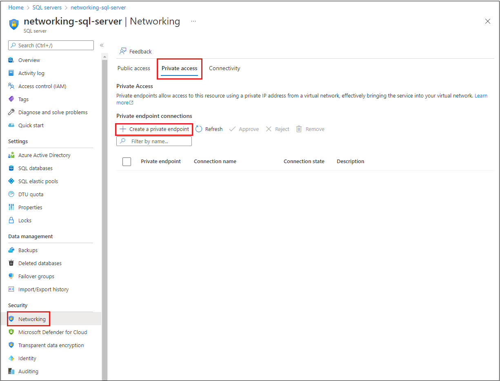
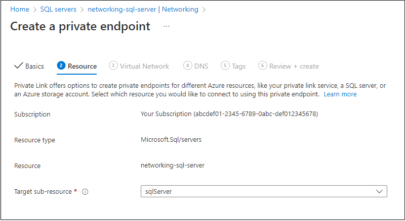
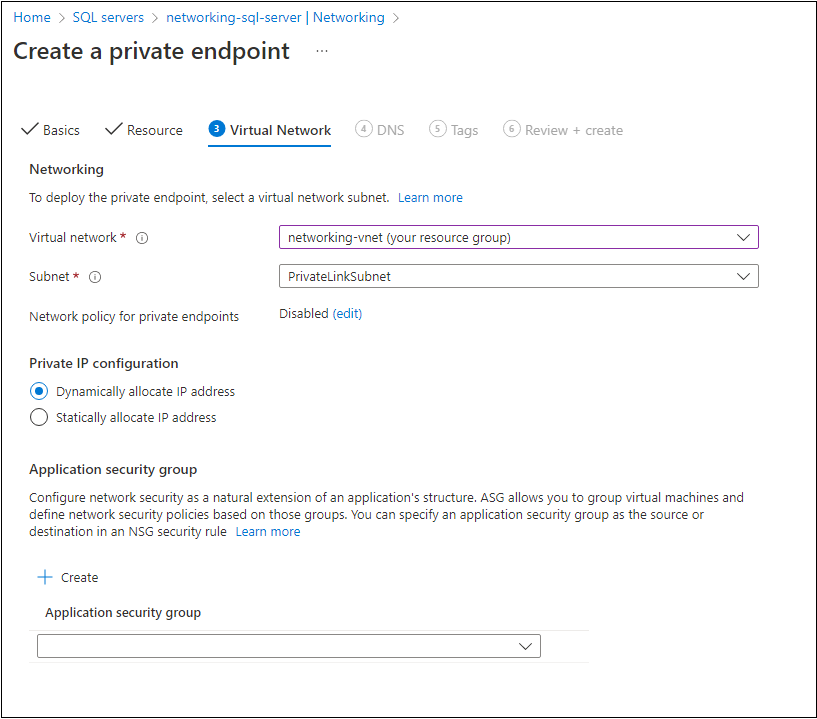
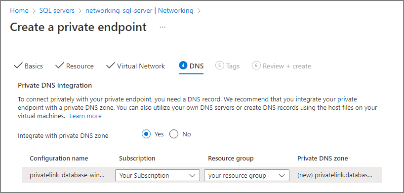
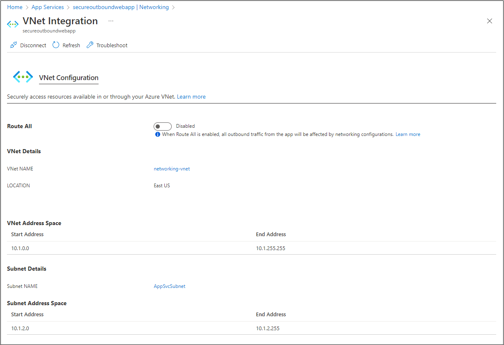

This example scenario describes how to securely connect a web app to a backend database over a fully private connection. The architecture ensures communication from the web app in Azure App Service and Azure SQL Database only traverses a virtual network.

## Architecture

*Download a [Visio file](https://arch-center.azureedge.net/private-web-application-app-service-private-sql.vsdx) of this architecture.*

### Workflow

1. The web app receives an HTTP request from the internet that requires an API call to the Azure SQL Database.

1. By default, web apps hosted in App Service can reach only [internet-hosted endpoints](/azure/app-service/networking-features). To communicate with the resources in your virtual network that aren't internet facing, you need to enable [regional virtual network integration](/azure/app-service/web-sites-integrate-with-vnet#regional-vnet-integration). Region virtual network integration gives the web app access to resources in the virtual network that aren't internet-hosted endpoint. Regional network integration mounts a virtual interface in the **AppSvcSubnet** that the App Service web app connects to.

1. The web app connects to the virtual network through a virtual interface mounted in the **AppSvcSubnet** of the [virtual network](/azure/virtual-network/).

1. [Azure Private Link](/azure/azure-sql/database/private-endpoint-overview#how-to-set-up-private-link-for-azure-sql-database) sets up a [private endpoint](/azure/private-link/private-endpoint-overview) for the [Azure SQL Database](/azure/azure-sql/database/) in the **PrivateLinkSubnet** of the virtual network.

1. The web app sends a query for the IP address of the Azure SQL Database. The query traverses the virtual interface in the **AppSvcSubnet**. The CNAME of the Azure SQL Database directs the query to the private DNS zone. The private DNS zone returns the private IP address of the private endpoint set up for the Azure SQL Database.

1. The web app connects to the Azure SQL Database through the private endpoint in the **PrivateLinkSubnet**.

1. The Azure SQL Database firewall allows only traffic coming from the **PrivateLinkSubnet** to connect. The database is inaccessible from the public internet.

### Components

This scenario uses the following Azure services:

- [Azure App Service](https://azure.microsoft.com/services/app-service) hosts web applications, allowing autoscale and high availability without having to manage infrastructure.

- [Azure SQL Database](https://azure.microsoft.com/products/azure-sql/database/) is a general-purpose relational database managed service that supports relational data, spatial data, JSON, and XML.

- [Azure Virtual Network](https://azure.microsoft.com/free/virtual-network) is the fundamental building block for private networks in Azure. Azure resources like virtual machines (VMs) can securely communicate with each other, the internet, and on-premises networks through Virtual Networks.

- [Azure Private Link](https://azure.microsoft.com/services/private-link/) provides a private endpoint in a Virtual Network for connectivity to Azure PaaS services like Azure Storage and SQL Database, or to customer or partner services.

- [Azure DNS](https://azure.microsoft.com/services/dns/#overview) hosts private DNS zones that provide a reliable, secure DNS service to manage and resolve domain names in a virtual network without the need to add a custom DNS solution.

### Alternatives

#### Architecture alternatives

- The virtual network in the architecture only routes traffic and is otherwise empty. Other subnets and workloads could also run in the virtual network.
- The **AppSvcSubnet** and **PrivateLinkSubnet** could be in separate peered virtual networks as part of a hub-and-spoke network configuration.
- The web app could be an [Azure Functions](/azure/azure-functions/functions-overview) app. An Azure Functions app can connect to any Azure service that supports an Azure Private Endpoint. The Azure Functions App must be deployed in a [pricing plan that supports virtual network integration](/azure/azure-functions/functions-networking-options#virtual-network-integration).
- The web app or functions app could connect to another web app. App Service supports [private endpoints](/azure/app-service/networking/private-endpoint) for inbound connectivity. For example, the web app or functions app could connect from a website to a REST API hosted in another Azure App Service instance.

#### Service alternatives

You could use an [App Service Environment](/azure/app-service/environment/intro) and [Azure SQL Managed Instance](/azure/azure-sql/managed-instance/sql-managed-instance-paas-overview) as the database engine to provide private connectivity.

- The App Service Environment and Azure SQL Managed Instance are natively deployed within a virtual network.
- These offerings are typically more costly because they provide single-tenant isolated deployment and other features.
- If you have an App Service Environment but aren't using SQL Managed Instance, you can still use a Private Endpoint for private connectivity to a SQL Database.
- If you already have SQL Managed Instance but are using multi-tenant App Service, you can still use regional VNet Integration to connect to the SQL Managed Instance private address.

You can use a [Service Endpoint](/azure/virtual-network/virtual-network-service-endpoints-overview) instead of the private endpoint to secure the database. You'll still need regional virtual network integration to route outbound web app traffic to the virtual network.

- With a service endpoint, the virtual interface in the **AppSvcSubnet** routes the API call through the Azure backbone. The source is the private IP address of the virtual interface. The destination is the public IP of the Azure SQL Database service endpoint. This route path makes the private endpoint and the **PrivateLinkSubnet**  unnecessary.
- A service endpoint is for an entire service. But a private endpoint provides a private, dedicated IP address to a specific instance (for example, a SQL Server). Private endpoints can help prevent data exfiltration. For more information, see [Comparison between Service Endpoints and Private Endpoints](/azure/virtual-network/vnet-integration-for-azure-services#compare-private-endpoints-and-service-endpoints).

#### Firewall alternatives

- Without using private connectivity, you can add [firewall rules](/azure/azure-sql/database/firewall-create-server-level-portal-quickstart) that limit inbound traffic from specified IP address ranges only.
- You could [allow only Azure services](/azure/azure-sql/database/network-access-controls-overview#allow-azure-services) access the server. However, the allowed traffic would include all Azure regions and other customers.
- You can also add a more restrictive firewall rule to allow only your app's [outbound IP address](/azure/app-service/overview-inbound-outbound-ips#find-outbound-ips) access the database. But App Service is a multi-tenant service, and IP addresses are shared with other customers on the same [deployment stamp](../../patterns/deployment-stamp.yml). This configuration would allow traffic from customers that use the same outbound IP address.

## Scenario details

### Potential use cases

- Private connectivity from an Azure App Service to Azure Platform-as-a-Service (PaaS) services.
- Private connectivity from an Azure App Service to Azure PaaS services that aren't natively deployed in isolated Azure Virtual Networks.
- Connect from Azure App Service to Azure Storage, Azure Cosmos DB, Azure Cognitive Search, Azure Event Grid, or any other service that supports an [Azure Private Endpoint](/azure/private-link/private-endpoint-overview#private-link-resource) for inbound connectivity.

## Considerations

These considerations implement the pillars of the Azure Well-Architected Framework, which is a set of guiding tenets that can be used to improve the quality of a workload. For more information, see [Microsoft Azure Well-Architected Framework](/azure/architecture/framework).

Below we outline other security, reliability, and cost-optimization considerations for this architecture.

### Security

Security provides assurances against deliberate attacks and the abuse of your valuable data and systems. For more information, see [Overview of the security pillar](/azure/architecture/framework/security/overview).

The architecture creates a secure outbound connection from an App Service web app to a downstream dependency like a database. You can also secure the inbound connection to the web app. Fronting the app with a service like [Application Gateway](/azure/application-gateway/overview) or [Azure Front Door](/azure/frontdoor/front-door-overview) enhances the inbound security of the web app. For extra inbound security, you can integrate [Azure Web Application Firewall](/azure/web-application-firewall/overview) into both the Application Gateway and Azure Front Door.

You can set [App Service access restrictions](/azure/app-service/app-service-ip-restrictions) to prevent users from bypassing the front-end service and accessing the web app directly. For an example scenario, see [Application Gateway integration with App Service (multi-tenant)](/azure/app-service/networking/app-gateway-with-service-endpoints#integration-with-app-service-multi-tenant).

#### DNS configuration

A configuration change is required to make the query to the public DNS (for example, `contoso.database.windows.net`) resolve to the IP address of the private endpoint. Regional virtual network integration allows the web app to resolve DNS queries using the virtual network's DNS service (including linked private DNS zones). The web app won't use the public IP address of the database server. It will use the IP address of the private endpoint in the virtual network. Communication between the web app and the database will traverse through the virtual network.

#### SQL database firewall

You can use the following steps to configure the firewall to prevent others from accessing the database:

1. Create a network security group (NSG), and link it to the **PrivateLinkSubnet**. Use the NSG to only allow inbound traffic from the **AppSvcSubnet**. For the subnet that contains the private endpoint, you need to [enable the *PrivateEndpointNetworkPolicies* property](/azure/private-link/disable-private-endpoint-network-policy) before the link will exist in the NSG.

1. Create a [virtual network rule](/azure/azure-sql/database/vnet-service-endpoint-rule-overview) that only allows traffic from the **AppSvcSubnet**. The **AppSvcSubnet** must have a [Service Endpoint](/azure/virtual-network/virtual-network-service-endpoints-overview) configured for `Microsoft.Sql` so the database can identify traffic from that subnet.

1. Configure the firewall to [deny public network access](/azure/azure-sql/database/connectivity-settings#deny-public-network-access). This configuration turns off all other firewall rules and makes the database accessible only through its private endpoint.

      - Denying public network access is the most secure configuration.
      - Database access is only possible through the virtual network that hosts the private endpoint. To connect to the database, anything other than the web app must have direct connectivity to the Virtual Network.
      - Deployments or urgent manual connections from SQL Server Management Studio (SSMS) on local machines can only reach the database through VPN or ExpressRoute connectivity into the virtual network.
      - You can also remotely connect to a VM in the virtual network and use SSMS from there.
      - For exceptional situations, you could temporarily allow public network access, and reduce risk by using other configuration options.

#### Logging and monitoring

Azure Private Link is integrated with [Azure Monitor](/azure/azure-monitor/overview). The integration allows you to see data flows and [troubleshoot connectivity](/azure/private-link/troubleshoot-private-endpoint-connectivity) for your private endpoint.

### Reliability

Private endpoints for Azure SQL Database are available in all public and government regions. The private endpoint has an [availability SLA of 99.99%](https://azure.microsoft.com/support/legal/sla/private-link/). The SLA must be taken into account when calculating the composite SLA of the entire solution.

#### Global peering

Any service in any Azure region that can connect through the virtual network can reach the private endpoint of the database. For example, [virtual network peering](/azure/virtual-network/virtual-network-peering-overview) in hub-and-spoke topologies would enable connectivity to the private endpoint.

The same is true when using App Service regional virtual network integration. Regional virtual network integration is a solution for cross-region connectivity from App Service to a database or other private endpoint in another Azure region. You can create a [multi-region web app with private connectivity to a database](../sql-failover/app-service-private-sql-multi-region.yml). This multi-region architecture supports partial failovers when either the web app or the database fails over to another region.

### Performance efficiency

Connections to Azure SQL can use either a "redirect" or a "proxy" [connection policy](/azure/azure-sql/database/connectivity-architecture#connection-policy). The "redirect" option is recommended for reduced latency and improved throughput. However, when you are accessing the database over a private endpoint, it will *always* use the "proxy" approach. This has performance implications, because in proxy mode the client connects through the Azure SQL Database gateways rather than being redirected directly to the node hosting the database.

> [!NOTE]
> As a general indication of the impact on performance, you can expect about a 5% increase in end-to-end latency. This is based on performing a load test between an App Service web app (single instance P3V2 tier) and an Azure SQL Database (General Purpose Gen 5 with 2 cores). The tests were run for five minutes by simulating five users all requesting a single web page which performed a single database query. The load test client, web app, and database were all deployed to the same Azure region. The average response time as seen by the load test client was increased from 8.51ms to 8.97ms when using a private endpoint.

The impact of using private endpoints depends greatly on your specific workload and how your app communicates with the database. To assess whether you can still meet your non-functional requirements you should validate your end-to-end scenario using a performance test that simulates your application's access patterns.

### Cost optimization

Cost optimization is about looking at ways to reduce unnecessary expenses and improve operational efficiencies. For more information, see [Overview of the cost optimization pillar](/azure/architecture/framework/cost/overview).

There's no extra cost for App Service regional virtual network integration in a supported pricing tier of Basic or above. Standard is a minimum recommendation for production workloads.

It's important to note that the private endpoint itself has an [associated cost](https://azure.microsoft.com/pricing/details/private-link/) based on an hourly fee plus a premium on bandwidth. You should take this additional cost into account, especially when you have a high-throughput workload.

All the mentioned services are pre-configured in an [Azure pricing calculator estimate](https://azure.com/e/f25225ef92824212ae34f837c22d519c) with reasonable default values for a small scale application.

To see how the pricing would change for your use case, change the appropriate variables to match your expected usage.

## Deploy this scenario

You can use the [Azure portal](#azure-portal) or an [Azure Resource Manager (ARM) template](#arm-template) to deploy this solution.

### Prerequisites

Before started, you need to have a running Azure App Service web app and an Azure SQL Database.

### Azure portal

1. In the [Azure portal](https://portal.azure.com), [create a virtual network](/azure/virtual-network/quick-create-portal) using the address range `10.1.0.0/16`, and [create two subnets](/azure/virtual-network/virtual-network-manage-subnet#add-a-subnet) within it:
   - **PrivateLinkSubnet** - address range `10.1.1.0/24` to expose the private endpoint of the database.
   - **AppSvcSubnet** - address range `10.1.2.0/24` for the web app's regional virtual network integration.

1. To [create the private endpoint](/azure/private-link/create-private-endpoint-portal#create-a-private-endpoint), navigate to your SQL Server. In the left navigation under **Security**, select **Networking**. At the top of the page, select **Private access**. Under **Private endpoint connections**, select **Create a private endpoint**.

      

1. Navigate through the five **Create a private endpoint** pages to create the private endpoint in the **PrivateLinkSubnet**.

   1. Select your resource group and name your private endpoint on the *Basics* page. On the *Resource* page, ensure the **Resource type** is **Microsoft.Sql/servers** and **Resource** shows the correct SQL Server. For **Target sub-resource**, select **sqlServer**.

      

   1. On the *Virtual Network* page, select the virtual network you create and the **PrivateLinkSubnet**

        

   1. On the *DNS* page, select **Yes** for the **Integrate with private DNS zone** option. The selection will register the private IP address of the database server in the `privatelink.database.windows.net` private Azure DNS zone.

      

1. [Enable VNet Integration](/azure/app-service/web-sites-integrate-with-vnet#enable-vnet-integration).

    1. Navigate to your web app. In the App Service left navigation under **Settings**, select **Networking**.

    1. On the **Networking** page, in the **Outbound Traffic** section, select **VNet integration**.

    1. On the **VNet Integration** page, select **Add VNet**.

    1. On the **Add VNet Integration** page, under **Virtual Network**, select your Virtual Network from the dropdown. Under **Subnet**, select **Select Existing**. Then select **AppSvcSubnet** from the **Subnet** dropdown. Select **OK**.

   The **VNet Integration** page now shows the virtual network configuration details.

   

   Configuring regional VNet Integration using the App Service **Networking** page (as we did) delegates the subnet to `Microsoft.Web` automatically. If you don't use the App Service **Networking** page, make sure to [manually delegate the subnet](/azure/virtual-network/manage-subnet-delegation#delegate-a-subnet-to-an-azure-service) to `Microsoft.Web`.

1. **Validate the connection** Your web application should now be able to connect to the database with the private IP address.
    1. To validate the connection, set the database firewall to **Deny public network access** to test that traffic is allowed only over the private endpoint.
    1. From the overview page of the SQL database, copy the **Server name** (for example, `contoso.database.windows.net`).
    1. In App Service, select your web app. In the left navigation under **Development Tools**, select **Console**.
    1. [Use the nameresolver.exe tool](/azure/app-service/web-sites-integrate-with-vnet#troubleshooting) to see the IP address the **Server name** resolves to. The syntax is `nameresolver.exe <Server name>`.
    1. Use the regular hostname for the SQL Database in the connection string (for example, `contoso.database.windows.net`) not the `privatelink`-specific hostname.

   

### ARM template

A slightly more advanced version of this scenario is available as an [Azure Resource Manager QuickStart Template](https://azure.microsoft.com/resources/templates/web-app-regional-vnet-private-endpoint-sql-storage/).

In this scenario, a web app accesses both a SQL Database and a Storage Account over private endpoints. These endpoints are in a different Virtual Network from the App Service integrated Virtual Network to demonstrate how this solution works across peered Virtual Networks.

## Next steps

- For more information on inbound and outbound scenarios for App Service, and which features to use in which cases, see the [App Service networking features overview](/azure/app-service/networking-features).

Product documentation:

- [Azure App Service overview](/azure/app-service/app-service-web-overview)
- [What is Azure SQL Database?](/azure/sql-database/sql-database-technical-overview)
- [What is Azure Virtual Network?](/azure/virtual-network/virtual-networks-overview)
- [What is Azure Private Link?](/azure/private-link/private-link-overview)

Learn modules:

- [Introduction to Azure Private Link](/training/modules/introduction-azure-private-link/)
- [Deploy PaaS solutions with Azure SQL](/training/modules/deploy-paas-solutions-with-azure-sql/)
- [Secure network connectivity on Azure](/training/modules/secure-network-connectivity-azure/)

## Related resources

- [Multi-region web app with private connectivity to database](../sql-failover/app-service-private-sql-multi-region.yml)
- [Security architecture design](../../guide/security/security-start-here.yml)
- [Design great API developer experiences using API Management and GitHub](../web/design-api-developer-experiences-management-github.yml)
- [Azure Private Link in a hub-and-spoke network](../../guide/networking/private-link-hub-spoke-network.yml)
