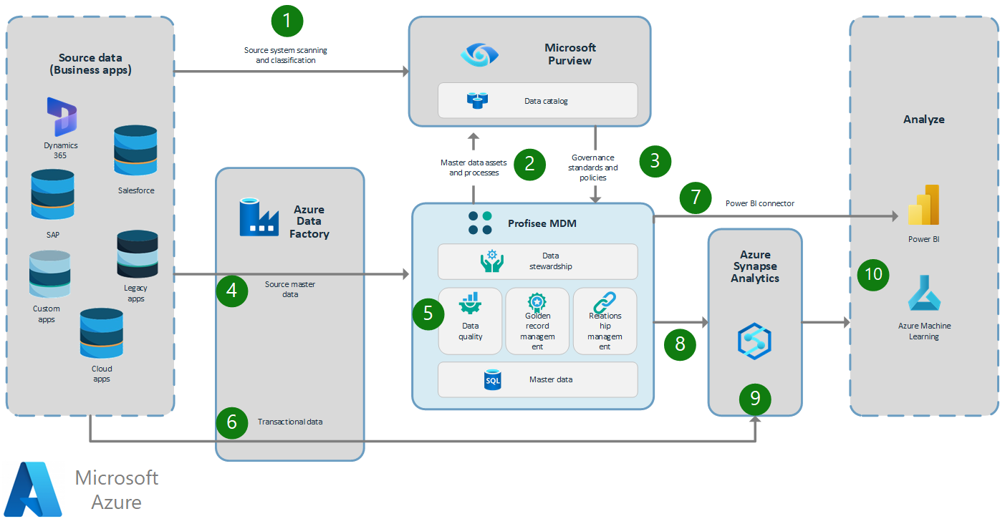
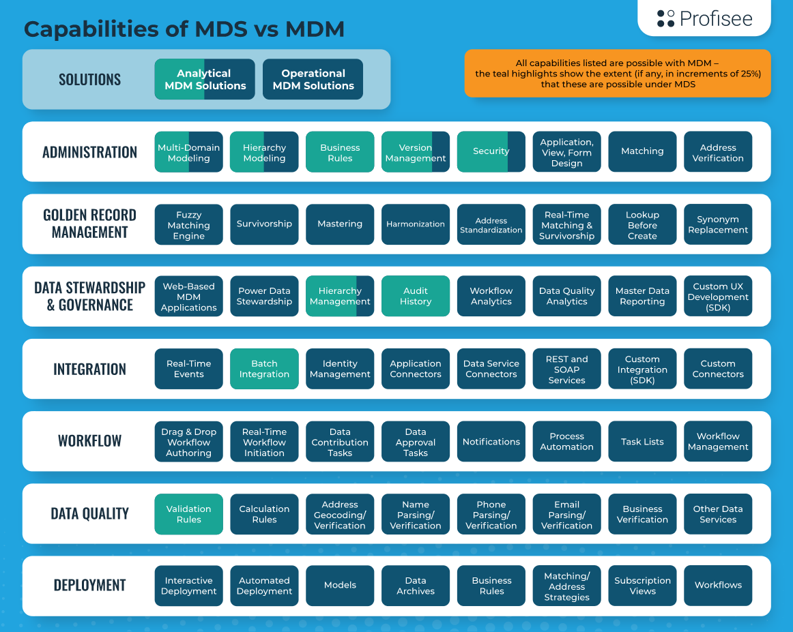

After you catalog enterprise data sources, you might determine that there are multiple sources of master data, which is the common data that's shared across systems. Examples of master data include customer, product, location, asset, and vendor data. It's important for this data to be effective and to form a common trusted platform for analytics and operational improvement. To get the data into that state, you can merge, validate, and correct it in Profisee. You can do this effectively when you use the governance definitions, insights, and expertise that are detailed in Microsoft Purview. In this way, Microsoft Purview and Profisee Master Data Management (MDM) form a foundation for governance and data management, and they maximize the business value of data in Azure.

This example scenario shows how Microsoft Purview and Profisee MDM work together to provide a foundation of high-quality, trusted data for the Azure data estate. For a short video about this solution, see [The power of fully integrated master data management in Azure](https://profisee.com/resources/the-power-of-fully-integrated-master-data-management-in-azure/).

## Architecture

The following diagram shows the steps that you take when you develop and operate your master data solution. Think of these steps as highly iterative. As your solution evolves, you might repeat these steps and phases, sometimes automatically and sometimes manually. Whether you use automatic or manual steps depends on the changes that your master data solution, metadata, and data undergo.

*Download a [Visio file](https://arch-center.azureedge.net/profisee-purview-reference-architecture.vsdx) of this architecture.*

### Dataflow

Metadata and data flow include these steps, shown in the preceding figure:

1. Pre-built Microsoft Purview connectors are used to build a data catalog from source business applications. The connectors scan data sources and populate the Microsoft Purview data catalog.

1. The master data model is published to Microsoft Purview. Master data entities that are created in Profisee MDM are seamlessly published to Microsoft Purview. This step further populates the Microsoft Purview data catalog and ensures that there's a record of this critical source of data in Microsoft Purview.

1. Governance standards and policies for data stewardship are used to enrich master data entity definitions. The data is enriched in Microsoft Purview with data dictionary and glossary information, ownership data, and sensitive data classifications. Any definitions and metadata that are available in Microsoft Purview are visible in real time in Profisee as guidance for the MDM data stewards.

1. Master data from source systems is loaded into Profisee MDM. A data integration toolset like Azure Data Factory extracts data from the source systems by using any of over 100 pre-built connectors or a REST gateway. Multiple streams of master data are loaded to Profisee MDM. Master data is the data that defines a domain entity, such as customer, product, asset, location, vendor, patient, household, menu item, and ingredient data. This data is typically present in multiple systems. Resolving differing definitions and matching and merging this data across systems is critical to the ability to use this data in a meaningful way.

1. The master data is standardized, matched, merged, enriched, and validated according to governance rules. Other systems such as Microsoft Purview might define data quality and governance rules. But Profisee MDM is the system that enforces these rules. Source records are matched and merged within and across source systems to create the most complete and correct record possible. Data quality rules check each record for compliance with business and technical requirements. Any record that fails validation or matches with a low probability score is subject to remediation. To remediate failed validations, a workflow process assigns records that require review to data stewards who are experts in their business data domain. After a record has been verified or corrected, it's ready to use as a golden record master.

1. Transactional data is loaded into a downstream analytics solution. A data integration toolset like Azure Data Factory extracts transactional data from source systems by using any of over 100 pre-built connectors or a REST gateway. The toolset loads the data directly into the analytics data platform. That platform might be Azure Synapse Analytics or a different analytics database. Analysis on this raw information without the proper master golden data is subject to inaccuracy, because data overlaps, mismatches, and conflicts aren't yet resolved.

1. Power BI connectors provide direct access to the curated master data. Power BI users can use the master data directly in reports. A dedicated Power BI connector recognizes and enforces role-based security. It also hides various system fields to simplify use.

1. High-quality, curated master data is published to a downstream analytics solution. If master data records have been merged into a single golden record, parent-child links to the original records are preserved.

1. A complete, consistent data foundation is available. The analytics platform has a set of data that's complete, consistent, and accurate. That data includes properly curated master data and associated transactional data. With that data combination, a solid foundation of trusted data is available for further analysis. In Microsoft-centric environments, Azure Synapse Analytics is generally preferred. But you can use any analytics database. Snowflake and Databricks are common choices.

1. Visualization and analytics are performed with high-quality master data. Using high-quality master data eliminates common data quality issues and helps to deliver sound insights for driving the business, no matter which tools that are used for analysis, machine learning, and visualization.

### Components

- [Microsoft Purview](https://azure.microsoft.com/services/purview/) is a data governance solution that provides broad visibility into on-premises and cloud data estates. It offers a combination of data discovery and classification, lineage, metadata search and discovery, and usage insights. All these features help you manage and understand data across your enterprise data landscape.

- [Profisee MDM](https://profisee.com/platform/) is a fast and intuitive MDM platform that integrates seamlessly with Microsoft technologies and the Azure data management ecosystem.

- [Azure Data Factory](https://azure.microsoft.com/products/data-factory/) is a hybrid data integration service. You can use Data Factory to create, schedule, and orchestrate extract, transform, and load (ETL) and extract, load, and transform (ELT) workflows. Data Factory also offers more than 100 pre-built connectors and a REST gateway that you can use to extract data from source systems.

- [Azure Synapse Analytics](https://azure.microsoft.com/services/synapse-analytics/) is a fast, flexible, and trusted cloud data warehouse that uses a massive parallel processing architecture. You can use Azure Synapse Analytics to scale, compute, and store data elastically and independently.

- [Power BI](https://powerbi.microsoft.com/) is a suite of business analytics tools that delivers insights throughout your organization. You can use Power BI to connect to hundreds of data sources, simplify data preparation, and drive improvised analysis. You can also produce beautiful reports and then publish them for your organization to consume on the web and on mobile devices.

### Alternatives

If you don't have a purpose-built MDM application, you can find some of the technical capabilities that you need to build an MDM solution in Azure:

- Data quality. When you load data into an analytics platform, you can build data quality into integration processes. For example, you can use hard-coded scripts to apply data quality transformations in an [Azure Data Factory](/azure/data-factory/introduction) pipeline.
- Data standardization and enrichment. Azure Maps can provide data verification and standardization for address data. You can use the standardized data in Azure Functions and Azure Data Factory. To standardize other data, you might need to develop hard-coded scripts.
- Duplicate data management: You can use Azure Data Factory to [deduplicate rows](/azure/data-factory/how-to-data-flow-dedupe-nulls-snippets) if sufficient identifiers are available for an exact match. You likely need custom hard-coded scripts to implement the logic that's needed to merge matched rows while applying appropriate data survivorship techniques.
- Data stewardship. You can use [Power Apps](https://powerapps.microsoft.com) to quickly develop basic data stewardship solutions to manage data in Azure. You can also develop appropriate user interfaces for reviews, workflows, alerts, and validations.

## Scenario details

Since June 2021, we no longer actively support SQL Server Master Data Services (MDS), and we only provide maintenance for the current version. As a result, long-time users are moving to other options. For many, the opportunity to upgrade to a more full-featured Master Data Management (MDM) platform is the obvious choice, especially if you can do so with minimal effort and disruption.

Profisee MDM is a full-featured MDM platform that was originally built using MDS as a foundation. Several of the original developers of Profisee MDM were the original developers of MDS. MDS was part of the architecture of early versions of the Profisee Platform.

Although the MDS underpinning was removed several years ago, it still represents a familiar architecture to current MDS users. Since all legacy Profisee users migrated from an MDS-based version of Profisee to the current architecture, Profisee developed several automated migration capabilities to streamline MDS migration for users down to a few steps.

Profisee core functionality includes data stewardship, data quality, golden record management, and relationship management. You can combine high-quality, trusted, and enriched master data with transactional data sent into Azure Synapse for downstream analytics and consumption. Or, you can use the officially certified Profisee Connector for Power BI to load data directly from Profisee as a native data source in Power BI.

### Benefits of migrating to Profisee MDM

Aside from the ease of migration, there are several benefits of migrating to a fully featured MDM platform like Profisee, including:

- **Matching.** Create a single golden record master by matching between and within data sources.

- **Data quality.** Enforce data quality and governance rules.

- **Data stewardship.** Engage experts to approve low-probability matches and directly remediate problem data, as required.

- **Workflow.** Orchestrate data routing issues to data stewards, as required.

- **Multidomain.** Model and master data from multiple domains (customer, product, location, asset, and more) simultaneously in a single system, together with all reference data.

- **Deployment options.** Use cloud-native platform as a service (PaaS) and turnkey software as a service (SaaS).

Upon migration, a new Profisee solution operates in full managed mode, eliminating usual deployment and administration that comes with on-premises solutions. For example, ARM templates automate the Profisee instance for you in Azure. Profisee is an all-Azure native solution. So, resolving maintenance and operation-related support issues becomes easier and quicker.

Profisee is built on a modern cloud architecture as a containerized Kubernetes service for easy deployment and flexibility. You can use Profisee MDM for complete flexibility to deploy in any cloud, on-premises, or in a hybrid environment. Or you can use Profisee MDM SaaS in the Azure cloud as a full turnkey service for the quickest path to trusted data.

For complete flexibility, both Profisee MDM and Profisee MDM SaaS are available as *transactable* services in Azure Marketplace.

For more information, see the following:

- [Cloud-native MDM](https://profisee.com/cloud-master-data-management/)
- [Profisee listings on Azure Marketplace](https://azuremarketplace.microsoft.com/en-us/marketplace/apps?search=profisee&page=1)

### Features of MDS and Profisee MDM

MDS helps organizations manage customer lists, product lists, hierarchies, state codes, cost centers, and other attributes. Profisee expands on the MDS toolset by creating a more complete MDM platform, as shown by the functional areas in the following chart.

Although Profisee was once based on MDS, its multi-domain MDM platform has been re-engineered on a modern, PaaS architecture, which is also offered in a turnkey SaaS model. With native integrations into leading Azure services such as Microsoft Purview, Azure Data Factory, Azure Synapse, and Power BI, Profisee is an ideal choice for modern Microsoft enterprises.

This chart shows the expansion in capabilities offered by Profisee MDM over MDS:

Along with the functional expansion shown in the preceding chart, the close fit and synergy from MDS to Profisee demonstrates the advantage of migrating reference data management to a cloud-native, multi-domain platform with Profisee MDM. It also demonstrates why Profisee MDM is a natural successor from MDS, helping organizations easily upgrade to full-featured MDM. Profisee’s lightweight MDS Migration Utility helps users quickly migrate their existing MDS entities, hierarchies, users, and groups to Profisee.

#### Profisee MDS Migration Utility (MMU)

To ensure simple and fast migration from MDS to full-featured MDM, Profisee developed the [MDS Migration Utility (MMU)](https://profisee.com/solutions/microsoft-enterprise/master-data-services/) and includes it with the Profisee MDM platform.

#### Profisee MDM core features

Profisee MDM is a full-featured multi-domain MDM solution that accommodates all functionality available in MDS.

- **Profisee core:** Supports the creation and deployment of flexible entity models to represent and master any domain.

- **Integration:** Makes it easy to synchronize clean, consistent, and trusted data across enterprise applications and data warehouses with out-of-the-box, real-time, and bi-directional integrations and support for REST APIs and webhooks.

- **Stewardship and governance:** Lets data stewards interact with their data for common tasks such as reviewing and approving matches and correcting data quality issues. The web-based user interface is intuitive and configurable to create applications tailored to typical data stewardship workflows and tasks.

- **Relationship management:** Supports modeling and exploration of both hierarchical (parent-child) roll-ups (typically used in reference data management and analytics) and peer-level entity relationships through common attributes.

- **Golden record management:** De-duplicates data between and within data sources with automated match and merge and survivorship functions. Matching is based on machine-learning algorithms and configurable for any master data domain and matching strategy. You can similarly configure survivorship rules to support specifying preferred sources when conflicts occur or to require human review of a low-confidence result. This feature includes a dedicated match-result viewer to explore and verify the matching process.

- **Data quality:** Specifies data quality rules to verify valid data. Machine-learning anomaly detection helps flag out-of-band values and then route them for appropriate remediation.

- **Workflow:** Optimizes and orchestrates routing of various tasks to data stewards for review or intervention, through a highly configurable workflow engine.

## Considerations

These considerations implement the pillars of the Azure Well-Architected Framework, which is a set of guiding tenets that can be used to improve the quality of a workload. For more information, see [Microsoft Azure Well-Architected Framework](/azure/architecture/framework).

The MMU utility is lightweight and easy to use, and it doesn't require installation. Just download the utility from the Profisee Support Portal and unzip the file into the desired directory. The utility transfers data and model structures from MDS 2014, 2016, and 2017 to Profisee MDM. The utility then re-creates the entities, attributes, relationships, and hierarchies from the current MDS implementation directly within Profisee MDM.

Migration is a one-time process. Each model is only migrated once.

Entities, hierarchies, users and groups, and data seamlessly migrate to Profisee. For more information, see the [MMU User Guide](https://profisee.com/resources/mds-migration-utility/).

> [!NOTE]
> Data quality rules aren't automatically migrated (due to the availability of more advanced data quality structures in Profisee). But you can quickly re-create and expand most data quality rules in the Profisee no-code data quality rules UI.

### Reliability

Reliability ensures your application can meet the commitments you make to your customers. For more information, see [Overview of the reliability pillar](/azure/architecture/framework/resiliency/overview).

You're a customer of Profisee MDM SaaS, your data hosts on Azure in regional pairs. The resources used to host Profisee Cloud are deployed across region pairs. The resources apply multiple availability zones within a region for high availability, geo-replication across regions for disaster recovery, and strong backup policies. These options enable minimal downtime, fast recovery, and seamless failover if necessary.

Profisee is a cloud-native application that runs on Azure services, including Azure Kubernetes Service (AKS), Azure SQL, and Azure Storage accounts. The Profisee SaaS offering uses these underlying services to provide high availability within an Azure region and the ability to fail over to an alternative Azure region if a major outage in an Azure region occurs.

### Security

Security provides assurances against deliberate attacks and the abuse of your valuable data and systems. For more information, see [Overview of the security pillar](/azure/architecture/framework/security/overview).

The Profisee MDS Migration Utility (MMU) requires users to link to their Profisee instance and sign in with their verified credentials to open the utility. To migrate data models from MDS, users must enter the URL of their MDS database and enter valid credentials before choosing a data model.

For SaaS implementations (hosted by Profisee on Azure), after you import MDS models into the Profisee Platform, they're managed under the Profisee security policy. For more information, see [Profisee Security Overview](https://profisee.com/security/).

Profisee data security practices have been audited against the SOC 2 security framework by a trusted audit firm, A-LIGN. Profisee complies with laws and regulations that affect or are relevant to Profisee operations (such as GDPR or CCPA) and implements security practices that follow industry standard practices. Profisee reviews the Security Information Program annually to identify and update the changes required to maintain a modern, proactive, and effective security program.

#### Encryption of data at rest

Customer data is stored in tenant-specific repositories (such as databases, storage accounts, and so on). All data at rest is encrypted with modern encryption standards and is reevaluated as required. Repositories aren't accessible publicly. They're isolated on a private network with row-level security enabled. Row-level security helps prevent unauthorized access as controlled through Azure AD roles and groups. Profisee maintains row-level security, which helps prevent unapproved access of any customer data by Profisee employees.

#### Encryption of data in transit

All network traffic to and from Profisee Cloud over the public internet uses a minimum of TLS 1.2 to encrypt data in transit.

#### Tenant isolation

Profisee Cloud uses dedicated repositories to provide complete tenant isolation between Profisee Cloud environments. Customer data isn't shared or co-mingled between environments. Users must be authenticated and authorized for each individual Profisee Cloud environment they access. If a customer uses a common authentication provider like Azure Active Directory across environments (such as Development, Test, and Production), users gain the benefit of single sign-on but are authorized independently for each environment.

#### Access security

Profisee uses single sign-on (SSO) by way of OpenIDConnect-compliant providers, coupled with multifactor authentication. After customers deploy on the platform, they're responsible for using role-based access controls to manage their users, groups, and roles. Profisee has designed the Profisee Cloud solution with the principles of least privilege access in mind, requiring the minimum access necessary.

Along with the role-based access controls required to gain access to the platform, the Profisee solution internally supports customization and granular control. You can assign built-in roles or custom group permissions that support identity and access management controls that you can use for just-in-time access.

### Cost optimization

Cost optimization is about looking at ways to reduce unnecessary expenses and improve operational efficiencies. For more information, see [Overview of the cost optimization pillar](/azure/architecture/framework/cost/overview).

The Profisee MMU is a free download from the Profisee Support Portal to all customers and is compatible with the Profisee Platform v7.1.1 and later. The MMU can migrate models built in Master Data Services 2014, 2016, and 2017.

Profisee is a true multi-domain MDM platform with domain-agnostic, volume-based pricing. Every deployment of the Profisee Platform includes 500,000 unique records. Bulk pricing is available for large-scale implementations.

## Contributors

*This article is maintained by Microsoft. It was originally written by the following contributors.*

Principal authors:

- [Benjamin Bourgeois](https://www.linkedin.com/in/benbourgeois1) | Content Marketing Manager
- [Martin Boyd](https://www.linkedin.com/in/martin-boyd-6714b4) | VP Product Marketing

Other contributors:

- [Brian Barnett](https://www.linkedin.com/in/brian-barnett-ga) | Software Architect

*To see non-public LinkedIn profiles, sign in to LinkedIn.*

## Next steps

- For more information about Profisee, see the [Profisee website](https://profisee.com/).
- For instructions on upgrading from Master Data Services to Profisee, see the [Profisee MDS Migration Utility](https://profisee.com/solutions/microsoft-enterprise/master-data-services/) web page.
- Learn more about Profisee shared history with Microsoft and SQL Server MDS in [this blog from one of the original architects of MDS](https://profisee.com/blog/4-key-takeaways-mds-migration-options-and-why-you-should-switch/).
- View a [Webinar with the original architect of MDS](https://profisee.com/resources/mdm-resource-hub/videos/master-data-services-migration-options-and-why-you-should-switch/).

## Related resources

- [Data governance with Profisee and Microsoft Purview](/azure/architecture/reference-architectures/data/profisee-master-data-management-purview)
- [Master data management with Profisee and Azure Data Factory](/azure/architecture/reference-architectures/data/profisee-master-data-management-data-factory)
- [Azure Data Architecture Guide](/azure/architecture/data-guide/)
- [Analytics end-to-end with Azure Synapse](/azure/architecture/example-scenario/dataplate2e/data-platform-end-to-end)
- [Deploy Microsoft Purview - Profisee integration for master data management (MDM) - Microsoft Purview](/azure/purview/how-to-deploy-profisee-purview-integration)
