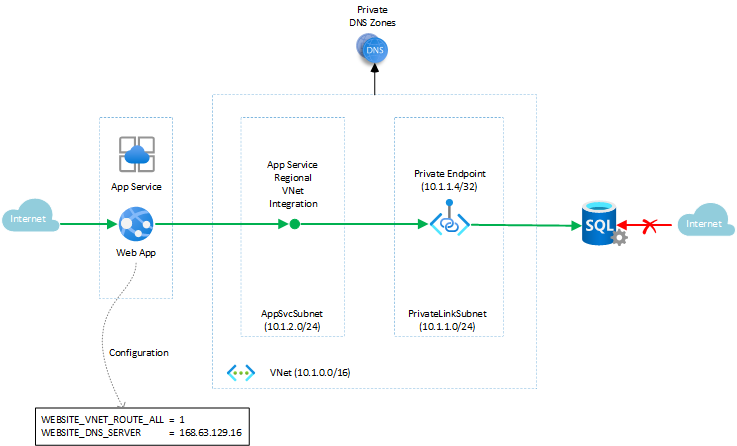
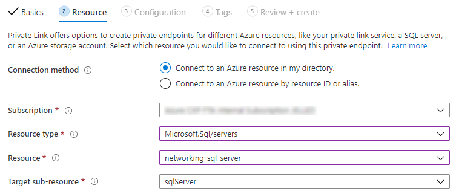
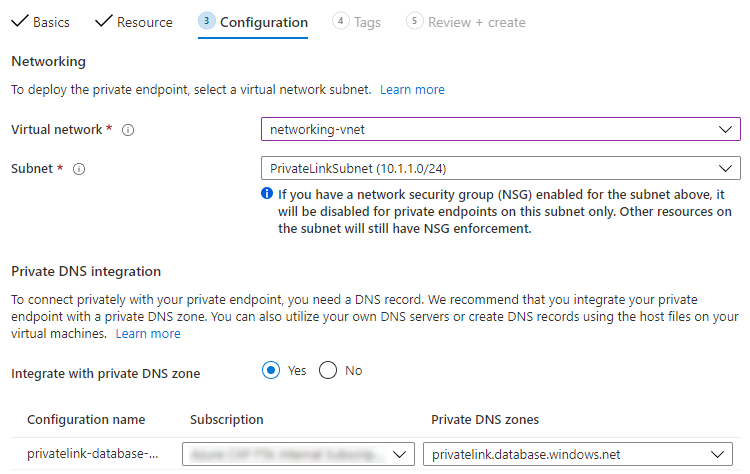
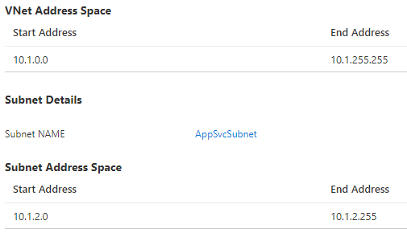
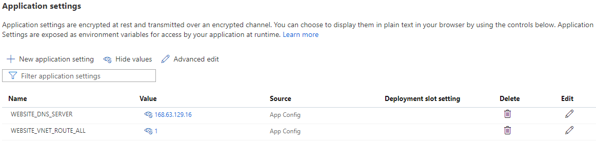

# Web app with private connectivity to database

This example scenario applies to customers who are looking for private connectivity between Platform-as-a-Service (PaaS) offerings that are not natively deployed within an isolated Azure Virtual Network (VNet).

In this article we show how a web application can securely connect to a database over a fully private connection, without exposing the database over a public endpoint. This allows customers to ensure the database cannot be reached from the public internet, thereby avoiding an important attack vector for malicious actors. Web applications and databases can obviously be hosted in many different ways, but in this scenario we consider a typical combination of hosting the web application in [App Service](https://docs.microsoft.com/azure/app-service/) and connects to [Azure SQL Database](https://docs.microsoft.com/azure/azure-sql/database/).

> [!NOTE]
> We deliberately chose these multi-tenant services rather than [App Service Environment](https://docs.microsoft.com/azure/app-service/environment/intro) and [Azure SQL Managed Instance](https://docs.microsoft.com/azure/azure-sql/managed-instance/sql-managed-instance-paas-overview), as these are natively deployed within an isolated VNet already and can therefore connect privately without additional configuration. See the [Alternatives](#alternatives) section for more information.

## Potential use cases

These other uses cases have similar design patterns, and are only small variations as the underlying principle is always the same:

- Connecting from a Web App to Azure Storage, Azure Cosmos DB, Azure Cognitive Search, Azure Event Grid, or [any other service which supports an Azure Private Endpoint](https://docs.microsoft.com/azure/private-link/private-endpoint-overview#private-link-resource) for inbound connectivity.
- Similarly to connecting from a Web App, you can also connect from a Function App to any of those services, as long as the Function App is deployed in a [pricing plan which supports VNet integration](https://docs.microsoft.com/azure/azure-functions/functions-networking-options#virtual-network-integration).
- You can even connect from a Web App or Function App to _another_ Web App, for example connecting from a website to a REST API hosted in another Azure App Service instance, as [App Service itself also supports Private Endpoints](https://docs.microsoft.com/azure/app-service/networking/private-endpoint) for inbound connectivity.

## Architecture

By exposing the database over a [private endpoint](https://docs.microsoft.com/azure/azure-sql/database/private-endpoint-overview) in a subnet of a specific VNet (named `PrivateLinkSubnet` in the architecture diagram), the database firewall can be locked down to allow only traffic coming from that VNet - effectively making it completely inaccessible from the public internet. By combining this with App Service's [regional VNet integration](https://docs.microsoft.com/azure/app-service/web-sites-integrate-with-vnet#regional-vnet-integration) feature, we can ensure the web app connects through a so-called delegated subnet in the VNet (named `AppSvcSubnet` in the architecture diagram) and from there into the database's private endpoint.

> [!NOTE]
> In this case, the VNet is only required for routing the traffic and is otherwise empty, but of course there could be other subnets and workloads running in the VNet. The App Service and Private Link subnets could even be in different (peered) VNets, e.g. as part of a hub and spoke network configuration.

### Components

The following Azure services are used in this scenario:

- [App Service](https://docs.microsoft.com/azure/app-service/app-service-web-overview) hosts web applications allowing autoscale and high availability without having to manage infrastructure.
- [SQL Database](https://docs.microsoft.com/azure/sql-database/sql-database-technical-overview) is a general-purpose relational database-managed service in Microsoft Azure that supports structures such as relational data, JSON, spatial, and XML.
- [Azure Virtual Network (VNet)](https://docs.microsoft.com/azure/virtual-network/virtual-networks-overview) is the fundamental building block for your private network in Azure. VNet enables many types of Azure resources, such as Azure Virtual Machines (VM), to securely communicate with each other, the internet, and on-premises networks.
- [Azure Private Link](https://docs.microsoft.com/azure/private-link/private-link-overview) enables you to access Azure PaaS Services (for example, Azure Storage and SQL Database) and Azure hosted customer-owned/partner services over a private endpoint in your virtual network.

In order for the private connectivity from the app to the database to work, the app code itself does not have to be modified, and it can still use the same hostname for the SQL Database in the connection string, e.g. `contoso.database.windows.net`. The database can then be [exposed through a private endpoint](https://docs.microsoft.com/azure/azure-sql/database/private-endpoint-overview#how-to-set-up-private-link-for-azure-sql-database), and the app can be configured with [regional VNet integration](https://docs.microsoft.com/azure/app-service/web-sites-integrate-with-vnet) using that same VNet.

However, without any further changes, this will not work as intended yet: by default, regional VNet integration only routes traffic to _private_ addresses from the web app into the VNet and currently, DNS resolution of the SQL Database hostname will still result in its regular (public) IP address. This means the web app would connect to the public IP address and the traffic would not pass through the VNet (note that this doesn't mean the traffic itself would go over the public internet: it will always remain within the Azure network!).

> [!NOTE]
> You may be tempted to use the Private Link-specific hostname (e.g. `contoso.privatelink.database.windows.net`) at this point, but that will not work as SQL Database doesn't accept this hostname, and in fact without additional configuration this still resolves to the same public IP address due to [how DNS works for private endpoints](https://docs.microsoft.com/azure/private-link/private-endpoint-dns).

To make the web app resolve the hostname to the SQL Database's _private_ IP address, App Service must be configured to use the Azure Private DNS Zone that was set up during the private endpoint configuration. This can be done by setting the web app's configuration setting `WEBSITE_VNET_ROUTE_ALL` to `1` and `WEBSITE_DNS_SERVER` to `168.63.129.16` (i.e. the IP address of the Azure-provided DNS service), as documented in [App Service VNet integration with DNS Private Zones](https://docs.microsoft.com/azure/app-service/web-sites-integrate-with-vnet#azure-dns-private-zones). With these configuration settings in place, this ensures that `contoso.database.windows.net` no longer resolves to the public IP address but instead to the private IP address in the `PrivateLinkSubnet` as defined in the Azure Private DNS Zone. From that moment on, traffic will flow privately over the VNet.

Alternatively, if you have a [custom DNS server already configured on the VNet](https://docs.microsoft.com/azure/virtual-network/virtual-networks-name-resolution-for-vms-and-role-instances#name-resolution-that-uses-your-own-dns-server), and it already resolves the SQL Database hostname to its private IP address, the `WEBSITE_DNS_SERVER` configuration setting on App Service isn't required (as the delegated `AppSvcSubnet` inherits the DNS settings from the VNet). If you don't have a custom DNS server, you can also set the VNet's DNS server IP address to `168.63.129.16`, so that the app inherits the DNS server from there. Of course, the scope and possible impact of defining DNS at the entire VNet is larger than setting it at the individual App Service, so only define it on the VNet if this makes sense for _all_ workloads running within that network. And regardless of whether you've set the DNS configuration on the app or on the VNet, the `WEBSITE_VNET_ROUTE_ALL` app setting is _always_ required to make this DNS resolution work.

### Alternatives

#### Service Endpoints

As an alternative to Private Endpoints, you can also use [Service Endpoints](https://docs.microsoft.com/azure/virtual-network/virtual-network-service-endpoints-overview) to secure the database. The architecture diagram would be conceptually similar but reduced, in the sense that you still need to use the regional VNet integration to get the traffic to route through the VNet (even without configuring the `WEBSITE_VNET_ROUTE_ALL` app setting in this case), but the private endpoint and the `PrivateLinkSubnet` wouldn't be required anymore.

One important difference is that with Service Endpoints, the database is still accessed via its public endpoint, which means you don't need any specific DNS configuration (i.e. the `WEBSITE_DNS_SERVER` app setting is also not needed). With Private Endpoints on the other hand, this becomes a fully private, dedicated IP address. Furthermore, a Private Endpoint is created towards _your specific instance_ (e.g. of your logical SQL Server) rather than _the entire service_ (as with Service Endpoints), which can be interesting for preventing data exfiltration towards other database servers for example.

For more details, see the [comparison between Service Endpoints and Private Endpoints](https://docs.microsoft.com/azure/private-link/private-link-faq#what-is-the-difference-between-a-service-endpoints-and-a-private-endpoints).

#### Single-tenant deployments

As mentioned before, an alternative approach to achieving private connectivity is to use an [App Service Environment](https://docs.microsoft.com/azure/app-service/environment/intro) for hosting the web application within an isolated environment, and [Azure SQL Managed Instance](https://docs.microsoft.com/azure/azure-sql/managed-instance/sql-managed-instance-paas-overview) as the database engine. Because these services are deployed within a VNet, there is no need for VNet integration or private endpoints.

However, these offerings are typically more costly as they provide a single-tenant isolated deployment and other features beyond their multi-tenant counterparts. If you don't _require_ any of those features, you can save money and still enjoy private connectivity by following the configuration outlined in this article.

> [!NOTE]
> If you already have an App Service Environment but aren't using SQL Managed Instance, you can of course still use a private endpoint of your SQL Database to achieve private connectivity. Likewise, if you already have SQL Managed Instance and are using multi-tenant App Service, you can still use the regional VNet integration to connect to the private address of the SQL Managed Instance.

## Considerations

### Database firewall considerations

The most important consideration to make in this scenario is how you want to configure the firewall of the SQL Database.

The following options are possible even without the private connectivity outlined in this article, from least to most secure:

- You could add a [firewall rule](https://docs.microsoft.com/azure/azure-sql/database/firewall-create-server-level-portal-quickstart) that would allow inbound traffic from Start IP `0.0.0.0` to End IP `255.255.255.255`, which essentially means that the database is wide open to the internet. Needless to say, this is not ideal from a security perspective.
- A more secure approach is to [Allow Azure services and resources to access this server](https://docs.microsoft.com/azure/azure-sql/database/network-access-controls-overview#allow-azure-services), which locks down the firewall by allowing only traffic coming from within Azure. However, this includes _all of Azure_, i.e. traffic from all Azure regions and from all other Azure customers as well.
- You can instead be more specific, and add a firewall rule for [all of the possible outbound IP addresses that App Service can use from your specific web app](https://docs.microsoft.com/azure/app-service/overview-inbound-outbound-ips#find-outbound-ips). However even in this case, as App Service is a multi-tenant service, these outbound IP addresses are still shared with other customers. In other words, with this configuration, you are still allowing traffic from other App Service customers who happen to run their apps on the same [deployment stamp](https://docs.microsoft.com/azure/architecture/patterns/deployment-stamp) and are therefore using the same outbound IP addresses.

With private connectivity configured through the VNet, you gain the following firewall options, allowing you to prevent other customers from having network-level access to your database:

- You can add a [Virtual network rule](https://docs.microsoft.com/azure/azure-sql/database/vnet-service-endpoint-rule-overview) which allows only traffic from the delegated subnet used by App Service's regional VNet integration (`AppSvcSubnet` in the architecture diagram). Note that this requires that delegated subnet to have a [Service Endpoint](https://docs.microsoft.com/azure/virtual-network/virtual-network-service-endpoints-overview) configured for `Microsoft.Sql` so that the traffic into the database is seen as coming from that specific subnet.
- You can configure the firewall to [Deny public network access](https://docs.microsoft.com/azure/azure-sql/database/connectivity-settings#deny-public-network-access). As soon as this is enabled, this turns off all other firewall rules and makes the database _only_ accessible through its private endpoint.

> [!IMPORTANT]
> The last option of denying public network access is the most secure configuration, but also means that you cannot access the database at all unless by going through the VNet hosting the private endpoint. This means that if you need anything other than the web app to connect to the database, it must have direct connectivity to that VNet. For example, for database deployments or urgent manual connections to the database from SQL Server Management Studio (SSMS) on your local machine, you will not be able to reach the database unless you have VPN or ExpressRoute connectivity into that VNet (or you could remote into a Virtual Machine in the VNet and use SSMS from there for example). Of course, for exceptional situations you could also temporarily allow public network access and still reduce risk by using the other configuration options outlined above.

### Global connectivity considerations

Another important consideration is that the database's private endpoint is reachable from any service in any Azure region that has connectivity through the VNet, for example through [VNet peering](https://docs.microsoft.com/azure/virtual-network/virtual-network-peering-overview). However, even though App Service's regional VNet integration works across peered VNets (e.g. for hub and spoke topologies), _global peering_ is not currently supported - in other words, the peered VNets must be located in the same Azure region. This means that you cannot use this solution for cross-region connectivity from App Service to a database (or any other private endpoint) in another Azure region. For example, this would not work for a multi-regional deployment where you want to support a partial failover, in which the web app remains active in one region but needs to connect to a failed-over database in another region (or vice versa).

### Availability, Scalability, and Security

The regional VNet integration and private endpoint configurations are managed by the underlying Azure infrastructure, so there are no additional _scalability_ considerations for this setup.

Similarly, apart from the database firewall considerations outlined above, and of course the goal of improving security in the first place, there are no additional _security_ considerations around the private connectivity configuration itself.

There is an additional consideration around _availability_, as you are introducing an additional component into the architecture: the Azure Private Link service which is used to publish and maintain the database's private endpoint. This service has an [availability SLA of 99.99%](https://azure.microsoft.com/support/legal/sla/private-link/), so this must be taken into account when considering the [composite SLA of the entire solution](https://docs.microsoft.com/azure/architecture/framework/resiliency/business-metrics#composite-slas).

## Deploy this scenario

### Manual Configuration

Assuming you've already created an App Service web app and deployed a SQL Database, the private connectivity can be established as follows:

- [Create a VNet](https://docs.microsoft.com/azure/virtual-network/quick-create-portal) using the address range `10.1.0.0/16`, and [create two subnets](https://docs.microsoft.com/azure/virtual-network/virtual-network-manage-subnet#add-a-subnet) within it:
  - The `PrivateLinkSubnet` (address range `10.1.1.0/24`) used to expose the private endpoint of the database.
  - The `AppSvcSubnet` (address range `10.1.2.0/24`) used for the web app's regional VNet integration.
- On the database, [create the private endpoint](https://docs.microsoft.com/azure/private-link/create-private-endpoint-portal#create-a-private-endpoint) in the `PrivateLinkSubnet`.
  - Note that when using the Azure Portal, the easiest way to configure the private endpoint (including the approval step and DNS Private Zones integration) is through the **Private endpoint connections** page on the logical SQL Server resource.
  - The **Resource type** for the connection is `Microsoft.Sql/servers`, the **Resource** is the logical SQL Server you want to expose, and the **Target sub-resource** is `sqlServer`.
    
  - Make sure to **Integrate with private DNS zone**, which will register the database server's private IP address in the `privatelink.database.windows.net` private zone.
    
- On the web app, [enable regional VNet integration](https://docs.microsoft.com/azure/app-service/web-sites-integrate-with-vnet#enable-vnet-integration) with the `AppSvcSubnet`.
    
  - Note that if you configure this via the web app's **Networking** page in the Azure Portal, the required delegation of the subnet to `Microsoft.Web` is performed automatically.
  - If not, make sure to [delegate the subnet](https://docs.microsoft.com/azure/virtual-network/manage-subnet-delegation#delegate-a-subnet-to-an-azure-service) to `Microsoft.Web` manually.
- Still on the web app, [add the configuration settings](https://docs.microsoft.com/azure/app-service/configure-common#configure-app-settings) required to make the integration work:
  - Set `WEBSITE_VNET_ROUTE_ALL` to `1` and `WEBSITE_DNS_SERVER` to `168.63.129.16`.
    
- That's it! Your web application should now be able to connect to the database over the private IP address.
  - To validate, set the database firewall to **Deny public network access** which ensures that only traffic is allowed over the private endpoint.
  - If the web app cannot connect, use the [VNet integration troubleshooting guidance](https://docs.microsoft.com/azure/app-service/web-sites-integrate-with-vnet#troubleshooting) to ensure that the hostname of the SQL Database resolves to its _private_ IP address (e.g. using `nameresolver.exe`).
  - Also remember to keep using the regular hostname for the SQL Database in the connection string, e.g. `contoso.database.windows.net` (not the `privatelink`-specific hostname).

### ARM Template

A slightly more advanced version of this scenario is available as an [Azure Resource Manager QuickStart Template](https://azure.microsoft.com/resources/templates/301-web-app-regional-vnet-private-endpoint-sql-storage/), where not only a SQL Database but also a Storage Account is accessed from a web app over a private endpoint. Furthermore, these private endpoints are exposed in a different VNet from the App Service integrated VNet, to demonstrate that this solution also works across peered VNets.

## Pricing

There is no additional cost for enabling App Service's regional VNet integration feature, as long as you are using a supported pricing tier (i.e. Standard or above, which would be a minimum recommendation for production workloads anyway). Similarly, the SQL Database pricing isn't impacted either.

The Azure Private Link service which enables the database's private endpoint does have an associated cost based on an hourly fee plus a premium on the bandwidth being transferred through the service. See the [Private Link pricing page](https://azure.microsoft.com/pricing/details/private-link/) for more details.

To explore the cost of running this scenario, all the services mentioned above are pre-configured in an [Azure pricing calculator estimate](https://azure.com/e/f25225ef92824212ae34f837c22d519c) with reasonable default values for a small scale application. To see how the pricing would change for your particular use case, change the appropriate variables to match your expected usage.

## Related resources

This article discussed securing the _outbound_ connection from an App Service web app to a downstream dependency like a database.

You may also want to consider securing the _inbound_ path, for example because you are fronting the web app with a service like [Application Gateway](https://docs.microsoft.com/azure/application-gateway/overview) or [Azure Front Door](https://docs.microsoft.com/azure/frontdoor/front-door-overview) (optionally with [Web Application Firewall](https://docs.microsoft.com/azure/web-application-firewall/overview) capabilities). In such cases, you want to avoid that the web app is accessible directly so that end users cannot bypass the front-end service. This can be achieved by using [App Service access restrictions](https://docs.microsoft.com/azure/app-service/app-service-ip-restrictions), e.g. by using IP address rules or service endpoints. See [integrating App Service with Application Gateway through service endpoints](https://docs.microsoft.com/azure/app-service/networking/app-gateway-with-service-endpoints#integration-with-app-service-multi-tenant) for one such scenario.

For more details on the various inbound and outbound scenarios of App Service and which features to use in which cases, see the overview of [App Service networking features](https://docs.microsoft.com/azure/app-service/networking-features).
