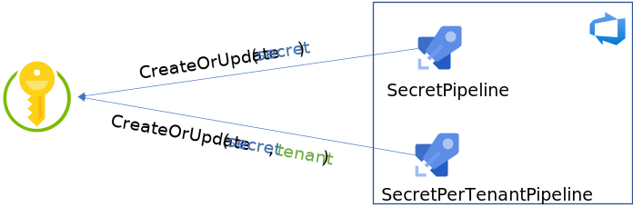
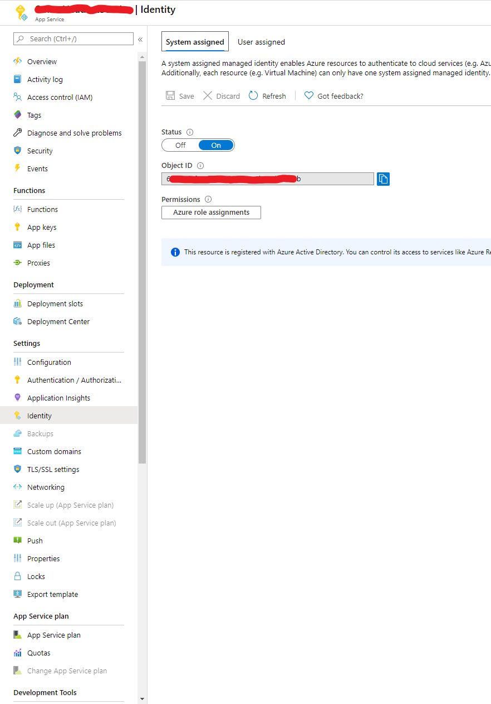
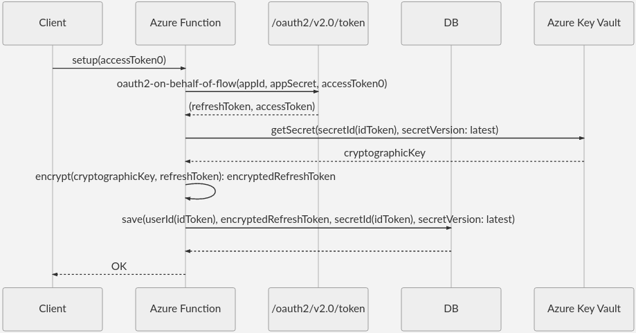
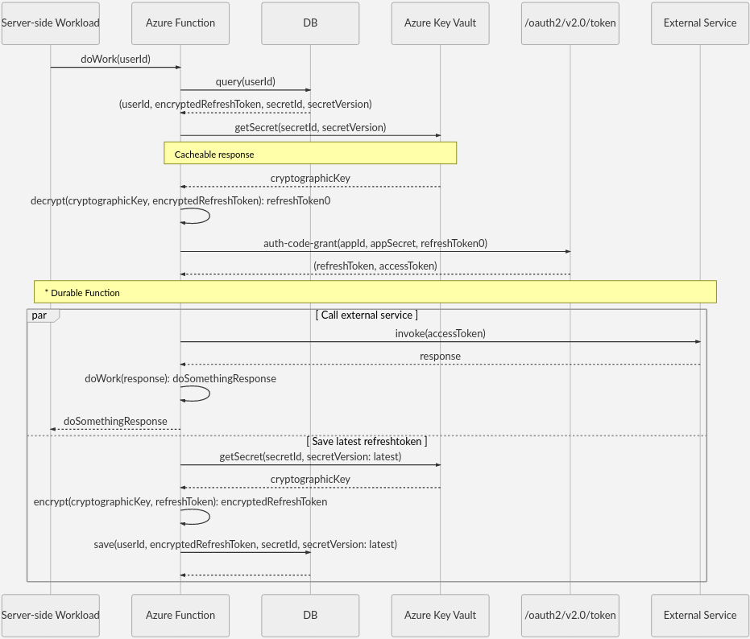
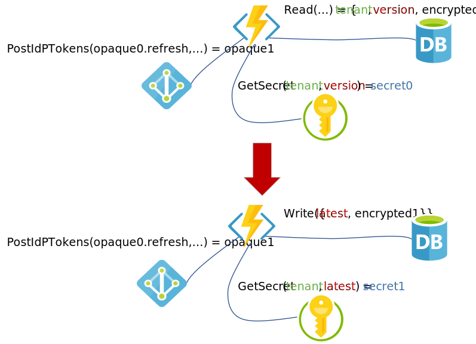
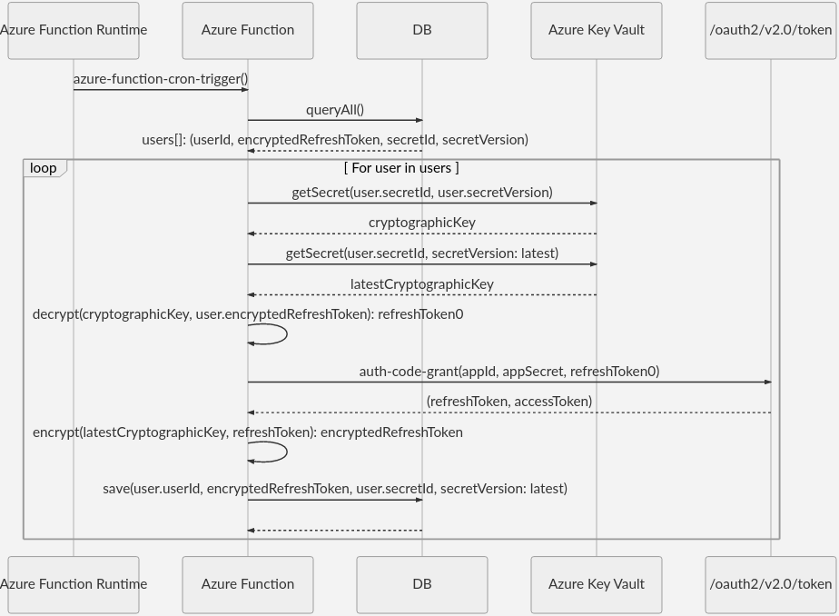

# Secure Storage of OAuth 2.0 On-Behalf-Of Refresh Tokens for Web Services

When developing web services, it may become necessary to obtain tokens using [OAuth 2.0 On-Behalf-Of flow](https://docs.microsoft.com/azure/active-directory/develop/v2-oauth2-on-behalf-of-flow). When an access and refresh token are to be obtained in this way are to be used indefinitely, it becomes critical to store the **refresh token** in a secure way.

Since these tokens can provide a malicious actor access to resources under the user's Azure Active Directory, a security breach of an application, which is configured to target _Accounts in any organizational directory (Any Azure AD directory - Multitenant)_, can become especially disastrous.

> [!IMPORTANT]
> The need to store refresh tokens should be considered carefully.
> It may seem like a good idea to store the access token also, however it poses a greater security risk, since in and of itself an access token can be used to access resources.
> The recommended approach is to store only refresh tokens and get the access token as needed.

This solution will use Azure Key Vault, Azure Functions,  and Azure DevOps. Also it will provide a way to remove access to an application for an organization by removing secrets.

- `Azure Key Vault` will hold a secret (encryption key) per AAD Tenant
- `Azure Function` will refresh the **refresh token** and save with **latest** secret (version)
- `Azure DevOps` can be used to create/update keys in a pipeline as part of a continuous delivery pipeline.  
- Database will store encrypted and necessary opaque data

## Azure Key Vault Operations



Taking the `Service Principal` for your `Azure Dev Ops Service Connection`, apply permissions, which will allow your Azure Pipelines to set secrets.

```azurecli
az keyvault set-policy --name $vault_name --spn $secret_manager_principal --secret-permissions set
```

Set the `vault_name` and `secret_manager_principal` variables to correct values for your environment.

Once you’ve setup your pipeline(s) to create or update keys, they can be scheduled to run periodically. This pipeline will enable an (eventual) key rotation. See [Configure schedules for pipelines](https://docs.microsoft.com/azure/devops/pipelines/process/scheduled-triggers?view=azure-devops&tabs=yaml).

When `refreshToken` is refreshed, a new key will be available for our new `refreshToken` to be encrypted with. You can keep the key rotation schedule in sync with the token refresh schedule (will be covered later).

> [!NOTE]
> Use of `Azure DevOps` is not strictly necessary. The point is to limit paths that secrets can be set or retrieved. If you're already using `Azure DevOps` for IaC and, or CI/CD, then this is a convenient point to add your key rotation strategy.

## Azure Function Operations


The most convenient way to allow a service access to Key Vault is to use a [Managed Identity](https://docs.microsoft.com/azure/azure-resource-manager/managed-applications/publish-managed-identity). Access can be granted the `Azure Portal`, `Resource Manager template` (for IaC scenario), or the ``Azure CLI` as above.



For example, using an [Resource Manager template](https://docs.microsoft.com/azure/azure-resource-manager/templates/) to set up an `Azure Function` with access to `Azure Key Vault`, you may use the following example. You may also create an `Azure Key Vault` through the portal or [Azure CLI](https://docs.microsoft.com/cli/azure/ext/keyvault-preview/keyvault?view=azure-cli-latest)

__Example:__ Set `Managed Identity` using `Resource Manager template` at creation time

```json
{
  "type": "Microsoft.KeyVault/vaults",
  "apiVersion": "***",
  "name": "***",
  "location": "***",
  "properties": {
    "sku": {
      "family": "A",
      "name": "standard"
    },
    "tenantId": "***",
    "enableSoftDelete": true,
    "enabledForDeployment": false,
    "enabledForTemplateDeployment": false,
    "enabledForDiskEncryption": false,
    "accessPolicies": [
      {
        "tenantId": "***",
        "objectId": "<Managed Identity Principal>",
        "permissions": {
          "secrets": [
            "get"
          ]
        }
      },
      {
        "tenantId": "***",
        "objectId": "<Service Connection Principal>",
        "permissions": {
          "secrets": [
            "set"
          ]
        }
      }
    ]
  }
}
```

__Example:__ Set `Managed Identity` using `Azure Cli`

```azurecli
az keyvault set-policy --name $vault_name --spn $secret_manager_principal --secret-permissions set
az keyvault set-policy --name $vault_name --spn $function_managed_identity --secret-permissions get
```


## Interactive Client to Service Call

Any database can be used since we will be storing the data in an encrypted format. Below shows the sequence to store a user's refresh tokens in the database.



With the cryptographic key stored as a secret, you can easily look up the __latest__ version of the key in `Azure Key Vault`

> [!NOTE]
> In the sequence there are 2 functions `userId()` and `secretId()`.
> We propose that these should be defined as some combination of `token.oid`, `token.tid`, and `token.sub`.
> But this is left to the implementation to define.
> See [Using the id_token](https://docs.microsoft.com/azure/active-directory/develop/id-tokens#using-the-id_token)

## Server-side Service Call

Using the key is equally straight forward. But this time the key will be queried based on the stored `version`



> [!IMPORTANT]
> It is not generally recommended that Azure Key Vault be used in the http pipeline. So whenever possible these responses should be cached. 
> The calls to Key Vault that are candidate for caching are labeled. 

The implicit key rotation here, is orthogonal to the unit of work we're running. So we can accomplish saving the `refreshToken` under a new key asynchronously. `Azure Functions` supports asynchronous processing using `Durable Functions`. See: [HTTP Features](https://docs.microsoft.com/azure/azure-functions/durable/durable-functions-http-features?tabs=csharp#http-api-url-discovery)

## Key Rotation and Token Refresh Flow



Key rotation, can be done at the same times that the `refreshToken` gets refreshed. Below is a sequence diagram to illustrate this process.



Here we are also using a `timedTrigger`, as in the `AzDo` example. While we refresh our `refreshToken`, it gets encrypted using the latest version of the encryption key.

> [!NOTE]
> `timerTrigger`s are have built in support within `Azure Functions` see [Timer trigger for Azure Functions](https://docs.microsoft.com/azure/azure-functions/functions-bindings-timer?tabs=csharp)

## User Management and Access Control

Removing a user or removing access per user is a straight-forward path. Simply remove the user's record or the refreshToken part of the user data.

To remove access for a group of users (ex. all users in a target tenant), we can simply delete the secret for this group based on `secretId()`. An `Azure Pipeline` can be a good place to implement this functionality.
