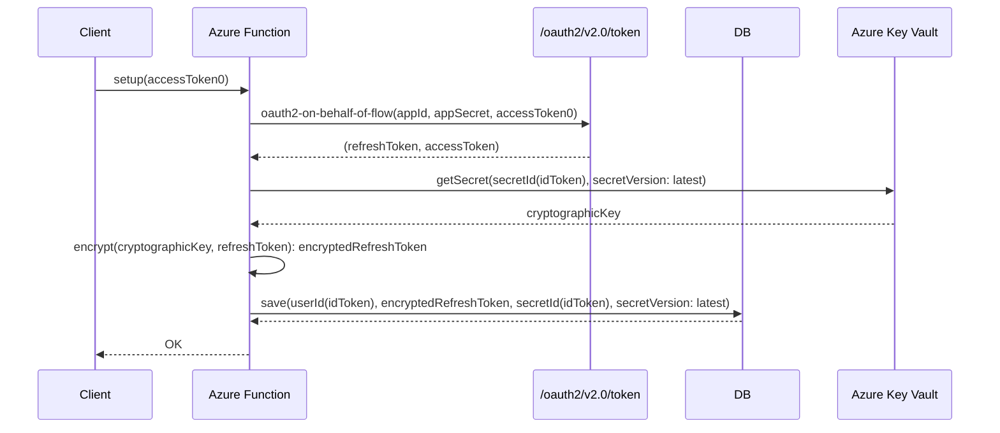
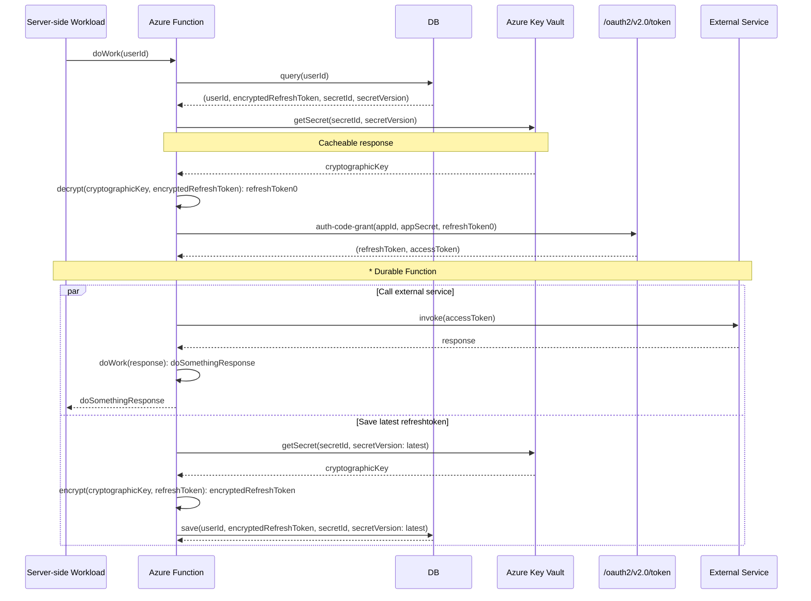
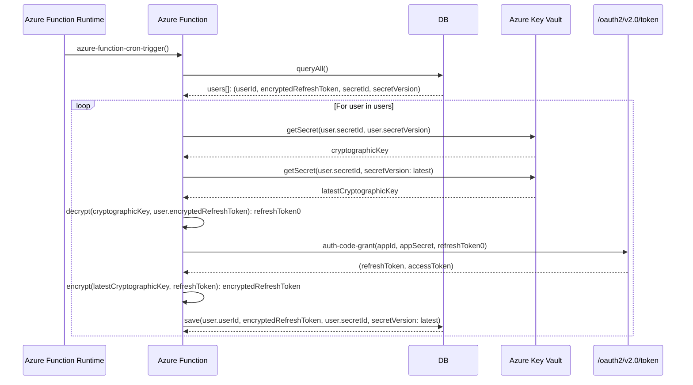

## Interactive Client to Service Call

__add-token-sequence.PNG__

``` mermaid
sequenceDiagram
participant c as Client
participant af as Azure Function
participant aada as /oauth2/v2.0/token
participant db as DB
participant kv as Azure Key Vault
c ->> af: setup(accessToken0)
af->>aada: oauth2-on-behalf-of-flow(appId, appSecret, accessToken0)
aada-->>af: (refreshToken, accessToken)
af ->> kv: getSecret(secretId(idToken), secretVersion: latest)
kv -->> af: cryptographicKey
af->>af: encrypt(cryptographicKey, refreshToken): encryptedRefreshToken
af->>db: save(userId(idToken), encryptedRefreshToken, secretId(idToken), secretVersion: latest)
db -->> af: 
af -->> c: OK
```

## Server-side Service Call

__use-stored-token.PNG__

``` mermaid
sequenceDiagram
participant c as Server-side Workload
participant af as Azure Function
participant db as DB
participant kv as Azure Key Vault
participant aada as /oauth2/v2.0/token
participant svc as External Service
c ->> af:  doWork(userId)
af->>db: query(userId)
db-->>af: (userId, encryptedRefreshToken, secretId, secretVersion)
af->> kv: getSecret(secretId, secretVersion)
Note over af,kv: Cacheable response
kv -->> af: cryptographicKey
af->>af: decrypt(cryptographicKey, encryptedRefreshToken): refreshToken0
af->>aada: auth-code-grant(appId, appSecret, refreshToken0)
aada-->>af: (refreshToken, accessToken)
Note over c,svc: * Durable Function
par Call external service
 af->>svc: invoke(accessToken)
 svc-->>af: response
 af->>af: doWork(response): doSomethingResponse
 af-->> c: doSomethingResponse
and Save latest refreshtoken
af ->> kv: getSecret(secretId, secretVersion: latest)
kv -->> af: cryptographicKey
af->>af: encrypt(cryptographicKey, refreshToken): encryptedRefreshToken
af->>db: save(userId, encryptedRefreshToken, secretId, secretVersion: latest)
db -->> af: 
end
```

## Key Rotation and Token Refresh Flow

__token-refresh-sequence.PNG__

```mermaid
sequenceDiagram
participant sched as Azure Function Runtime
participant af as Azure Function
participant db as DB
participant kv as Azure Key Vault
participant aada as /oauth2/v2.0/token
sched ->> af: azure-function-cron-trigger()
af ->> db: queryAll()
db -->> af: users[]: (userId, encryptedRefreshToken, secretId, secretVersion)
loop For user in  users 
af->> kv: getSecret(user.secretId, user.secretVersion)
kv -->> af: cryptographicKey
af->> kv: getSecret(user.secretId, secretVersion: latest)
kv -->> af: latestCryptographicKey
af->>af: decrypt(cryptographicKey, user.encryptedRefreshToken): refreshToken0
af ->> aada: auth-code-grant(appId, appSecret, refreshToken0)
aada-->>af: (refreshToken, accessToken)
af->>af: encrypt(latestCryptographicKey, refreshToken): encryptedRefreshToken
af ->> db: save(user.userId, encryptedRefreshToken, user.secretId, secretVersion: latest)
db -->> af: 
end
```