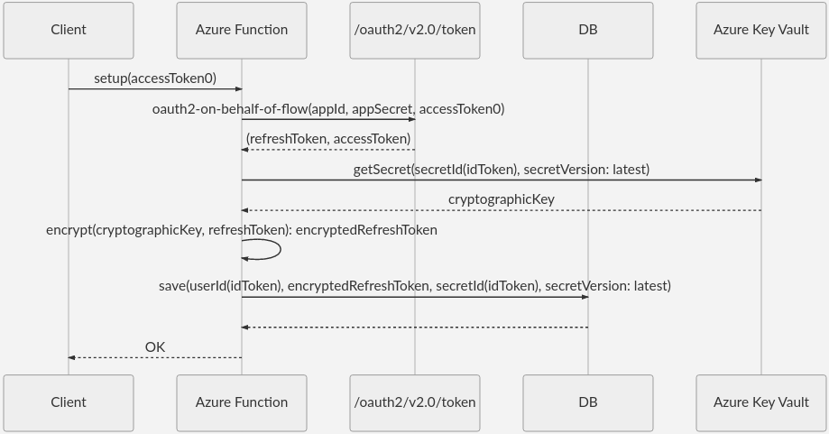
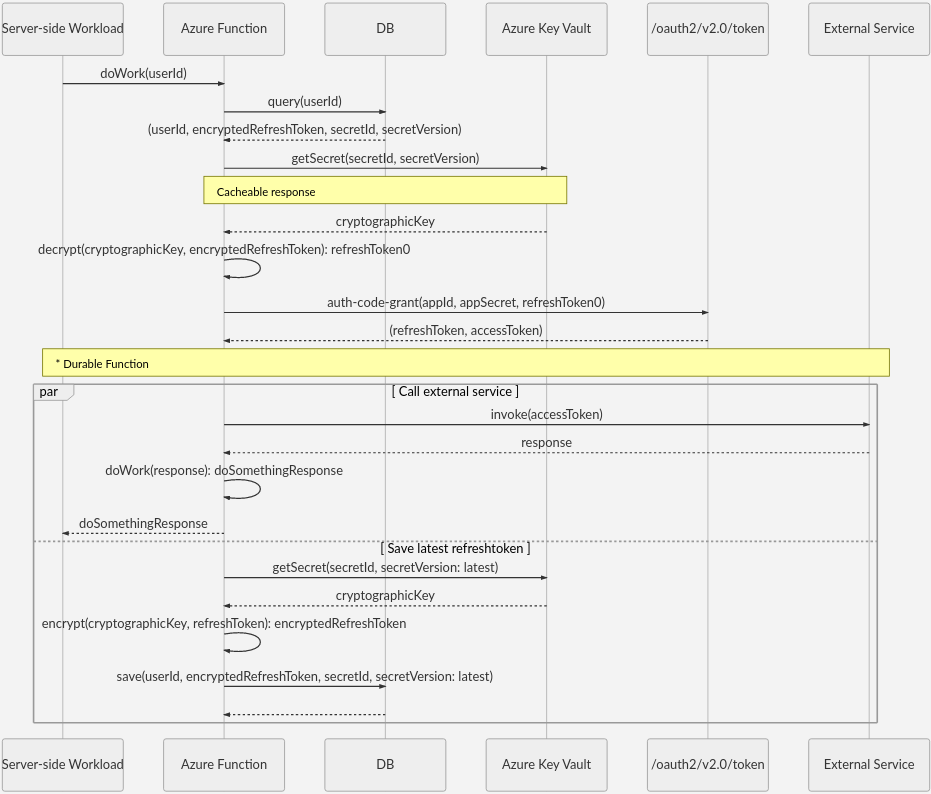
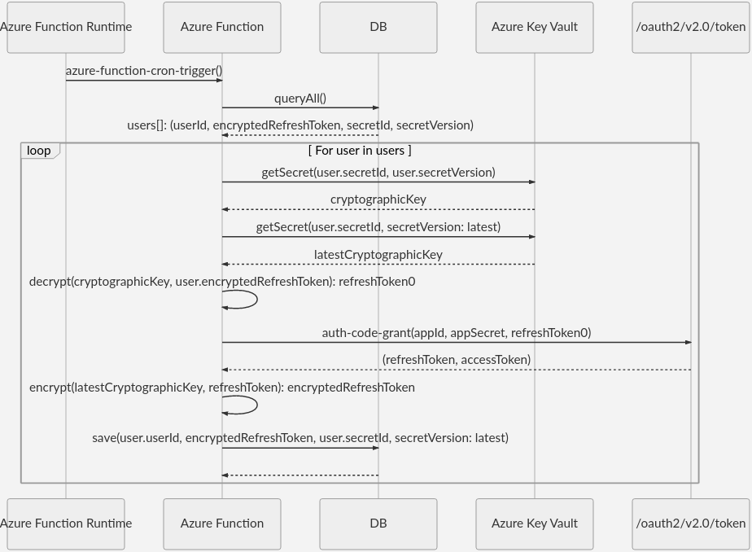

When developing web services, you may need to get tokens using the [OAuth 2.0 On-Behalf-Of (OBO) flow](/azure/active-directory/develop/v2-oauth2-on-behalf-of-flow). The OBO flow serves the use case where an application invokes a service or web API, which in turn needs to call another service or web API. OBO propagates the delegated user identity and permissions through the request chain. When an application needs to use access and refresh tokens indefinitely, typically in offline access scenarios, it's critical to store the refresh tokens securely.

> [!WARNING]
> Carefully consider the risk and responsibility involved in storing any security tokens, since these tokens can give a malicious actor access to resources protected by the organization's Azure Active Directory (Azure AD). A security breach of an application that targets **Accounts in any organizational directory (Any Azure AD directory - Multitenant)** can be especially disastrous.
>
> Storing access tokens poses a greater security risk, since an access token in and of itself can access resources. The recommended approach is not to store access tokens, but get the access tokens as needed. Securely store only the refresh tokens, with as much rigor as if they were access tokens.
>
> If necessary, you can [revoke refresh tokens](/azure/active-directory/develop/access-tokens#token-revocation) if they become compromised.

## Potential use cases

This solution uses Azure Key Vault, Azure Functions, and Azure DevOps to securely update and store OBO refresh tokens.

## Architecture

:::image type="content" source="./media/refresh-diagram.svg" alt-text="Diagram showing the key and token refresh processes." lightbox="./media/refresh-diagram.svg" border="false":::

*Download a [Visio file](https://arch-center.azureedge.net/secure-OBO-refresh-tokens.vsdx) of this architecture.*

### Dataflow

- Azure [Key Vault](https://azure.microsoft.com/services/key-vault) holds secret encryption keys for each [Azure AD](https://azure.microsoft.com/services/active-directory) tenant.
- An [Azure Functions](https://azure.microsoft.com/services/functions) timer-triggered function gets the latest secret key from Key Vault. Another Azure Functions function retrieves the refresh token from the Microsoft identity platform and saves it with the latest secret key version.
- A database stores the latest encrypted key and opaque data.
- An [Azure DevOps](https://azure.microsoft.com/services/devops) continuous delivery pipeline manages and syncs the secret rotation and token refresh processes.

[Azure Pipelines](https://azure.microsoft.com/services/devops/pipelines) is a convenient place to add your key rotation strategy, if you're already using Pipelines for infrastructure-as-code (IaC) or continuous integration and delivery (CI/CD). You don't have to use Azure Pipelines, as long as you limit the paths for setting and retrieving secrets.

Apply the following policy to allow the Service Principal for your Azure DevOps service connection to set secrets in Key Vault. Replace the `<Key Vault Name>` and `<Service Connection Principal>` variables with the correct values for your environment.

```azurecli
az keyvault set-policy --name $<Key Vault Name> --spn $<Service Connection Principal> --secret-permissions set
```

After you set up Azure Pipelines to create and update keys, you can schedule the pipeline to run periodically. The pipeline updates the Key Vault secret to sync with key rotation, and saves the encrypted token with the new secret version. For more information, see [Configure schedules for pipelines](/azure/devops/pipelines/process/scheduled-triggers?tabs=yaml).

## Managed identity

The preferred way for an Azure service like Azure Functions to access Key Vault is to use the service's [managed identity](/azure/azure-resource-manager/managed-applications/publish-managed-identity). You can grant access through the Azure portal, Azure CLI, or through an Azure Resource Manager (ARM) template for IaC scenarios.

### Azure portal

In the Azure portal, add a Key Vault access policy to allow the Azure Functions managed identity Object ID to **Get** and **Set** secrets. For more information, see [Add a system-assigned identity](/azure/app-service/overview-managed-identity?tabs=dotnet#add-a-system-assigned-identity) and [Use Key Vault references for App Service and Azure Functions](/azure/app-service/app-service-key-vault-references).


### Azure CLI

You can also set Azure Key Vault policy by using the [Azure CLI](/cli/azure/keyvault):

```azurecli
az keyvault set-policy --name $<Key Vault Name> --spn $<Service Connection Principal> --secret-permissions set
az keyvault set-policy --name $<Key Vault Name> --spn $<Managed Identity Principal> --secret-permissions get
```

### ARM template

The following [ARM template](/azure/azure-resource-manager/templates) gives Azure Functions access to Azure Key Vault. Replace the `***` variables with the correct values for your environment.

```json
{
  "type": "Microsoft.KeyVault/vaults",
  "apiVersion": "2019-09-01",
  "name": "***",
  "location": "***",
  "properties": {
    "sku": {
      "family": "A",
      "name": "standard"
    },
    "tenantId": "***",
    "enableSoftDelete": true,
    "enabledForDeployment": false,
    "enabledForTemplateDeployment": false,
    "enabledForDiskEncryption": false,
    "accessPolicies": [
      {
        "tenantId": "***",
        "objectId": "<Managed Identity Principal>",
        "permissions": {
          "secrets": [
            "get"
          ]
        }
      },
      {
        "tenantId": "***",
        "objectId": "<Service Connection Principal>",
        "permissions": {
          "secrets": [
            "set"
          ]
        }
      }
    ]
  }
}
```

## Token storage

You can use any database to store the tokens in encrypted form. The following diagram shows the sequence to store refresh tokens in a database:



The sequence has two functions, `userId()` and `secretId()`. You can define these functions as some combination of `token.oid`, `token.tid`, and `token.sub`. For more information, see [Using the id_token](/azure/active-directory/develop/id-tokens#using-the-id_token).

With the cryptographic key stored as a secret, you can look up the latest version of the key in Azure Key Vault.

## Token usage

Using the key is straightforward. The following sequence queries the key based on the latest key version.



The token refresh is orthogonal to the `DoWork` function, so Azure Functions can perform `DoWork` and token refresh asynchronously by using [Durable Functions](/azure/azure-functions/durable). For more information about HTTP-triggered functions with Durable Functions, see [HTTP features](/azure/azure-functions/durable/durable-functions-http-features?tabs=csharp).

It's not recommended to use Azure Key Vault in the HTTP request pipeline, so cache responses whenever reasonable. In the example, Key Vault's response to the `getSecret(secretId, secretVersion)` call is cacheable.

## Key rotation and token refresh

You can rotate the secret key at the same time that you refresh the refresh token, so the latest token gets encrypted with the latest version of the encryption secret. This process uses the built-in Azure Functions support for timer triggers. For more information, see [Timer trigger for Azure Functions](/azure/azure-functions/functions-bindings-timer?tabs=csharp).

The following sequence diagram illustrates the process of syncing the token refresh with the key rotation:



## User and access control

Microsoft Identity Platform offers the ability to revoke refresh tokens in case of compromise. See [Token revocation](/azure/active-directory/develop/access-tokens#token-revocation) and [Revoke-AzureADUserAllRefreshToken](/powershell/module/azuread/revoke-azureaduserallrefreshtoken?view=azureadps-2.0).

To remove a user from Azure AD, just remove the user's record. To remove application access per user, remove the `refreshToken` part of the user data.

To remove access for a group of users, such as all users in a target tenant, you can use Azure Pipelines to delete the group's secret based on `secretId()`.

## Contributors

*This article is maintained by Microsoft. It was originally written by the following contributors.*

Principal author:

- [Jason Mostella](https://www.linkedin.com/in/jasonmostella) | Senior Software Engineer

## Next steps

- [Microsoft identity platform and OAuth 2.0 On-Behalf-Of flow](/azure/active-directory/develop/v2-oauth2-on-behalf-of-flow)
- [How to use managed identities for App Service and Azure Functions](/azure/app-service/overview-managed-identity)
- [Use Key Vault references for App Service and Azure Functions](/azure/app-service/app-service-key-vault-references)
- [Securing Azure Functions](/azure/azure-functions/security-concepts)  
