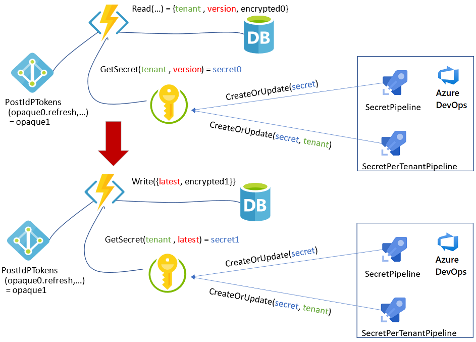

# Secure OAuth 2.0 OBO refresh tokens

When developing web services, you may need to get tokens using the [OAuth 2.0 On-Behalf-Of (OBO) flow](https://docs.microsoft.com/azure/active-directory/develop/v2-oauth2-on-behalf-of-flow). The OBO flow serves the use case where an application invokes a service or web API, which in turn needs to call another service or web API. OBO propagates the delegated user identity and permissions through the request chain.

>[!WARNING]
>Carefully consider the need to store OBO tokens, since these tokens can give a malicious actor access to resources in the organization's Azure Active Directory (Azure AD). A security breach of an application that targets **Accounts in any organizational directory (Any Azure AD directory - Multitenant)** can be especially disastrous.
>
>When an application needs to use access and refresh tokens indefinitely, it's critical to store the refresh tokens securely. Storing access tokens poses an even greater security risk, since an access token in and of itself can access resources. The recommended approach is to store only refresh tokens, and get access tokens as needed.
>
>In case of compromise, you can [revoke refresh tokens](https://docs.microsoft.com/azure/active-directory/develop/access-tokens#token-revocation).

This solution uses Azure Key Vault, Azure Functions, and Azure DevOps to securely update and store OBO refresh tokens.

## Architecture



- Azure [Key Vault](https://azure.microsoft.com/services/key-vault/) holds a secret encryption key for each [Azure AD](https://azure.microsoft.com/services/active-directory/) tenant.
- An [Azure Functions](https://azure.microsoft.com/services/functions/) function refreshes the refresh token and saves it with the latest secret key version.
- A database stores the encrypted key and and opaque data.
- An [Azure DevOps](https://azure.microsoft.com/services/devops/) continuous delivery pipeline creates and updates the secret keys.

[Azure Pipelines](https://azure.microsoft.com/services/devops/pipelines/) is a convenient place to add your key rotation strategy, if you're already using Pipelines for infrastructure-as-code (IaC) or continuous integration and delivery (CI/CD). But you don't have to use Azure DevOps, as long as you limit the paths for setting or retrieving secrets.

You can apply the following permissions to the Service Principal for your Azure DevOps service connection, which allow Azure Pipelines to set secrets. Set the `<Key Vault Name>` and `<Service Connection Principal>` variables to the correct values for your environment.

```azurecli
az keyvault set-policy --name $<Key Vault Name> --spn $<Service Connection Principal> --secret-permissions set
```

After you set up your pipeline to create or update keys, you can schedule the pipeline to run periodically and [sync the key rotation with the token refresh](#key-rotation-and-token-refresh). Whenever the refresh token refreshes, a new key encrypts the new refresh token. For more information, see [Configure schedules for pipelines](https://docs.microsoft.com/azure/devops/pipelines/process/scheduled-triggers?view=azure-devops&tabs=yaml).

## Managed identity

The most convenient way for an Azure service like Azure Functions to access Key Vault is to use the service's [managed identity](https://docs.microsoft.com/azure/azure-resource-manager/managed-applications/publish-managed-identity). You can grant access through the Azure portal, Azure CLI, or through an Azure Resource Manager (ARM) template for IaC scenarios.

### Azure portal

You can use the Azure portal to set up the managed identity for Azure Functions to access Key Vault. From the Functions app's **Identity** page, copy the Managed Identity Principal's **Object ID**. Then create a Key Vault access policy to enable `get` secret permissions for the Azure Functions managed identity. For more information, see [Add a system-assigned identity](https://docs.microsoft.com/azure/app-service/overview-managed-identity?tabs=dotnet#add-a-system-assigned-identity) and [Use Key Vault references for App Service and Azure Functions](https://docs.microsoft.com/azure/app-service/app-service-key-vault-references).


### Azure CLI

You can also set Azure Key Vault policy by using the [Azure CLI](https://docs.microsoft.com/cli/azure/ext/keyvault-preview/keyvault?view=azure-cli-latest):

```azurecli
az keyvault set-policy --name $<Key Vault Name> --spn $<Service Connection Principal> --secret-permissions set
az keyvault set-policy --name $<Key Vault Name> --spn $<Managed Identity Principal> --secret-permissions get
```

### ARM template

The following [ARM template](https://docs.microsoft.com/azure/azure-resource-manager/templates/) gives Azure Functions access to Azure Key Vault. Replace the `***` variables with the correct values for your environment.

```json
{
  "type": "Microsoft.KeyVault/vaults",
  "apiVersion": "2019-09-01",
  "name": "***",
  "location": "***",
  "properties": {
    "sku": {
      "family": "A",
      "name": "standard"
    },
    "tenantId": "***",
    "enableSoftDelete": true,
    "enabledForDeployment": false,
    "enabledForTemplateDeployment": false,
    "enabledForDiskEncryption": false,
    "accessPolicies": [
      {
        "tenantId": "***",
        "objectId": "<Managed Identity Principal>",
        "permissions": {
          "secrets": [
            "get"
          ]
        }
      },
      {
        "tenantId": "***",
        "objectId": "<Service Connection Principal>",
        "permissions": {
          "secrets": [
            "set"
          ]
        }
      }
    ]
  }
}
```

## Token storage

You can use any database to store the tokens in encrypted form. The following diagram shows the sequence to store refresh tokens in a database:


The sequence has two functions, `userId()` and `secretId()`. You can define these functions as some combination of `token.oid`, `token.tid`, and `token.sub`. For more information, see [Using the id_token](https://docs.microsoft.com/azure/active-directory/develop/id-tokens#using-the-id_token).

With the cryptographic key stored as a secret, you can look up the latest version of the key in Azure Key Vault.

## Token usage

Using the key is straightforward. The following sequence queries the key based on the stored key version.


The token refresh is orthogonal to the `DoWork` function, so Azure Functions can perform `DoWork` and token refresh asynchronously with [Durable Functions](https://docs.microsoft.com/azure/azure-functions/durable/). For more information about HTTP-triggered functions with Durable Functions, see [HTTP features](https://docs.microsoft.com/azure/azure-functions/durable/durable-functions-http-features?tabs=csharp).

It's not recommended to use Azure Key Vault in the HTTP request pipeline, so cache the responses whenever reasonable. In this example, the response to the Azure Functions to Key Vault `getSecret(secretId, secretVersion)` call is cacheable.

## Key rotation and token refresh

You can rotate the secret key at the same time that you refresh the refresh token, so the latest token gets encrypted using the latest version of the encryption key. This process uses the built-in Azure Functions support for timer triggers. For more information, see [Timer trigger for Azure Functions](https://docs.microsoft.com/azure/azure-functions/functions-bindings-timer?tabs=csharp).

The following sequence diagram illustrates the process of syncing the token refresh with the key rotation:


## User and access control

Microsoft Identity Platform offers the ability to revoke refresh tokens in case of compromise. See [Token revocation](https://docs.microsoft.com/azure/active-directory/develop/access-tokens#token-revocation) and [Revoke-AzureADUserAllRefreshToken](https://docs.microsoft.com/powershell/module/azuread/revoke-azureaduserallrefreshtoken?view=azureadps-2.0).

To remove a user from Azure AD, just remove the user's record. To remove application access per user, remove the `refreshToken` part of the user data.

To remove access for a group of users, such as all users in a target tenant, you can use Azure Pipelines to delete the group's secret based on `secretId()`.

## Next steps

- [Microsoft identity platform and OAuth 2.0 On-Behalf-Of flow](https://docs.microsoft.com/azure/active-directory/develop/v2-oauth2-on-behalf-of-flow)
- [How to use managed identities for App Service and Azure Functions](https://docs.microsoft.com/azure/app-service/overview-managed-identity)
- [Use Key Vault references for App Service and Azure Functions](https://docs.microsoft.com/azure/app-service/app-service-key-vault-references)
- [Securing Azure Functions](https://docs.microsoft.com/azure/azure-functions/security-concepts)
