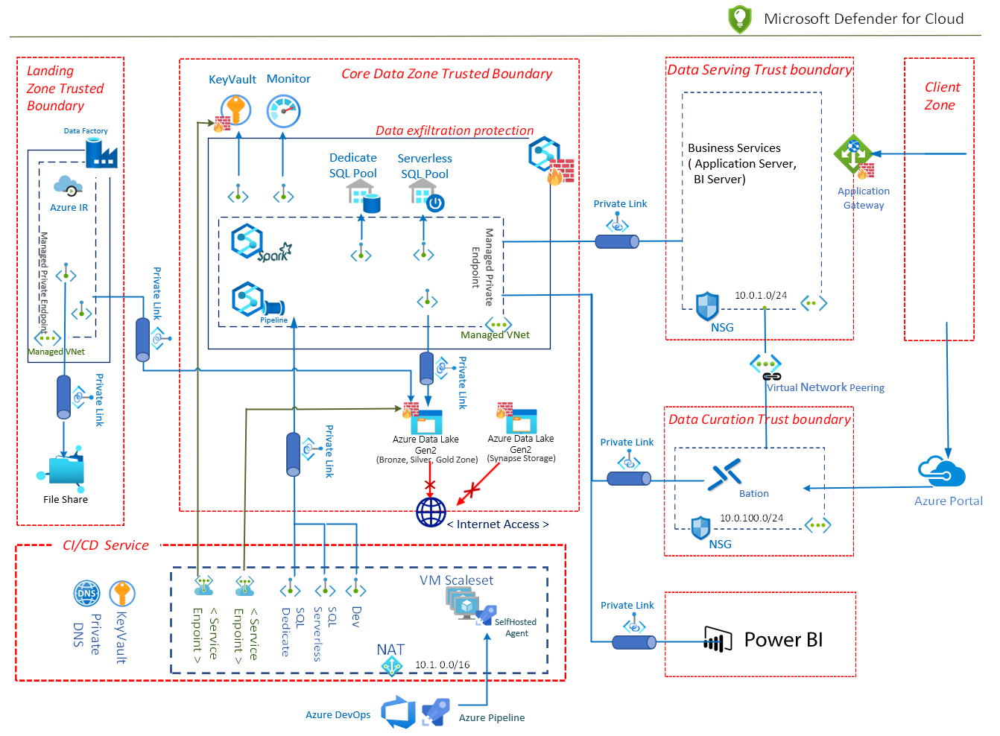
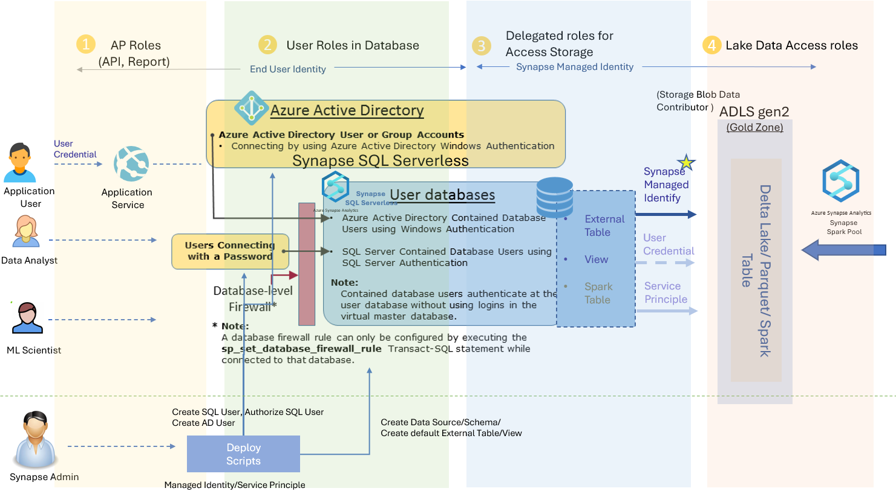
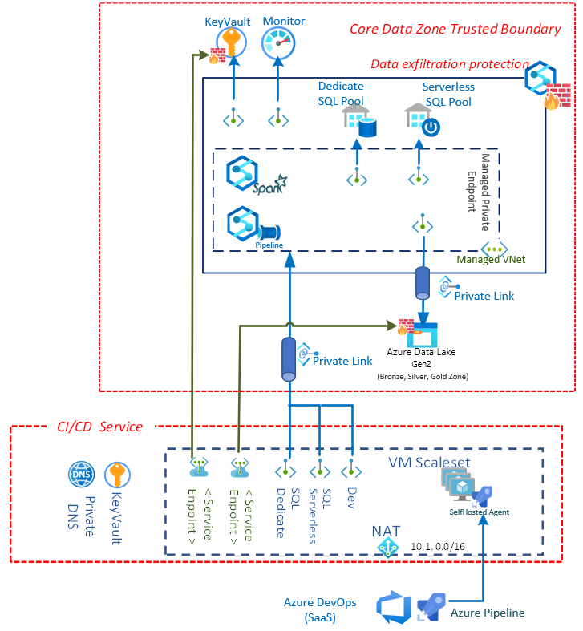

Synapse is a versatile data platform that supports enterprise data warehousing,  real-time data analytics, data pipeline,  time-series data processing, machine learning, and data governance. It integrates several different technologies (e.g., SQL DW, Serverless SQL, Spark, Data Pipeline, Data Explorer, Synapse ML, Purview...) to support these various capabilities. However, there are many technical choices to make when enterprises want to securely configure the infrastructure for these different technologies.  

 

This article describes the design process, principle, and technology choices when building a secure data lakehouse solution on Azure Synapse. We will focus on the security consideration and key technical decision. Key Azure services used in the solution are [Synapse serverless SQL](https://docs.microsoft.com/en-us/azure/synapse-analytics/sql/on-demand-workspace-overview),  [Synapse Spark](https://docs.microsoft.com/en-us/azure/synapse-analytics/spark/apache-spark-overview), [Synpase Pipelines](https://docs.microsoft.com/en-us/azure/data-factory/concepts-pipelines-activities?context=%2Fazure%2Fsynapse-analytics%2Fcontext%2Fcontext&tabs=synapse-analytics), [Azure Data Lake Gen2](https://docs.microsoft.com/en-us/azure/storage/blobs/data-lake-storage-introduction) and [Azure DevOps](https://azure.microsoft.com/en-us/services/devops/). The goal is to provide guidance on building a secure and cost-efficiencies data lakehouse platform for enterprises and making these technologies work together seamlessly under security protections.

## Potential Use Cases

[Data Lakehouse](https://databricks.com/glossary/data-lakehouse)  is a modern data management architecture that combines  data lakes'  cost-efficiency, scale, and flexibility features with data warehouse's data and transaction management capabilities. It can handle a vast amount of data and well supports business intelligence and machine learning (ML) scenarios. It can also process data from diverse data structures and data sources. Some common use cases for the solution here are:
- IoT telemetry analysis
- Smart Factory automation
- Consumer activities and behavior tracking
- Security incident and event management
- Application log and behavior monitoring
- Semi-structured data processing and Business Analysis

## Architecture

The below diagram shows the detailed architecture design with the technical solutions chosen in the security protection plan. We designed and controlled the service's interaction behaviors based on business requirements to mitigate security threats in the data lakehouse solution. Solutions with a different design focus and protection plans will have a slightly different implementation. You can find more information in the references documents. 

### Dataflow

In this data lakehouse solution, the dataflow is showed in the following diagram.:

1. Data source uploads data to Azure Blob storage or Azure File Share in data landing zone. Data can be uploaded by a batch uploader program or system. For streaming data, they can be streamed to Event Hub and use its "capture streaming data" feature to store data in Blob storage. There could have multiple data sources. For example, several different factories could upload their operation data to the blob storage. For more information on how to securely access Blob storage and Azure Files, you can check  [Identity and access management](https://docs.microsoft.com/en-us/azure/storage/blobs/security-recommendations#identity-and-access-management) of Blob storage or Azure Files's [Identity](https://docs.microsoft.com/en-us/azure/storage/files/storage-files-planning#identity) section. 
2. Data Factory is triggered by the new arrived data file. It processes the data and store the data in Azure Data Lake located in core data zone. The Data Factory can only upload data to the core data zone in Azure Data Lake for better data exfiltration protection.
3. Azure Data Lake stores the raw data from different sources. It is protected by the Firewall rules and VNets. It will block all public internet connection.   
4. Synapse pipelines are triggered by the data in Data Lake or run data processing job by time trigger. It will activate Synapse Spark and run Spark Job or Notebooks. It also orchestrates the data process flow in the data lakehouse. So Synapse pipelines will convert data from [Bronze zone to Sliver Zone and then to Gold Zone](https://docs.microsoft.com/en-us/learn/modules/describe-azure-databricks-delta-lake-architecture/2-describe-bronze-silver-gold-architecture). 
5. Spark Job or Notebooks run the data processing job. Data curation or some ML training job can also run in the Synapse Spark services. Structure Data in the Gold zone are stored in [Delta Lake](https://docs.delta.io/latest/delta-intro.html) format.  
6. Synapse serverless SQL server [creates external tables](https://docs.microsoft.com/en-us/azure/synapse-analytics/sql/develop-tables-external-tables?tabs=hadoop) which use the data stored in Delta Lake. It provides a powerful and efficient SQL query engine and can support traditional SQL user accounts or AAD user accounts. 
7. Power BI can connect to Synapse Serverless SQL to visualize the data. It creates reports or dashboards using the data in the Data Lakehouse.  
8. Data Analysts or scientists can log in to Synapse Studio to further enhance the data, analyze business insight, or train the ML model.
9. Business applications can connect to Synapse Serverless SQL and use the data to support other business operation requirements. 

### Components

Following are the key components in this data lakehouse solution:

  - [Synapse serverless SQL](https://docs.microsoft.com/en-us/azure/synapse-analytics/sql/on-demand-workspace-overview) 
  - [Synapse Spark](https://docs.microsoft.com/en-us/azure/synapse-analytics/spark/apache-spark-overview) 
  - [Synapse Pipeline](https://docs.microsoft.com/en-us/azure/data-factory/concepts-pipelines-activities?context=%2Fazure%2Fsynapse-analytics%2Fcontext%2Fcontext&tabs=synapse-analytics)
  - [Azure DataLake Gen2](https://docs.microsoft.com/en-us/azure/storage/blobs/data-lake-storage-introduction)
  - [Azure DevOps](https://azure.microsoft.com/en-us/services/devops/)
  - [Power BI](https://powerbi.microsoft.com/en-us/what-is-power-bi/) 
  - [Azure Data Factory](https://docs.microsoft.com/en-us/azure/data-factory/introduction)
  - [Azure Bastion](https://docs.microsoft.com/en-us/azure/bastion/bastion-overview)
  - [Azure Monitor](https://azure.microsoft.com/services/monitor): 
  - [Microsoft Defender for Cloud](https://docs.microsoft.com/en-us/azure/defender-for-cloud/defender-for-cloud-introduction) 

### Alternatives

- If you need near-real-time data processing, instead of storing individual files on the Data Landing zone, you can use Spark structure streaming to receive the data stream from Event Hub and process the data in real-time.
- If the data has a complex relationship and needs to run complex SQL queries, you should consider storing the data in Dedicate SQL pool instead of a Serverless SQL pool.
- If the data contains many hierarchical data structures (e.g., large, long JSON structure), you might want to store the data in Synapse Data Explorer.
   
## High-level design

This solution focuses on the security design and implementation practices in the architecture.  Synapse serverless SQL , Synapse Spark and Synpase Pipeline, Azure DataLake and Power BI  are the key services used to implement  the [data lakehouse pattern](https://blog.starburst.io/part-2-of-current-data-patterns-blog-series-data-lakehouse).

Following is the high-level solution design architecture.

### Choose Security Focus 

We started the security design by using the [Threat Modeling tool](https://www.microsoft.com/en-us/securityengineering/sdl/threatmodeling). The tool helps us communicate with system stakeholders about the potential risks and define the trust boundary in the system. Based on the thread modeling result,  <u>Identity and Access control</u>, <u>Network protection</u>, and  <u>DevOps security</u> are prioritized  in the solution.  We designed the security features and planned infrastructure changes to protect the system and mitigate key security risks identified with these top security priorities. . You can also check  __Access Control__, __Asset Protection__, and __Innovation Security__ sections in the  [Cloud Adoption Framework (CAF)'s security disciplines](https://docs.microsoft.com/en-us/azure/cloud-adoption-framework/secure/#security-disciplines). They provide more detail explanation about what should be checked and considered. 

### Network and Asset protection plan

One of the key security assurances principles in the Cloud Adoption Framework is the [Zero Trust principle](https://docs.microsoft.com/en-us/azure/cloud-adoption-framework/secure/#guiding-principles). When designing security for any component or system, we should reduce the risk of attackers expanding access by assuming other resources in the organization are compromised. 

Based on the threat modeling discussion result, the solution adopts the [micro-segmentation deployment](https://docs.microsoft.com/en-us/security/zero-trust/deploy/networks#i-network-segmentation-many-ingressegress-cloud-micro-perimeters-with-some-micro-segmentation) recommendation in zero-trust and defines several [security boundaries](https://insights.sei.cmu.edu/blog/cybersecurity-architecture-part-2-system-boundary-and-boundary-protection/). [Azure VNet](https://docs.microsoft.com/en-us/azure/virtual-network/virtual-networks-overview) and [Synapse data exfiltration protection](https://docs.microsoft.com/en-us/azure/synapse-analytics/security/workspace-data-exfiltration-protection#:~:text=Azure%20Synapse%20Analytics%20workspaces%20support%20enabling%20data%20exfiltration,data%20to%20locations%20outside%20of%20your%20organization%E2%80%99s%20scope.) are the key technologies used to implement the security boundary and protect the system's data assets and critical components.

Considering Synapse is a composition of [several different technologies](https://docs.microsoft.com/en-us/azure/synapse-analytics/overview-what-is), we need to :
- <u>Identify essential  components of Synapse and related services used in the project</u>. 

  Synapse is a very versatile data platform. It can handle many different data processing needs. First, we need to decide which components in Synapse are used in the project to plan how to protect them. Also, we need to determine what other services are communicating with these Synapse's components. 
  In the data data lakehouse architecture, _Synapse Serverless SQL, Synapse Spark, Synpase Pipeline,Azure Data Lakes and Azure DevOps_ are the key components. 

- <u>Define the __legal communication behaviors__ between the components</u>.

    We need to define the "legal" communication behaviors between the components. For example, do we want the Synapse Spark engine to communicate with the dedicated SQL instance directly, or do we want the spark engine to communicate with the database through a proxy such as Synapse Data Integration pipeline or Data Lake?
    
    Based on the Zero trust principle, we should block the communication if there is no business need for the interaction. For example, we should block the communication if a Synapse Spark engine directly communicates with Data Lake storage in an unknown tenant.  

- <u>Choose the proper security solution that can enforce the defined communication behaviors</u>.

    In Azure, several security technologies are capable of enforcing the defined service communication behaviors. For example, in Azure Data Lake storage, you can use a white-list IP address to control its access, but you can also choose allowed VNet, Azure services, or resource instances. Each protection method provides different security protection and needs to be selected based on the business needs and environmental limitations. The configuration  used in this solution is described in the next section.   
    
 - <u>Add threat detection and advanced defense for critical resources</u>.   

    For critical resources, it is better to add threat detection and advanced defense. These services help identify threats and triggers alerts. So the system can notify users about the security breach.

For better Network and Asset protection, the following are some additional security design considerations.

 - Deploy Perimeter Networks for Security Zones for Data Pipeline. 
 
    Because in a data pipeline, data could be loaded from external data sources. When a data pipeline workload requires access to external data and data landing zone, it is better to implement a perimeter network and separate it with a regular ETL pipeline.

- Enable [Azure Defender for all storage accounts](https://docs.microsoft.com/en-us/azure/storage/common/azure-defender-storage-configure). 

    Azure Defender provides an additional layer of security intelligence that detects unusual and potentially harmful attempts to access or exploit storage accounts. Security alerts are triggered in Azure Security Center. 
- [Lock storage account](https://docs.microsoft.com/en-us/azure/storage/common/lock-account-resource) to prevent malicious deletion or configuration changes

### Architecture with Network and Asset protection

 The following table describes the defined communication behaviors and security technologies chose based on network and asset protection plan in previous session. 

From (Client) | To (Service) | Behavior| Configuration | Notes
--- | --- | --- | --- | -- 
Internet| Azure DataLake |  Deny All | Firewall Rule - Default Deny | Default: 'Deny' | Firewall Rule - Default Deny
Synapse Pipeline/Spark| Azure DataLake |  Allow (Instance) | VNet - Managed Private EndPoint (Azure DataLake) | 
Synapse SQL | Azure DataLake | Allow (Instance) | Firewall Rule - Resource instances (Synapse SQL) | Synapse SQL needs to access Azure DataLake using Managed Identity | N/A
Azure Pipeline Agent | Azure DataLake | Allow (Instance) | * Firewall Rule - Selected Virtual networks   * Service Endpoint - Storage  |  For Integration Testing   bypass: 'AzureServices' (firewall rule)
Internet | Synapse Workspace | Deny All  | Firewall Rule | | Firewall Rule 
Azure Pipeline Agent | Synapse Workspace  | Allow (Instance) |  VNet - Private EndPoint | Requires 3 Private EndPoints (Dev, Serverless SQL, and Dedicate SQL) 
Synapse Managed VNet | Internet/ Unauthorized Azure Tenant| Deny All | VNet - Synapse Data Exfiltration Protection| 
Synaspe Pipeline/Spark| KeyVault |  Allow (Instance) | VNet - Managed Private EndPoint (KeyVault) |Default: 'Deny'  
Azure Pipeline Agent| KeyVault | Allow (Instance)  |* Firewall Rule - Selected Virtual networks   * Service Endpoint - KeyVault  |  bypass: 'AzureServices' (firewall rule)
Azure Functions| Synapse Serverless SQL| Allow (Instance) | VNet - Private EndPoint (Synapse Serverless SQL) 
Synaspe Pipeline/Spark|Azure Monitor |Allow (Instance) |VNet - Private EndPoint (Azure Monitor) 

For example, in the plan we want to :
- Create a Synapse workspace with a managed virtual network. 
- Securing data egress from Synapse workspaces through [Synapse workspaces Data exfiltration protection.](https://docs.microsoft.com/en-us/azure/synapse-analytics/security/workspace-data-exfiltration-protection)
- Manage the list of approved Azure AD tenants for the Synapse workspace.
- Configure network rules to grant only traffic from selected virtual networks access to storage account and disable public network access.
- Use [Managed Private Endpoints](https://docs.microsoft.com/en-us/azure/synapse-analytics/security/synapse-workspace-managed-private-endpoints) to connect Synapse managed VNet with Data Lake. 
- Use [Resource Instance](https://docs.microsoft.com/en-us/azure/storage/common/storage-network-security?tabs=azure-portal#grant-access-from-azure-resource-instances-preview) to securely connect Synapse SQL with Data Lake 

## Considerations

### Security

#### Identity and Access control

There are several components in the system. Each part requires a different Identity and Access Management (IAM) configuration. These IAMs will need to collaborate tightly to provide a streamlined user experience. Therefore, we use the following design guidance when we implement authentication and authorization control.

- <u>Choose Identity solution for different Access Control Layers</u>

    There are four different identity solutions in the system.
    - SQL Account (SQL Server)
    - Service Principal (Azure AD)
    - Managed Identity (Azure AD)
    - User AAD Account (Azure AD)

    Also, there are four different access control layers in the system.
    - Application access layer: choose identity solution for AP Roles
    - Synapse DB/Table access layer: choose identity solution for roles in Databases
    - Synapse access external resource layer: choose identity solution to access External Resources 
    - Azure Data Lake access layer: choose identity solution to control file access in the storage

    
    A crucial part of identity and access control is choosing the right identity solution for each access control layer. The [Well Architecture Security Design Principles](https://docs.microsoft.com/en-us/azure/architecture/framework/security/security-principles) suggests using native controls and driving simplicity. Therefore, this solution uses end user's AAD account in the Application, Synapse DB access layer. It leverages the native first-party IAM solutions and provides fine-grained access control. The Synapse access external resource layer and Data Lake access layer use Managed Identity of Synapse to simply the authorization process. 

- <u>Consider Least-privileged access</u>

    In Zero trust guiding principles, it suggests providing just-in-time and just-enough-access to critical resources. Azure [AD Privileged Identity Management (PIM)](https://docs.microsoft.com/en-us/azure/active-directory/privileged-identity-management/pim-configure) and enhance security deployment check in the future. 

- <u>Protect Linked Service</u>

    Linked services define the connection information needed for the service to connect to external resources. It is important to secure the linked Service configuration and access in Synapse.

    - Create [Azure Data Lake linked service with Private Links](https://docs.microsoft.com/en-us/azure/synapse-analytics/data-integration/linked-service#:~:text=In%20Azure%20Synapse%20Analytics%2C%20a%20linked%20service%20is,Manage%20tab.%20Under%20External%20connections%2C%20select%20Linked%20services.)
    - Use [Managed Identity](https://docs.microsoft.com/en-us/azure/active-directory/managed-identities-azure-resources/overview) as the authentication method in linked services
    - Use Azure Key Vault as the secret stored in Linked Service.

#### Security Score assessment and Threat Detection 

To understand the security status of the system, the solution use Microsoft Defender for Cloud to assess the infrastructure security and detect the security issues. [Microsoft Defender for Cloud](https://docs.microsoft.com/en-us/azure/defender-for-cloud/defender-for-cloud-introduction) is a tool for security posture management and threat protection. It can protect workloads running in Azure, hybrid, and other cloud platforms.

You can enable Defender for Cloud's free plan  on all your current Azure subscriptions when you visit the Defender for Cloud pages in the Azure portal for the first time. It is highly recommend to enable it so you can get your Cloud security posture evaluation and suggestions. Microsoft Defender for Cloud will provide you security score and some security hardening guidance for your subscription.

If the solution needs advanced security management and threat detection capabilities, which provide features such as suspicious activities detection and alerting, you can enable Cloud workload protection individually for different resources. 

### Cost optimization

A key benefit of the data Lakehouse solution is its cost-efficiency and scalable architecture. Most components in the solution use consumption-based billing and will auto scale. So you only need to pay the cost of a component when you actually consume or use. For example, in the solution, all data are stored in Azure DataLake. As a result, you only need to pay for the storage cost if you don't  run any queries or process data. 

Pricing for this solution depends on the usage of following key resources:
- Synapse Serverless SQL: Use consumption-based billing, pay for only what consumed or used.
- Synapse Spark: Use consumption-based billing, pay for only what consumed or used.
- Synapse Pipelines: Use consumption-based billing, pay for only what consumed or used.
- Azure Data Lakes : Use consumption-based billing, pay for only what consumed or used.
- Power BI : License based billing, cost is based on purchased license. 
- Private Link: Use consumption-based billing, pay for only what consumed or used.

Also different security protection solutions has different cost mode. You should choose the  security solution based your business needs and solution cost .

You can use [Azure Prices Calculator](https://azure.microsoft.com/en-us/pricing/calculator/) to estimate the cost of the solution.

### Operational excellence

#####<u>Use VNet enabled self-hosted pipeline agent for CI/CD Services</u>

  Default Azure DevOp pipeline agent couldn't support VNet communication because it used a very wide IP range. This solution implements  Azure DevOps [self-hosted agent](https://docs.microsoft.com/en-us/azure/devops/pipelines/agents/v2-linux?view=azure-devops) in VNet so the DevOps process can smoothly communicate with the whole system protected in VNet. The connection strings and secrets for running the CI/CD services are stored in an independent Azure KeyVault. Also, during the deployment process, the self-hosted agent will access the KeyVault in the Core-Data-Zone to update resource configuration and secrets. You can check [Use separate key vaults](https://docs.microsoft.com/en-us/azure/key-vault/general/best-practices#use-separate-key-vaults) document for more detailed Azure KeyValut design suggestions. This solution also uses [VM scale sets](https://docs.microsoft.com/en-us/azure/virtual-machine-scale-sets/overview) to ensure the DevOps engine can automatically scale up and down based on the workload.  

##### <u>Implement infrastructure security scanning & security smoke testing in CI/CD pipeline</u>

  Static analysis tool for scanning infrastructure as code (IaC) files can help detect and prevent misconfigurations that may lead to security or compliance problems. In addition, security smoke testing ensures that the vital system security measure is successfully enabled and prevents security risk due to a design fault in the deployment pipeline.

  - Use static analysis tool for scanning infrastructure as code (IaC) templates to detect and prevent misconfigurations that may lead to security or compliance problems. Use tools such as [Checkov](https://www.checkov.io/) or [Terrascan](
  https://github.com/accurics/terrascan) to detect and prevent security risks.
  - Make sure the CD pipeline correctly handles the failure of the deployment. Any deployment failure related to security features should be treated as a critical failure.  It should retry the failed action or hold the deployment.  
  - Validate the security measures in the deployment pipeline by running security smoke testing. The security smoke testing, such as validating the configuration status of deployed resources or testing cases that examine critical security scenarios, can ensure that the security design is working as expected.

## Contributors

*This article is maintained by Microsoft. It was originally written by the following contributors.*

**Principal authors:** 

 * [Herman Wu](https://www.linkedin.com/in/hermanwu01/) | Senior Software Engineer

**Other contributors:** 

 * Ian Chen | PRINCIPAL SOFTWARE ENGINEER LEAD 
 * [Jose Contreras](https://www.linkedin.com/in/josedanielcontreras/) | PRINCIPAL SOFTWARE ENGINEERING
 * Roy Chan | PRINCIPAL SOFTWARE ENGINEER MANAGER
## Next steps

- [Current Data Patterns Blog Series: Data Lakehouse](https://blog.starburst.io/part-2-of-current-data-patterns-blog-series-data-lakehouse)
- [The Data Lakehouse, the Data Warehouse and a Modern Data platform architecture](https://techcommunity.microsoft.com/t5/azure-synapse-analytics-blog/the-data-lakehouse-the-data-warehouse-and-a-modern-data-platform/ba-p/2792337?msclkid=c7eddbcbb24411ecae0f0ec795c2ad28)
- [The best practices for organizing Synapse workspaces and lakehouse](https://techcommunity.microsoft.com/t5/azure-synapse-analytics-blog/the-best-practices-for-organizing-synapse-workspaces-and/ba-p/3002506)
- [Understanding Azure Synapse Private Endpoints](https://www.thedataguy.blog/azure-synapse-understanding-private-endpoints/)
- [Azure Synapse Analytics – New Insights Into Data Security](https://dzone.com/articles/azure-synapse-analytics-new-insights-into-data-sec)
- [Azure security baseline for Azure Synapse dedicated SQL pool (formerly SQL DW)](https://docs.microsoft.com/en-us/security/benchmark/azure/baselines/synapse-analytics-security-baseline)
- [Cloud Network Security 101: Azure Service Endpoints vs. Private Endpoints](https://www.fugue.co/blog/cloud-network-security-101-azure-service-endpoints-vs.-private-endpoints)
- [How to set up access control for your Synapse workspace](https://docs.microsoft.com/en-us/azure/synapse-analytics/security/how-to-set-up-access-control)
- [Connect to Azure Synapse Studio using Azure Private Link Hubs](https://docs.microsoft.com/en-us/azure/synapse-analytics/security/synapse-private-link-hubs)
- [How-To Deploy your Synapse Workspace Artifacts to a Managed VNET Synapse Workspace](https://techcommunity.microsoft.com/t5/azure-synapse-analytics-blog/how-to-deploy-your-synapse-workspace-artifacts-to-a-managed-vnet/ba-p/2764232)
- [Continuous integration and delivery for an Azure Synapse Analytics workspace](https://docs.microsoft.com/en-us/azure/synapse-analytics/cicd/continuous-integration-delivery)
- [Secure score in Microsoft Defender for Cloud](https://docs.microsoft.com/en-us/azure/defender-for-cloud/secure-score-security-controls#:~:text=Defender%20for%20Cloud%20continually%20assesses,lower%20the%20identified%20risk%20level.)
- [Best practices for using Azure Key Vault](https://docs.microsoft.com/en-us/azure/key-vault/general/best-practices)
## Related resources

- [Big data architectures](/azure/architecture/data-guide/big-data/)
- [Choose an analytical data store in Azure](/azure/architecture/data-guide/technology-choices/analytical-data-stores)
- [Secure data solutions](/azure/architecture/data-guide/scenarios/securing-data-solutions)
- [Adatum Corporation scenario for data management and analytics in Azure](/azure/cloud-adoption-framework/scenarios/data-management/architectures/reference-architecture-adatum?toc=https%3A%2F%2Fdocs.microsoft.com%2Fen-us%2Fazure%2Farchitecture%2Ftoc.json&bc=https%3A%2F%2Fdocs.microsoft.com%2Fen-us%2Fazure%2Farchitecture%2Fbread%2Ftoc.json)
- [Enterprise data warehouse](/azure/architecture/solution-ideas/articles/enterprise-data-warehouse)
- [Modern data warehouse for small and medium business](/azure/architecture/example-scenario/data/small-medium-data-warehouse)
