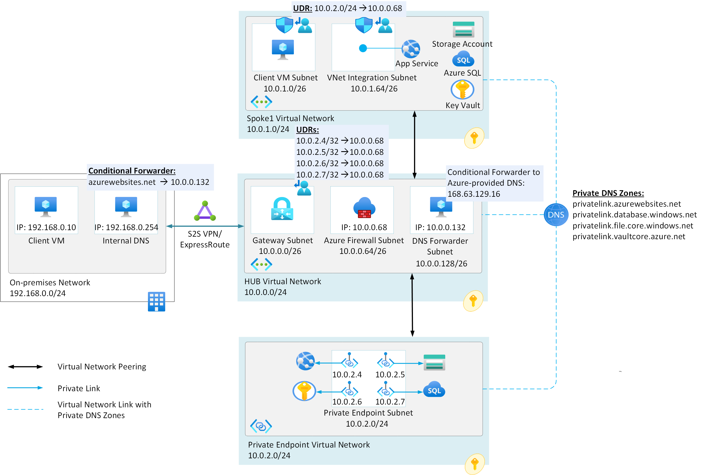

This article shows how to set up improved-security private connectivity to a multitenant web app or function app from an on-premises network or from within an Azure virtual network. It also shows how to set up improved-security connectivity between the app and other Azure PaaS services over Azure Private Link, without using the public internet. 

## Architecture

*Download a [Visio file](https://arch-center.azureedge.net/multitenant-web-apps.vsdx) of this architecture.*

### Dataflow

- By using Azure App Service [regional virtual network integration](/azure/app-service/web-sites-integrate-with-vnet#regional-vnet-integration), the web app connects to Azure services through delegated subnet *VNet Integration Subnet* in an Azure virtual network.
   -	The *VNet Integration Subnet* and *Private Endpoint Subnet* networks are separate virtual networks in different subscriptions. Both networks are peered with *Hub Virtual Network* as part of a hub-and-spoke network configuration. For regional virtual network integration, the peered virtual networks must be in the same Azure region.
- [Azure Private Link](/azure/private-link/private-link-service-overview) service sets up a [private endpoint](/azure/private-link/private-endpoint-overview) for the PaaS services, web apps, Azure SQL database, Azure storage account, and Azure key vault in *Private Endpoint Virtual Network*.
   
   In this example, this virtual network is dedicated for the deployment of private endpoints only. No other resources, like virtual machines (VMs), will be deployed in this virtual network. The future demand to add private endpoints was taken into account when the subnet size was selected.
- The on-premises network and Azure virtual networks can be connected via [Site-to-Site (S2S) VPN](/azure/vpn-gateway/tutorial-site-to-site-portal) or [Azure ExpressRoute private peering](/azure/expressroute/expressroute-circuit-peerings#privatepeering). Users in the on-premises network access the app privately and with improved security over the private network only.

   In this example, the on-premises network and Azure virtual networks are connected via ExpressRoute private peering.
- For an on-premises network that already has a Domain Name System (DNS) solution in place, the on-premises DNS solution is configured to forward DNS traffic to an Azure private DNS record (for example, azurewebsites.net) via a [conditional forwarder](/azure/virtual-network/virtual-networks-name-resolution-for-vms-and-role-instances#name-resolution-that-uses-your-own-dns-server) that forwards the request to the DNS Private Resolver service's inbound endpoint that's deployed in Azure. DNS Private Resolver queries Azure DNS and receives information about the Azure Private DNS virtual network link. Then the resolution is done by the [private DNS zone linked to the virtual network](/azure/dns/private-dns-overview). 

   Private DNS zones are also deployed in the same subscription as *Private Endpoint Virtual Network*.

   In this example, a DNS forwarder machine at IP address 192.168.0.254 in the on-premises network forwards all DNS resolution requests to the hostname azurewebsites.net to the DNS Private Resolver service's inbound endpoint in Azure at address 10.0.0.132. Then the requests are resolved by the Azure-provided DNS service, which has IP address 168.63.129.16, via the Azure Private DNS zone that's linked to the virtual network.

   An outbound endpoint is required to enable conditional forwarding name resolution from Azure to on-premises, other cloud providers, or external DNS servers, using a DNS forwarding ruleset.
 
   Configuring a DNS forwarding ruleset isn't required for this scenario.

   This app service configuration should be present:

   |Key  |Value   |
   |----------|-----------|
   |WEBSITE_DNS_SERVER     |168.63.129.16       |

- Virtual networks are linked to all the Azure private DNS zones.
  - The virtual network that has private endpoints is automatically linked to the private DNS zones. You need to link the other virtual networks separately.
- The web app communicates with the private endpoints of the PaaS services in *Private Endpoint Virtual Network* via Azure Firewall.
- On Azure Firewall, the [application rules](/azure/private-link/inspect-traffic-with-azure-firewall) are configured to allow communication between *VNet Integration Subnet* and the private endpoints of PaaS resources.
The target fully qualified domain names (FQDNs) are:
  - *.azurewebsites.net
  - *.database.windows.net
  - *.core.windows.net
  - *.vaultcore.azure.net
- Firewall and virtual network configuration for Azure SQL, Azure Storage Account, and Azure Key Vault allows traffic only from *VNet Integration Subnet*. The configuration doesn't allow communication with any other virtual network or with the public internet.

### Components
- [Azure App Service](https://azure.microsoft.com/services/app-service) hosts web applications and function apps, allowing autoscale and high availability without requiring you to manage infrastructure.
 - [Azure SQL Database](https://azure.microsoft.com/services/sql-database) is a general-purpose relational-database managed service that supports relational data, spatial data, JSON, and XML.
 - [Azure Storage account](https://azure.microsoft.com/product-categories/storage) provides a unique namespace for Azure Storage data that's accessible from anywhere in the world over HTTP or HTTPS. It contains all Azure Storage data objects: blobs, file shares, queues, tables, and disks.
- [Azure Key Vault](https://azure.microsoft.com/services/key-vault) is a service for securely storing and accessing API keys, passwords, certificates, cryptographic keys, or any other secrets used by cloud apps and services.
- [Azure Virtual Network](https://azure.microsoft.com/services/virtual-network) is the fundamental building block for private networks in Azure. Azure resources like VMs can securely communicate with each other, the internet, and on-premises networks through virtual networks.
- [Azure Private Link](https://azure.microsoft.com/services/private-link) provides a private endpoint in a virtual network for connectivity to Azure PaaS services like Azure Storage and SQL Database, or to customer or partner services.
- [Azure ExpressRoute](https://azure.microsoft.com/services/expressroute) private peering extends on-premises networks into the Microsoft cloud over a private connection. You could also establish Site-to-Site VPN between on-premises and the Azure network instead of using Azure ExpressRoute.
-	[Azure Firewall](https://azure.microsoft.com/services/azure-firewall) is a managed, cloud-based network security service that helps protect Azure Virtual Network resources. 
-	[Private DNS Zone](/azure/dns/private-dns-overview) provides a reliable and secure DNS service for managing and resolving domain names in the virtual network.
- [DNS Private Resolver](/azure/dns/dns-private-resolver-overview) enables the querying of [Azure DNS](https://azure.microsoft.com/products/dns) private zones from an on-premises environment, and vice-versa, without deploying VM-based DNS servers.

### Alternatives

For private connectivity, an alternative approach is to use [App Service Environment](/azure/app-service/environment/intro) to host the web application in an isolated environment. For the database, you can natively deploy [Azure SQL Managed Instance](/azure/azure-sql/managed-instance/sql-managed-instance-paas-overview) in a virtual network, so you don't need VNet Integration or private endpoints. These offerings are typically more expensive because they provide single-tenant isolated deployment and other features.

If you have an App Service Environment but aren't using SQL Managed Instance, you can still use a private endpoint for private connectivity to an Azure SQL database. If you already have SQL Managed Instance but are using multitenant App Service, you can still use regional VNet Integration to connect to the SQL Managed Instance private address.

For some other Azure services, like Key Vault or Storage, there's no alternative to using private endpoints for highly secure and private connections from Web Apps.

## Potential use cases

- Access a multitenant web app or function app privately with improved security over its [private endpoint](/azure/private-link/private-endpoint-overview) from an on-premises network or from within Azure virtual networks.
- Connect from a web app or function app to Azure platform as a service (PaaS) offerings:
   - Another web app
   - SQL Database
   - Azure Storage
   - Key Vault
   - Any other service that supports Azure private endpoints for inbound connectivity

## Considerations

These considerations implement the pillars of the Azure Well-Architected Framework, which is a set of guiding tenets that can be used to improve the quality of a workload. For more information, see [Microsoft Azure Well-Architected Framework](/azure/architecture/framework).

### Security

Security provides assurances against deliberate attacks and the abuse of your valuable data and systems. For more information, see [Overview of the security pillar](/azure/architecture/framework/security/overview).

Using Private Endpoint for your web app enables you to:
- Help secure your web app by configuring the private endpoint, eliminating public exposure.
- Connect with improved security to Web Apps from on-premises networks that connect to the virtual network by using a VPN or ExpressRoute private peering. Inbound connections to the web app are allowed from the on-premises network or from within the Azure virtual network only.
- Avoid any data exfiltration from your virtual network.

You can further improve the security of the inbound connection to the web app by fronting the app with a service like [Azure Application Gateway](/azure/application-gateway/overview) or [Azure Front Door](/azure/frontdoor/front-door-overview), optionally with [Azure Web Application Firewall](/azure/web-application-firewall/overview). When you enable Private Endpoint for your web app, the [access restrictions](/azure/app-service/app-service-ip-restrictions) configuration of the web app isn't evaluated.

This scenario also improves security of the outbound connection from an App Service web app to a downstream dependency like a database, Storage, or Key Vault.

You can configure application routing to route either all traffic or only private traffic (also known as [RFC1918](https://datatracker.ietf.org/doc/html/rfc1918#section-3) traffic) into your virtual network. You configure this behavior by using the **Route All** setting. If [Route All](/azure/app-service/overview-vnet-integration#application-routing) is disabled, the web app routes only private traffic into your virtual network. To block traffic to public addresses, enable the **Route All** setting to the virtual network. You can also use a [network security group](/azure/virtual-network/security-overview) to block outbound traffic to resources in your virtual network or the internet. When **Route All** isn't enabled, NSGs are applied only to RFC1918 traffic.

In this example, the web app doesn't need to communicate with any service that isn't in the virtual network, so **Route All** is enabled.

An important security consideration in this scenario is the configuration of the firewall for PaaS resources.

#### SQL Database firewall options

Without using private connectivity, you can add [firewall rules](/azure/azure-sql/database/firewall-create-server-level-portal-quickstart) that allow inbound traffic from specified IP address ranges only. Another approach is to [allow Azure services](/azure/azure-sql/database/network-access-controls-overview#allow-azure-services) to access the server. This approach locks down the firewall to allow only traffic from within Azure. But this traffic includes all Azure regions and other customers.

You can also add a more restrictive firewall rule to allow only your app's [outbound IP addresses](/azure/app-service/overview-inbound-outbound-ips#find-outbound-ips) to access the database. But because App Service is a multitenant service, these IP addresses are shared with and allow traffic from other customers on the same [deployment stamp](/azure/architecture/patterns/deployment-stamp), which uses the same outbound IP addresses.

Using private connectivity through the virtual network provides these firewall options to help prevent others from accessing the database:
- Create a [virtual network rule](/azure/azure-sql/database/vnet-service-endpoint-rule-overview) that allows traffic only from the regional subnet delegated by VNet Integration, *VNet Integration Subnet* in this example. The delegated subnet must have a [service endpoint](/azure/virtual-network/virtual-network-service-endpoints-overview) configured for *Microsoft.Sql* so the database can identify traffic from that subnet.
-	Configure the firewall to [deny public network access](/azure/azure-sql/database/connectivity-settings#deny-public-network-access). Doing so turns off all other firewall rules and makes the database accessible only through its private endpoint.

The option of denying public network access is the most secure configuration. But if you use this option, database access is possible only via the virtual network that hosts the private endpoint. To connect to the database, anything other than the web app must have direct connectivity to the virtual network.

For example, deployments or urgent manual connections from SQL Server Management Studio (SSMS) on local machines can't reach the database except through VPN or ExpressRoute connectivity into the virtual network. You could also remotely connect to a VM in the virtual network and use SSMS from there. For exceptional situations, you could temporarily allow public network access and reduce risk by using other configuration options.

#### Storage Account and Key Vault firewall options

Storage accounts and key vaults have a public endpoint that's accessible from the internet. You can also create [private endpoints for your storage account](/azure/storage/common/storage-private-endpoints) and [key vault](/azure/key-vault/general/private-link-service?tabs=portal). Doing so assigns these services a private IP address from your virtual network and helps to secure all traffic between your virtual network and the respective service over a private link. 

When you create a private endpoint, *VNet Integration Subnet* can access the service privately and with improved security over a private link. But the storage account and key vault are still accessible from other Azure virtual networks. To block access from any other virtual network, create the service endpoint for this delegated subnet.

### Availability

Private Link support for App Service, Azure SQL Database, Azure Storage, and Azure Key Vault is available in all public regions. To check availability in other regions, see [Azure Private Link availability](/azure/private-link/availability)

Private Link introduces another component and availability consideration into the architecture. The Private Link service has a [high-availability SLA](https://azure.microsoft.com/support/legal/sla/private-link). You need to take this SLA into account when you calculate the composite SLA of the entire solution.

### Scalability

For information about integrating Azure Private Link for PaaS services with Azure Private DNS zones in hub-and-spoke network architectures, see [Private Link and DNS integration at scale](/azure/cloud-adoption-framework/ready/azure-best-practices/private-link-and-dns-integration-at-scale).

### Global peering 

Any service in any Azure region that can connect through the virtual network can reach the PaaS services' private endpoints, for example, through [virtual network peering](/azure/virtual-network/virtual-network-peering-overview) in hub-and-spoke topologies. However, for App Service regional VNet Integration, the peered virtual networks must be located in the same Azure region.

Lack of global peering support means you can't use this solution for cross-region connectivity from App Service to a database or other private endpoint in another Azure region. For example, this solution wouldn't work for a multiregional deployment to support a partial failover, in which the web app remains active in one region but must connect to a failed-over database in another region, or vice versa. But other solutions exist for this situation. See [Multi-region web app with private connectivity to database](/azure/architecture/example-scenario/sql-failover/app-service-private-sql-multi-region) for an architecture that supports partial failovers when either the web app or the database fails over to another region.

If you need to connect Web Apps to a virtual network in another region, you can set up gateway-required VNet Integration. The limitation is that gateway-required VNet Integration can't be used with a virtual network connected with Azure ExpressRoute.

### Logging and monitoring

Azure Private Link is integrated with [Azure Monitor](/azure/azure-monitor/overview), which allows you to see if data is flowing.

You can also use the connection troubleshoot service in Azure [Network Watcher](/azure/private-link/troubleshoot-private-endpoint-connectivity) to trace the connectivity from a VM in a virtual network to the FQDN of the Private Endpoint resource.

### Cost optimization

Cost optimization is about looking at ways to reduce unnecessary expenses and improve operational efficiencies. For more information, see [Overview of the cost optimization pillar](/azure/architecture/framework/cost/overview).

There's no added cost for App Service regional VNet Integration in supported pricing tiers in Basic, Standard, Premium v2, Premium v3, Isolated v2 App Service, and Azure Functions Premium plans.

Private endpoint is available for Windows web apps and Linux web apps, containerized or not, hosted on Basic, Standard, Premium v2, Premium v3, and Isolated v2 App Service plans, and also for function apps deployed to a Premium plan.

The Azure Private Link service that enables the private endpoints for PaaS services has an associated cost that's based on an hourly fee plus a premium on bandwidth. See the [Private Link pricing](https://azure.microsoft.com/pricing/details/private-link) page for details. Connections from a client virtual network to the Azure Firewall in the hub virtual network incur charges. You aren't charged for connections from Azure Firewall in the hub virtual network to private endpoints in a peered virtual network.

Azure Private DNS zone costs are based on the number of DNS zones hosted in Azure and the number of received DNS queries.

To explore the cost of running this scenario, see the [Azure pricing calculator estimate](https://azure.com/e/004f18af0e4344d7acbabfc212930138). All the services described in this article are preconfigured with reasonable default values for a small-scale application. To see how the pricing would change for your use case, change the appropriate variables to match your expected usage.

## Contributors

*This article is maintained by Microsoft. It was originally written by the following contributor.*

Principal author:

 * [Ankit Singhal](https://www.linkedin.com/in/ankit-singhal-microsoft) | Cloud Solution Architect

*To see non-public LinkedIn profiles, sign in to LinkedIn.*

## Next steps

-	See step-by-step guidance on how to [integrate Azure Functions with an Azure virtual network by using private endpoints](/azure/azure-functions/functions-create-vnet).
-	See the steps to configure [Azure Firewall application rules to inspect traffic destined to private endpoints in various network topologies](/azure/private-link/inspect-traffic-with-azure-firewall).
- For more information on inbound and outbound scenarios for App Service, and which features to use in which case, see the [App Service networking features overview](/azure/app-service/networking-features).
- For more information about private endpoints for Azure Web Apps, see [Using Private Endpoints for Azure Web Apps](/azure/app-service/networking/private-endpoint).
- For more information about integrating multitenant web apps with Azure Virtual Network, see [Integrate your app with an Azure virtual network](/azure/app-service/web-sites-integrate-with-vnet).
-	The FQDN of some of the PaaS services might resolve automatically to a public IP address. For information about overriding the DNS configuration to connect to the private endpoint, see [Azure Private Endpoint DNS configuration](/azure/private-link/private-endpoint-dns).

## Related resources

- [Web app private connectivity to Azure SQL Database](/azure/architecture/example-scenario/private-web-app/private-web-app)
- [Tutorial: Integrate Azure Functions with an Azure virtual network by using private endpoints](/azure/azure-functions/functions-create-vnet)
- [Tutorial: Establish Azure Functions private site access](/azure/azure-functions/functions-create-private-site-access)
- [Use Key Vault references for App Service and Azure Functions](/azure/app-service/app-service-key-vault-references)
