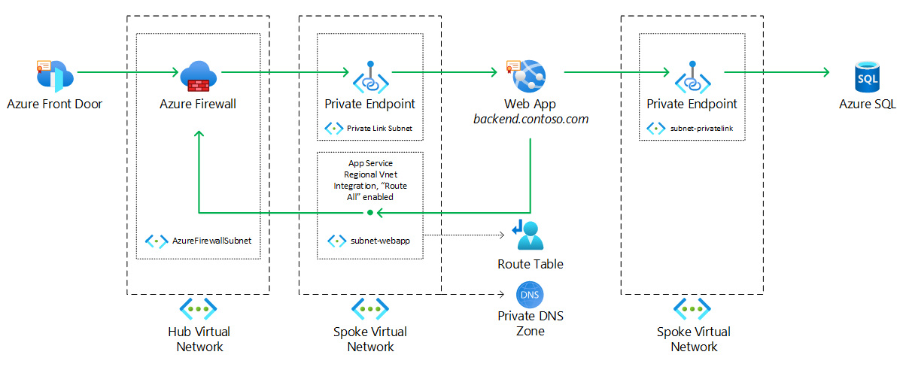
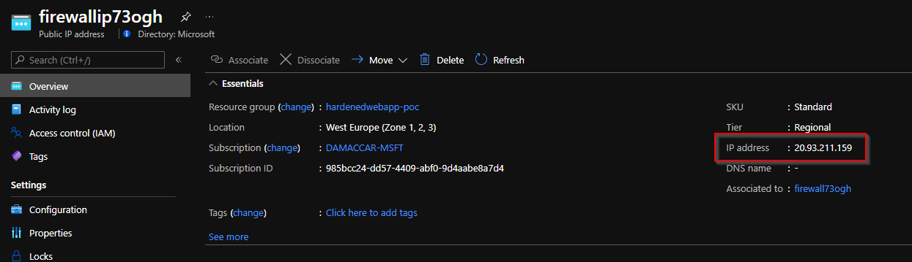
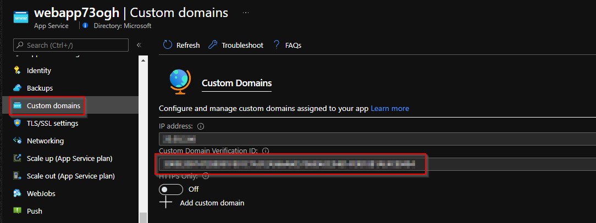
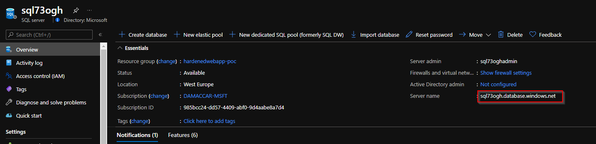
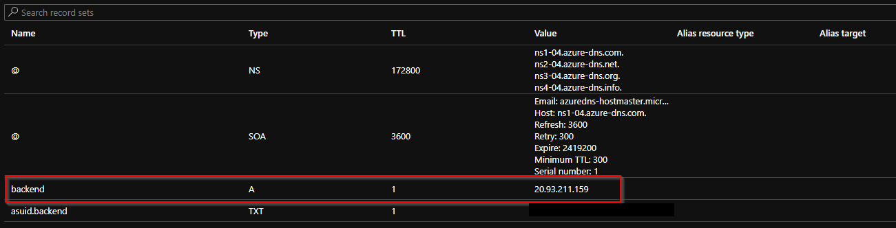
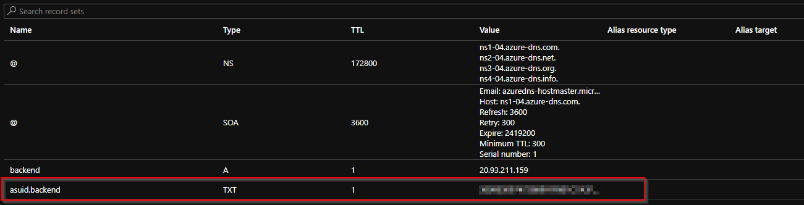
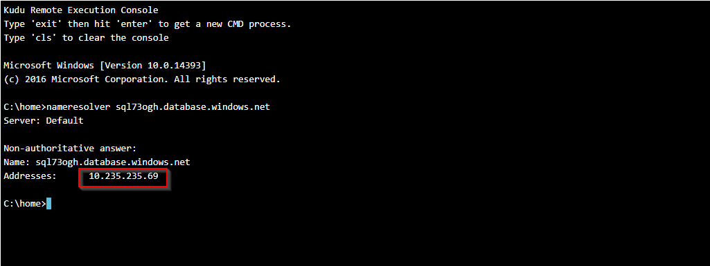
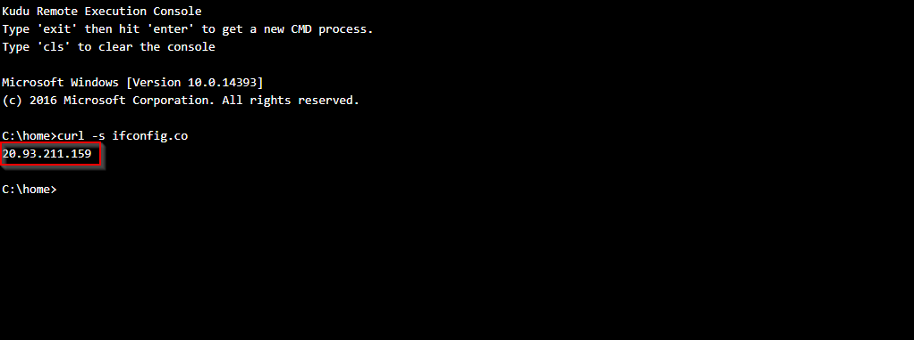

This article describes how to set up an [Azure web app](https://azure.microsoft.com/en-us/services/app-service/web) in a network environment that enforces strict policies regarding inbound and outbound network flows. In such cases, the web app can't be directly exposed to the internet. Instead, all traffic needs to go through an [Azure firewall](/azure/firewall) or third-party network virtual appliance.

The example shows a scenario in which a web application is protected with [Azure Front Door](/azure/frontdoor), an Azure Firewall and connects securely to an [Azure SQL Databases](/azure/azure-sql).

## Potential use cases

These uses cases have similar design patterns:

- Connect from a Web App or an [Azure Function](/azure/azure-functions) to any PaaS service that supports [Azure Private Link private endpoints](/azure/private-link/private-endpoint-overview) for inbound network flows, such as Azure Storage, Azure Cosmos Db other Web Apps.
- Connect from a Web App or an Azure Function to a [Virtual Machine](/azure/virtual-machines) on the cloud or on premises through VPNs or [Azure ExpressRoute](/azure/expressroute).

## Architecture



1. An Azure Front Door instance is deployed to provide [Azure Web Application Firewall](/azure/web-application-firewall/afds/afds-overview) features and terminate SSL connections from clients.
2. A custom FQDN is chosen to represent the back-end Web App and it is mapped through CNAME or A DNS records to the public IP address of an Azure Firewall or third-party network virtual appliance.
3. A private endpoint for the Web App is created in a Virtual Network subnet (**subnet-privatelink** in the example).
3. The Azure Firewall or third-party network virtual appliance is deployed in a Virtual Network (**Hub Virtual Network** in the example) and configured to perform destination NAT (DNAT) of incoming requests to the private IP address of the private endpoint associated to the Web App.
4. The Wep App is assigned the custom FQDN through the [Domain Verification ID property of the Web App](https://docs.microsoft.com/Azure/app-service/manage-custom-dns-migrate-domain#bind-the-domain-name-preemptively). This allows the custom FQDN already mapped to the public IP of the Azure Firewall or third-party network virtual appliance to be reused with the Web App without altering DNS name resolution and network flows.
5. The Web App is connected to a Virtual Network subnet (**subnet-webapp** in the example) through regional VNet integration. The flag **Route All** is enabled, which forces all outbound traffic from the Web App into the Virtual Network and allows the Web App to inherit the Virtual Network's DNS resolution configuration, such as custom DNS servers and integration with [Private DNS Zones](/azure/dns) used for private endpoints name resolution.
7. A custom [Route Table](/azure/virtual-network/virtual-networks-udr-overview#custom-routes) is attached to the Web App subnet (**subnet-webapp** in the example) to force all outbound traffic coming from the Web App to go to the Azure Firewall or third-party network virtual appliance.
8. One or more Private DNS Zones are linked to the Virtual Network containing the Web App (**Spoke Virtual Network** in the example) to allow DNS resolution of PaaS resources deployed with private endpoints.
9. A private endpoint for Azure SQL is created in a Virtual Network subnet (**subnet-privatelink** in the example) and a corresponding DNS record is created on the matching Private DNS zone.
10. The Web App can now only be accessed through Azure Front Door and the Azure Firewall. It can also establish a connection to the Azure SQL instance through private endpoint, securing the communication over private IP only.

### Considerations

The solution deploys an Azure Front Door instance which is used for terminating SSL connections from clients and to provide a rich set of Web Application Firewall configurations. It is recommended to further lock down your applications to accept traffic coming only from your Front Door instance.

This can be done in several ways depending on your network virtual appliance of choice and application configuration. Some options include:

- Configuring your Azure Firewall or network virtual appliance to accept traffic only from the __AzureFrontDoor.Backend__ [Azure IP Ranges](https://www.microsoft.com/download/details.aspx?id=56519)
- Configuring your network virtual appliance to integrate with [Azure Service Tags](/azure/virtual-network/service-tags-overview)
- Configuring your application to accept traffic only from your Front Door instance by validating request headers

For more information, see [How do I lock down the access to my backend to only Azure Front Door?](/azure/frontdoor/front-door-faq#how-do-i-lock-down-the-access-to-my-backend-to-only-azure-front-door). 

The solution also deploys an Azure SQL Server that accepts traffic only through a private endpoint, locking down completely traffic coming from external sources. The Web App deployed with the solution is configured to ensure proper DNS resolution of private endpoints and allow secure communication with the SQL Server. 

When deploying resources with private endpoints in your environments, it is important to properly configure your DNS infrastructure. For more information, see [Azure Private Endpoint DNS configuration](/azure/private-link/private-endpoint-dns).

### Components

- [Azure Front Door](https://azure.microsoft.com/services/frontdoor)
- [Azure Firewall](https://azure.microsoft.com/services/azure-firewall)
- [Azure App Service](https://azure.microsoft.com/services/app-service)
- [Azure Private Link Service private endpoints](https://docs.microsoft.com/azure/private-link/private-endpoint-overview)
- [Route Tables](https://docs.microsoft.com/azure/virtual-network/virtual-networks-udr-overview#custom-routes)
- [Azure DNS Private Zones](https://docs.microsoft.com/azure/dns)
- [Azure SQL](https://azure.microsoft.com/en-us/products/azure-sql)


### Alternatives

- The Wep App can be deployed to an internal [Azure App Service Environment](/azure/app-service/environment/overview) to provide isolation from the public internet. This example uses a Web App within an App Service to lower operating costs.
- Azure Front Door can be replaced with a [Azure Application Gateway](/azure/application-gateway) if the Web Application Firewall component of the solution must also be deployed behind a firewall or within a Virtual Network.

### Availability

Front Door is a global service with built-in availability and reduncdancy and an [SLA of 99.99%](https://azure.microsoft.com/support/legal/sla/frontdoor/v1_0)

Azure Firewall features [built-in availability with a standard SLA of 99.95%](/azure/firewall/features#built-in-high-availability). It and can also be deployed to span multiple [Availability Zones](https://azure.microsoft.com/global-infrastructure/availability-zones/#overview), [increasing the SLA to 99.99%](/azure/firewall/features#availability-zones). If using a third-party or custom network virtual appliance, you can achieve the same SLA targets configuring your deployment to leverage Availability Sets or Availability Zones.

Azuew Web Apps support built-in availability and can be deployed across [multiple Availability Zones](/azure/app-service/how-to-zone-redundancy)

You can further increase the availability of the solution to spread it across multiple [Azure Regions](https://azure.microsoft.com/global-infrastructure/geographies/#overview). This can be accomplished by deploying new instances of all components (except Front Door) to other Azure Regions and then by configuring the original Front Door instance with [multiple backend targets](/azure/frontdoor/front-door-backend-pool). If you are using Azure SQL as datastore, multiple servers can then be [joined to an auto-failover group to enable transparent and coordinated failover of multiple databases](/azure/azure-sql/database/auto-failover-group-overview?tabs=azure-powershell).

You can refer to the following reference architectures to see how multi-available web applications can be deployed in Azure and how multi-region SQL Servers can be setup to work with private endpoints:

[Azure Architecture Center | Highly available multi-region web application](/azure/architecture/reference-architectures/app-service-web-app/multi-region)  
[Azure Architecture Center | Multi-region web app with private connectivity to database](/azure/architecture/example-scenario/sql-failover/app-service-private-sql-multi-region)

All components of the example solution can be monitored using [Azure Monitor](https://docs.microsoft.com/azure/azure-monitor) services.
[Azure Monitor Log Analytics](/azure/azure-monitor/logs/log-analytics-overview) can be used to monitor logs related to web application firewall and network inspection rules of Azure Front Door and Azure Firewall, [Azure Monitor Application Insights](/azure/azure-monitor/azure-monitor-app-hub) can be used to monitor performance, availability and gain insights into usage of web applications.

### Scalability

All components of the solution provide either transparent built-in scalability or expose a rich set of features to scale the number of available instances such as [Azure Web App autoscale](/azure/azure-monitor/autoscale/autoscale-best-practices#manual-scaling-is-reset-by-autoscale-min-and-max)

## Deploy this scenario

### Prerequisites

- You must have an existing Azure account. If you do not have an Azure subscription, [create a free account](https://azure.microsoft.com/free) before you begin.
- You must own a publicly routable domain and have permissions to create two DNS records in your public DNS zone.
- You must own a valid SSL certificate to be used for your Web App.

### Walk-through

The solution is comprised of several [Bicep](/azure/azure-resource-manager/bicep) files that deploy the required infrastucture.

The ```main.bicep``` deploys the base infrastructure using Bicep modules from the following files
- ```network.bicep```
- ```webapp.bicep```
- ```firewall.bicep```
- ```sql.bicep```
- ```frontdoor.bicep```
- ```routetable.bicep```

1. [Install Bicep](/azure/azure-resource-manager/bicep/install) and deploy main.bicep using either [Azure PowerShell](/azure/azure-resource-manager/bicep/install#azure-powershell) or [Azure CLI](/azure/azure-resource-manager/bicep/install#azure-cli). The bicep file has pre-configured parameters for deploying all resources.

   For example, using Azure PowerShell:

   ```powershell
   New-AzResourceGroupDeployment -ResourceGroupName [resourceGroupName] -Name [frontDoorDeployment] -TemplateFile .\frontdoor.bicep
   ```

   You will be asked to provide the parameters ```customBackendFqdn``` and ```sqladministratorLoginPassword``` upon deployment.

2. Take note of the Public IP Address assigned to the Azure Firewall after creation. The IP is also provided as output of the deployment of main.bicep.

   

3. Take note of the Custom Domain Verification ID of the Web App you just created. The Custom Domain Verification ID is also provided as output of the deployment of main.bicep.

   

4. Take note of the Azure SQL Server name you just created. The FQDN of the Azure SQL Server is also provided as output of the deployment of main.bicep.

   

5. Sign in to the website of your domain provider.

   > [!NOTE]
   > Every domain provider has its own DNS records interface, so consult the provider's documentation. Look for areas of the site labeled Domain Name, DNS, or Name Server Management.
   >
   > Often, you can find the DNS records page by viewing your account information and then looking for a link such as My domains. Go to that page, and then look for a link that's named something like Zone file, DNS Records, or Advanced configuration.


6. Create an A record with the Public IP you just obtained

   The following screenshot is an example of a DNS records page with the A record created:

   

   > [!NOTE]
   > If you like, you can use Azure DNS to manage DNS records for your domain and configure a custom DNS name for Azure App Service. For more information, see [Tutorial: Host your domain in Azure DNS](/azure/dns/dns-delegate-domain-azure-dns).

7. Create a TXT record with the Custom Domain Verification ID of the Web App you just deployed. This will allow you to reuse the custom FQDN record you just created an A record for and add it to the Web App in the following steps.

   The TXT record must be created in the format ```asuid.<subdomain>``` For example, if your custom FQDN is ```backend.contoso.com``` you would create the record:

   ```asuid.backend.contoso.com TXT [DOMAIN VERIFICATION ID]```

   For more information, see [Tutorial: Map an existing custom DNS name to Azure App Service - Create the DNS records](/Azure/app-service/app-service-web-tutorial-custom-domain?tabs=cname#4-create-the-dns-records)

   The following screenshot is an example of a DNS records page with the TXT record created:

   

8. Map the custom domain to the Web App you just created. For more information, see [Tutorial: Map an existing custom DNS name to Azure App Service - Get a domain verification ID](/Azure/app-service/app-service-web-tutorial-custom-domain?tabs=cname#3-get-a-domain-verification-id)

9. Upload a SSL certificate matching your custom FQDN to your Web App. For more information, see [Tutorial: Secure a custom DNS name with a TLS/SSL binding in Azure App Service](/Azure/app-service/configure-ssl-bindings)

10. Your Web App should now be reachable with the public FQDN of the Azure Front Door instance.

**Optional Steps**

11. If you'd like, you can also [bind a custom FQDN domain to Azure Front Door](/azure/frontdoor/front-door-custom-domain) and [configure HTTPS for the custom domain](/azure/frontdoor/front-door-custom-domain-https)

12. You can verify that connectivity from the Web App to the Azure SQL Server is happening over a private channel by creating a [Virtual Machine](/azure/virtual-machines) **in the same Virtual Network** used for the scenario. 
    - Log into the Virtual Machine and browse to ```https://<webappname>.scm.azurewebsites.net``` where you will access the [Kudu diagnostic console](/azure/app-service/resources-kudu)
    - Log in and in the top bar click on ```Debug console --> CMD```
    - Type the command ```nameresolver <sqlname>.database.windows.net```, using the Azure SQL Server name you retrieved in Step 4.

    You should see that the Azure SQL Server instance name is being resolved with a private IP.

    The following screenshot is an example of DNS resolution of the Azure SQL Server instance from the Kudu console:

    

13. You can also verify that outbound traffic from the Web App is going through the Azure Firewall by typing the following command in the Kudu console:
    - ```curl -s ifconfig.co```

    The output should match the public IP address of the Azure Firewall you retrieved in Step 2.

    The following screenshot is an example from the Kudu console:

    

## Pricing

The example scenario features a deployment within a hardened network environment, as such an Azure Firewall or third-party network virtual appliance most likely already exist in the target infrastructure.

The main consideration for the remaining infrastructure is the sizing of the App Service Plan that will host the Web App. Private endpoints for Web Apps are [available only on the Premium SKU](/azure/app-service/networking/private-endpoint).

Use the [Azure Pricing calculator](https://azure.microsoft.com/pricing/calculator) to estimate you costs. Two possible pricing estimates are linked below:

[Infrastructure, including Azure Firewall](https://azure.com/e/e836a805a5b04fd3a750f04c4bfef120)  
[Infrastructure, excluding Azure Firewall](https://azure.com/e/200979762ace4d8096851edb92c13756)

## Next steps

- Visit the [Azure Architecture Center](../../browse.yml) to view other architectures and workloads.
- Head over to the [Microsoft Azure Well-Architecture Framework](../../framework.yml) documentation to learn the guiding principles that can be used to improve the quality of your Azure workloads.

## Related resources

- [Azure Web Application Firewall on Azure Front Door | Microsoft Docs](/azure/web-application-firewall/afds/afds-overview)
- [Azure Firewall architecture overview | Microsoft Docs](/azure/architecture/example-scenario/firewalls)
- [Azuere Web App Deployment Best Practices | Microsoft Docs](/azure/app-service/deploy-best-practices)
- [Azure Private Endpoint DNS Configuration | Microsoft Docs](/azure/private-link/private-endpoint-dns)