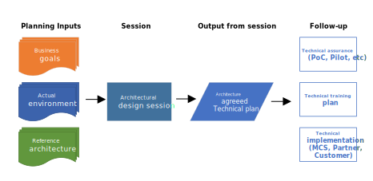

# Architectural Design Sessions

## Introduction

Architecture is a term applied to both the process and the outcome of thinking out and specifying:
- The overall structure.
- Logical components.
- The logical interrelationships of a computer and its operating system.
- A network or other conception.

The definition of an architecture used in ANSI/IEEE Std 1471-2000 is: “The fundamental organization of a system, embodied in its components, their relationships to each other and the environment, and the principles governing its design and evolution.“
An architectural design session (ADS) occurs when:
- An architectural design session (ADS) is necessary when you need an in-depth discussion on how a new solution will blend into the environment.
- The first step is to explain the reference architecture to the team or customer. If this satisfies all of their decision criteria, and the team or customer agrees with the reference architecture, then you can move forward without running an ADS.
- If the reference architecture does not meet their decision criteria, then you will need to conduct an ADS to custom build an architecture that works in their environment and satisfies all of their decision criteria and technical requirements.

Before you set up an ADS, you need to work with your stakeholders to identify needs and decide whether an alternative engagement would be a better fit:
- If you are looking for information on some solutions, a product briefing might be a better, faster, and lower-cost option.
- If you want to try out a product, running a demonstration or a hands-on lab might be a better environment for testing.
- If you want to improve your skills, get a training, either online or from a local partner.
- If you are interested in collaborating on a solution around an opportunity, that’s the right time for an ADS.

## Architectural design session process

### Planning
Prior to conducting an ADS:
- Identify: stakeholders, decision-makers, attendees, implementers. Who needs to be in the session?
- Qualify: the project, stakeholders objectives, technical team objectives.
- Review the reference architecture for the project’s workload, industry, and technology.
- Prepare to explain any gaps that were found in the reference-architecture review.
- Schedule: local resources, delivery owners.

### Agenda
On a meeting with the customer, confirm that they are ready for an ADS. The outcome of the meeting should be a mutual understanding of:
- Goals and requirements for the solution.
- Logistics of the project.
- A high-level agenda for the ADS.
- A list of participants for the ADS (6 to 8 people for optimal decision-making).

The ADS usually runs over two days. During the session, four main topics should be discussed:
- Business capabilities
- Data flow 
- Technology
- and information flow

To learn more about the structure, activities, and timeline of the ADS, review the table below suggested.

| Activities | Two-day session |
|------------------------------------------------------------------|-----------------------------------------------------------------|
| **Gather requirements.** Customer context, business background, business goals and objectives, business scenarios and user stores, security requirements, operational requirements, and customer environment.   **Make sure all information is relevant.** Stated and unstated.   **Prioritize what you want to achieve.**|Day one (four hours) |
| **Present reference architecture.**   **Discuss how to blend the reference architecture into the customer’s reality.**  Customer goals and requirements of their current environment.| Day one/two (eight hours) |
| **Validate that the customer’s business goals were achieved.**   **Define next steps.**| Day two (four hours) |

### Deliver your ADS
Lead your ADS as a facilitator, not as a presenter. Make sure the your team or customer’s voice is heard throughout the conversation. Take notes to capture their thoughts on the whiteboard. Here are the typical steps of delivering an ADS:
- **Confirm the objectives.** Validate agenda.
- **Discover the situation.** Learn customer’s challenge and opportunity. Record the current state and future vision.
- **Explore Options.** Help your customer envision potential solutions with Microsoft technical capabilities.
- **Drive to consensus on the solution.** Customer confirmation and engagement for next steps.

### Next steps
After the architecture is agreed upon by the customer, clearly define the next steps. These next steps are dependent upon the opportunity and the strategy documented in the technical plan. Make sure that:
- The next steps are documented.
- You include all stakeholders, both internal and external.
- You actively hand it over to another resource, such as a partner or your team, if needed.

The last step in an ADS is to send a follow-up email that includes the agreed-upon:
- Project goal.
- Requirements and concerns.
- Existing situation and proposed solution.
- Next steps and action items per the key decisions.
- Formalized illustration from whiteboard (Visio, PowerPoint, etc.).

### References
(serverless architecture references)
