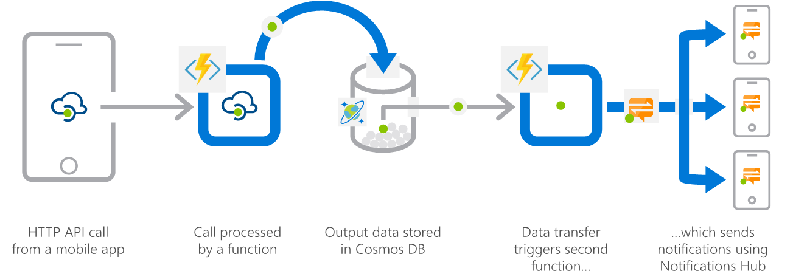

# Serverless Reference Architectures with Azure Functions

## Introduction
Before implementing a solution, use a reference architecture to visualize the ideal technical architecture, which is then blended and integrated into the your reality. A reference architecture is a template of components required by the industry and the technical requirements to implement them, based on extensive experience. The reference architecture is not a custom-built architecture for the customer solution. Rather, it is a high-level architecture that has already been created for the solution.

## Common serverless architecture patterns
- **Serverless APIs**. Mobile and web backends.
- **Event and Stream Processing**. IoT event and data processing. Big data and machine learning pipelines.
- **Integration and Enterprise Service Bus**. Connecting line-of-business systems. Pub/Sub for business events.
- **Automation and Digital Transformation**. Process automation.
- **'Middleware'**. SaaS (e.g. Dynamics), big data projects, etc.

<table>
<tr>
    <td style="width: 100px;">
        <h3>Web application backends</h3>
        
Retail scenario: Online orders are picked up from a queue, processed and the resulting data is stored in a database

    </td>
        <td style="vertical-align: middle; width: 300px;"></td>
</tr>
<tr>
    <td style="width: 100px;">
        <h3>Mobile application backends</h3>
        
Financial services scenario: Colleagues use mobile banking to reimburse each other for lunch: the person who paid for lunch requests payment through his mobile app, triggering a notification on his colleagues’ phones.

    </td>
        <td style="vertical-align: middle;"></td>
</tr>
<tr>
    <td style="width: 100px;">
        <h3>IoT – connected backends</h3>
        
Manufacturing scenario: A manufacturing company uses IoT to monitor its machines. Functions detects anomalous data and triggers a message to Service department when repair is required.

    </td>
        <td style="vertical-align: middle;"></td>
</tr>
<tr>
    <td style="width: 100px;">
        <h3>Conversational bot processing</h3>
        
Hospitality scenario: Customer asks for available vacation accommodations on her smartphone. A serverless bot deciphers the request and returns vacation options.

    </td>
        <td style="vertical-align: middle;"></td>
</tr>
<tr>
    <td style="width: 100px;">
        <h3>Real-time file processing</h3>
        
Healthcare scenario: Patient records are securely uploaded as PDF files. That data is then decomposed, processed using OCR detection, and added to a database for easy queries.

    </td>
        <td style="vertical-align: middle;"></td>
</tr>
<tr>
    <td style="width: 100px;">
        <h3>Real-time stream processing</h3>
        
ISV scenario: Huge amounts of telemetry data is collected from a massive cloud app. That data is processed in near real-time and stored in a DB for use in an analytics dashboard.

    </td>
        <td style="vertical-align: middle;"></td>
</tr>
<tr>
    <td style="width: 100px;">
        <h3>Automation of scheduled tasks</h3>
        
Financial services scenario: A customer database is analyzed for duplicate entries every 15 minutes, to avoid multiple communications being sent out to same customers.

    </td>
        <td style="vertical-align: middle;"></td>
</tr>
<tr>
    <td style="width: 100px;">
        <h3>Extending SaaS applications</h3>
        
Professional services scenario: A SaaS solution provides extensibility through webhooks, which can be implemented through Functions, to automate certain workflows.

    </td>
        <td style="vertical-align: middle;"></td>
</tr>
</table>

## Serverless Microservices reference architecture
This [reference architecture](https://docs.microsoft.com/samples/azure-samples/serverless-microservices-reference-architecture/serverless-microservices-reference-architecture/) walks you through the decision-making process involved in designing, developing, and delivering the Rideshare by Relecloud application (a fictitious company). You will be given hands-on instructions for configuring and deploying all of the architecture's components, with helpful information about each component along the way. 

## Serverless application with Azure Functions reference architecture
This two-part solution describes a hypothetical drone delivery system. Drones send in-flight status to the cloud, which stores these messages for later use. A web application allows users to retrieve these messages to get the latest status of these devices.
- The code for this solution is available to download from [GitHub](https://github.com/mspnp/serverless-reference-implementation/tree/v0.1.0).
- The article [Code walkthrough: Serverless application with Azure Functions](https://docs.microsoft.com/azure/architecture/serverless/code) walks you through this code, and explains why various choices were made.
### Serverless web application

### Serverless event processing

## Event-based cloud automation reference architecture
Automating workflows and repetitive tasks on the cloud using serverless technologies, can dramatically improve productivity of an organization's DevOps team. A serverless model is best suited for automation scenarios that fit an event driven approach. This [reference architecture](https://docs.microsoft.com/azure/architecture/reference-architectures/serverless/cloud-automation) illustrates two such cloud automation scenarios: cost center tagging and throttling response.

## Serverless Framework multicloud reference architecture
This [article](https://docs.microsoft.com/azure/architecture/example-scenario/serverless/serverless-multicloud) describes how the Microsoft Commercial Software Engineering (CSE) team partnered with a global retailer to deploy a highly-available serverless solution across both Azure and Amazon Web Services (AWS) cloud platforms, using the Serverless Framework.

## More serverless reference architectures with Azure Functions

### General

- [Serverless application architectures using Event Grid](https://docs.microsoft.com/azure/architecture/solution-ideas/articles/serverless-application-architectures-using-event-grid)
- [Serverless apps using Cosmos DB](https://docs.microsoft.com/azure/architecture/solution-ideas/articles/data-sovereignty-and-gravity)
- [Serverless event processing using Azure Functions](https://docs.microsoft.com/azure/architecture/reference-architectures/serverless/event-processing)
- [Serverless web application on Azure](https://docs.microsoft.com/azure/architecture/reference-architectures/serverless/web-app)
- [Serverless Asynchronous Multiplayer Reference Architecture](https://docs.microsoft.com/gaming/azure/reference-architectures/multiplayer-asynchronous-serverless)
- [Instant Broadcasting on Serverless Architecture](https://docs.microsoft.com/azure/architecture/solution-ideas/articles/instant-broadcasting-on-serverless-architecture)
- [Building a telehealth system on Azure](https://docs.microsoft.com/azure/architecture/example-scenario/apps/telehealth-system)
- [Custom Data Sovereignty & Data Gravity Requirements](https://docs.microsoft.com/azure/architecture/solution-ideas/articles/data-sovereignty-and-gravity)
- [Sharing location in real time using low-cost serverless Azure services](https://docs.microsoft.com/azure/architecture/example-scenario/signalr/)

### Web and Mobile Backend references architectures
- [An e-commerce front end](https://docs.microsoft.com/azure/architecture/example-scenario/apps/ecommerce-scenario)
- [Architect scalable e-commerce web app](https://docs.microsoft.com/azure/architecture/solution-ideas/articles/scalable-ecommerce-web-app)
- [Improve scalability in an Azure web application](https://docs.microsoft.com/azure/architecture/reference-architectures/app-service-web-app/scalable-web-app)
- [Uploading and CDN-preloading static content with Azure Functions](https://docs.microsoft.com/samples/azure-samples/functions-java-push-static-contents-to-cdn/functions-java-push-static-contents-to-cdn/)
- [Cross Cloud Scaling Architecture](https://docs.microsoft.com/azure/architecture/solution-ideas/articles/cross-cloud-scaling)
- [Social App for Mobile and Web with Authentication](https://docs.microsoft.com/azure/architecture/solution-ideas/articles/social-mobile-and-web-app-with-authentication)

### AI + Machine Learning reference architectures
- [Image classification for insurance claims](https://docs.microsoft.com/azure/architecture/example-scenario/ai/intelligent-apps-image-processing)
- [Personalized Offers](https://docs.microsoft.com/azure/architecture/solution-ideas/articles/personalized-offers)
- [Personalized marketing solutions](https://docs.microsoft.com/azure/architecture/solution-ideas/articles/personalized-marketing)
- [Speech transcription with Azure Cognitive Services](https://docs.microsoft.com/azure/architecture/reference-architectures/ai/speech-ai-ingestion)
- [Training a Model with AzureML and Azure Functions](https://docs.microsoft.com/samples/azure-samples/functions-python-azureml-azurefunctions-deeplearning/training-a-model-with-azureml-and-azure-functions/)
- [Customer Reviews App with Cognitive Services](https://docs.microsoft.com/samples/azure-samples/functions-customer-reviews/customer-reviews-cognitive-services/)
- [Enterprise-grade conversational bot](https://docs.microsoft.com/azure/architecture/reference-architectures/ai/conversational-bot)
- [AI at the Edge](https://docs.microsoft.com/azure/architecture/solution-ideas/articles/ai-at-the-edge)
- [Mass ingestion and analysis of news feeds on Azure](https://docs.microsoft.com/azure/architecture/example-scenario/ai/newsfeed-ingestion)
- [HIPPA and HITRUST compliant health data AI](https://docs.microsoft.com/azure/architecture/solution-ideas/articles/security-compliance-blueprint-hippa-hitrust-health-data-ai)

### Data & Analytics reference architectures
- [Application integration using Event Grid](https://docs.microsoft.com/azure/architecture/solution-ideas/articles/application-integration-using-event-grid)
- [Mass ingestion and analysis of news feeds](https://docs.microsoft.com/azure/architecture/example-scenario/ai/newsfeed-ingestion)
- [Tier Applications & Data for Analytics](https://docs.microsoft.com/azure/architecture/solution-ideas/articles/tiered-data-for-analytics)
- [Operational analysis and driving process efficiency](https://docs.microsoft.com/azure/time-series-insights/time-series-insights-update-use-cases#operational-analysis-and-driving-process-efficiency)

### IoT reference architectures 
- [Azure IoT reference (SQL DB)](https://docs.microsoft.com/azure/architecture/reference-architectures/iot-with-sql)
- [Azure IoT reference (Cosmos DB)](https://docs.microsoft.com/azure/architecture/reference-architectures/iot)
- [IoT using Cosmos DB](https://docs.microsoft.com/azure/architecture/solution-ideas/articles/iot-using-cosmos-db)
- [Facilities management powered by mixed reality and IoT](https://docs.microsoft.com/azure/architecture/solution-ideas/articles/facilities-management-powered-by-mixed-reality-and-iot)
- [IoT Reliable Edge Relay]()
- [Complementary Code Pattern for Azure IoT Edge Modules & Cloud Applications](https://docs.microsoft.com/samples/azure-samples/iot-edge-complementary-code/complementary-code-pattern-for-azure-iot-edge-modules--cloud-applications/)

### Gaming reference architectures
- [Custom Game Server Scaling Reference Architecture](https://docs.microsoft.com/gaming/azure/reference-architectures/multiplayer-custom-server-scaling)
- [Non-real Time Dashboard Reference Architectures](https://docs.microsoft.com/gaming/azure/reference-architectures/analytics-non-real-time-dashboard)
- [In-editor Debugging Telemetry Reference Architecture](https://docs.microsoft.com/gaming/azure/reference-architectures/analytics-in-editor-debugging)
- [Multiplayer Serverless Matchmaker](https://docs.microsoft.com/gaming/azure/reference-architectures/multiplayer-matchmaker-serverless)
- [Advanced leaderboard for large scale](https://docs.microsoft.com/gaming/azure/reference-architectures/leaderboard-non-relational#advanced-leaderboard-for-large-scale)
- [Relational Leaderboard Reference Architecture](https://docs.microsoft.com/gaming/azure/reference-architectures/leaderboard-relational)
- [Content Moderation Reference Architecture](https://docs.microsoft.com/gaming/azure/reference-architectures/cognitive-content-moderation)
- [Text Translation Reference Architecture](https://docs.microsoft.com/gaming/azure/reference-architectures/cognitive-text-translation)
- [Text to Speech Reference Architecture](https://docs.microsoft.com/gaming/azure/reference-architectures/cognitive-text-to-speech)
- [Gaming using Cosmos DB](https://docs.microsoft.com/azure/architecture/solution-ideas/articles/gaming-using-cosmos-db)

### Automation reference architectures
- [Smart scaling for Azure Scale Set with Azure Functions](https://docs.microsoft.com/samples/azure-samples/azure-scale-set-smart-downscale/smart-scaling-for-azure-scale-set-with-azure-functions/)
