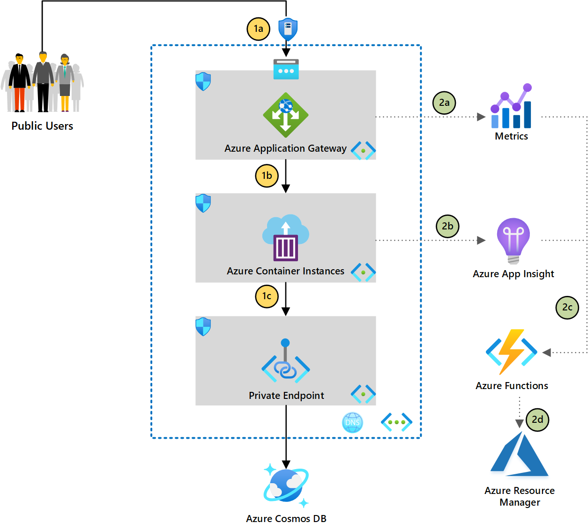

Containerization is a common approach to app modernization. You might consider using Azure Kubernetes Service for advanced workloads, or use Azure Container Instances for simple container workloads, like a simple web application. This article focuses on performing infrastructure-level serverless automation for Azure Container Instances, together with Application Gateway.

We'll start with a common scenario. To secure Azure container instances, you can use container groups in Azure Container Instances, which allow you to deploy Azure container instances in a virtual network so that the containers can access other private resources or other Azure services via an Azure private endpoint. For customers hosting web applications, it's a common practice to have a web application firewall like Azure Application Gateway to front incoming traffic while using Azure Container Instances as a backend pool. This is a great starting point: [Expose a static IP address for a container group
](/azure/container-instances/container-instances-application-gateway).

One potential challenge with this approach is using a non-static private IP address as a backend pool. The private IP might be rotated during maintenance, requiring the cloud admin to manually reconfigure the backend pool. If new containers are added for scaling, the admin would also need to do reconfiguration to ensure traffic is routed to the right backend pool. And liveness probes and readiness probes aren't supported in container groups, which makes it harder to identify workload downtime.

This article explores additional enhancement to address these common issues, by adopting Azure Application Insights for apps monitoring, Azure Monitor, and using Azure Functions to perform auto rotation of private IP. This approach will improve the redundancy of the workload by introducing automation.

## Potential use cases

The architecture works best for:
- Serverless deployment is preferred
- Minimal operation for cloud native workload with automation
- Simple container workload that doesn't require advanced container orchestration capability
- High redundant external facing workload, with auto reconfiguration
- Container workload that requires to access private resources, such as those exposed by Azure Private Endpoint

## Architecture

#### Part 1 - Typical Web Application Traffic Flow
1a. Application Gateway has web application firewall capability, which is ideal to front public facing traffic before hitting backend workload. The Application Gateway will expose public IP address, hence having Azure DDoS Protection provides additional layer of protection.

1b. Backend pool of Application Gateway is configured using private IP address of Azure Container Instance in container group. Note that Azure Container Instance in container group doesn't come with fully qualified domain name (FQDN), hence IP address is the only way.

1c. Containers in Azure Container Instances can consume private resources, such as Azure Cosmos DB via private link.

#### Part 2 - Enhancement with Automation
2a. Metrics of Application Gateway contains **Healthy Host Count**, which can be used as liveness probe for Azure Container Instance, given that container group in Azure Container Instances doesn't support liveness and readiness probe.

2b. Azure Application Insight can be used within containers to collect additional metrics, including a custom thread to send heartbeat to Azure Application Insight for monitoring purproses.

2c. Alerts can be configured based on threshold level defined in step 2a and 2b. As an example, if the system has 3 container instainces running as backend pool, when **Healthy Host Count** < 3, an alert is fired. Under action group of **Alert rules**, Azure Functions can be used as one of the action type to trigger custom action.

2d. Azure SDK is used in Azure Functions, to get the configuration of existing container instances, and recreate the same instances using the SDK. This function will be triggered whenever there's an alert defined in 2c. This function may take long running time, depending on the complexity of setup. Azure Functions may timeout, so Azure Durable Functions can be used to handle long running process and provide status update.

### Components

#### Automation

- [Azure Durable Functions](/azure/azure-functions/durable/durable-functions-overview?tabs=csharp): Unlike Azure Functions, Durable Functions is stateful, and it can support several stateful workflow patterns. In this example, [monitoring pattern](/azure/azure-functions/durable/durable-functions-overview?tabs=csharp#monitoring) is being used.
- [Azure SDK](https://azure.microsoft.com/en-us/downloads/): Azure SDKs are collections of libraries that allows developers to interact with Azure Services using preferred programming language. This gives more flexibility for users to integrate logic to perform automation.

#### Monitoring

- [Azure Monitor Metrics](/azure/azure-monitor/essentials/data-platform-metrics): This is a feature within Azure Monitor, which has predefined numeric data that Azure Monitor collects from respective Azure services.
- [Action Group](/azure/azure-monitor/alerts/action-groups): This is a collection of notification preference defined by resource owner. Notification channel and actions can be defined based on triggered alerts.

#### Networking

- [Azure DDoS Protection Standard](/azure/ddos-protection/ddos-protection-overview): Azure DDoS Basic is free and enabled on all public IP. Azure DDoS Protection provides additional capability such as ingesting logs to other location, and ability to engage DDoS Protection Rapid Response team.
- [Azure Application Gateway](/azure/web-application-firewall/ag/ag-overview): Web Application Firewall provides protection to public facing application such as SQL injectionm CSS Attack etc.
- [Azure Private Link](/azure/private-link/private-link-overview): Azure Private Link enable access to Azure PaaS via private endpoint on Microsoft backbone to further enhance network access security.

#### Application

- [Azure Container Instances](/azure/container-instances/container-instances-overview): Azure Container Instances runs container images seamlessly without the hassle of setting up additional infrastructure. [Azure Kubernetes Service (AKS)](/azure/aks/) should be considered for advanced container orchestration requirements.

- [Azure Cosmos DB](/azure/cosmos-db/introduction): It's a fully managed NoSQL database which supports multiple API such as SQL, Cassandra or MongoDB.
- [Azure Key Vault](/azure/key-vault/general/overview): As security best practice, developers don't store connection string as clear text in application source code. Azure Key Vault serves as the cnetral location to store secrets securely and application can retrieve necessary key securely.

### Alternatives

The scenario above updates backend pool for Azure Application Gateway. As an alternative, Azure Private DNS Zone can be used as target backend for Azure Application Gateway, and use Azure Functions to update A record, instead of making changes on Azure Application Gateway. The deployment time will be shorter. On the flip side, metrics of Azure Application Gateway will not be able to identify host count, as it's abstracted by DNS, hence this automation need to be triggered from application monitoring perspective, such as Application Insights or Azure Monitor directly. 

Azure provides multiple options to host container-based workload such as [Azure Kubernetes Service](/azure/aks/intro-kubernetes) and [Azure App Services](/azure/app-service/quickstart-custom-container?tabs=dotnet&pivots=container-linux).

Azure Kubernetes Service provide advanced container orchestration and network capability, such as the concept of [service](https://kubernetes.io/docs/concepts/services-networking/service/) which is not present in Azure Container Instances, hence this reference architecture to address this requirement.

App Services can host container workload as well, and [App Service Environment](/azure/app-service/environment/intro) allows developers to deploy App Services inside Azure Virtual Network. Pricing structure of Azure Container Instances make it compelling for small workload compare to App Services.

## Considerations

### Availability

As liveness and readiness probe is not supported in container group, it is recommended to use Azure Metrics, as well as Azure Application Insights to perform monitoring. Container health or uptime is not a deterministic approach to determine if the system is still operating end to end.

### Operations

Azure Durable Functions is used to reconfigure infrastructure, in the event of failure in Azure Container Instances, or private IP of container group has changed. As mentioned in the [documentation](/azure/container-instances/container-instances-virtual-network-concepts), the provisioning process takes slightly longer duration. Users may still experience minimal downtime, if the containers are not ready in time.

While this architure added additional layer of resiliency, it is still recommended to configure monitoring capability within the application, and also pay attention to [Azure Status](https://status.azure.com/status), in the event of platform failure.

### Scalability

CPU and memory requirement is defined during container creation, hence you will not be able to perform vertical scaling directly. However, additional containers can be added into the container group to scale horizontally. However, do note that each container in the container group will consume 1 private IP hence the limit would the the provisioned subnet size.

Another important consideration on scaling is the state of this application. The application need to handle the state, either locally or with external services such as [Azure Cache for Redis](/azure/azure-cache-for-redis/cache-overview) to ensure scaling on demand doesn't create data loss in the application.

### Security

The ability to deploy PaaS into Virtual Network (VNET Injection) doesn't improve security posture if setup is not done properly. With VNET injection, it allows admin to have more control on network angle, such as tighter network security group, or leverage resources not exposed publicly.

Private Link projects a private endpoint into Virtual Network, and this allow the application to access Azure PaaS directly via private IP address, and at the same time, admin can further control who can access the relevant Azure PaaS.

If container images are stored in [Azure Container Registry](/azure/container-registry/), you can enable [Azure Defender for container registries](/azure/security-center/defender-for-container-registries-introduction) to perform container image vulnerability scan.

## Deploy this scenario

Sample source code, with Azure Functions performing automation: [GitHub](https://github.com/mspnp/aci-auto-healing)

You will need a service principal (client ID + secret), which will be used by Azure Functions to perform Azure Resource Manager operations. This service principal requires at least owner rights in that resource group, so that it can update Azure Application Gateway and create Azure Container Instances. This sample create a simple Python application, being containerized and stored in Azure Container Registry, do update the registry with your own application.

## Pricing

Use the [Azure Pricing Calculator](https://azure.microsoft.com/pricing/calculator/) to estimate costs for Azure resources.

See [here](https://azure.com/e/437a828a735f44c6b942c72ef67ade58) as an example on implmentation above.

## Next steps

- [Architect modern applications in Azure](/learn/paths/architect-modern-apps/)
- [Implement network security in Azure](/learn/paths/implement-network-security/)

## Related resources

- [Azure Serverless Computing Cookbook](https://azure.microsoft.com/resources/azure-serverless-computing-cookbook/)
- [Azure Architecture Center - Automation](https://docs.microsoft.com/en-us/azure/architecture/browse/?terms=automation)
- [Azure Architecture Center - Serverless](https://docs.microsoft.com/en-us/azure/architecture/browse/?terms=serverless)
