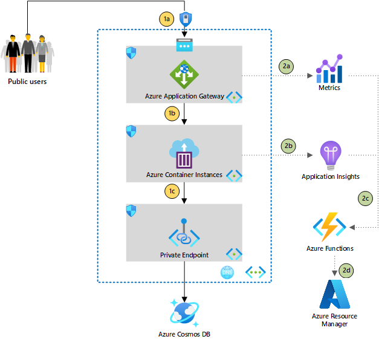

Containerization is a common approach to app modernization. You might consider using Azure Kubernetes Service for advanced workloads, or use Azure Container Instances for simple container workloads, like a simple web application. This article focuses on implementing infrastructure-level serverless automation for Container Instances when Application Gateway is used as a firewall.

We'll start with a common scenario. To secure Azure container instances, you can use container groups in Azure Container Instances. By using container groups, you can deploy Azure container instances in a virtual network so that the containers can access other private resources or other Azure services via an Azure private endpoint. For customers hosting web applications, it's a common practice to use a web application firewall like Azure Application Gateway to front incoming traffic while using Azure Container Instances as a backend pool. This article is a great starting point: [Expose a static IP address for a container group](/azure/container-instances/container-instances-application-gateway).

One potential challenge with this approach is using a non-static private IP address as a backend pool. The private IP might be rotated during maintenance, requiring the cloud admin to manually reconfigure the backend pool. If new containers are added for scaling, the admin would also need to do reconfiguration to ensure traffic is routed to the right backend pool. And liveness probes and readiness probes aren't supported in container groups, which make it harder to identify workload downtime.

This article explores enhancements to address these common problems through the adoption of Application Insights and Azure Monitor for monitoring and using Azure Functions to perform automatic rotation of private IPs. This approach improves the redundancy of the workload.

## Potential use cases

This architecture works best for:

- Serverless deployment.
- Minimal operation for a cloud-native workload with automation.
- A simple container workload that doesn't require advanced container orchestration.
- A highly redundant, external-facing workload with automated reconfiguration.
- A container workload that requires access to private resources, like those exposed by Azure private endpoints.

## Architecture

*Download a [Visio file](https://arch-center.azureedge.net/Architecture.vsdx) of this architecture.*

### Dataflow

#### Part 1: Typical web application traffic flow

1a. Application Gateway has web application firewall capability, which is ideal for fronting public-facing traffic before it hits the backend workload. Application Gateway exposes the public IP address, so Azure DDoS Protection provides another layer of protection.

1b. The backend pool of Application Gateway is configured with the private IP address of the Azure container instance in a container group. Azure container instances in container groups don't come with fully qualified domain names (FQDN), so the IP address has to be used.

1c. Containers in Azure Container Instances can consume private resources, like Azure Cosmos DB, via private links.

#### Part 2: Enhancements with automation

2a. Application Gateway includes a **healthy host count** metric that you can use as a liveness probe for Azure container instances, given that container groups in Container Instances don't support liveness or readiness probes.

2b. Application Insights is used in containers to collect other metrics, including heart beats, which can be sent to Application Insights for monitoring via a custom thread.

2c. You can configure alerts based on threshold levels defined in steps 2a and 2b. For example, assume your system has three container instances running as a backend pool. You could configure an alert to fire when **healthy host count** is less than 3. In an action group of alert rules, you can use an Azure function as the action type to trigger the custom action.

2d. In the Azure function, an Azure SDK is used to get the configuration of existing container instances and re-create the same instances. This function is triggered by the alert defined in step 2c. This function might take a long time to run, depending on the complexity of the setup. Azure functions can time out, so you can use Azure Durable Functions to handle long-running processes and get status updates.

### Components

#### Automation

- [Azure Durable Functions](/azure/azure-functions/durable/durable-functions-overview): Unlike Azure Functions, Durable Functions is stateful and supports several stateful workflow patterns. In this example, the [monitor pattern](/azure/azure-functions/durable/durable-functions-overview?tabs=csharp#monitoring) is used.
- [Azure SDKs](https://azure.microsoft.com/downloads): Azure SDKs are collections of libraries that you can use to interact with Azure services in your preferred programming language. The SDKs give you more flexibility for integrating logic that performs automation.

#### Monitoring

- [Azure Monitor Metrics](/azure/azure-monitor/essentials/data-platform-metrics): This feature of Azure Monitor collects predefined numeric data from Azure services.
- [Action groups](/azure/azure-monitor/alerts/action-groups): An action group is a collection of notification preferences defined by the resource owner. You can define notification channels and actions based on triggered alerts.

#### Networking

- [Azure DDoS Protection](https://azure.microsoft.com/services/ddos-protection): Azure DDoS (Basic) Protection is free and enabled on all public IPs. Azure DDoS Network Protection provides more capabilities, like ingesting logs to other locations and the ability to engage the DDoS Protection Rapid Response team.
- [Azure Application Gateway](https://azure.microsoft.com/services/application-gateway): Azure Web Application Firewall provides protection for public-facing applications against exploits like SQL injection and XSS attacks.
- [Azure Private Link](https://azure.microsoft.com/services/private-link): Azure Private Link provides access to Azure PaaS services via a private endpoint on the Microsoft backbone to further enhance network access security.

#### Application

- [Azure Container Instances](https://azure.microsoft.com/services/container-instances): Azure Container Instances runs container images seamlessly without requiring you to set up another infrastructure. You should consider [Azure Kubernetes Service (AKS)](https://azure.microsoft.com/services/kubernetes-service) for advanced container orchestration.
- [Azure Cosmos DB](https://azure.microsoft.com/services/cosmos-db): Azure Cosmos DB is a fully managed NoSQL database that supports multiple platforms, like SQL, Cassandra, and MongoDB.
- [Azure Key Vault](https://azure.microsoft.com/services/key-vault): As a security best practice, developers don't store connection strings as clear text in application source code. Azure Key Vault serves as a central location to store secrets with improved security. Applications can retrieve necessary keys with improved security.

### Alternatives

The preceding scenario updates a backend pool for Application Gateway. As an alternative, you could use an Azure private DNS zone as a target backend for Application Gateway and use Azure functions to update a record instead of making changes on Application Gateway. This alternative would reduce deployment time. On the other hand, Application Gateway metrics wouldn't be able to identify the host count because it would be abstracted by DNS. So this automation would need to be triggered through an application monitoring solution like Application Insights or Azure Monitor directly.

Azure provides multiple options to host container-based workloads, like [Azure Kubernetes Service](/azure/aks/intro-kubernetes) and [Azure App Service](/azure/app-service/quickstart-custom-container).

Azure Kubernetes Service provides advanced container orchestration and network capabilities like the [Service resource](https://kubernetes.io/docs/concepts/services-networking/service), which isn't available in Container Instances. This reference architecture addresses this requirement.

App Service can also host container workloads, and [App Service Environment](/azure/app-service/environment/intro) allows developers to deploy App Service in Azure Virtual Network. The pricing structure of Container Instances, as compared to App Service, makes it compelling for small workloads.

## Considerations

### Availability

Because liveness and readiness probes aren't supported in container groups, we recommend that you use Azure Monitor Metrics and Azure Application Insights for monitoring. Container health and uptime aren't deterministic approaches to determine if a system is operating end to end.

### Operations

Azure Durable Functions is used to reconfigure infrastructure if there's a failure in Container Instances or if the private IP of a container group changes. As noted in the [documentation](/azure/container-instances/container-instances-virtual-network-concepts), the provisioning process takes slightly longer. Users might experience minimal downtime if the containers aren't ready in time.

This architecture adds a layer of resiliency. But we still recommend that you configure monitoring in the application and monitor [Azure status](https://status.azure.com/status) for platform failures.

### Scalability

CPU and memory requirements are defined when containers are created, so you won't be able to perform vertical scaling directly. You can add containers to the container group to scale horizontally. But note that each container in the container group will consume one private IP, so the limit would be the provisioned subnet size.

Another important consideration for scaling is the state of the application. The application needs to handle the state, either locally or by using external services like [Azure Cache for Redis](/azure/azure-cache-for-redis/cache-overview), to ensure scaling on demand doesn't create data loss in the application.

### Security

The ability to deploy PaaS into a virtual network (VNet injection) doesn't improve security if the configuration isn't set up correctly. VNet injection gives admins more network control, providing benefits like tighter network security groups and the use of resources not exposed publicly.

Private Link projects a private endpoint into the virtual network, which allows the application to access Azure PaaS directly via a private IP address. At the same time, admins can further control who can access the relevant Azure PaaS.

If you store container images in [Azure Container Registry](/azure/container-registry), you can enable [Microsoft Defender for container registries](/azure/security-center/defender-for-container-registries-introduction) to perform container image vulnerability scans.

## Deploy this scenario

Sample source code, with Azure Functions performing automation, is available on [GitHub](https://github.com/mspnp/aci-auto-healing).

You'll need a service principal (client ID and secret). It will be used by Azure Functions to perform Azure Resource Manager operations. This service principal requires at least owner rights in the resource group so it can update Application Gateway and create Azure container instances. The sample creates a simple Python application, containerized and stored in Container Registry. Update the registry with your own application.

## Pricing

Use the [Azure pricing calculator](https://azure.microsoft.com/pricing/calculator) to estimate costs for Azure resources.

See [this example](https://azure.com/e/437a828a735f44c6b942c72ef67ade58) of the preceding implementation.

## Contributors

*This article is maintained by Microsoft. It was originally written by the following contributors.*

Principal author:

 * [Marcus Tee](https://www.linkedin.com/in/teeguangyingmarcus) | Technical Strategy & Roadmap

## Next steps

- [Architect modern applications in Azure](/training/paths/architect-modern-apps)
- [Implement network security in Azure](/training/paths/implement-network-security)
- [Azure Serverless Computing Cookbook](https://azure.microsoft.com/resources/azure-serverless-computing-cookbook)

## Related resources

Browse our architectures:
- [Azure Architecture Center: Automation](/azure/architecture/browse/?terms=automation)
- [Azure Architecture Center: Serverless](/azure/architecture/browse/?terms=serverless)

Related guidance:
- [Serverless Functions architecture](/azure/architecture/serverless-quest/serverless-overview)
- [Run containers in a hybrid environment](/azure/architecture/hybrid/hybrid-containers)
- [Bursting from AKS with ACI](/azure/architecture/solution-ideas/articles/scale-using-aks-with-aci)
- [Protect APIs with Application Gateway and API Management](/azure/architecture/reference-architectures/apis/protect-apis)
- [Firewall and Application Gateway for virtual networks](/azure/architecture/example-scenario/gateway/firewall-application-gateway)
- [Zero-trust network for web applications with Azure Firewall and Application Gateway](/azure/architecture/example-scenario/gateway/application-gateway-before-azure-firewall)
