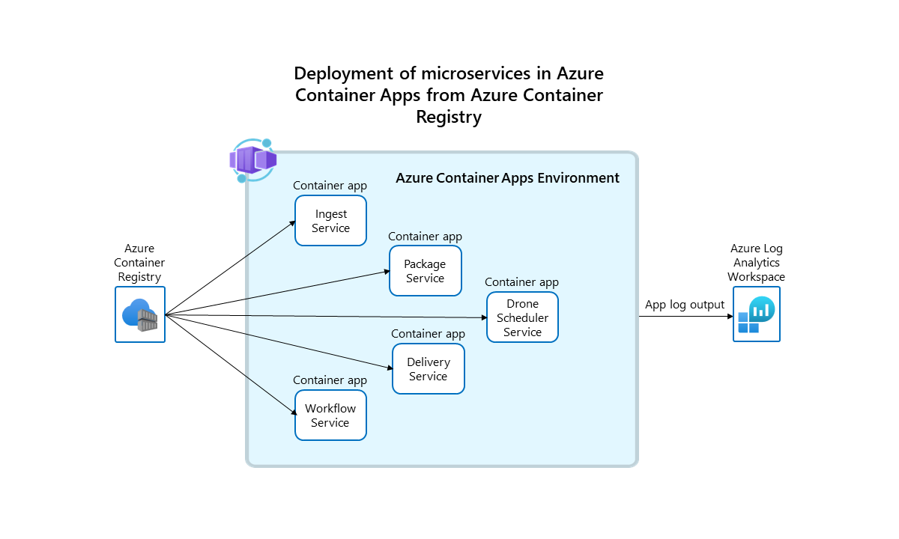
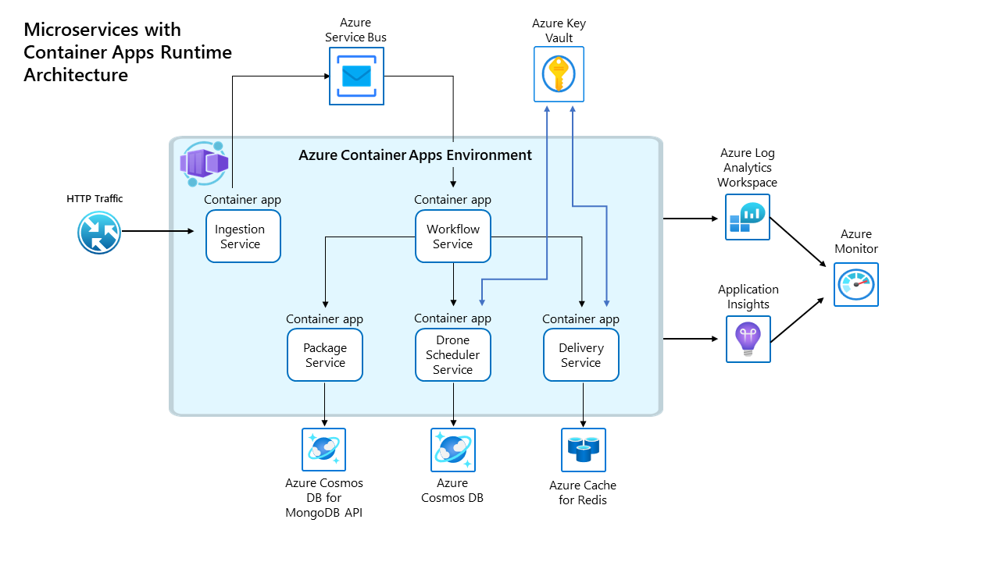

Your business can simplify the deployment and management of microservice containers by using Azure Container Apps Preview. Container Apps provides a fully managed serverless environment for building and deploying modern applications.

This example scenario demonstrates how to deploy microservice containers without needing to manage complex infrastructure and container orchestration.  

Fabrikam, Inc. (a fictional company) has implemented a drone delivery service where users can request a drone to pick up goods for delivery. When a customer schedules a pickup, a backend system assigns a drone and notifies the user with an estimated delivery time. While the delivery is in progress, the customer can track the location of the drone, with a continuously updated ETA. The application is composed of containerized microservices and was originally deployed to Azure Kubernetes Service.

With Azure Container Apps, Fabrikam can run their containerized applications on a flexible, serverless platform purpose-built to support microservices. Azure Container Apps runs on Azure Kubernetes Service, and includes several open-source projects: Kubernetes Event Driven Autoscaling (KEDA), Distributed Application Runtime (Dapr), and Envoy. This open-source foundation enables teams to build and run portable applications powered by Kubernetes and open standards. By using built-in platform capabilities, teams can avoid the management complexity of working with the Kubernetes platform and APIs directly.

Because the Fabrikam team wasn't making use of many of advanced AKS configuration settings, they were able to migrate their application to Azure Container Apps without much overhead. By porting their solution to Azure Container Apps, Fabrikam took advantage of:

1. Migrating the application as-is: No code changes were required when moving their application from AKS to Azure Container Apps.
1. Deploying with Bicep templates: No Kubernetes YAML manifests were needed to deploy their application containers.
1. Exposing apps through managed ingress: Built-in support for external, https-based ingress to expose the Ingestion Service removed the need for configuring their own ingress.
1. Pulling container images from ACR: Azure Container Apps doesn't require a specific base image or registry.
1. Managing application lifecycle: The revision feature supports running multiple revisions of a particular container app and traffic-splitting across them for A/B testing or Blue/Green deployment scenarios.

You can find a code sample in the [Container Apps Example Scenario](https://github.com/mspnp/container-apps-fabrikam-dronedelivery) repository.

## Potential use cases

In this example solution, the use cases are:

- Deploy a brownfield microservice-based application into a platform as a service (PaaS) offering to avoid the operational complexity of managing a container orchestrator.
- Optimize operations and management by migrating containerized services to a platform that supports native scale-to-zero.
  - Execute a long-running background process, such as the workflow service in single revision mode.
  
Other common uses of Container Apps include:

- Running containerized workloads on a serverless, consumption-based platform.
- Autoscaling applications based on HTTP/HTTPS traffic and/or Event-driven triggers supported by KEDA
- Minimizing maintenance overhead for containerized applications
- Deploying API endpoints
- Hosting background processing applications
- Handling event-driven processing

## Architecture

In this scenario, the container images are sourced from Azure Container Registry and deployed to a Container Apps environment.  

The services sharing the same environment benefit from:

- Internal ingress and service discovery
- A single Log Analytics workspace for runtime logging
- Secure management of secrets and certificates

The containers apps are running in single revision mode.  A container app running in single revision mode will have a single revision that is backed by zero-many replicas. A replica is composed of the application container and any required sidecar containers. This example isn't making use of sidecar containers, therefore each container app replica represents a single container.  Since this example doesn't employ scaling, there will be only one replica running for each container app.

This diagram illustrates the runtime architecture for the solution.  

### Workflow

1. **Ingestion service:** Receives client requests, buffers them and sends them via Azure Service Bus to the workflow service.
1. **Workflow service:**  Consumes messages from Azure Service Bus and dispatches them to underlying services.
1. **Package service:** Manages packages.
1. **Drone scheduler service:** Schedules drones and monitors drones in flight.
1. **Delivery service:** Manages deliveries that are scheduled or in-transit.

### Components

The drone delivery service uses a series of Azure services in concert with one another.

**[Azure Container Apps](https://azure.microsoft.com/services/container-apps)

Many of the complexities of the previous AKS architecture are replaced by these features:

- Built-in service discovery
- Fully managed HTTP and HTTP/2 endpoints
- Integrated load balancing
- Logging and monitoring
- Autoscaling based on HTTP traffic or events powered by KEDA
- Application upgrades and versioning

### External storage and other components

**[Azure Key Vault](https://azure.microsoft.com/services/key-vault)** service for securely storing and accessing secrets, such as API keys, passwords, and certificates.

**[Azure Container Registry](https://azure.microsoft.com/services/container-registry)** stores private container images. You can also use other container registries like Docker Hub.

**[Azure Cosmos DB](https://azure.microsoft.com/services/cosmos-db)** stores data using the open-source [Azure Cosmos DB API for MongoDB](/azure/cosmos-db/mongodb-introduction). Microservices are typically stateless and write their state to external data stores. Azure Cosmos DB is a NoSQL database with open-source APIs for MongoDB and Cassandra.

**[Azure Service Bus](https://azure.microsoft.com/services/service-bus)** offers reliable cloud messaging as a service and simple hybrid integration. Service Bus supports asynchronous messaging patterns that are common with microservices applications.

**[Azure Cache for Redis](https://azure.microsoft.com/services/cache)** adds a caching layer to the application architecture to improve speed and performance for heavy traffic loads.

**[Azure Monitor](/azure/azure-monitor)** collects and stores metrics and logs. Use this data to monitor the application, set up alerts and dashboards, and do root cause analysis of failures.  This scenario uses a Log Analytics workspace for comprehensive monitoring of the application.

**[Application Insights](/azure/azure-monitor/app/app-insights-overview)** provides extensible application performance management (APM) and monitoring for the services.  each service is instrumented with the Application Insights SDK to monitor the app and direct the telemetry data to Azure Monitor.

**[Azure Resource Manager (ARM) Templates](/azure/azure-resource-manager/templates/overview)** to configure and deploy the applications.

### Alternatives

An alternative scenario of this example is the Fabrikam Drone Delivery application using Kubernetes, which is available on GitHub in the [Azure Kubernetes Service (AKS) Fabrikam Drone Delivery](https://github.com/mspnp/aks-fabrikam-dronedelivery) repository.

## Considerations

### Availability

Container Apps allows you to more easily deploy, manage, maintain and monitor the applications.

Container updates automatically trigger revisions for zero downtime between application updates.  These revisions can be managed and traffic split between the revisions to support blue/green deployments and A/B testing.

Integration with Azure Monitor allows you to track container app execution. You can set alerts on these metrics to monitor problems that arise.  When an app unexpectedly terminates, the Container Apps service automatically restarts it.  

You can enable autoscaling rules to meet demand as workloads increase. When the application scales, more replicas spawn to ensure availability.  Performance is optimized by the dynamic load balancing features of Container Apps.

### Operational excellence

To achieve operational excellence, the Container Apps service offers these features:

- GitHub Actions integration for setting up automated CI/CD deployments.
- Multi-revision mode with traffic splitting for testing changes to your application code and scale rules.
- Integration with Azure Monitor and Log Analytics to provide insight into your containerized application.

### Performance

Performance considerations in this solution:

- The workload is distributed among multiple microservice applications.
- Each microservice is independent sharing nothing with the other microservices so that they can independently scale.
- Autoscaling can be enabled as the workload increases.
- Requests are dynamically load-balanced.
- Metrics, including CPU and memory utilization, bandwidth information and storage utilization, are available through Azure Monitor.
- Log analytics provides log aggregation to gather information across each Container Apps environment.

### Reliability

Container Apps will attempt to restart failing containers and abstracts away hardware from users. Transient failures and high-availability of backing compute is handled by Microsoft.

Performance monitoring through Log Analytics and Azure Monitor allows you to evaluate the application under load.  These metrics give you the data needed to diagnose issues and perform root-cause analysis of failures.

### Security

- Secrets:  Your Container Apps can store and retrieve sensitive values as secrets. Once a secret is defined for a Container App, it's available for use by the application and any associated scale rules. If you're running in multi-revision mode, all revisions will share the same secrets. Because secrets are considered an application-scope change, if you change the value of a secret, no new revision is created. However, for any running revisions to load the new secret value, you'll need to restart them. In this scenario, application and environment variable values are used.

- Environment variables: sensitive values can be securely stored at the application level.  When environment variables are changed, the container app will spawn a new revision.

- Network security:  Backend services in the drone delivery app aren't exposed via external ingress. All requests are passed from the **Ingestion service** through the Azure Service Bus.

<!--  Add when feature is complete
- Container Apps supports Managed Identities allowing your app to easily authenticate other Azure AD-protected resources such as Azure Key Vault, without managing credentials in your container app.  For services that don't support AD authentication, you can store secrets in Azure Key Vault and use the managed identity to access Key Vault to access the secrets. 
-->

## Deploy this scenario 

Follow the steps in the README.md in the [sample repository](https://github.com/mspnp/container-apps-fabrikam-dronedelivery) to deploy this scenario.

## Pricing

- The [Cost section in the Microsoft Azure Well-Architected Framework](/azure/architecture/framework/cost/overview) describes cost considerations. Use the [Azure pricing calculator](https://azure.microsoft.com/pricing/calculator) to estimate costs for your specific scenario.
<!--
- [Container Apps pricing]().  We can add the link when the document is published.
 -->
- Azure Container Apps has consumption based pricing model.
- Azure Container Apps supports scale to zero.  When a container app is scaled to zero, there's no charge.
- In this scenario, the Azure Cosmos DB and Azure Cache for Redis services generate most of the costs.  
- To avoid accruing charges, don't leave this example running.

## Next steps

- [Azure Container Apps Documentation](/azure/container-apps/?branch=release-ignite-container-apps)
- [Azure Kubernetes Service (AKS) Fabrikam Drone Delivery GitHub repo](https://github.com/mspnp/aks-fabrikam-dronedelivery)

## Related resources

- [Build microservices on Azure](/azure/architecture/microservices/)
- [Design a microservices architecture](/azure/architecture/microservices/design/)
- [Microservices with AKS](/azure/architecture/solution-ideas/articles/microservices-with-aks)
- [Advanced Azure Kubernetes Service (AKS) microservices architecture](/azure/architecture/reference-architectures/containers/aks-microservices/aks-microservices-advanced)
- [Microservices architecture on Azure Kubernetes Service](/azure/architecture/reference-architectures/containers/aks-microservices/aks-microservices)
- [Microservices architecture on Azure Service Fabric](/azure/architecture/reference-architectures/microservices/service-fabric)
