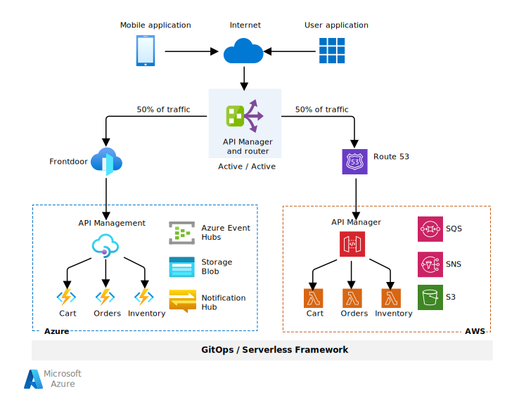
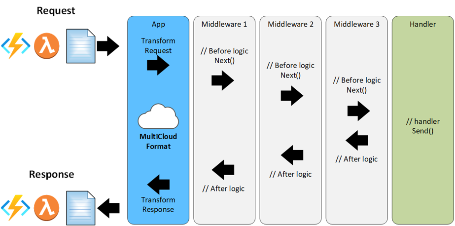
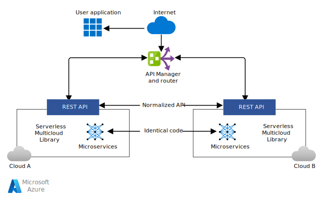
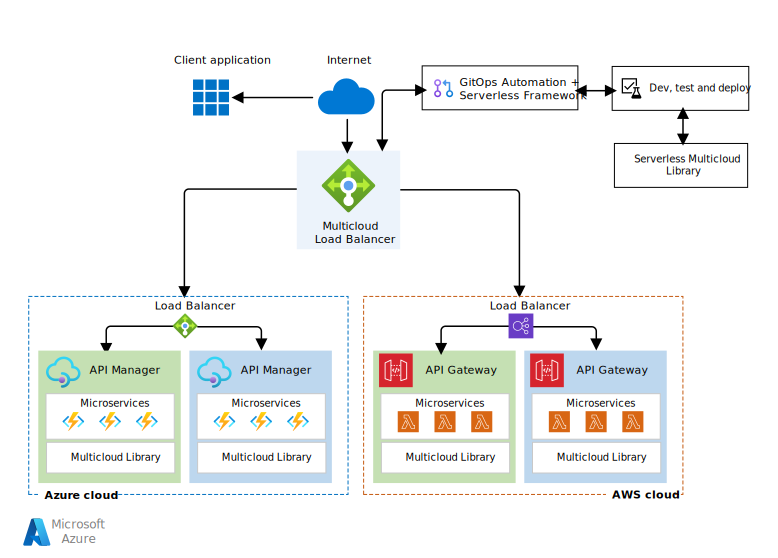

This article describes how the Microsoft Commercial Software Engineering (CSE) team partnered with a global retailer to deploy a highly available serverless solution across both Azure and Amazon Web Services (AWS) cloud platforms, using the [Serverless Framework](https://serverless.com).

## Architecture

*Download a [Visio file](https://arch-center.azureedge.net/serverless-multicloud.vsdx) of this architecture.*

### Dataflow

- The user app can come from any source capable of logging into the cloud. In this implementation, the user logs into a gateway app that load balances requests 50-50 between the Azure and AWS clouds.
- Any response also routes through the API Manager gateway, which then sends it to the requestor app.

### Components

#### The Serverless Framework
This solution uses the Serverless Framework, available from [Serverless, Inc](https://serverless.com/). The free version of the Serverless Framework includes a CLI, more plugins, and limited monitoring services. The Pro edition features operational capabilities across clouds, such as enhanced monitoring and alerts. The framework supports Node.js and Python languages, and both AWS and Azure cloud hosts.

To use Azure with the Serverless Framework, you need:

- Node.js, to package microservices
- Azure Functions, to provide functionality comparable to other cloud platforms
- The Serverless Framework, to support multicloud deployment and monitoring
- The Serverless Multicloud Library, to provide normalized runtime APIs for developers
- The Azure Functions Serverless Plugin, to support multicloud deployment. This plugin wasn't initially up to parity with the comparable AWS Lambda plug-in, and was extended for this project.

The following figure shows the processing pipeline. The middleware layers represent any intermediate functionality needed before reaching the handler.

#### Cloud-agnostic APIs

The serverless implementation on each platform supports individual functions as microservices, one to each functional VM node, and executes processing as needed. Each AWS Lambda function has a corresponding Azure Functions function. The *Serverless Multicloud Library* builds analogous microservices from either cloud into a cloud-agnostic *normalized REST API* that client apps can use to interface with either platform. Because the abstracted API layer provides code to address the corresponding microservices for each platform, transactions don't need translation. The cloud-agnostic interface lets user apps interact with the cloud without knowing or caring which cloud platform they're accessing.

The following diagram illustrates this concept:

#### CI/CD with GitOps

A primary job of the Serverless Framework is to abstract away all the infrastructure concerns of deploying an app to the cloud. By using a manifest-based approach, the Serverless Framework can deal with all deployment issues, allowing deployment to be automated as needed to support GitOps.

Although this initial project used manual deployments, it's realistic to implement manifest-driven serverless builds, tests, and deployments within or across clouds. This process can use a GitOps developer workflow: building from Git, using quality gates for test and evaluation, and pushing serverless solutions onto both cloud providers. Performing all deployments using the Serverless Framework from the beginning of the project is the most efficient way to proceed.

#### API manager

The API Manager can be an existing or custom application. The Apigee&trade; API Manager in this implementation acted only as a router to provide a 50-50 transaction load balance to the two cloud platforms, and was underutilized for its capabilities.

The API Manager must be able to:

- Be deployed inside or outside a cloud platform as needed
- Route messages to and from both cloud platforms
- Log traffic requests to coordinate asynchronous message traffic
- Relay requests and responses using the common REST API from and to the user application
- Monitor the health of both cloud serverless framework deployments to validate their ability to receive requests
- Perform automated health and availability checks on each cloud platform, to support routing and high availability

### Alternatives

- Other languages such as Python could implement the solution, as long as they're supported by the serverless implementations of the cloud platforms, AWS Lambda and Azure Functions in this case. This project used Node.js to package the microservices, because the customer was comfortable with Node.js, and both AWS and Azure platforms support it.

- The solution can use any cloud platform that supports the Serverless Framework, not just Azure and AWS. Currently, the Serverless Framework reports compatibility with eight different cloud providers. The only caveat is to ensure that the elements that support the multicloud architecture or its equivalent are available on the target cloud platforms.

- The API Manager in this initial implementation acted only as a router to provide a 50-50 transaction load balance to the two cloud platforms. The API Manager could incorporate other business logic for specific scenarios.

## Scenario details

In *serverless computing*, the cloud provider dynamically allocates microservices resources to run code, and only charges for the resources used. Serverless computing abstracts app code from infrastructure implementation, code deployment, and operational aspects like planning and maintenance.

As with other services, each cloud provider has its own serverless implementation, and it's difficult for customers to use a different provider without considerable operational impact and costs. Potential customers may view this situation as weakening their bargaining position and agility. Vendor lock-in is one of the greatest obstacles to enterprise cloud adoption.

The open-source *Serverless Framework* is a universal cloud interface for developing and deploying serverless computing solutions across cloud providers. Open-sourcing and common APIs for serverless functions help providers, customers, and partners build cross-cloud solutions for best-of-breed services. The Serverless Framework reduces barriers to cloud adoption by addressing the problems of vendor lock-in and cross-cloud provider redundancy. Customers can optimize their solutions based on cost, agility, and other considerations.

CSE and the Azure product team collectively rewrote the *Serverless CLI* to support new Azure Functions features like Premium Functions, API Management, and KeyVault. The Serverless CLI now provides a standard interface for GitOps deployment to both Azure and AWS. The team also developed the *Serverless Multicloud Library*, which provides a *normalized runtime API* to deploy serverless apps to both AWS and Azure.

This design provides high availability with *active-active* failover between multiple cloud platforms, as opposed to *active-passive* failover. If the service of one cloud provider becomes unhealthy or unavailable, this solution can reroute requests to another cloud platform.

This project met the following technical goals:

- Create a cross-industry solution.
- Use the Multicloud Serverless Library to support a cloud-agnostic API that interfaces with microservices wherever they are deployed.
- Support a GitOps CI/CD process workflow for development, testing, and deployment on all supported cloud platforms.
- Use API-based access via an authenticated cloud gateway, and load balance between cloud platforms by using the gateway as a router.

Other potential benefits of using the Serverless Framework include:

- Prevention or reduction of vendor lock-in
- 40-60+% code reduction during development by using the Multicloud Serverless Library
- Development of best-of-breed solutions that combine different cloud providers' services
- Elimination of most platform and infrastructure complexity and maintenance requirements
- Easier data sharing, performance and cost comparisons, and ability to take advantage of special offerings
- Active-active high availability

### Potential use cases

- Write client-side applications for multiple platforms by using a cloud-agnostic API from the Serverless Multicloud Library.
- Deploy a collection of functional microservices in a serverless framework to multiple cloud platforms.
- Use a cloud-agnostic app across cloud platforms without knowing or caring which platform is hosting it.

## Considerations

- This article doesn't describe security solutions, although the initial deployment included them. There are many possible security solutions, some platform dependent, and this framework should accommodate any reasonable solution. User authentication is the minimum security assumed.

- Because it's difficult to articulate the differences between AWS and Azure serverless functional offerings, early effort should focus on mapping the functions available on each cloud platform and identifying necessary transformation requirements. You can develop a platform-agnostic API from this information.

- Using an open-source solution may introduce risks, due to long-term maintenance and support challenges with any open-source software.

- In the free Serverless Framework, monitoring is limited primarily to the administrative dashboard. Monitoring is available in the paid enterprise offering. Currently, the Azure Functions Serverless Plugin doesn't include provisions for observability or monitoring, and would need modification to implement these capabilities.

- This solution could use metrics to compare performance and costs between cloud platforms, enabling customers to seamlessly optimize usage across cloud platforms.

## Deploy this scenario

A traditional *Blue-Green Deployment* develops and deploys an app to two separate but identical environments, blue and green, increasing availability and reducing risk. The blue environment is usually the production environment that normally handles live traffic, and the green environment is a failover deployment as needed. Typically, the CI/CD pipeline automatically deploys both blue and green environments within the same cloud platform. This configuration is considered an *active-passive* configuration.

In the multicloud solution, blue-green deployment is implemented in both cloud platforms. In the serverless case, two duplicate sets of microservices are deployed for each cloud platform, one as the production environment and the other as the failover environment. This active-passive setup within each cloud platform reduces the risk that this platform will be down, increasing its availability, and enabling multicloud *active-active* high availability.

A secondary benefit of blue-green deployment is the ability to use the failover deployment on each cloud platform as a test environment for microservices updates, before releasing them to the production deployment.

## Next steps

- [Sample code](https://github.com/serverless/multicloud) and [README](https://github.com/serverless/multicloud/blob/master/README.md) for this implementation on GitHub
- [Serverless Framework](https://serverless.com)
- [Training: Introduction to Azure Functions](/training/modules/intro-azure-functions)
- [Overview of Azure Functions](/azure/azure-functions/functions-overview)

## Related resources

- [Serverless functions architecture design](../../serverless-quest/serverless-overview.md)
- [Serverless functions reference architectures](../../serverless-quest/reference-architectures.md)
- [Code walkthrough: Serverless application with Functions](../../web-apps/serverless/architectures/code.yml)
