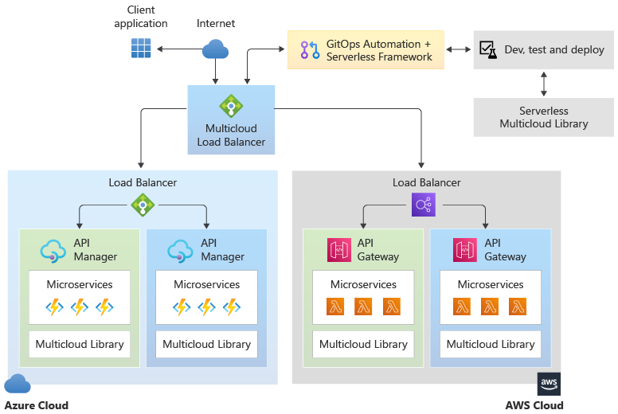

# Multi-cloud functions with Serverless Framework

This article describes how the Microsoft Commercial Software Engineering (CSE) team partnered with a global retailer to build a highly available, *active-active* microservices deployment solution leveraging the [Serverless Framework](https://serverless.com) across both Azure and Amazon Web Services (AWS) cloud platforms. 

An internal partnership between CSE and the Azure product team led to the enhancement of the Azure implementation of the Serverless Framework. The teams collectively rewrote the Serverless CLI to support new features in Azure Functions, including Premium Functions, API Management, and KeyVault. With such enhancements, the Serverless CLI now provides a standard interface for GitOps deployment to both Azure and AWS. Also, the team developed the *Serverless Multicloud Library*, which provides a normalized runtime API for serverless applications that can be deployed to both AWS and Azure.

Serverless computing abstracts application code from infrastructure implementation, code deployment details, and other operational aspects like planning and maintenance operations. Apps that use  microservices are abstracted from the cloud platform that hosts the services. 

Typically, each cloud provider has its own serverless computing implementation, with its own process and practices. When a customer depends on a particular cloud provider, it's hard to switch to another vendor without considerable operational impact and costs. Potential customers may view this situation as weakening their bargaining position and agility. Vendor lock-in is one of the greatest obstacles to enterprise cloud adoption. 

The Serverless Framework addresses the problem of vendor lock-in and cross-cloud provider redundancy by abstracting development across multiple cloud providers, based on common tools for developing and deploying serverless functions. In essence, this framework provides a universal cloud interface that enables deploying serverless computing solutions across multiple cloud providers. 

The Serverless Framework code is open-sourced. Open sourcing helps Microsoft teams and the customer and partner community build cross-cloud provider solutions, which reduces barriers to cloud adoption. This opens the door for leveraging best of breed services like Cognitive Services across cloud providers, giving the customer the ability to optimize based on price, time, and other considerations. 

One goal of this design was to provide a serverless solution that is hosted, load-balanced, and whose codebase is deployable on multiple cloud platforms, such as AWS and Azure. 

Another key goal of the design was to provide *active-active* failover between multiple cloud platforms, as opposed to *active-passive* failover. Because cloud platforms in the real world are occasionally unavailable for some reason, this capability enables cross-cloud redundancy. When the service of one cloud provider becomes unhealthy or unavailable, requests can be rerouted to an alternate cloud platform.

The implementation also included the following technical goals:

- Create a cross-industry solution.
- Support a common API to the different clouds with the Multicloud Serverless Library.
- Use API-based access via the authenticated cloud gateway.
- Use a common API for users to interface with microservices, wherever they are deployed.
- Use a third-party API Management Gateway as a router to load balance between cloud platforms.
- Support a GitOps CI/CD process workflow for development, testing, and deployment on all supported cloud platforms.

The goals were accomplished using a serverless framework to unify the deployment and operations of the solution to both cloud platforms, thus reducing associated effort and risk. By using Azure Functions and AWS Lambda functions, both platforms can implement this mirrored functionality. 

The benefits of this approach include:

- Greater uptime
- High availability with active-active deployment on multiple cloud platforms
- Ability to compare performance and analyze costs
- Best of breed solutions that combine services offered by the different cloud providers
- Prevention or reduction of vendor lock-in
- Easier data sharing between platforms
- Typically, 40-60+% code reduction during development with the Multicloud Serverless Library
- Elimination of most platform/infrastructure complexity and maintenance requirements

## Potential use cases

A collection of functional microservices in a serverless framework can be deployed on two different cloud platforms. Client-side applications can access the functional microservices on either platform by using the same cloud-agnostic API, established by the Multicloud Library.

## Architecture

1. The user application can come from any source capable of logging into the cloud. In this implementation, the user logs into a gateway application that functions as a load balancer between the Azure and AWS clouds, initially set for 50/50 load sharing. 
1. Any response generated is also routed through the API Manager Gateway, which then sends the response on to the requestor user app. 

A breakdown of the processing pipeline is shown in the figure below. Note that the middleware layers represent any intermediate functionality needed prior to reaching the handler.

### Serverless Framework
Serverless technology is a fundamental requirement of this approach, because of the use of microservices. The solution used here is the Serverless Framework, available from [Serverless, Inc](https://serverless.com/). The free version of the Serverless Framework includes a CLI, additional plugins, and limited monitoring services. The Pro edition features operational capabilities across clouds such as enhanced monitoring and alerts. The framework supports Node.js and Python languages, and both AWS and Azure as cloud hosts.

The current requirements to use Azure with the Serverless Framework include:

- Node.js, to support microservice code
- The Serverless Framework, to support multi-cloud deployment and monitoring
- The Serverless Multicloud Library, to provide a normalized runtime API for developers building the microservices
- Azure Functions, to host microservices functionality comparable to other cloud platforms used
- The Azure Functions Serverless Plugin, to support multi-cloud deployment. This plugin wasn't initially up to parity with the comparable AWS Lambda plug-in, and was extended to meet the goals of this project. 

### Functions
By using a serverless implementation on both platforms, individual functions can be treated as microservices that are supported one to each functional VM node. The generic processing functions are executed as needed by the platform. Each AWS Lambda function has a corresponding Azure Function element deployed. The microservices use identical code on each platform, and are addressed via the Serverless Multicloud Library's abstracted API layer, so that translation of each transaction isn't required.

### CI/CD with GitOps

A primary job of the Serverless Framework is to abstract away all the infrastructure concerns of deploying an application to the cloud. Using a manifest based approach, the Serverless Framework deals with all deployment issues, allowing deployment to be automated as needed to support GitOps. The goal is a manifest driven process for automating serverless deployments within one or more cloud platforms, aligned with GitOps process schemes. Care must be taken to find tools and solutions that support the GitOps model.

For the initial engagement, all deployments were done manually. However, a manifest driven way of managing serverless build/test/deployments within the same, or across clouds is realistic, using the elements employed in this initial engagement. This process can take the form of a GitOps developer workflow focus, building from Git, using quality gates for test/evaluation, and pushing serverless solutions onto both cloud providers.

Performing all deployments using the Serverless Framework from the beginning of the project is the most efficient way to proceed.

### Server agnosticity

The key to making this multi-cloud deployment useful is the ability of the *Serverless Multicloud Library* to normalize the API of the microservices on both cloud platforms. This normalization makes using the deployed microservices easy for client applications, because they use a cloud-agnostic API.

The goal is to allow user apps to interface with the cloud without ever knowing which cloud platform they're accessing. This is principally accomplished by the serverless framework deploying identical microservices that use the Serverless Multicloud Library to build a *normalized REST API* into the microservice code. Any microservice from within either cloud framework will respond to the normalized API. Because of this, user apps can employ a *cloud agnostic API* for interfacing with the platforms. The following illustration describes this concept:

### API manager

The API manager can be an existing application or a custom application. The API manager in this initial implementation was only used as a router to provide a 50-50 transaction load balance to the two cloud platforms. Apigee&trade; was used in the initial engagement with good success, but was underutilized for its capabilities. 

The API manager must have the following capabilities:

- Can be deployed inside or outside a cloud platform as needed
- Can route messages to and from both cloud platforms
- Can relay requests and responses using the common REST API from and to the user application
- Monitors the health of both cloud serverless framework deployments to validate their ability to receive requests
- Logs traffic requests to coordinate asynchronous message traffic
- Performs automated health checks and availability on each cloud platform, to enable routing requests accordingly and achieving high availability

## Alternatives

- A key design decision in the initial project was to use Node.js to package the microservices. The decision was made because the customer was comfortable with Node.js, and both AWS and Azure platforms support it. Other languages, such as Python, could be used to implement this solution, as long as they're supported by the serverless implementations of the cloud platforms, AWS Lambda and Azure Functions in this case.

- Any cloud platform can be used, not just Azure or AWS. However, the selected cloud platform must be able to support the Serverless Framework. Currently, the Serverless Framework reports compatibility with eight different cloud providers. The only caveat is to ensure that the elements to support the multi-cloud architecture or its equivalent are available on the target cloud platforms.

- The API Manager in this initial implementation was only used as a router to provide a 50-50 transaction load balance to the two cloud platforms. Other business logic can be incorporated as needed in a specific scenario.

## Considerations

- Because it's difficult to articulate the differences between AWS and Azure serverless functional offerings, early effort should focus on mapping the functions available on each cloud platform so that necessary transformation requirements can be identified. A platform-agnostic API can be developed from this information. Problems occur when functionality is missing from one platform and workarounds must be devised.

- Using an open-source solution may introduce risks due to long-term maintenance and support challenges with open-source software.

- Monitoring is limited in the free Serverless Framework, primarily in the administrative dashboard. However, monitoring is typically available in the paid enterprise offering. Currently, the Azure Functions Serverless Plugin doesn't include provisions for observability or monitoring, and would need modification to implement these functions.

- Security concerns aren't included in this description of the solution, although they were present in the initial deployment. The security scheme used can vary based on the system designer's preference or tools. There are many possible security solutions available, some platform dependent, and this pattern should accommodate any reasonable solution. User authentication is the minimum security assumed.

- Metrics can be used to compare performance and costs between cloud platforms, enabling the customer to seamlessly optimize usage accordingly across cloud-platform and take advantage of special offerings by the cloud providers. Rich metrics gathering capability wasn't implemented in the early phases of this project.

## Deploy the solution

In a traditional *Blue-Green Deployment*, an application is developed and deployed to two separate but identical environments, blue and green, increasing availability and reducing risk. The blue environment is usually the production environment that normally handles live traffic, and the green environment is created as a fail-over deployment as needed. This is considered an *active-passive* configuration. Typically, the CI/CD pipeline automatically deploys both blue and green environments within the same cloud platform. However, this is only a partial solution.

In the multi-cloud situation, blue-green deployment is implemented in each of the cloud platforms. In the serverless case, this means that two duplicate sets of microservices are deployed for each cloud platform, one as the production environment and the other as the failover environment. This active-passive setup within each cloud platform reduces the risk that this platform will be down, increasing its availability, which translates to having both platforms up and enabling the multi-cloud active-active high availability.

A secondary benefit of this type of blue-green deployment is that the fail-over deployment on each cloud platform can be used as a test environment for microservice updates for test and validation, prior to releasing them for use on the production deployment.

## Related resources

- [One-pager](https://aka.ms/01_Multicloud_1Pager): Multi-Cloud Functions with Serverless Framework
- [Reference Architecture](https://aka.ms/01_Multicloud_ReferenceArchitecture): Multi-Cloud Functions with Serverless Framework
- [Sample Code](https://github.com/serverless/multicloud)
- [Read Me](https://github.com/serverless/multicloud/blob/master/README.md)
- [Serverless Framework](https://serverless.com/)