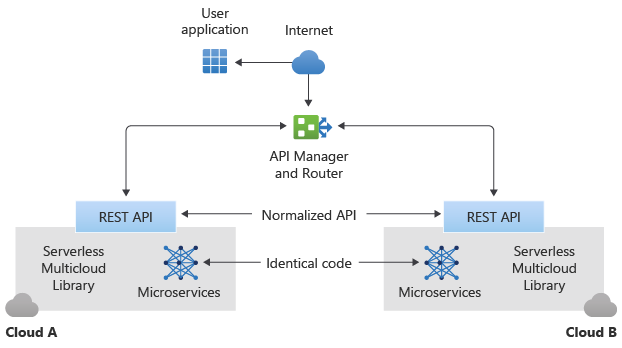

# Multi-cloud functions with Serverless Framework

This article describes how the Microsoft Commercial Software Engineering (CSE) team partnered with a global retailer to build a highly available microservices deployment solution that leverages the [Serverless Framework](https://serverless.com) across both Azure and Amazon Web Services (AWS) cloud platforms. 

Serverless computing abstracts app code from infrastructure implementation, code deployment, and operational aspects like planning and maintenance. Typically, each cloud provider has its own serverless computing implementation, and it's difficult for customers to use another vendor without considerable operational impact and costs. Potential customers may view this situation as weakening their bargaining position and agility. Vendor lock-in is one of the greatest obstacles to enterprise cloud adoption. 

The Serverless Framework addresses the problems of vendor lock-in and cross-cloud provider redundancy by abstracting development from cloud provider, based on common tools for developing and deploying serverless functions. This framework provides a universal cloud interface for deploying serverless computing solutions across cloud providers. 

Serverless Framework code is open-sourced, which helps Microsoft teams and the customer and partner community to build cross-cloud provider solutions. Open sourcing reduces barriers to cloud adoption, and opens the door to using best-of-breed services like Cognitive Services across cloud providers. Customers can optimize their solutions based on cost, agility, and other considerations. 

CSE and the Azure product team collectively rewrote the Serverless CLI to support new Azure Functions features like Premium Functions, API Management, and KeyVault. The Serverless CLI now provides a standard interface for GitOps deployment to both Azure and AWS. The team also developed the *Serverless Multicloud Library*, which provides a normalized runtime API to deploy serverless apps to both AWS and Azure.

This design also provides *active-active* failover between multiple cloud platforms, as opposed to *active-passive* failover. If the service of one cloud provider becomes unhealthy or unavailable, this solution can reroute requests to another cloud platform. 

This project had the following technical goals:

- Create a cross-industry solution.
- Use the Multicloud Serverless Library to support a common API for users to interface with microservices wherever they are deployed.
- Use API-based access via an authenticated cloud gateway, and load balance between cloud platforms by using the gateway as a router.
- Support a GitOps CI/CD process workflow for development, testing, and deployment on all supported cloud platforms.

By using Azure Functions and AWS Lambda functions, both platforms can implement mirrored functionality. By using the Serverless Framework, the platforms can unify deployment and operations.

Benefits of using the Serverless Framework to deploy microservice apps to multiple platforms include:

- Prevention or reduction of vendor lock-in
- Easier data sharing between platforms
- Ability to compare performance, analyze costs, and take advantage of special offerings
- Best of breed solutions that combine services offered by different cloud providers
- 40-60+% code reduction during development by using the Multicloud Serverless Library
- Ability to use GitOps for development and deployment
- Active-active high availability
- Elimination of most platform and infrastructure complexity and maintenance requirements

## Potential use cases

- Deploy a collection of functional microservices in a serverless framework on multiple cloud platforms. 
- Write client-side applications for multiple platforms by using the same cloud-agnostic API from the Multicloud Library.

## Architecture

1. The user app can come from any source capable of logging into the cloud. In this implementation, the user logs into a gateway app that load balances requests 50-50 between the Azure and AWS clouds.
1. Any response also routes through the API Manager gateway, which then sends the response to the requestor user app. 

The following figure shows the processing pipeline. The middleware layers represent any intermediate functionality needed before reaching the handler.

### Serverless Framework
Serverless technology is a fundamental requirement for an approach that uses microservices. This solution uses the Serverless Framework, available from [Serverless, Inc](https://serverless.com/). The free version of the Serverless Framework includes a CLI, additional plugins, and limited monitoring services. The Pro edition features operational capabilities across clouds, such as enhanced monitoring and alerts. The framework supports Node.js and Python languages, and both AWS and Azure cloud hosts.

To use Azure with the Serverless Framework, you need:

- Node.js, to support microservice code
- The Serverless Framework, to support multi-cloud deployment and monitoring
- The Serverless Multicloud Library, to provide a normalized runtime API for developers
- Azure Functions, to host microservices functionality comparable to other cloud platforms
- The Azure Functions Serverless Plugin, to support multi-cloud deployment. This plugin wasn't initially up to parity with the comparable AWS Lambda plug-in, and was extended for this project. 

### Functions
The serverless implementation on each platform supports individual functions as microservices, one to each functional VM node, and executes generic processing functions as needed. Each AWS Lambda function has a corresponding Azure Function element. The microservices use identical code on each platform, and are addressed via the Serverless Multicloud Library's abstracted API layer, so don't require translation of each transaction.

### CI/CD with GitOps

A primary job of the Serverless Framework is to abstract away all the infrastructure concerns of deploying an app to the cloud. Using a manifest-based approach, the Serverless Framework deals with all deployment issues, allowing deployment to be automated as needed to support GitOps.

Although this initial project used manual deployments, it's realistic to implement manifest-driven serverless builds, tests, and deployments within the same or across clouds. This process can use a GitOps developer workflow focus: building from Git, using quality gates for test and evaluation, and pushing serverless solutions onto both cloud providers. Performing all deployments using the Serverless Framework from the beginning of the project is the most efficient way to proceed.

### Cloud-agnostic API

Server agnosticity allows user apps to interface with the cloud without knowing or caring which cloud platform they're accessing. The *Serverless Multicloud Library* builds identical microservices into a *normalized REST API*. Microservices from within either cloud framework respond to the normalized API, so client apps can use the *cloud agnostic API* to interface with the platforms.
The following diagram illustrates this concept:

### API manager

The API manager can be an existing or custom application. The Apigee&trade; API manager in this implementation only acted as a router to provide a 50-50 transaction load balance to the two cloud platforms, and was underutilized for its capabilities. 

The API manager must be able to:

- Be deployed inside or outside a cloud platform as needed
- Route messages to and from both cloud platforms
- Relay requests and responses using the common REST API from and to the user application
- Monitor the health of both cloud serverless framework deployments to validate their ability to receive requests
- Log traffic requests to coordinate asynchronous message traffic
- Perform automated health checks and availability on each cloud platform, to support routing and high availability

## Alternatives

- Node.js was used to package the microservices, because the customer was comfortable with Node.js, and both AWS and Azure platforms support it. Other languages, such as Python, could implement this solution, as long as they're supported by the serverless implementations of the cloud platforms, AWS Lambda and Azure Functions in this case.

- Any cloud platform can be used, not just Azure or AWS. The cloud platform must be able to support the Serverless Framework. Currently, the Serverless Framework reports compatibility with eight different cloud providers. The only caveat is to ensure that the elements that support the multi-cloud architecture or its equivalent are available on the target cloud platforms.

- The API Manager in this initial implementation acted only as a router to provide a 50-50 transaction load balance to the two cloud platforms. The API Manager could incorporate other business logic for specific scenarios.

## Considerations

- Because it's difficult to articulate the differences between AWS and Azure serverless functional offerings, early effort should focus on mapping the functions available on each cloud platform and identifying necessary transformation requirements. You can develop a platform-agnostic API from this information.

- Using an open-source solution may introduce risks, due to long-term maintenance and support challenges with open-source software.

- In the free Serverless Framework, monitoring is limited primarily to the administrative dashboard. Monitoring is usually available in the paid enterprise offering. Currently, the Azure Functions Serverless Plugin doesn't include provisions for observability or monitoring, and would need modification to implement these capabilities.

- This article doesn't describe security solutions, although the initial deployment included them. There are many possible security solutions, some platform dependent, and this pattern should accommodate any reasonable solution. User authentication is the minimum security assumed.

- This solution could use metrics to compare performance and costs between cloud platforms, enabling customers to seamlessly optimize usage accordingly across cloud platforms.

## Deploy the solution

A traditional *Blue-Green Deployment* develops and deploys an app to two separate but identical environments, blue and green, increasing availability and reducing risk. The blue environment is usually the production environment that normally handles live traffic, and the green environment is a failover deployment as needed. Typically, the CI/CD pipeline automatically deploys both blue and green environments within the same cloud platform. This is considered an *active-passive* configuration, but is only a partial solution.

In the multi-cloud solution, blue-green deployment is implemented in both of the cloud platforms. In the serverless case, this means that two duplicate sets of microservices are deployed for each cloud platform, one as the production environment and the other as the failover environment. This active-passive setup within each cloud platform reduces the risk that this platform will be down, increasing its availability, which translates to having both platforms up, and enabling the multi-cloud active-active high availability.

A secondary benefit of blue-green deployment is using the failover deployment on each cloud platform as a test environment for microservice updates, before releasing them to the production deployment.

## Related resources

- [One-page version](https://aka.ms/01_Multicloud_1Pager) of this article
- [Reference Architecture](https://aka.ms/01_Multicloud_ReferenceArchitecture) for this article
- [Sample code](https://github.com/serverless/multicloud) and [README](https://github.com/serverless/multicloud/blob/master/README.md) for this implementation on GitHub
- [Serverless Framework](https://serverless.com/)