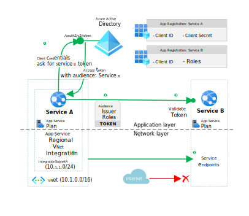

This example scenario shows how to restrict communications between two Azure backend services on both the application and network layers. Communications can flow only between services that are explicitly configured to allow it, adhering to the [principle of least privilege][leastpriv]. This example uses services hosted in Azure App Service, but you can use similar techniques for Azure Functions.

These communications restrictions should be part of an overall security strategy based on careful planning and [threat-modeling][threatmodeling] through the [Security Development Lifecycle][sdlc]. Incorporate business, compliance, regulatory, and other non-functional requirements when developing a security architecture. For example, while the current scenario focuses on network restrictions, many organizations now embrace a [zero trust security model][zerotrust] that assumes a breach, so the networking layer is of secondary importance.

## Architecture

The diagram outlines how Service A can communicate in a restricted way to Service B, both running on Azure App Service.

- Both services [register with Azure Active Directory (Azure AD)][appreg], and use OAuth 2.0 token-based authorization in the [client credentials flow][clientcredsflow].
- Service A communicates to Service B from a private IP address in its integration subnet through [Regional VNet Integration][regionalvnet].
- Service B [service endpoints][svcep] restrict inbound communications to those coming from the integration subnet of Service A.
- Token-based authorization restricts access on the application layer, and service endpoints restrict access on the network layer.

### Token-based authorization

Use an OpenID Connect (OIDC)-compatible library like the [Microsoft Authentication Library (MSAL)][msal] to support the [client credentials flow][clientcredsflow]. For more information, see [Scenario: Daemon application that calls web APIs][daemoncallswebapi], and the [sample application for the daemon scenario][daemonsample].

Both Service A and Service B must register in Azure AD, and Service A must have client credentials in either shared secret or certificate form.

1. Service A requests and receives an access token from Azure AD to use to access Service B.
1. Service A injects its token as a *bearer token* in the HTTP Authorization header of the request to Service B, according to the [OAuth 2.0 Bearer Token Usage specification][bearertokenspec].
1. On the receiving side, Service B [validates the token][tokenvalidation] and ensures the request is for Service B by evaluating the audience **aud** claim.

Service B has three ways to ensure that only specifically allowed clients, Service A in this case, get access:

- **Validate the token appid claim**. Service B can validate the token [appid claim][accesstokenclaims], which identifies the Azure AD-registered application that requested the token. Service B must explicitly check the claim against a known access control caller list.
- **Check for roles in the token**. Similarly, by checking for the presence of a certain **role** in the incoming token, Service B can ensure that Service A has explicit access permission.
- **Require user assignment**. Alternatively, Service B's owner or admin can configure Azure AD to [require user assignment][userassignment] to give a token to a service principal. Only applications that have explicit permissions to the Service B application can get a token toward Service B. Service B then doesn't need to do an explicit role check, unless required by business logic.
   
   To set up the user assignment requirement:
   
   1. [Enable user assignment][userassignment] on Service B.
   1. [Expose at least one app role][exposeapprole] on Service B, which Service A can ask permission for. The **AllowedMemberTypes** for this role must include `Application`.
   1. [Request app permission][configurepermission] for Service A to the exposed Service B role.
      1. From the **API permissions** section of the Service A app registration, select **Add a permission**, and then select the Service B application from the list.
      1. On the **Request API permissions** screen, select **Application permissions**, because this backend application runs without a signed-in user. Select the exposed Service B role, and then select **Add permissions**.
   1. [Grant admin consent][aadpermissiontypes] to the Service A application permissions request. Only a Service B owner or admin can consent to the Service A permissions request.

### Service endpoints

This scenario also restricts communications on the network layer.

1. The Service A web app uses [Regional VNet Integration][regionalvnet] to route all outbound communications through a private IP address within the IP range of the integration subnet.
1. Service B has [service endpoints][svcep] that allow inbound communications only from web apps on the integration subnet of Service B. For more information, see [Set up Azure App Service access restrictions][accessrestrictions].

### Components

This scenario uses the following Azure services:

- [Azure App Service][appsvc] hosts both Service A and Service B, allowing autoscale and high availability without having to manage infrastructure.
- [Azure AD][aad] is the cloud-based identity and access management service that authenticates services and enables OAuth 2.0 token-based authorization.
- [Azure Virtual Network][vnet] is the fundamental building block for private networks in Azure. Azure Virtual Network lets resources like Azure Virtual Machines (VMs) securely communicate with each other, the internet, and on-premises networks.
- [Azure Service Endpoints][svcep] provide secure and direct connectivity to Azure services over an optimized route on the Azure backbone network, and [allow access][accessrestrictions] only from the range of private source IPs in the integration subnet.
- [Microsoft Authentication Library (MSAL)][msal] is an OIDC-compatible library that allows a service to fetch access tokens from Azure AD using a client credentials flow.

## Alternatives

There are several alternatives to the example scenario.

### Managed identity

Instead of registering as an application with Azure AD, Service A could use a [managed identity][mi] to fetch an access token. Managed identity frees operators from having to manage credentials for an app registration.

While a managed identity provides an identity for Service A to fetch a token with, it doesn't provide an Azure AD app registration. Service A still needs a proper Azure AD app registration for scenarios where other services need to request an access token towards Service A itself.

You can't assign a managed identity to an app role through the Azure portal, only through the Azure PowerShell command line. For more information, see [Assign a managed identity access to an application role using PowerShell][addmitorole].

### Azure Functions

You can host the services in [Azure Functions][functions] instead of App Service. To restrict access on the network layer by using Regional VNet Integration, you need to host the Functions apps in an App Service plan or a Premium Plan. For more information, see [Azure Functions networking options][functionsnetworking].

### App Service built-in authentication and authorization

Performing token validation as part of the application code has the advantage that the authorization code is by design colocated with the rest of the business logic. [App Service built-in authentication and authorization][easyauth], or Easy Auth, can also perform basic token validation before a request makes it to a service. The service then relies on the hosting infrastructure to reject unauthorized requests.

To configure App Service authentication and authorization, set the authorization behavior to **Log in with Azure Active Directory**. This setting validates tokens and restricts access to valid tokens only.

The downside of using Easy Auth is that the service loses the authentication and authorization protection if it moves elsewhere. While App Service authentication and authorization works for simple scenarios, complex authorization requirements should use logic from within the application code.

### Service endpoints vs. private endpoints

This scenario uses service endpoints rather than [private endpoints][privateend] because only service endpoints allow [restricting access][accessrestrictions] to a web app from a given subnet. Filtering inbound traffic on private endpoints isn't supported through Network Security Groups (NSGs) or by using App Service access restrictions. Every service with network line-of-sight can communicate with the private endpoint of a web application. This limits private endpoint usefulness for locking down traffic on the network layer.

## Considerations

- App Service [Regional VNet Integration][regionalvnet] provides a single integration subnet for each App Service Plan. All web apps on the same plan integrate with the same subnet and share the same set of private outbound IP addresses. Receiving services can't distinguish which web app the traffic originates from. If you need to identify the originating web apps, you must deploy the web apps on separate App Service Plans, each with its own integration subnet.

- Every worker instance in an App Service Plan occupies a separate private IP address within the integration subnet. When planning for scale, ensure that the size of the integration subnet is large enough to accommodate the scale you expect.

## Related resources

The following resources provide more information on the components used in this scenario:

- [App Service networking features][appsvcnetworking]
- [Zero to Hero: securing your web app][securingwebapp]
- [Zero to Hero: multi-tier web apps][zerotohero]
- [Azure AD client credentials flow][clientcredsflow]
- [Service endpoints][svcep]
- [Microsoft Authentication Library][msal]
- [App Service Regional VNet Integration][regionalvnet]
- [Sample application demonstrating client credentials flow for daemon apps][daemonsample]
- [Azure Security Baseline for App Service][securitybaseline]

<!-- links -->
[privateend]: /azure/private-link/private-endpoint-overview
[leastpriv]: https://wikipedia.org/wiki/Principle_of_least_privilege
[appsvcnetworking]: /azure/app-service/networking-features
[securingwebapp]: https://azure.github.io/AppService/2020/08/14/zero_to_hero_pt6.html
[zerotohero]: https://azure.github.io/AppService/2020/10/05/zero_to_hero_pt7.html
[clientcredsflow]: /azure/active-directory/develop/v2-oauth2-client-creds-grant-flow
[appsvc]: /azure/app-service/overview
[aad]: /azure/active-directory/fundamentals/active-directory-whatis
[vnet]: /azure/virtual-network/virtual-networks-overview
[svcep]: /azure/virtual-network/virtual-network-service-endpoints-overview
[msal]: /azure/active-directory/develop/msal-overview
[mi]: /azure/active-directory/managed-identities-azure-resources/overview
[privep]: /azure/app-service/networking/private-endpoint
[regionalvnet]: /azure/app-service/web-sites-integrate-with-vnet#regional-vnet-integration
[appreg]: /azure/active-directory/develop/quickstart-register-app
[daemoncallswebapi]: /azure/active-directory/develop/scenario-daemon-overview
[daemonsample]: https://github.com/Azure-Samples/active-directory-dotnetcore-daemon-v2/tree/master/2-Call-OwnApi
[accesstokenclaims]: /azure/active-directory/develop/access-tokens#payload-claims
[userassignment]: /azure/active-directory/develop/howto-restrict-your-app-to-a-set-of-users#update-the-app-to-enable-user-assignment
[exposeapprole]: /azure/active-directory/develop/howto-add-app-roles-in-azure-ad-apps
[configurepermission]: /azure/active-directory/develop/quickstart-configure-app-access-web-apis#add-permissions-to-access-web-apis
[aadpermissiontypes]: /azure/active-directory/develop/v2-permissions-and-consent#permission-types
[accessrestrictions]: /azure/app-service/app-service-ip-restrictions#use-service-endpoints
[tokenvalidation]: /azure/active-directory/develop/access-tokens#validating-tokens
[functions]: /azure/azure-functions/functions-overview
[threatmodeling]: https://www.microsoft.com/securityengineering/sdl/threatmodeling
[zerotrust]: https://www.microsoft.com/security/business/zero-trust
[sdlc]: https://www.microsoft.com/securityengineering/sdl
[addmitorole]: /azure/active-directory/managed-identities-azure-resources/how-to-assign-app-role-managed-identity-powershell
[functionsnetworking]: /azure/azure-functions/functions-networking-options
[easyauth]: /azure/app-service/overview-authentication-authorization
[securitybaseline]: /azure/app-service/security-baseline
[bearertokenspec]: https://tools.ietf.org/html/rfc6750
