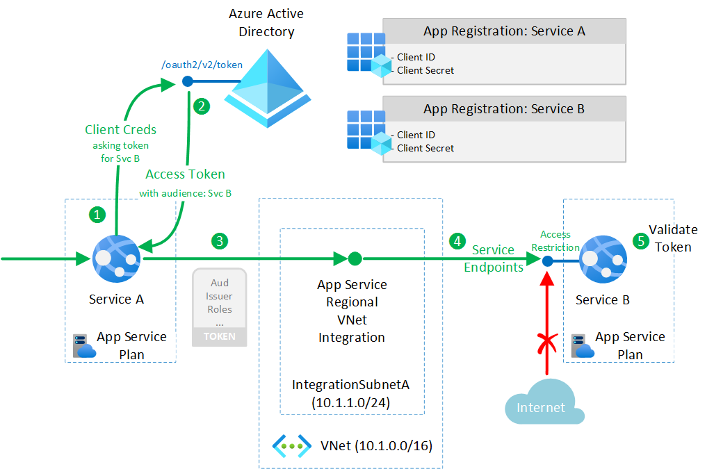

# Restricted inter-service communications

This example scenario shows how to set up restricted communications between two backend services on both the application and network layers.  Communications can only flow between those services which have been explicitly configured to allow for this, adhering to the principle of least privilege.

> [!IMPORTANT]
> While this article serves as a specific educational example of how communications can be restricted between two services it should not serve as generic guidance.  The way an architecture is secured should be the result of careful planning, [threat-modeling][threatmodeling], work throughout the [Security Development Lifecycle][sdlc] and should be derived from a close understanding of business-, compliance-, regulatory- and other non-functional requirements.  As an example, while in the below scenario communications are restricted on the network layer, organizations increasingly realize they should assume breach and rather embrace a [zero trust security model][zerotrust] in which the networking layer is of secondary importance.

<!-- The title is a noun phrase that describes the scenario.

> Example: "Insurance claim image classification on Azure"

Avoid naming the scenario after the Azure technologies that are used.

(Introductory section - no heading)

> This should be an introduction of the business problem and why this scenario was built to solve it.
>> What industry is the customer in?
>> What prompted them to solve the problem?
>> What services were used in building out this solution?
>> What does this example scenario show? What are the customer's goals?

> What were the benefits of implementing the solution described blow? -->

## Potential use cases

While this article provides a concrete example with services hosted in Azure App Service, similar techniques can be used for Azure Functions.

<!-- > Are there any other use cases or industries where this would be a fit?
> How similar or different are they to what's in this article?

These other uses cases have similar design patterns:

- List of example use cases -->

## Architecture

The diagram outlines how Service A wants to communicate in a restricted way with Service B, both running on Azure App Service.

To do so, both services are registered with Azure Active Directory so they can use OAuth 2.0 token-based authorization between them, leveraging a [Client Credentials flow][clientcredsflow].

In addition, Service B is configured with [Service Endpoints][svcep] to only allow communications from the integration subnet of Service A.  From a network point of view, this restricts inbound connectivity to Service B to Service A which uses App Service [Regional VNET integration][regionalvnet] to establish outbound communication from a private IP address in the integration subnet.

<!--
> What does the solution look like at a high level?
> Why did we build the solution this way?
> What will the customer need to bring to this?  (Software, skills, etc?)
> Is there a data flow that should be described? -->

### Components

The following Azure services are used in this scenario:

- [App Service][appsvc] hosting both services and allowing autoscale and high availability without having to manage infrastructure.
- [Azure Active Directory][aad] as the cloud-based identity and access management service taking care of authenticating services and enabling OAuth 2.0 based token-based authorization.
- [Azure Virtual Network (VNet)][vnet] is the fundamental building block for your private network in Azure. VNet enables many types of Azure resources, such as Azure Virtual Machines (VM), to securely communicate with each other, the internet, and on-premises networks.
- [Azure Service Endpoints][svcep] providing secure and direct connectivity to Azure services over an optimized route over the Azure backbone network, while [restricting access][accessrestrictions] to the range of private source IPs from within the integration subnet.

In addition to these services, the code making up our services is likely to make use of an OIDC compatible library such as the [Microsoft Authentication Library (MSAL)][msal].  For Service A, such library like MSAL allows for fetching access tokens from Azure AD using a client-credentials-flow.

The two layers at which communications are restricted are outlined below:
- **Token-based Authorization**, restricting access on the application layer
- **Service Endpoints**, restricting access on the networking layer

#### Token-based Authorization

In step 1 and 2 of the scenario, Service A will request an access token from Azure AD to access Service B with.  This is done through a [Client Credentials flow][clientcredsflow] and is typically facilitated by an OIDC compatible library like [MSAL][msal] which supports this as shown in the article describing a [daemon application that call web APIs][daemoncallswebapi].  (Additional details can be found in the [sample application for the daemon scenario][daemonsample]).  For this, both Service A and B need to be [registered in Azure AD][appreg] with Service A requiring client credentials to be assigned in the form of either a shared secret or certificate.  

When Service A fetches a token, it injects it as a "bearer" token in the HTTP Authorization header in the request towards Service B (See step 3.)  This is according to the [OAuth 2.0 Bearer Token Usage specification][bearertokenspec].  On the receiving side, in step 5, Service B will need to [validate the token][tokenvalidation] to make sure it is valid *and* intended for Service B (indicated by the audience claim: `aud`).

Even when a token is valid, one will want to ensure Service B is ony accessible by those clients (Service A in this case) which are explicitly allowed.  There are three ways to accomplish this:

- **Validating the token `appid` claim**: Service B can validate the `appid` [claim][accesstokenclaims] of the token, indicating which application registered in Azure AD requested the token; this requires Service B to be explicitly coded for this check against a known access control list of callers
- **Check for roles in the token**: similar to the previous option, when Service B explicitly checks for the presence of a role in the incoming token, it can ensure that Service A was explicitly granted permissions.
- **Requiring User Assignment**: alternatively, one can configure Azure AD to only hand out tokens for Service B by [requiring user assignment][userassignment] on the corresponding Service Principal of Service B.  In this case, only applications in Azure AD which have been explicitly assigned a role will get a token towards Service B.  The receiving service in this case does not need to do an explicit role check, except when required by any business logic.

  In order to set up the requirement for this:

  - [Enable User Assignment][userassignment] on Service B
  - [Expose at least one app role][exposeapprole] on Service B, which Service A can ask permission for.  The `AllowedMemberTypes` for this role needs to include `Application`.
  - [Request app permission to the role of Service B][configurepermission] from the Service A app registration by opening its application registration "API permissions" section where you can add permissions to access Service B. Any application roles Service B exposes can be found as an "Application Permission" which can be requested. (This is different from "delegated permissions" which are permissions which you'd grant the application on behalf of a user. In this scenario, using a client-credential flow, there is no user, only an application.)
  - Grant Admin Consent on Service A: as [application permissions][aadpermissiontypes] can only be consented by an admin or the owner of Service B.  This consent will need to be given for the application permissions (the app roles from Service B) requested by Service A.

#### Service Endpoints

Besides the application-layer inter-service authorization, this scenario also restricts communications on the network layer.  To do so, the web app for Service A is configured with [Regional VNet Integration][regionalvnet].  This causes any outbound communications from Service A to happen from a private IP from within the IP range assigned to the integration subnet.

In order for Service B, to be able to [restrict inbound communication][accessrestrictions] to the integration subnet from Service A, enable [Service Endpoints][svcep] to Web Apps on the integration subnet.

<!-- A bullet list of components in the architecture (including all relevant Azure services) with links to the product documentation.

> Why is each component there?
> What does it do and why was it necessary?

- Example: [Resource Groups][resource-groups] is a logical container for Azure resources.  We use resource groups to organize everything related to this project in the Azure console. -->

### Alternatives

#### Managed Identity

Instead of registering as an application with Azure AD, Service A might consider to leverage a [Managed Identity][mi] to fetch an access token with.  This has the distinct advantage that it would free operators from managing credentials for an app registration.  

> [!IMPORTANT]
> While the managed identity would provide Service A with an identity to fetch a token with, it does not represent an app registration in Azure AD.  This means, a proper app registration would still be required for scenarios where other services need to request an access token towards Service A itself.

> [!IMPORTANT]
> Note that a managed identity cannot be assigned to an app role through the Azure Portal.  Instead this can be done through the command line [as documented][addmitorole].

#### Use of Azure Functions to host Services

Instead of hosting services on App Services, [Azure Functions][functions] can be used as well.  To restrict access on the network layer, as described in [azure functions networking][functionsnetworking], one would need to host the functions in an App Service plan or a Premium Plan to make use of the vnet integration capability.

#### Use of App Service Authentication and Authorization

Performing token validation as part of the application code has the advantage of the fact that the authorization code is by-design co-located with the rest of the business logic.  If this is for some reason not practical or desired, [App Service Authentication and Authorization][easyauth] (sometimes referred to as "Easy-Auth") can be configured to perform basic token validation before the request makes it to the service.  The service then relies on the hosting infrastructure to not accept unauthorized requests.  The downside of doing so is that the service loses this protection when it is moved elsewhere.  

In order to configure App Service Authentication and Authorization, the Authorization Behavior should be set to "Log In with Azure Active Directory".  This will cause tokens to be validated and access to be restricted to valid tokens.

> [!IMPORTANT]
> While App Service Authentication and Authorization works for simple scenarios, complex authorization requirements should be covered with logic from within the application code instead.

<!-- Use this section to talk about alternative Azure services or architectures that you might consider for this solution. Include the reasons why you might choose these alternatives. -->
<!-- 
> What alternative technologies were considered and why didn't we use them? -->

## Considerations

### App Service Regional VNet Integration restrictions

App Service [Regional VNet integration][regionalvnet] is limited to a single integration subnet per App Service Plan.  If multiple web apps are deployed on the same plan, they need to be integrated with the same subnet and all of those will share the same set of private outbound IP addresses.  As a consequence of this, the services to which these web apps communicate will not be able to distinguish from which web app the traffic originates from.  If this is a requirement, then web apps will need to be deployed on separate App Service Plans, each integrated to their own integration subnet.

<!-- > Are there any lessons learned from running this that would be helpful for new customers?  What went wrong when building it out?  What went right? -->

### Availability, Scalability, and Security

Every worker instance of an App Service Plan will occupy a separate private IP address within the integration subnet.  When planning for scale, this needs to be taken into account and the size of the integration subnet should be large enough to accommodate the scale anticipated.

### Note on Private Endpoints

The reason in this article Service Endpoints where chosen above Private Endpoints is because Service Endpoints allow to [restrict access][accessrestrictions] to a web app to a given subnet.  This can not be accomplished using Private Endpoints.

> [!CAUTION]
> Filtering inbound traffic on Private Endpoints is neither supported through Network Security Groups (NSGs) or by using App Service Access Restrictions.  Every service with network line-of-sight will be able to communicate with the private endpoint of a web application.  This limits its use for locking down traffic on the network layer.

<!-- > How do I need to think about managing, maintaining, and monitoring this long term?

> Are there any size considerations around this specific solution?
> What scale does this work at?
> At what point do things break or not make sense for this architecture?

> Are there any security considerations (past the typical) that I should know about this? -->

<!-- ## Deploy this scenario

> (Optional if it doesn't make sense)
>
> Is there an example deployment that can show me this in action?  What would I need to change to run this in production?

## Pricing

> How much will this cost to run?
> Are there ways I could save cost?
> If it scales linearly, than we should break it down by cost/unit.  If it does not, why?
> What are the components that make up the cost?
> How does scale effect the cost?
>
> Link to the pricing calculator with all of the components in the architecture included, even if they're a $0 or $1 usage.
> If it makes sense, include a small/medium/large configurations.  Describe what needs to be changed as you move to larger sizes

## Next steps

> Where should I go next if I want to start building this?
> Are there any reference architectures that help me build this? -->

## Related resources

<!-- > Are there any relevant case studies or customers doing something similar?
> Is there any other documentation that might be useful?
> Are there product documents that go into more detail on specific technologies not already linked -->

The following resources will provide more information on the components used in this scenario:

- [App Service networking features][appsvcnetworking]
- [Zero to Hero: securing your web app][securingwebapp]
- [Zero to Hero: multi-tier web apps][zerotohero]
- [AAD Client Credentials Flow][clientcredsflow]
- [Service Endpoints][svcep]
- [Microsoft Authentication Library][msal]
- [App Service Regional VNet Integration][regionalvnet]
- [Sample application demonstrating client credentials flow for daemon apps][daemonsample]
- [Azure Security Baseline for App Service][securitybaseline]

<!-- links -->
[appsvcnetworking]: https://docs.microsoft.com/azure/app-service/networking-features
[securingwebapp]: https://azure.github.io/AppService/2020/08/14/zero_to_hero_pt6.html
[zerotohero]: https://azure.github.io/AppService/2020/10/05/zero_to_hero_pt7.html
[clientcredsflow]: https://docs.microsoft.com/azure/active-directory/develop/v2-oauth2-client-creds-grant-flow
[appsvc]: https://docs.microsoft.com/azure/app-service/overview
[aad]: https://docs.microsoft.com/azure/active-directory/fundamentals/active-directory-whatis
[vnet]: https://docs.microsoft.com/azure/virtual-network/virtual-networks-overview
[svcep]: https://docs.microsoft.com/azure/virtual-network/virtual-network-service-endpoints-overview
[msal]: https://docs.microsoft.com/azure/active-directory/develop/msal-overview
[mi]: https://docs.microsoft.com/azure/active-directory/managed-identities-azure-resources/overview
[privep]: https://docs.microsoft.com/azure/app-service/networking/private-endpoint
[regionalvnet]: https://docs.microsoft.com/azure/app-service/web-sites-integrate-with-vnet#regional-vnet-integration
[appreg]: https://docs.microsoft.com/azure/active-directory/develop/quickstart-register-app
[daemoncallswebapi]: https://docs.microsoft.com/azure/active-directory/develop/scenario-daemon-overview
[daemonsample]: https://github.com/Azure-Samples/active-directory-dotnetcore-daemon-v2/tree/master/2-Call-OwnApi
[accesstokenclaims]: https://docs.microsoft.com/azure/active-directory/develop/access-tokens#payload-claims
[userassignment]: https://docs.microsoft.com/azure/active-directory/develop/howto-restrict-your-app-to-a-set-of-users#update-the-app-to-enable-user-assignment
[exposeapprole]: https://docs.microsoft.com/azure/active-directory/develop/howto-add-app-roles-in-azure-ad-apps
[configurepermission]: https://docs.microsoft.com/azure/active-directory/develop/quickstart-configure-app-access-web-apis#add-permissions-to-access-web-apis
[aadpermissiontypes]: https://docs.microsoft.com/azure/active-directory/develop/v2-permissions-and-consent#permission-types
[accessrestrictions]: https://docs.microsoft.com/azure/app-service/app-service-ip-restrictions#use-service-endpoints
[tokenvalidation]: https://docs.microsoft.com/azure/active-directory/develop/access-tokens#validating-tokens
[functions]: https://docs.microsoft.com/azure/azure-functions/functions-overview
[threatmodeling]: https://www.microsoft.com/securityengineering/sdl/threatmodeling
[zerotrust]: https://www.microsoft.com/security/business/zero-trust
[sdlc]: https://www.microsoft.com/securityengineering/sdl
[addmitorole]: https://docs.microsoft.com/azure/active-directory/managed-identities-azure-resources/how-to-assign-app-role-managed-identity-powershell
[functionsnetworking]: https://docs.microsoft.com/azure/azure-functions/functions-networking-options
[easyauth]: https://docs.microsoft.com/azure/app-service/overview-authentication-authorization
[securitybaseline]: https://docs.microsoft.com/azure/app-service/security-baseline
[bearertokenspec]: https://tools.ietf.org/html/rfc6750