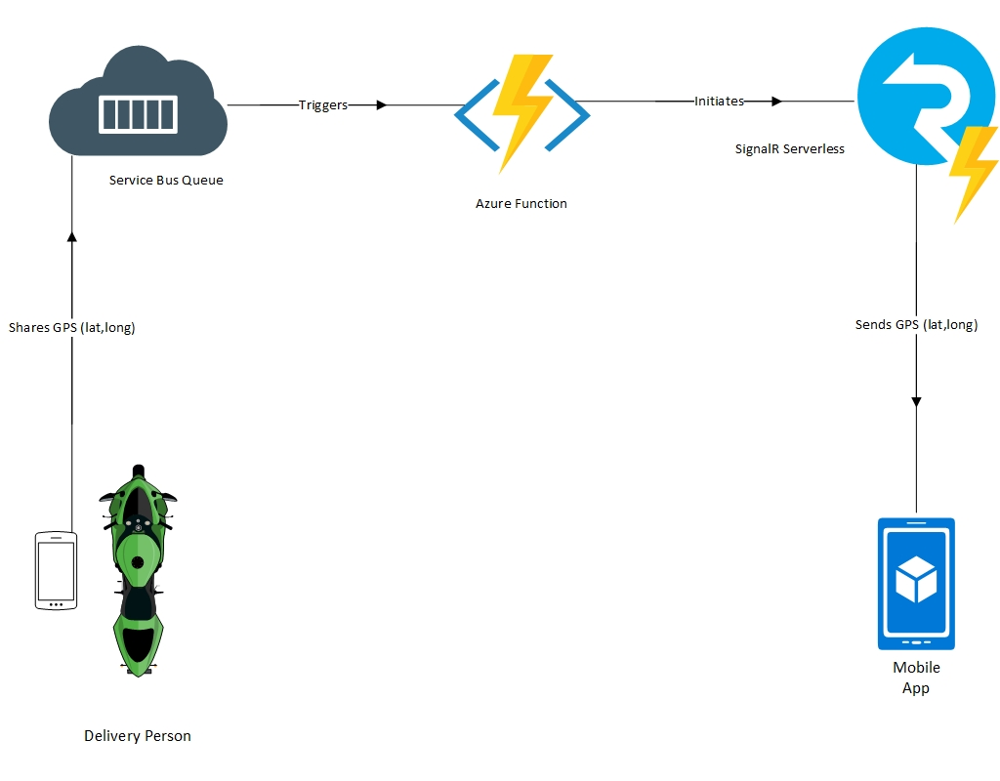
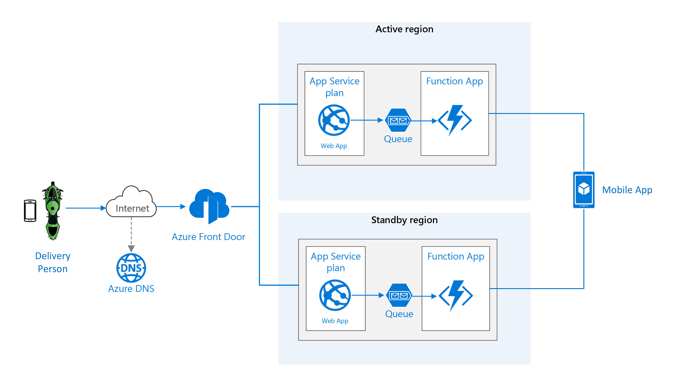

# Sharing location in real time using low-cost serverless Azure services

This scenario describes how to architect a solution that processes changes to underlying data within a web view without the need for a page refresh using real-time services. Examples that use this scenario include real-time tracking of products and goods, as well as social media solutions.

In this scenario, we look at how to set up a real-time messaging service to share live location of a food delivery service transaction. This example can also be useful for users trying to build a real-time location sharing platform for their web or mobile applications.

We'll use a SignalR service configured in server-less mode to integrate with an Azure Functions app triggered by a Service Bus. All of it using .NET Core

## Potential use cases

These other uses cases have similar design patterns:

* Sharing real-time location with client devices.
* Pushing notifications to users.
* Updating timelines.
* Create chat rooms.

## Architecture

### Components

* [Service Bus](https://azure.microsoft.com/services/service-bus/), a highly reliable cloud messaging service between applications and services, even when one or more is offline.
* [SignalR](https://azure.microsoft.com/services/signalr-service/), makes it easy to add real-time communications to your web application.
* [Azure Functions](https://azure.microsoft.com/services/functions/), an event-driven serverless compute platform that can also solve complex orchestration problems.

## Considerations

Here are some of the considerations taken to develop this scenario, including how to configure parameters in the Azure Service Bus connection string in the ServiceBusTrigger as well as:

**Hubs:** Hubs can be compared to a video streaming service. You can subscribe to the Hub to send/receive messages from/to the Hub.

**Targets:** Targets are like radio channels. Everyone who is listening to the Target channel and is notified when there is a new message on it.

If you can remember the above two features of SignalR platform, it will be a easy to get up and running quickly.

### Availability, scalability, and security

You can achieve high availability of this solution by performing the following steps:

#### Regional pairing

Each Azure region is paired with another region within the same geography. In general, choose regions from the same regional pair (for example, East US 2 and Central US). Benefits of doing so include:

* If there is a broad outage, recovery of at least one region out of every pair is prioritized.
* Planned Azure system updates are rolled out to paired regions sequentially to minimize possible downtime.
* In most cases, regional pairs reside within the same geography to meet data residency requirements.
* However, make sure that both regions support all of the Azure services needed for your application. See [Services by region](https://azure.microsoft.com/regions/#services). For more information about regional pairs, see [Business continuity and disaster recovery (BCDR): Azure Paired Regions](https://docs.microsoft.com/azure/best-practices-availability-paired-regions).

#### Azure Front Door

Azure Front Door is a scalable and secure entry point for fast delivery of your global applications. Using *priority routing*, it automatically fails over if the primary region becomes unavailable. A multi-region architecture can provide higher availability than deploying to a single region. If a regional outage affects the primary region, you can use Front Door to fail over to the secondary region. This architecture can also help if an individual subsystem of the solution fails. Stop network and application layer attacks at the edge with Web Application Firewall and DDoS Protection. Harden your service using Microsoft-managed rule sets and author your own rules for custom protection of your app.

Front Door is a possible failure point in the system. If the service fails, clients cannot access your application during the downtime. Review the [Front Door service level agreement (SLA)](https://azure.microsoft.com/support/legal/sla/frontdoor) and determine whether using Front Door alone meets your business requirements for high availability. If not, consider adding another traffic management solution as a fallback. If the Front Door service fails, change your canonical name (CNAME) records in DNS to point to the other traffic management service. This step must be performed manually, and your application will be unavailable until the DNS changes are propagated.

### Pricing this scenario

Assume your business has 1000 orders in a day and needs to share location data with all of them concurrently, your estimated Azure usage for deploying this scenario will be close to $192 based on pricing at the time of writing.

| Service type          | Estimated Cost |
|-----------------------|----------------|
| Azure Functions       | $119.40        |
| Azure SignalR Service | $48.97         |
| Service Bus           | $23.71         |
| Total                 | $192.08        |

## Deploy this scenario

### Azure Functions development

A serverless real-time application built with Azure Functions and Azure SignalR Service typically requires two Azure Functions:

* A "negotiate" function that the client calls to obtain a valid SignalR Service access token and service endpoint URL
* One or more functions that send messages or manage group membership

### FunctionApp6

This is a function app that creates an Azure Function with Service Bus trigger with SignalR.

#### Negotiate.cs

This function is triggered by an HTTP request. It is used by client applications to get a token from the SignalR service which clients can use to subscribe to a hub. This should be named "negotiate." For more information [read this guide](https://docs.microsoft.com/azure/azure-signalr/signalr-concept-serverless-development-config)

#### Message.cs

This function is triggered by a Service Bus Trigger. It has a binding with SignalR service. It pulls the message from the queue and passes it on to a SignalR hub.

#### Instructions

1. Make sure you have a Service Bus Queue provisioned on Azure.
2. Make sure you have a SignalR service provisioned in serverless mode on Azure.
3. Enter your connection strings (Service Bus & SignalR) in the **local.settings.json file.**
4. Enter the URL of client application (SignalR client) in CORS. [This guide](https://docs.microsoft.com/azure/azure-signalr/signalr-concept-serverless-development-config) provides the most recent syntax.
5. Enter your Service Bus Queue name in the Service Bus Trigger inside **Message.cs file**.

Now, let's configure the client application to test. First, grab the example sources from [here](https://github.com/mspnp/solution-architectures/tree/master/signalr)

### SignalR client

This a simple .NET Core web application to subscribe to the hub created by FunctionApp6 and display messages received on the Service Bus Queue in real time. Although you can use FunctionApp6 to work with a mobile client but for the purpose of this repository, we'll stick to the web client.

#### Instructions

1. Make sure FunctionApp6 is running first.
2. Copy the url generated by the Negotiate function. It will look something like this: http://localhost:7071/api/
3. Paste the url into chat.js inside signalR.HubConnectionBuilder().withUrl("YOUR_URL_HERE").build();
4. Run the application.
5. You'll see status connected when the web client successfully subscribes to the SignalR hub.

### SendToQueue.js

This is a node js script to push a message to the Service Bus so that you can test the deployment you did above.

#### Instructions

1. Install the node Azure Service Bus module (@azure/service-bus).
2. Enter your connection strings and queue name in the script.
3. Run the script.

## Next steps

You can take this scenario into your production environment, however, make sure your Azure services are set to scale. For instance, your Azure Service Bus should be set to a standard or premium plan.

You can deploy the code to Azure Functions right from Visual Studio. [Follow this guide](https://tutorials.visualstudio.com/first-azure-function/publish) to learn how to publish your code to Azure Functions from Visual Studio.

## Alternatives

Alternatives exist to address this scenario including [Pusher](https://pusher.com/). It is the category leader in robust APIs for app developers building scalable real time communication features.

There is also [PubNub](https://pubnub.com/). PubNub makes it easy for you to add real-time capabilities to your apps, without worrying about the infrastructure. Build apps that allow your users to engage in real time across mobile, browser, desktop, and server.

No doubt that Pusher and PubNub are the widely adopted platforms for real-time messaging but for this scenario, we do everything in Azure. SignalR was simply the go to for me as it allows bi-directional communication between server and client. It is also an open-source tool with 7.9 K GitHub stars and 2.2 K GitHub forks.

[Here's](https://github.com/SignalR/SignalR) a link to SignalR's open-source repository on GitHub.

## Related resources

[This article explains](https://docs.microsoft.com/azure/azure-functions/functions-bindings-service-bus) how to work with Azure Service Bus bindings in Azure Functions. Azure Functions supports trigger and output bindings for Service Bus queues and topics.

[This article explains](https://docs.microsoft.com/azure/azure-functions/functions-bindings-signalr-service) how to authenticate and send real-time messages to clients connected to Azure SignalR Service by using SignalR Service bindings in Azure Functions. Azure Functions supports input and output bindings for SignalR Service.
