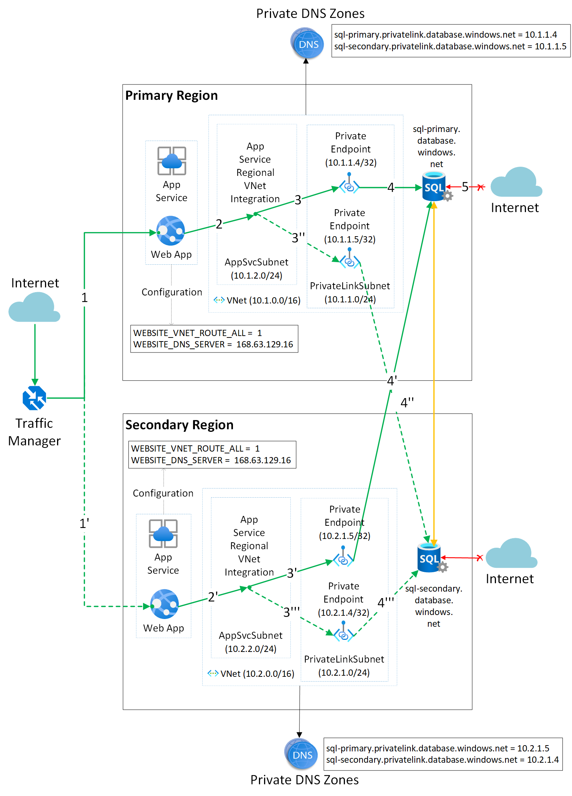
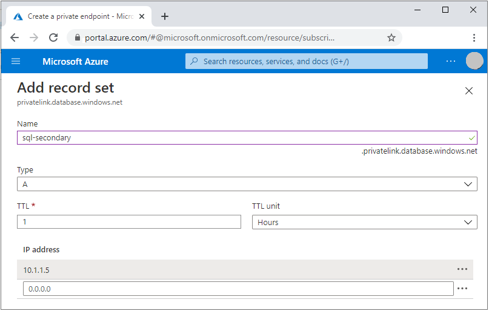

This example scenario discusses a highly available solution for a web app with private connectivity to a SQL database. A single-region architecture already exists for a web app with private connectivity to a SQL Database. This solution extends that base architecture by making it highly available.

See [Web app private connectivity to Azure SQL database](https://docs.microsoft.com/azure/architecture/example-scenario/private-web-app/private-web-app) for more information on the base architecture. In particular, see alternatives and specific considerations that also apply to this solution. (*Maybe move the last sentence into a considerations section.*)

To offer high availability, this solution:

- Deploys a secondary instance of the solution in another Azure region.
- [Uses auto-failover groups for geo-replication and high availability of the database](https://docs.microsoft.com/azure/azure-sql/database/auto-failover-group-overview).

(*Move this paragraph to security considerations?*) As with the single-region scenario, the web apps can securely connect to both backend databases over a fully private connection. The public internet can't access any of the database servers. This setup eliminates a common attack vector.

## Potential use cases

As with the single-region version (*change wording to avoid repitition*), this approach isn't limited to Azure SQL Database. You can also use this scenario with any service that supports an [Azure Private Endpoint](/azure/private-link/private-endpoint-overview#private-link-resource) for inbound connectivity. Examples include:

- Azure Storage
- Azure Cosmos DB
- Azure Cognitive Search
- Azure Event Grid
- Function Apps
- Other web apps

## Failover approaches

There are different ways to achieve high availability.

### Complete region failover

In one high availability approach, the architecture fails over the complete region in case of a failure in a single component, as detailed in the [Highly available multi-region web application](https://docs.microsoft.com/azure/architecture/reference-architectures/app-service-web-app/multi-region) reference architecture.

For example, when there is an issue with just the web app in the primary region, a database failover can be triggered and at the same time all traffic can be shifted to the app in the secondary region (for example, using [Traffic Manager](https://docs.microsoft.com/azure/traffic-manager/traffic-manager-overview) or [Azure Front Door](https://docs.microsoft.com/azure/frontdoor/front-door-overview)). This is simpler to reason about because there is no cross-region connectivity required, and you treat your entire solution as an isolated [deployment stamp](https://docs.microsoft.com/azure/architecture/patterns/deployment-stamp) which moves from one region to another as one unit.

The main disadvantage with this approach however is that triggering a [database failover can cause some data loss](https://docs.microsoft.com/azure/azure-sql/database/business-continuity-high-availability-disaster-recover-hadr-overview#fail-over-to-a-geo-replicated-secondary-database) due to the asynchronous nature of database replication. In this case, only the app has an issue, not the database. So it's possible to avoid this data loss.

In the other failure scenario where the app is running fine but the database has an issue, it could be a good idea to detect an automatic failover that was triggered in the database and use that to redirect all app traffic to the other region. Because the database failover (and therefore potential data loss) has happened anyway, there is nothing more to avoid and moving the app to the secondary region again keeps everything running locally without cross-region connectivity.

### Partial region failover

As an alternative to a complete region failover, you can also consider failing over only the components that are experiencing an issue. This means that if the database has an issue and fails over, the web app in the primary region should still be able to connect to the database (which is now active in the secondary region) - all while maintaining private connectivity. Similarly, if the app goes down in the primary region, the instance in the secondary region can take over but keep connecting to the same database (which is still active in the primary region).

The main disadvantage with this approach is the fact that cross-region connectivity implies latency, since every app request to the database must now go across the Azure network backbone into a remote Azure region, rather than staying local within the region. Depending on requirements, this can likely be tolerated for some period of time while the failed app or database is restored and connectivity can go back to normal inside the same region.

The partial region failover scenario is the focus of the remainder of this article.

### Two private endpoints for each database

Note that per the documentation on making [App Service work with Azure DNS private zones](https://docs.microsoft.com/azure/app-service/web-sites-integrate-with-vnet#azure-dns-private-zones), the web app needs the `WEBSITE_VNET_ROUTE_ALL` configuration setting to be `1` for the DNS resolution to work correctly within the region. (*Elaborate. What does that setting specify?*)

For cross-region private connectivity, however, this is not enough. [Global peering](https://docs.microsoft.com/azure/virtual-network/virtual-network-peering-overview) between the Virtual Networks is not an option, because with App Service regional VNet integration, [you can't reach resources across global peering connections](https://docs.microsoft.com/azure/app-service/web-sites-integrate-with-vnet#regional-vnet-integration). This means that when the database would fail over to the secondary region, the web app in the primary region cannot reach the private endpoint of the database in the secondary region.

In this architecture, we overcome that limitation by giving each database not one but *two* private endpoints: one in each region, resulting in four private endpoints in total. This works well because:

- [You can create multiple private endpoints for the same resource](https://docs.microsoft.com/azure/private-link/private-link-faq#can-i-connect-my-service-to-multiple-private-endpoints), meaning that it's allowed to expose two private endpoints for the same database.
- [A private endpoint in one region can connect to an Azure PaaS resource in another region](https://docs.microsoft.com/azure/private-link/private-link-faq#can-private-endpoint-connect-to-azure-paas-resources-across-azure-regions); in this case a private endpoint for the primary database can be created in the secondary region and vice versa.
- [You can create multiple private endpoints in the same Virtual Network](https://docs.microsoft.com/azure/private-link/private-link-faq#can-i-create-multiple-private-endpoints-in-same-vnet-can-they-connect-to-different-services), meaning that the private endpoints for both database instances can exist in the same network, [even in the same subnet](https://docs.microsoft.com/azure/private-link/private-link-faq#do-i-require-a-dedicated-subnet-for-private-endpoints).

## Architecture

Within each region, local connectivity happens exactly like in the [single-region version](https://docs.microsoft.com/azure/architecture/example-scenario/private-web-app/private-web-app):

1. Using Azure App Service [regional VNet Integration](https://docs.microsoft.com/azure/app-service/web-sites-integrate-with-vnet#regional-vnet-integration), the web app connects to Azure through an **AppSvcSubnet** delegated subnet in an Azure Virtual Network.
1. [Azure Private Link](https://docs.microsoft.com/azure/azure-sql/database/private-endpoint-overview#how-to-set-up-private-link-for-azure-sql-database) sets up a [private endpoint](https://docs.microsoft.com/azure/private-link/private-endpoint-overview) for the Azure SQL database in the **PrivateLinkSubnet** of the Virtual Network.
1. The web app connects to the Azure SQL Database private endpoint presented inside the **PrivateLinkSubnet** of the Virtual Network.
1. The database firewall allows only traffic coming from the private endpoint on the **PrivateLinkSubnet** to connect, making the database inaccessible from the public internet (but accessible from anything inside or connected to the Virtual Network).

### Connectivity flows

The web app in both regions is configured with a connection string where the `Server` host name refers to the DNS name of the SQL failover group, for example `Server=tcp:sql-failovergroup.database.windows.net,1433;Initial Catalog=...`. The exact same connection string is used in both regions, and does not have to be changed at any time (not even when the database needs to fail over).

#### Regular case: primary database is active

As we're using a SQL failover group, the DNS name of `sql-failovergroup.database.windows.net` resolves to the host name of the currently active database, in this case `sql-primary.database.windows.net`. Given that the database has private endpoints enabled, this DNS name will in turn resolve to `sql-primary.privatelink.database.windows.net` (note the intermediary `privatelink` subdomain that was added). From there, which IP address this host name will resolve into depends on the Private DNS Zone deployed in each region.

For traffic going into the *primary* region, the Private DNS Zone is configured to resolve `sql-primary.privatelink.database.windows.net` to `10.1.1.4`. This means that the app will connect to the private endpoint of the primary database (running in the same region), as depicted by the solid green arrows in the diagram.

If the web app would fail over to the secondary region (or even in case of an active/active configuration where traffic is routed to both regions simultaneously), that same `sql-primary.privatelink.database.windows.net` host name will now be resolved to `10.2.1.5` as there is a different Private DNS Zone in the secondary region. This results in the web app in the *secondary* region connecting to the private endpoint of the *primary* database which is exposed via the local Virtual Network inside the *secondary* region (thereby not requiring any global peering support as the connectivity is local from the web app's point of view). This can again be seen by following the solid green arrows in the diagram. Note that in this case there is cross-region traffic, implying an increase in latency.

Summary of DNS resolution in this case:

- Primary region: `sql-failovergroup.database.windows.net => sql-primary.database.windows.net => sql-primary.privatelink.database.windows.net => 10.1.1.4`
- Secondary region: `sql-failovergroup.database.windows.net => sql-primary.database.windows.net => sql-primary.privatelink.database.windows.net => 10.2.1.5`

#### Failover case: secondary database becomes active

If the database fails over, the SQL failover group's DNS record will change and now resolve to the newly active database in the secondary region, i.e. `sql-secondary.database.windows.net`. Again, since the secondary database also has private endpoints enabled, this resolves to `sql-secondary.privatelink.database.windows.net`.

For traffic going into the *secondary* region, the web app there will resolve `sql-secondary.privatelink.database.windows.net` to `10.2.1.4` according to its local Private DNS Zone. This means that the web app will now connect to the private endpoint of the secondary database (running in the same region), as depicted by the dotted green arrows.

If the web app remains active in the primary region (or again in case of an active/active solution), that same `sql-secondary.privatelink.database.windows.net` host name will there resolve to `10.1.1.5` as per the Private DNS Zone record in the primary region. This results in the web app in the *primary* region now connecting to the local private endpoint of the *secondary* database.

This shows that in all cases, both applications will connect to the currently active database over a fully private connection, without any change to configuration required.

Summary of DNS resolution in this case:

- Primary region: `sql-failovergroup.database.windows.net => sql-secondary.database.windows.net => sql-secondary.privatelink.database.windows.net => 10.1.1.5`
- Secondary region: `sql-failovergroup.database.windows.net => sql-secondary.database.windows.net => sql-secondary.privatelink.database.windows.net => 10.2.1.4`

### Components

- [App Service][App Service overview] provides a framework for building, deploying, and scaling web apps. This platform offers built-in infrastructure maintenance, security patching, and scaling.

- [Azure SQL Database][What is Azure SQL Database?] is a general-purpose relational database managed service that supports relational data, spatial data, JSON, and XML.

- [Azure Virtual Network][What is Azure Virtual Network?] is the fundamental building block for private networks in Azure. Azure resources like virtual machines (VMs) can securely communicate with each other, the internet, and on-premises networks through Virtual Networks.

- [Azure Private Link][What is Azure Private Link?] provides a private endpoint in a Virtual Network for connectivity to Azure PaaS services like Azure Storage and SQL Database, or to customer or partner services.

- [Traffic Manager][What is Traffic Manager?] is a DNS-based traffic load balancer. This service distributes traffic to public-facing applications across global Azure regions. Traffic Manager also provides public endpoints with high availability and quick responsiveness.

### Alternatives

## Considerations

In general, the same considerations apply as with the [single-region version](https://docs.microsoft.com/azure/architecture/example-scenario/private-web-app/private-web-app). However, the "global peering" limitation mentioned as a consideration there is explicitly resolved here by deploying the additional private endpoints in the remote regions. This allows you to achieve a higher availability than with a single-region deployment.

## Deploy this scenario

Follow these steps to deploy this scenario:

1. Deploy the two regions separately by following the steps in the [single-region version](https://docs.microsoft.com/azure/architecture/example-scenario/private-web-app/private-web-app#deploy-this-scenario). But note the following points:

   - You need at least two resource groups for this complete scenario for these reasons:

     - The Azure resource that represents a private DNS zone uses the actual DNS zone name (for example, `privatelink.database.windows.net`).
     - You can't have different private DNS zones with the same name within a single resource group.
  
     It's best to deploy all resources that you host in the same Azure region into the same resource group.

   - To avoid confusion, choose non-overlapping IP address ranges for the virtual networks in both regions. This approach isn't required but is best if you plan on peering the networks for other reasons later on.

   - Only create the logical SQL Server in the secondary region. Don't create the SQL Database itself. The process of setting up the SQL failover group automatically creates and replicates the secondary database.

1. [Create the SQL failover group](https://docs.microsoft.com/azure/azure-sql/database/failover-group-add-single-database-tutorial#2---create-the-failover-group). This step replicates the database across the two regions. Ensure the application uses the failover group DNS name in its connection string.

1. Deploy and configure the additional cross-regional private endpoints for both databases:

   1. [Create an additional private endpoint for each database](https://docs.microsoft.com/azure/private-link/create-private-endpoint-portal#create-a-private-endpoint), but select the subnet in the virtual network in the *other* region.
   1. Look up the IP address for the newly created private endpoint in the local virtual network. For example:

      - In the primary region, the address for the secondary database might be `10.1.1.5`.
      - In the secondary region, the address for the primary database might be `10.2.1.5`.

   1. Add that IP address as an A record to the `privatelink.database.windows.net` private DNS zone that's linked to the local virtual network. For example:
   
      - In the primary region, set `sql-secondary` to `10.1.1.5`.
      - In the seconday region, set `sql-primary` to `10.2.1.5`.

   

At this point:

- The apps in both regions should be able to connect to both databases over their private endpoints.
- Both apps should transparently continue to function even if the database fails over to the other region.

## Pricing

This scenario effectively doubles the cost of the single-region version, unless you use a scaled-down version of the App Service Plan in the secondary (standby) region and scale it up only when it becomes the active region. The database in the secondary region *must* be configured with the same service tier as called out in the [documentation for Azure SQL Database geo-replication](https://docs.microsoft.com/azure/azure-sql/database/active-geo-replication-overview#configuring-secondary-database), otherwise the secondary may not be able to keep up with the replication changes. An additional factor is the [egress bandwidth cost](https://azure.microsoft.com/pricing/details/bandwidth/) in case there is cross-region traffic, as network traffic between Azure regions is charged.

## Next steps

## Related resources

For more information on database replication and high availability, see the [Overview of business continuity with Azure SQL Database](https://docs.microsoft.com/azure/azure-sql/database/business-continuity-high-availability-disaster-recover-hadr-overview).

For more information on inbound and outbound scenarios for App Service, and which features to use in which cases, see the [App Service networking features overview](/azure/app-service/networking-features).

[App Service overview]: https://docs.microsoft.com/azure/app-service/overview
[What is Azure Private Link?]: https://docs.microsoft.com/azure/private-link/private-link-overview
[What is Azure SQL Database?]: https://docs.microsoft.com/azure/azure-sql/database/sql-database-paas-overview
[What is Azure Virtual Network?]: https://docs.microsoft.com/azure/virtual-network/virtual-networks-overview
[What is Traffic Manager?]: https://docs.microsoft.com/azure/traffic-manager/traffic-manager-overview