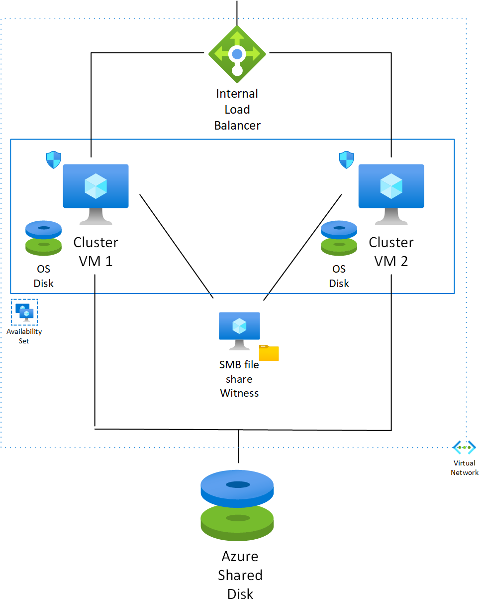

# SQL Server 2008 R2 Failover Cluster Instance on Windows Server 2008 R2 in Azure

For different users, in their on-premises environments, SQL Server 2008 R2 Failover Cluster is still one of most adopted database cluster implementation. So far, if these users want to replicate their on-premises deployment in Azure, they had to adopt software solutions to manage shared storage.

Recently Microsoft has definitely overcome this requirement introducing the [Azure shared disks](https://docs.microsoft.com/azure/virtual-machines/windows/disks-shared) feature.

Plus [extending the support for SQL Server 2008 R2 and Windows Server 2008 R2](https://azure.microsoft.com/blog/announcing-new-options-for-sql-server-2008-and-windows-server-2008-end-of-support), Microsoft want to support all users that cannot change their infrastructure, but who want to migrate in Azure.

The combinations of these two features enable scenarios of workloads rehosting in Azure with no application code changes.

In this architecture is described a configuration to move SQL Server 2008 R2 Failover Cluster on Azure to extend the supportability for the old platforms. A Windows Server 2008 R2 failover cluster based on the Azure Shared Disks is used.



## Prerequisites

* A two nodes instance SQL Server 2008 R2 Failover Cluster on-premises available for migration
  * The cluster nodes are joined to on-premises domain
* An Azure VNet connected with on-premises network
  * Communication with an Active Directory Domain Controller (AD DC), either on premises or an Azure VNet, must be allowed
  * A subnet on-which host cluster must be available
* A server, joined to domain, that can host a SMB file share that is used for cluster quorum configuration 

## Building a Windows Server 2008 R2 Failover Cluster on Azure

### Deploy Virtual Machines on Azure

The first element of target architecture that must be prepared is the Windows Server 200 R2 Failover Cluster. For this two Windows Server 2008 R2 virtual machine instances are required. This specific operating system version is no longer available through [Azure Marketplace](https://azuremarketplace.microsoft.com/en-us). It can be obtained through a PowerShell script or [uploading a generalized VHD](https://docs.microsoft.com/azure/virtual-machines/windows/upload-generalized-managed).

To guarantee redundancy and availability of two Virtual Machines an [Availability Set](https://docs.microsoft.com/azure/virtual-machines/windows/manage-availability#configure-multiple-virtual-machines-in-an-availability-set-for-redundancy) is configured.

>[!NOTE]
>In [Azure Marketplace](https://azuremarketplace.microsoft.com/en-us) is still available "SQL Server 2008 R2 SP3 on Windows Server 2008 R2". Please don't use this instance, because in this image SQL Server is pre-configured as standalone SQL Server instance and target architecture require a cluster configuration.

>[!NOTE]
>Virtual Machines are deployed with [Azure Hybrid Benefit](#Licensing) already activated.

The code is available in [Reference Code](/clusterwin2008sql.md#Reference-Code).

### Configure Virtual Machines

In order to prepare the two Windows Server 2008 R2 virtual machines to host SQL Cluster 2008 R2 Failover Cluster some specific configurations must be applied.

>[!NOTE]
>The above script deploys VMs that only have private IPs, consistently with classic on-premises database cluster configuration, that usually it is not directly exposed on Internet. To manage the cluster nodes deployed into the Azure VNet from the on-premises network, you must either have a route path established from on-premises that allows the relevant protocols, or you can use Azure native methods like [Azure Bastion](https://docs.microsoft.com/azure/bastion/bastion-connect-vm-rdp).

In each virtual machine execute below steps:

* Join virtual machine to domain

>[!IMPORTANT]
>Before execute this operation, be sure that the correct [name resolution for resource in Azure virtual networks](https://docs.microsoft.com/azure/virtual-network/virtual-networks-name-resolution-for-vms-and-role-instances#name-resolution-that-uses-your-own-dns-server) is in place.

* Add a domain administrator to the machine
* Install the rollup update [KB3125574](https://support.microsoft.com/help/3125574/convenience-rollup-update-for-windows-7-sp1-and-windows-server-2008-r2). This update extends the failover cluster to support the custom probe used by Azure Internal Load balancer.

### Deploy Azure Shared Disk

Currently the functionally to deploy an Azure Shared Disk is not available in Azure portal, but deployment with [ARM template](https://docs.microsoft.com/azure/azure-resource-manager/templates/overview) is available.

When the creation of Azure Shared Disk is complete connect it to both Virtual Machines. This operation can be done in Azure portal using the function "Attach existing disks" di Disks blade of each Virtual Machine.

>[!NOTE]
>Currently ReadOnly host caching is not available for premium SSDs Azure shared disks.

Login in one virtual machine and execute below operations:

* Initialize Azure shared disks using MBR partition style
* Create a New Simple Volume
* Format Disk

>[!NOTE]
> This operation can take several minutes and Virtual Machine could be restarted

* To make disk visible on the second virtual machine, reboot it
* Check that disk is visible on both virtual machines

>[!IMPORTANT]
> The visibility on both virtual machine is only temporary because subsequently the disk will be managed by cluster.

The ARM template is available in [Reference Code](/clusterwin2008sql.md#Reference-Code).

### Configure Cluster

The configuration of Windows Server 2008 R2 cluster is done following the standard procedures. This chapter describes the macro operations that must be executed.
There are two deployment option: through the command line or through the Management Console. Due to Windows 2008 R2 Cluster Limitations, the configuration through the GUI 
will generate some errors related to cluster IP configuration and it will require some recovery activities. The configuration using the command line is easier and it will not generate any errors.
For both detailed procedures referee to official Microsoft documentation.

### Command Line Configuration   

In each Virtual Machine, login as domain administrator, open a command line as administrator and run the following commands:
* Add Failover Clustering feature

```powershell
servermanagercmd -install Failover-Clustering
```
* Create the Failover Clustering

```powershell
cluster /cluster:"<cluster name>" /create /nodes:"<node 1> <node 2> /ipaddr:<cluster ip address>/255.255.255.0
```

* Open the Failover Cluster Management Console
  * Add the disks in the available storage
  * Run the cluster validation to check the configuration
* Open Firewall Inbound Ports - This configuration is ok for a SQL Server Default instance:
  * SQL Server - 1433
  * Load Balancer Health Probe - 59999
  * For a complete guideline refer to [Configure the Windows Firewall to Allow SQL Server Access](https://docs.microsoft.com/sql/sql-server/install/configure-the-windows-firewall-to-allow-sql-server-access?view=sql-server-ver15)

### UI Configuration

* Add Failover Clustering feature
  * If you run a configuration validation, only a warning is displayed because there is only a network interface in each node
* Open Firewall Inbound Ports - This configuration is ok for a SQL Server Default instance:
  * SQL Server - 1433
  * Load Balancer Health Probe - 59999
  * For a complete guideline refer to [Configure the Windows Firewall to Allow SQL Server Access](https://docs.microsoft.com/sql/sql-server/install/configure-the-windows-firewall-to-allow-sql-server-access?view=sql-server-ver15)

Login in one virtual machine and execute below operations:

* Create a cluster using UI wizard
  * During this operation the Cluster Name Object (CNO) with the specified name is set into domain
  * By default the cluster IP address is set using DHCP

  >[!NOTE]
  > At the end of cluster creation, if a critical error is generated, please ignore it

At end of configuration the cluster won't start because quorum is missing and network IP isn't configured properly.

#### Fix IP Configuration

When the cluster run firs time it receives a not valid IP address. This problem must be fix providing a VNet available IP.

From one of two nodes execute below command:

```powershell
Net start clussvc /fq
```

From the "Failover Cluster Manager" open the properties of the Cluster IP address and change it from DHCP to Static. Assign it an unused Azure VNet IP address.

Anyway this IP cannot be used to communicate with cluster. This happen because it is not associated to an Azure object. As consequence, it is not visible inside VNet and cannot be routed. To solve this problem an [Azure internal load balancer](/clusterwin2008sql.md#Azure-Internal-Load-Balancer) will be deployed.

#### Cluster Witness

Having a cluster with only two nodes a quorum must be configured. In this configuration a file share witness is used.

On the server that can host a SMB file share, create a share and provide _Change_ and _Read_ right to the Cluster Name Object (CNO).

Login in one virtual machine and open the "Configure Cluster Quorum Wizard" and set the cluster quorum using "Node and File Share Majority" setting. When required select the newly created share. 
The quorum configuration can be done also through the command line. Open a command line as administrator end execute the following command:

```powershell
cluster /cluster:"<cluster name>" res "File Share Witness" /create /group:"Cluster Group" /type:"File Share Witness" /priv SharePath="<witness share>"
cluster /cluster:"<cluster name>" res "File Share Witness" /online
cluster "<cluster name>" /quorum:"File Share Witness"
```

Because all the pending configuration now are completed, the cluster can go online.

### Deploy SQL Server 2008 R2 Failover Cluster

To speed up the deployment procedure, slipstream SQL Server 2008 R2 and SQL Server 2008 R2 SP3 using procedure described [here](https://support.microsoft.com/help/955392/how-to-update-or-slipstream-an-installation-of-sql-server-2008).

Login in the first virtual machine and execute below activities:

* Add .NET Framework 3.5.1 feature
* Execute "New SQL Server failover cluster installation"
  * In the Network configuration, disable DHCP and set an unused VNet IP
  * In the Database Engine Configuration check that in Data Directories the Azure shared disk is selected

Login in the second virtual machine and execute below activities:

* Add .NET Framework 3.5.1 feature
* Execute "Add node to a SQL Server failover cluster"

### Azure Internal Load Balancer

To associate a routable private IP address to SQL cluster an [Azure Internal Load Balancer](https://docs.microsoft.com/azure/load-balancer/tutorial-load-balancer-standard-internal-portal) must be used.

>[!NOTE]
>Use as private IP one that was not used previously during the cluster configuration.

The code is available in [Reference Code](/clusterwin2008sql.md#Reference-Code).

Now the SQL Server 2008 R2 Failover Cluster must be configured to accept the probe requests. To do it a TCP listener for the SQL Failover Cluster IP is configured. During its configuration a TCP port, that is the probe port, is provided as parameter.

From one virtual machine, execute:

```powershell
$IPResourceName = "<Name of the SQL Server IP resource e.g. 'SQL IP Address 1 (sqldbcluster)'>"
$AILBIP = "<Azure Internal Load Balancer IP>"
cluster res $IPResourceName /priv enabledhcp=0 address=$AILBIP probeport=59999 subnetmask=255.255.255.255
```

To apply changes, take the SQL Server offline and start it again.

To check that new configuration was accepted, check the SQL Server IP configuration to be sure that subnet mask is set to 255.255.255.255.

>[!NOTE]
> If the rollup update [KB3125574](https://support.microsoft.com/help/3125574/convenience-rollup-update-for-windows-7-sp1-and-windows-server-2008-r2) has been not installed, the ```cluster``` command will fail because by default it is not possible to configure a subnet mask 255.255.255.255 for a Windows Server 2008 R2 cluster.

## Licensing

For customers with Software Assurance, [Azure Hybrid Benefit](https://docs.microsoft.com/azure/virtual-machines/windows/hybrid-use-benefit-licensing) for Windows Server allows to use on-premises Windows Server licenses.

The deployed Virtual Machines have the Azure Hybrid Benefit already activated. If you want to revert this configuration follow the [official guideline](https://docs.microsoft.com/azure/virtual-machines/windows/hybrid-use-benefit-licensing#powershell-1).

## Data Migration Strategy

To transfer data from on-premises database to newly created cluster, some potential migration strategies are:

* [Restore a database backup](https://docs.microsoft.com/sql/relational-databases/backup-restore/restore-a-database-backup-using-ssms?view=sql-server-ver15) on the new installation
* Use the [SQL Log Shipping](https://docs.microsoft.com/it-it/sql/database-engine/log-shipping/configure-log-shipping-sql-server?view=sql-server-ver15) to replicate the databases from the old server to the new one

## Reference Code

* [PowerShell script to deploy Virtual Machines on Azure](VM-Deploy.ps1)
* [ARM Template to create shared disk](shared-disk.json)
* [PowerShell script to deploy Azure Internal Load Balancer](LB-Deploy.ps1)
