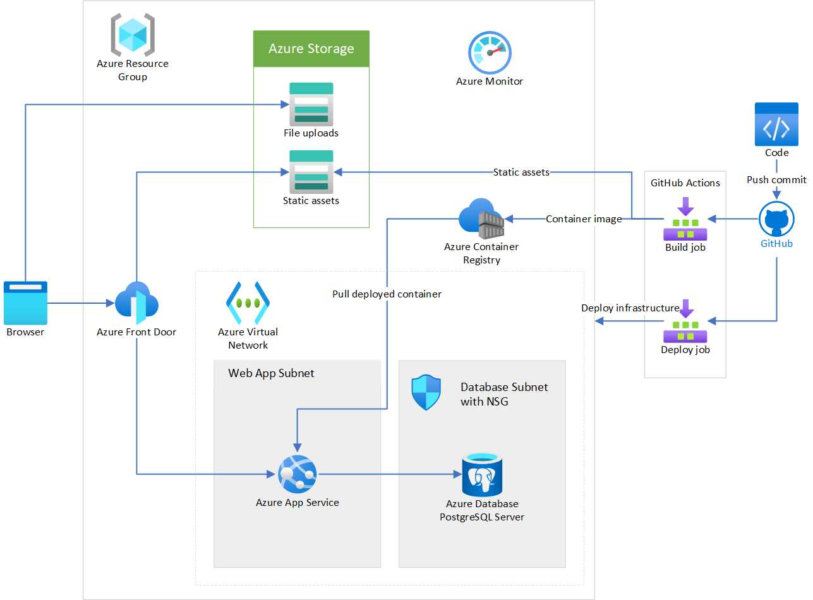
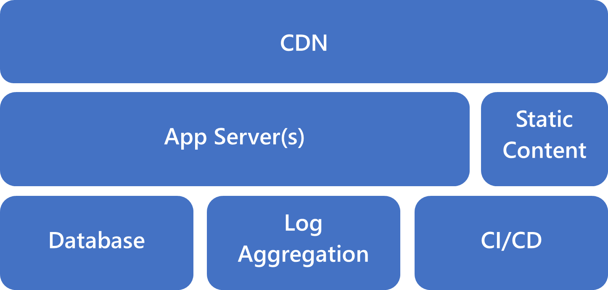

Many lessons you learn in larger companies aren't directly applicable to a startup's first stack. In a product's initial [explore](../../guide/startups/startup-architecture.md#explore) stage, you need to optimize deployment for speed, cost, and *optionality*. Optionality refers to how fast you can change directions within a given architecture.

A business in the [expand](../../guide/startups/startup-architecture.md#expand) or [extract](../../guide/startups/startup-architecture.md#extract) phases of product development  might use a service-oriented or microservices architecture. This type of deployment architecture is rarely right for a startup that hasn't yet found product/market fit or commercial traction.

For a core startup stack, a simple monolithic design is best. This design limits the time spent managing infrastructure, while providing ample ability to scale as the startup wins more customers. This article presents an example of a simple core startup stack, and discusses its components.

## Architecture

A startup, Contoso, has built an application prototype with a [Ruby on Rails](https://rubyonrails.org) back end and a [React](https://reactjs.org) front end written in [TypeScript](https://www.typescriptlang.org). The Contoso team has been running demos on their laptops. Now they want to deploy their app for their first customer sales meetings.

While the app is ambitious, it doesn't yet need a complex, microservice-driven architecture. Contoso opted for a simple monolithic design that includes the recommended startup stack components.

*Download a [Visio file](https://archcenter.blob.core.windows.net/cdn/Startup%20Stack%20Architecture.vsdx) of this architecture.*

In this core startup stack architecture:

- [Azure App Service](/azure/app-service/overview) provides a simple app server to deploy scalable applications without configuring servers, load balancers, or other infrastructure.
- [Azure Database for PostgreSQL](/azure/postgresql/overview) is an Azure database service for a leading open-source relational database management system (RDBMS). You can concentrate on developing your application rather than managing database servers.
- [Azure Virtual Network](/azure/virtual-network/virtual-networks-overview) segments network traffic and keeps internal services protected from internet threats. Your app servers use [virtual network integration](/azure/app-service/web-sites-integrate-with-vnet) to communicate with the database without exposure to the internet.
- [GitHub Actions](https://docs.github.com/actions) builds continuous integration and continuous deployment (CI/CD) into your source code management. GitHub Actions has extensive support for different languages, and strong integration with Azure services.
- [Azure Blob Storage](/azure/storage/blobs/storage-blobs-overview) stores static assets and moves load away from the app servers.
- [Azure Content Delivery Network (CDN)](/azure/cdn/cdn-overview) accelerates content delivery to users through a global network.
- [Azure Monitor](/azure/azure-monitor/overview) monitors and analyzes what's happening across your application's infrastructure.

## Core startup stack components

A complex stack can generate bugs that require constant attention. A sophisticated architecture might detract from building your product. Bugs aren't caused by complexity, but a complex stack makes it easier to ship bugs. Not all sophisticated architectures are a waste of energy, but they waste your resources if you haven't yet found product/market fit. Your first startup stack should be simple and get out of your way, so you can concentrate on product development.

The following simple diagram shows the recommended core startup stack. These components are enough to get your product off the ground and into the hands of your customers. For 80 percent of startups, this stack is all you need to test the basic hypotheses built into your product. Startups working in machine learning, internet of things (IoT), or highly regulated environments might require more components.

### CDN

With few customers at the start, a CDN might seem premature. However, adding a CDN to a product already in production can have unexpected side effects. It's best to implement a CDN up front. A CDN caches static content closer to your customers, and provides a façade behind which you can iterate on your APIs and your architecture.

### App server

Your code needs to run somewhere. Ideally, this platform should make deployments easy, while requiring the least possible operational input. The app server should scale horizontally, but some manual scaling intervention is fine while you're still in the explore stage.

Like most of this stack, the app server should essentially run itself. Traditionally, the app server was a virtual machine, or a web server instance running on a bare-metal server. Now, you can look to platform-as-a-service (PaaS) options and containers to remove operational overhead.

### Static content

Serving static content from your app server wastes resources. Once you configure a CI/CD pipeline, the work to build and deploy static assets with each release is trivial. Most production web frameworks deploy static assets with CI/CD, so it's worthwhile to start out by aligning with this best practice.

### Database

Once your app is running, you need to store your data in a database. For most cases, a relational database is the best solution. A relational database has multiple access methods and the speed of a time-tested solution. Relational databases include [Azure SQL Database](https://azure.microsoft.com/products/azure-sql/database), [Azure Database for PostgreSQL](https://azure.microsoft.com/services/postgresql), and [Azure Database for MariaDB](https://azure.microsoft.com/services/mariadb). Some use cases need a document database or NoSQL database like [MongoDB](https://www.mongodb.com/mongodb-on-azure) or [Azure Cosmos DB](https://azure.microsoft.com/services/cosmos-db).

### Log aggregation

If something goes wrong with your app, you want to spend as little time as possible diagnosing the problem. By aggregating logs and using application tracing from the beginning, you help your team focus on the problems themselves. You don't have to access a file on the app server and pore over logs to get monitoring data.

### CI/CD

The lack of repeatable and rapid deployments is one of the worst impediments to speed when you're iterating on a product. A well-configured CI/CD pipeline streamlines the code deployment process on your app server. Quick and easy deployments mean that you see the results of your labor quickly. Frequent integration avoids divergent code bases that lead to merge conflicts.

## Deploy this architecture

You can see a sample core startup stack implementation [on GitHub](https://github.com/Azure-Samples/core-startup-stack-rails). The sample uses a Ruby on Rails app. The concepts and techniques are the same for most projects you build by using a [Dockerfile](https://docs.docker.com/engine/reference/builder).

## Next steps

- [Automate your workflow with GitHub Actions](/learn/paths/automate-workflow-github-actions)

## Related resources

- [Architecture for startups](../../guide/startups/startup-architecture.md)
- [Best practices in cloud applications](../../best-practices/index-best-practices.md)
- [Best practices for using content delivery networks (CDNs)](../../best-practices/cdn.md)
- [Ten design principles for Azure applications](../../guide/design-principles/index.md)
