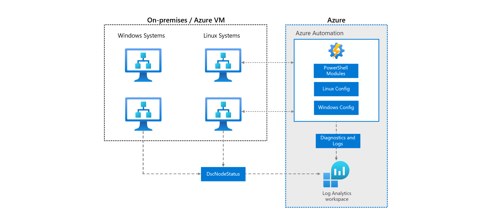

Azure Automation State Configuration is an Azure configuration management service that allows you to configure and enforce state on virtual and physical machines in any cloud or on-premises datacenter. In addition to enforcing configuration, you can also use Azure Automation State Configuration in a report-only mode where compliance data is generated based on a virtual or physical machine's compliance with a configuration.

## Architecture

This example scenario demonstrates using Azure Automation State Configuration to install a web server on both Windows and Linux-based Azure Virtual Machines. Azure Monitor is used to raise an alert for any non-compliant systems.



## Reference deployment

This deployment includes an Azure Automation account, the Azure Automation State Configuration feature, and one to many Windows and Linux Virtual machines that are onboarded onto State Configuration. Once deployed, and configuration is applied to each virtual machine that installs a web server.

#### [Azure CLI](#tab/cli)

Use the following command to create a resource group for the deployment. Click the **Try it** button to use an embedded shell.

```azurecli-interactive
az group create --name state-configuration --location eastus
```

Run the following command to deploy the ARM template. When prompted, enter a username and password. These values can be used to log into the created virtual machines.

```azurecli-interactive
az deployment group create --resource-group state-configuration \
    --template-uri https://raw.githubusercontent.com/mspnp/samples/master/solutions/azure-automation-state-configuration/azuredeploy.json
```

Once deployed, in the Azure portal, click on the **Automation Account** resource and then **State configuration (DSC)** and notice that all virtual machines have been added to the system and are compliant. These machines have all had the PowerShell DSC configuration applied, which has installed a web server on each.


You can also browse to the public IP address of any virtual machine to verify that a web server is running.

#### [PowerShell](#tab/powershell)

Use the following command to create a resource group for the deployment. Click the **Try it** button to use an embedded shell.

```azurepowershell-interactive
New-AzResourceGroup -Name state-configuration -Location eastus
```

Run the following command to deploy the ARM template. When prompted, enter a username and password. These values can be used to log into the created virtual machines.

```azurepowershell-interactive
New-AzResourceGroupDeployment -ResourceGroupName state-configuration `
    -TemplateUri https://raw.githubusercontent.com/mspnp/samples/master/solutions/azure-automation-state-configuration/azuredeploy.json
```

Once deployed, in the Azure portal, click on the **Automation Account** resource and then **State configuration (DSC)** and notice that all virtual machines have been added to the system and are compliant. These machines have all had the PowerShell DSC configuration applied, which has installed a web server on each.


You can also browse to the public IP address of any virtual machine to verify that a web server is running.

#### [Azure portal](#tab/portal)

Use the following button to deploy the reference using the Azure portal.

[](https://portal.azure.com/#create/Microsoft.Template/uri/https%3A%2F%2Fraw.githubusercontent.com%2Fmspnp%2Fsamples%2Fmaster%2Fsolutions%2Fazure-automation-state-configuration%2Fazuredeploy.json)

Once deployed, in the Azure portal, click on the **Automation Account** resource and then **State configuration (DSC)** and notice that all virtual machines have been added to the system and are compliant. These machines have all had the PowerShell DSC configuration applied, which has installed a web server on each.


You can also browse to the public IP address of any virtual machine to verify that a web server is running.

---

For detailed information and additional deployment options, see the ARM Templates used to deploy this solution.

> [!div class="nextstepaction"]
> [Azure Automation State Configuration ARM Templates](/samples/mspnp/samples/azure-automation-state-configuration/)

## Components

The following services and components are used in this solution.

- **Azure Automation:** Azure Automation delivers a cloud-based automation and configuration service that supports consistent management across your Azure and non-Azure environments.

- **Azure Automation State Configuration:** is a configuration management solution built on top of PowerShell Desired State Configuration (DSC). State configuration works with Azure virtual machines, on-premises machines, and machines in a cloud other than Azure. Using state configuration, you can import PowerShell DSC resources and assign them to many virtual machines from a central location. Once each endpoint has evaluated and / or applied the desired state, state compliance is reported to Azure and can be seen on a built-in dashboard.

- **Azure Monitor:** Azure Monitor collects and stores metrics and logs, application telemetry, and platform metrics for the Azure services. Use this data to monitor the application, set up alerts, dashboards, and perform root cause analysis of failures.

- **Azure Virtual Machines:** Azure IaaS solution for running virtual machines.

## Potential use cases

Use Azure Automation state configuration to host and manage PowerShell Desired State configurations centrally. These configurations can be applied to Windows and Linux systems to enforce state configuration. Example configurations could include:

- Configuring applications and web services.
- Enforcing compliance and security controls.
- Configure and enforce other operating system controls.

## Considerations

Consider the following items when managing systems configuration with Azure Automation State Configuration.

### Configurations

Windows and Linux systems are configured using a DSC configuration. These configurations are uploaded into the Azure Automation State Configuration service, compiled into a node configuration, and can be assigned to any system managed by the state configuration services.

Configuration can be composed in any text editor or in the Azure portal. The following examples are used in the included deployment to install a web server on both Windows and Linux systems.

# [Linux](#tab/linux)

```powershell
configuration linuxpackage {

    Import-DSCResource -Module nx

    Node "localhost" {

        nxPackage nginx {
            Name = "nginx"
            Ensure = "Present"
        }
    }
}
```

For more information on creating configurations, see [Compose DSC configurations](/azure/automation/compose-configurationwithcompositeresources).

# [Windows](#tab/windows)

```powershell
configuration windowsfeatures {

    Import-DscResource -ModuleName PsDesiredStateConfiguration

    node localhost {

        WindowsFeature WebServer {
            Ensure = "Present"
            Name = "Web-Server"
        }
    }
}
```

---

For more information on composing configurations, see [Composing DSC configurations](/azure/automation/compose-configurationwithcompositeresources).

### Monitoring

Azure Automation State Configuration retains node status data for 30 days. You can send node status data to your Log Analytics workspace if you prefer to retain this data for a longer period. Azure Monitor logs provide greater operational visibility to your Automation State Configuration data and help address incidents more quickly. For example, with Azure monitor integration, an email alert can be raised when a system is found to be non-compliant.

Azure Monitor integration is configured with the included deployment. The following Azure Monitor query is used to detect and alert when non-compliant systems are detected.

```kusto
AzureDiagnostics
| where Category == "DscNodeStatus"
| where ResultType != "Failed"
```

For more information on monitoring Azure Automation State Configuration, see [Integrate with Azure Monitor logs](/azure/automation/automation-dsc-diagnostics).

## Pricing

Configuration management includes the configuration pull service and change tracking capabilities. Billing is based on the number of nodes that are registered with the service and the log data stored in the Azure Log Analytics service.

Charges for configuration management start when a node is registered with the service and stops when the node is unregistered. A node is any machine whose configuration is managed by configuration management. This could be an Azure virtual machine (VM), on-premises VM, physical host, or a VM in another public cloud. Billing for nodes is pro-rated hourly.

For more information, see [Automation pricing](https://azure.microsoft.com/pricing/details/automation/).

## Next steps

- [Browse additional solutions](/azure/architecture/browse/)
- [Azure Automation update management](/azure/architecture/hybrid/azure-update-mgmt)
- [Azure Automation State Configuration documentaton](/azure/automation/automation-dsc-overview)
