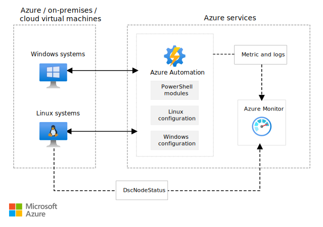
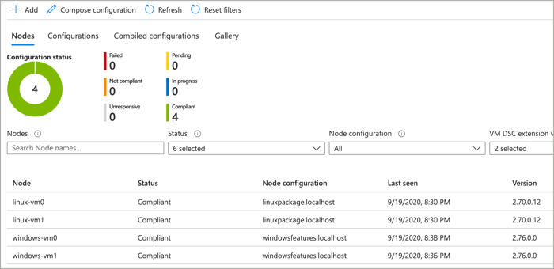

Azure Automation State Configuration is an Azure configuration management service that makes it possible for you to configure and enforce state on virtual and physical machines in any cloud or on-premises datacenter. You can use Azure Automation State Configuration in a report-only mode to see configuration compliance data for a virtual or physical machine.

## Architecture

This example scenario demonstrates how to use Azure Automation State Configuration to install a web server on Windows and Linux Azure virtual machines (VMs). You can then use Azure Monitor to raise an alert when a system is non-compliant.



*Download a [Visio file](https://arch-center.azureedge.net/azure-automation-state-configuration.vsdx) of this architecture.*

### Workflow

In this solution, you use the following services and components:

- **Azure Automation**: Delivers a cloud-based automation and configuration service that supports consistent management across your Azure and non-Azure environments.
- **PowerShell Desired State Configuration (DSC):** A management platform in PowerShell that you can use to manage your IT and development infrastructure by using configuration as code.
- **Azure Automation State Configuration:** A configuration management solution that's built by using PowerShell Desired State Configuration. State Configuration works with Azure VMs, on-premises machines, and machines in non-Azure clouds. By using State Configuration, you can import PowerShell DSC resources and assign them to many virtual machines from a central location. After each endpoint has evaluated or applied the desired state, state compliance is reported to Azure and displayed on a built-in dashboard.
- **Azure Monitor:** Azure Monitor collects and stores metrics and logs, application telemetry, and platform metrics for the Azure services. Use this data to monitor the application, to set up alerts and dashboards, and to perform root-cause analysis of failures.
- **Azure Virtual Machines:** The Azure IaaS solution for running virtual machines.

### Components

- [Azure Automation](https://azure.microsoft.com/products/automation)
- [Azure Monitor](https://azure.microsoft.com/products/monitor)
- [Azure Virtual Machines](https://azure.microsoft.com/products/virtual-machines)

## Scenario details

### Configurations

You configure Windows and Linux systems by using a DSC configuration. These configurations are uploaded into the Azure Automation State Configuration service and compiled into a node configuration. They can then be assigned to any system that's managed by the state configuration services.

A configuration can be composed in any text editor or by using the Azure portal. The following examples are used in the included deployment to install a web server on both Windows and Linux systems.

#### [Linux](#tab/linux)

```powershell
configuration linuxpackage {

    Import-DSCResource -Module nx

    Node "localhost" {

        nxPackage nginx {
            Name = "nginx"
            Ensure = "Present"
        }
    }
}
```

For more information about composing configurations, see [Compose DSC configurations](/azure/automation/compose-configurationwithcompositeresources).

#### [Windows](#tab/windows)

```powershell
configuration windowsfeatures {

    Import-DscResource -ModuleName PsDesiredStateConfiguration

    node localhost {

        WindowsFeature WebServer {
            Ensure = "Present"
            Name = "Web-Server"
        }
    }
}
```

For more information about composing configurations, see [Compose DSC configurations](/azure/automation/compose-configurationwithcompositeresources).

---

### Monitoring

Azure Automation State Configuration retains node status data for 30 days. You can send node status data to your Log Analytics workspace if you want to retain it for longer. Azure Monitor logs provide greater operational visibility to your Automation State Configuration data and help address incidents more quickly. For example, with Azure monitor integration, an email alert can be raised when a system is found to be non-compliant.

Azure Monitor integration is configured with the included deployment. The following Azure Monitor query is used to detect and alert when non-compliant systems are detected.

```kusto
AzureDiagnostics
| where Category == "DscNodeStatus"
| where ResultType != "Failed"
```

For more information about monitoring Azure Automation State Configuration, see [Integrate with Azure Monitor logs](/azure/automation/automation-dsc-diagnostics).

## Considerations

These considerations implement the pillars of the Azure Well-Architected Framework, which is a set of guiding tenets that can be used to improve the quality of a workload. For more information, see [Microsoft Azure Well-Architected Framework](/azure/architecture/framework).

### Cost optimization

Cost optimization is about looking at ways to reduce unnecessary expenses and improve operational efficiencies. For more information, see [Overview of the cost optimization pillar](/azure/architecture/framework/cost/overview).

Configuration management includes the configuration pull service and change tracking capabilities. Billing is based on the number of nodes that are registered with the service and on the quantity of log data that's stored in the Azure Log Analytics service.

Charges for configuration management start when a node is registered with the service and they stop when the node is unregistered. A node is any machine whose configuration is managed by configuration management. It could be an Azure VM, an on-premises VM, a physical host, or a VM in another public cloud. Billing for nodes is prorated hourly.

For more information, see [Automation pricing](https://azure.microsoft.com/pricing/details/automation).

## Deploy this scenario

This deployment includes an Azure Automation account, the Azure Automation State Configuration feature, and one or more Windows and Linux VMs that are onboarded onto State Configuration. After they're deployed, a configuration is applied to each virtual machine that installs a web server.

### [The Azure CLI](#tab/cli)

To create a resource group for the deployment, run the following command. To use an embedded shell, select the **Try it** button.

```azurecli-interactive
az group create --name state-configuration --location eastus
```

To deploy the ARM template, run the following command. At the prompt, enter a username and password. Use these values to log in to the virtual machines that you create.

```azurecli-interactive
az deployment group create --resource-group state-configuration \
    --template-uri https://raw.githubusercontent.com/mspnp/samples/master/solutions/azure-automation-state-configuration/azuredeploy.json
```

After the VMs are deployed, select the **Automation Account** resource in the Azure portal and then select **State configuration (DSC)**. You'll note that all the virtual machines have been added to the system and are compliant. All these machines had the PowerShell DSC configuration applied, which installed a web server on each.



You can also browse to the public IP address of any virtual machine to verify that a web server is running.

### [PowerShell](#tab/powershell)

To create a resource group for the deployment, run the following command. To use an embedded shell, select the **Try it** button.

```azurepowershell-interactive
New-AzResourceGroup -Name state-configuration -Location eastus
```

To deploy the ARM template, run the following command. At the prompt, enter a username and password. Use these values to log in to the virtual machines that you create.

```azurepowershell-interactive
New-AzResourceGroupDeployment -ResourceGroupName state-configuration `
    -TemplateUri https://raw.githubusercontent.com/mspnp/samples/master/solutions/azure-automation-state-configuration/azuredeploy.json
```

After the VMs are deployed, select the **Automation Account** resource in the Azure portal, and then select **State configuration (DSC)**. You'll note that all the virtual machines have been added to the system and are compliant. All these machines had the PowerShell DSC configuration applied, which installed a web server on each.


You can also browse to the public IP address of any VM to verify that a web server is running.

### [Azure portal](#tab/portal)

Use the following button to deploy the reference using the Azure portal.

[](https://portal.azure.com/#create/Microsoft.Template/uri/https%3A%2F%2Fraw.githubusercontent.com%2Fmspnp%2Fsamples%2Fmaster%2Fsolutions%2Fazure-automation-state-configuration%2Fazuredeploy.json)

After the VMs are deployed, select the **Automation Account** resource in the Azure portal, and then select **State configuration (DSC)**. You'll note that all the virtual machines were added to the system and are compliant. All these machines had the PowerShell DSC configuration applied, which installed a web server on each.


You can also browse to the public IP address of any VM to verify that a web server is running.

---

For detailed information and additional deployment options, see the ARM templates that are used to deploy this solution.

> [!div class="nextstepaction"]
> [Azure Automation State Configuration ARM templates](/samples/mspnp/samples/azure-automation-state-configuration)

## Next steps

- [Azure Automation State Configuration overview](/azure/automation/automation-dsc-overview)
- [PowerShell Desired State Configuration (DSC) Overview](/powershell/scripting/dsc/overview)
- [Get started with Desired State Configuration (DSC) for Windows](/powershell/dsc/getting-started/wingettingstarted)
- [Compose DSC configurations](/azure/automation/compose-configurationwithcompositeresources).

- [Azure Automation documentation](/azure/automation)
- [Azure Monitor documentation](/azure/azure-monitor)
- [PowerShell documentation](/powershell)

## Related resources

- [Browse additional solutions](/azure/architecture/browse)
- [Azure Automation update management](/azure/architecture/hybrid/azure-update-mgmt)
