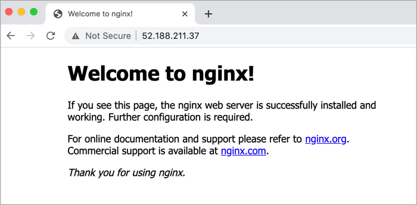

Azure Automation State Configuration is an Azure configuration management service that allows you to configure and enforce state on virtual and physical machines in any cloud or on-premises datacenter. The service is fully managed and is accessed through the Azure portal or Azure command-line tools and software development kits. In addition to enforcing configuration, you can also use Azure Automation State Configuration in a report-only mode where compliance data is generated based on a virtual or physical machine's compliance with a configuration.

This example scenario demonstrates using Azure Automation State Configuration to install a web server on both Windows and Linux-based Azure Virtual Machines. Use the included deployment to experience Azure Automation State Configuration in your Azure environment.

## Architecture

## Reference deployment

This deployment includes an Azure Automation account, the Azure Automation State Configuration feature, and one to many Windows and Linux Virtual machines that are onboarded onto State Configuration. Once deployed, and configuration is applied to each virtual machine that installs a web server.

#### [Azure CLI](#tab/cli)

Use the following command to create a resource group for the deployment. Click the **Try it** button to use an embedded shell.

```azurecli-interactive
az group create --name state-configuration --location eastus
```

Run the following command to deploy the ARM template.

```azurecli-interactive
az deployment group create --resource-group state-configuration \
    --template-uri https://raw.githubusercontent.com/mspnp/samples/master/OperationalExcellence/azure-automation-state-configuration/azuredeploy.json
```

#### [PowerShell](#tab/powershell)

Use the following command to create a resource group for the deployment. Click the **Try it** button to use an embedded shell.

```azurepowershell-interactive
New-AzResourceGroup -Name state-configuration -Location eastus
```

Run the following command to deploy the ARM template.

```azurepowershell-interactive
New-AzResourceGroupDeployment -ResourceGroupName state-configuration `
    -TemplateUri https://raw.githubusercontent.com/mspnp/samples/master/OperationalExcellence/azure-automation-state-configuration/azuredeploy.json
```

#### [Azure portal](#tab/portal)

Use the following button to deploy the reference using the Azure portal.

[](https://portal.azure.com/#create/Microsoft.Template/uri/https%3A%2F%2Fraw.githubusercontent.com%2Fmspnp%2Fsamples%2Fmaster%2FOperationalExcellence%2Fazure-automation-state-configuration%2Fazuredeploy.json)

--- 

## Components

## Potential use cases

## Alternatives

## Considerations

## Demo the solution

Click on the **Automation Account** resource and then **State configuration (DSC)** and notice that all virtual machines have been added to the system and are compliant. These machines have all had the PowerShell DSC configuration applied, which has installed a web server on each.


Browse to the public IP address of any virtual machine to verify that a web server is running.

