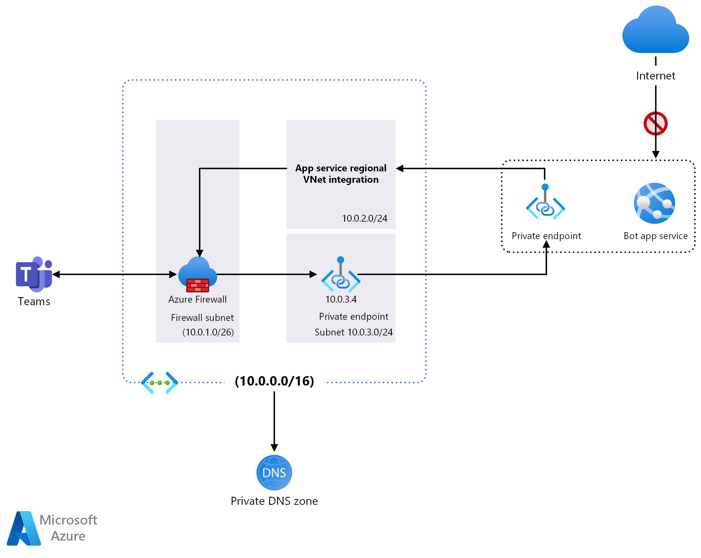

This example scenario secures the connection to a Microsoft Teams channel bot's
web app using Azure Private Link and Azure Private Endpoint, while enabling channels in the Teams client to communicate with the bot through an IP exposed through an Azure Firewall.

Bots allow Teams users to interact with web services through text, interactive cards, and task modules. The Microsoft Bot Framework and Azure Bot Services give you an easy-to-use set of tools for creating and managing these bots.

Bots can be developed using a variety of languages, such as C\#, JavaScript, and Python. Once developed, the bot can be deployed to Azure. A key component of the bot is the web app, which contains the core logic and interface that the user communicates with. One of the key requirements for the bot to work is that it must expose a publicly accessible HTTPS endpoint.

InfoSec policy commonly requires that all incoming traffic to web apps go through a corporate firewall. This means that all traffic going to a bot, and responses from the bot, must route through a corporate firewall, as with any other web app.

## Architecture



-   [Azure Virtual Network](/azure/virtual-network/) enables communications between Azure resources. The virtual network (VNet) in this example uses the address space of 10.0.0.0/16, and contains three subnets for use by the scenario's required components:

    -   *Azure Firewall Subnet* (10.0.1.0/26).

    -   *Virtual Network Integration Subnet* (10.0.2.0/24), which is used to route traffic from the bot's private endpoint to the firewall.

    -   *Private Endpoint Subnet* (10.0.3.0/24), which is used to route traffic from the firewall to the bot's private endpoint.

-   [Azure Firewall](/azure/firewall/) exposes a single public IP address that clients can use to communicate with the underlying bot services. Typically, a firewall is placed in its own VNet, which is a common pattern for [hub and spoke](../../reference-architectures/hybrid-networking/hub-spoke.yml) architectures, but this is a simplified example and deploys all services and resources into a single VNet. The Azure Firewall instance is placed in its own subnet.

-   [Route table](/azure/virtual-network/virtual-networks-udr-overview) defines the routes traffic takes within the virtual network, and ensures traffic coming to and from the bot passes through the firewall.

    -   The default route with the 0.0.0.0/0 address prefix instructs Azure to route traffic that isn't within the address prefix of any other route to the subnet where the Azure Firewall is deployed. In this example, it's the only route.

    -   The *Virtual Network Integration Subnet* and the *Private Endpoint Subnet* are associated with the route table, ensuring any traffic passing through them is routed through the firewall.

-   [Bot Service](/azure/bot-service/?view=azure-bot-service-4.0) consists of the bot [App Service plan](/azure/app-service/overview-hosting-plans),
    [App Service](/azure/app-service/), and the
    [bot channels registration](/azure/bot-service/bot-service-manage-channels?view=azure-bot-service-4.0).

    -   The App Service has a custom domain registered that points to the IP address of the firewall. This way the App Service can only be accessed through the firewall.

-   [Azure Private Link](/azure/private-link/private-link-overview) service for inbound access to the bot App Service over an [Azure Private Endpoint](/azure/private-link/private-endpoint-overview).

-   [Virtual Network Integration](/azure/app-service/web-sites-integrate-with-vnet) connects the App Service to the virtual network, ensuring outbound traffic from the bot App Service passes through the firewall.

### Components

-   [Virtual Network](https://azure.microsoft.com/services/virtual-network/)
-   [Azure Firewall](https://azure.microsoft.com/services/azure-firewall/)
-   [Azure Bot Services](https://azure.microsoft.com/services/bot-services/)
-   [App Service](https://azure.microsoft.com/services/app-service/)
-   [Azure Private Link](https://azure.microsoft.com/services/private-link/)

### Alternatives

-   [App Service Environment](/azure/app-service/environment/intro) (ASE) can provide a fully isolated and dedicated environment for securely running App Service apps at high scale. This example doesn't make use of ASE to reduce costs, but the sample architecture could support it with modifications.

## Considerations

### Monitoring

Although not implemented in this example scenario, a bot's App Service can utilize [Azure Monitor](/azure/azure-monitor/) services to monitor its availability and performance.

### Scalability

The bots used in this scenario are hosted on Azure App Service. As a result, you can use the standard App Service autoscaling features to automatically scale the number of instances running your bot, allowing your bot to keep up with demand. For more information on autoscaling, see [Autoscaling best practices](../../best-practices/auto-scaling.md).

For other scalability topics, see the Azure Architecture Center's [Performance efficiency checklist](/azure/architecture/framework/scalability/performance-efficiency).

### DevOps

It's a common practice to deploy web apps, API apps, and mobile apps to an Azure App Service plan using continuous deployment pipelines. Because a secured bot's App Service is protected using a private endpoint, externally hosted build agents don't have the access required to deploy updates. To work around this, you may need to use a solution such as Azure Pipeline [self-hosted DevOps agents](/azure/devops/pipelines/agents/agents?view=azure-devops&tabs=browser#install).

## Deploy the scenario

### Prerequisites

You must have an existing Azure account. If you do not have an Azure subscription, create a [free account](https://azure.microsoft.com/free/?WT.mc_id=A261C142F) before you begin.

### Walk-through

1.  Run the following Azure CLI commands in Azure Cloud Shell or your preferred deployment shell.

    This set of commands creates the necessary resource group, virtual network, and subnets required for this walk-through. Please note that the IP range used by Teams is
    [52.112.0.0/14](/microsoft-365/enterprise/urls-and-ip-address-ranges?view=o365-worldwide#skype-for-business-online-and-microsoft-teams).

   ```azurecli
   # Declare variables (bash syntax)
   export PREFIX='SecureBot'
   export RG_NAME='rg-'${PREFIX}
   export VNET_NAME='vnet-'${PREFIX}
   export SUBNET_INT_NAME='VnetIntegrationSubnet'
   export SUBNET_PVT_NAME='PrivateEndpointSubnet'
   export LOCATION='eastus'
   export TEAMS_IP_RANGE=' 52.112.0.0/14'

   # Create a resource group
   az group create --name ${RG_NAME} --location ${LOCATION}

   # Create a virtual network with a subnet for the firewall
   az network vnet create \
     --name ${VNET_NAME} \
     --resource-group ${RG_NAME} \
     --location ${LOCATION} \
     --address-prefix 10.0.0.0/16 \
     --subnet-name AzureFirewallSubnet \
     --subnet-prefix 10.0.1.0/26

   # Add a subnet for the Virtual Network Integration
   az network vnet subnet create \
     --name ${SUBNET_INT_NAME} \
     --resource-group ${RG_NAME} \
     --vnet-name ${VNET_NAME} \
     --address-prefix 10.0.2.0/24

   # Add a subnet where the private endpoint will be deployed for the app service
   az network vnet subnet create \
     --name ${SUBNET_PVT_NAME} \
     --resource-group ${RG_NAME} \
     --vnet-name ${VNET_NAME} \
     --address-prefix 10.0.3.0/24
   ```

> When complete, you should see the following subnets within your virtual network:

> 

2.  Using the following CLI commands, deploy an Azure Firewall into the firewall subnet created in step 1.

   ```azurecli                                                                                                                                             
   # Create a firewall
   az network firewall create \
     --name ${FIREWALL_NAME} \
     --resource-group ${RG_NAME} \
     --location ${LOCATION}

   # Create a public IP for the firewall
   az network public-ip create \
     --name ${FIREWALL_NAME}-pip \
     --resource-group ${RG_NAME} \
     --location ${LOCATION} \
     --allocation-method static \
     --sku standard

   # Associate the IP with the firewall
   az network firewall ip-config create \
     --firewall-name ${FIREWALL_NAME} \
     --name ${FIREWALL_NAME}-Config \
     --public-ip-address ${FIREWALL_NAME}-pip \
     --resource-group ${RG_NAME} \
     --vnet-name ${VNET_NAME}

   # Update the firewall
   az network firewall update \
     --name ${FIREWALL_NAME} \
     --resource-group ${RG_NAME}

   # Get the public IP address for the firewall and take note of it as it will be needed in a later step
   az network public-ip show \
     --name ${FIREWALL_NAME}-pip \
     --resource-group ${RG_NAME}
   ```

> Your firewall configuration should look something like this:

> 

3.  [Create a basic bot](/azure/bot-service/bot-builder-tutorial-create-basic-bot?view=azure-bot-service-4.0&tabs=csharp%2Cvs).

4.  [Deploy the basic bot](/azure/bot-service/bot-builder-deploy-az-cli) that you created in step 3 into the resource group you created in step 1. As part of this process, you'll create an app registration, which you need to interact with the bot via channels. During this process, you'll also deploy the necessary App Service plan (Note: *Select an App Service plan that supports Private Link*), App Service, and the web app bot.

5.  [Map a custom domain](/azure/app-service/app-service-web-tutorial-custom-domain?tabs=cname) to the App Service that was deployed to the resource group in step 3. This step requires access to your domain registrar, and it requires you to add an A-record to the custom domain pointing to the public IP of the firewall you created in step 2.

6.  You need to secure the mapped custom domain by either uploading an existing certificate for the domain or purchasing an App Service Certificate in Azure and importing it. You can do this by following the steps outlined in the tutorial: [Secure a custom DNS name with a TLS/SSL binding in Azure App Service](/azure/app-service/configure-ssl-bindings).

7.  You should now have a fully functional bot that you can add to a channel in Teams or test through Web Chat using the directions found in the [Bot Framework SDK documentation](/azure/bot-service/bot-builder-deploy-az-cli#test-in-web-chat).

    Note that at this point the bot's App Service is still publicly accessible over both the azurewebsites.net URL and over the custom URL you configured. In the next steps, you'll use private endpoints to disable public access. You'll also configure the firewall to only allow the bot service to communicate with Teams clients.

8.  Run the following Azure CLI script to [deploy and configure the private endpoint](/azure/app-service/scripts/cli-deploy-privateendpoint). This step also implements VNet integration for the bot's App Service, connecting it to your virtual network's integration subnet.

   ```azurecli                                                                                       
   # Disable private endpoint network policies (this step is not required if using the portal)
   az network vnet subnet update \
     --name ${SUBNET_PVT_NAME} \
     --resource-group ${RG_NAME} \
     --vnet-name ${VNET_NAME} \
     --disable-private-endpoint-network-policies true

   # Create the private endpoint. Make sure you copy the correct resource ID from your deployment of the bot App Service
   # The ID can be viewed by using the following CLI command:
   # az resource show --name wapp-securebot --resource-group rg-securebot --resource-type Microsoft.web/sites --query "id" 
   az network private-endpoint create \
     --name pvt-${PREFIX}Endpoint \
     --resource-group ${RG_NAME} \
     --vnet-name ${VNET_NAME} \
     --subnet ${SUBNET_PVT_NAME} \
     --connection-name conn-${PREFIX} \
     --private-connection-resource-id /subscriptions/cad87d9e-c941-4519-a638-c9804a0577b9/resourceGroups/rg-securebot/providers/Microsoft.Web/sites/wapp-securebot \
     --group-id sites

   # Create a private DNS zone to resolve the name of the app service
   az network private-dns zone create \
     --name ${PREFIX}privatelink.azurewebsites.net \
     --resource-group ${RG_NAME}

   az network private-dns link vnet create \
     --name ${PREFIX}-DNSLink \
     --resource-group ${RG_NAME} \
     --registration-enabled false \
     --virtual-network ${VNET_NAME} \
     --zone-name ${PREFIX}privatelink.azurewebsites.net

   az network private-endpoint dns-zone-group create \
     --name chatBotZoneGroup \
     --resource-group ${RG_NAME} \
     --endpoint-name pvt-${PREFIX}Endpoint \
     --private-dns-zone ${PREFIX}privatelink.azurewebsites.net \
     --zone-name ${PREFIX}privatelink.azurewebsites.net

   # Establish VNET integration for outbound traffic
   az webapp vnet-integration add \
     -g ${RG_NAME} \
     -n wapp-${PREFIX} \
     --vnet ${VNET_NAME} \
     --subnet ${SUBNET_INT_NAME}
   ```

> After completing these commands, you should see the following resources in your resource group:

> 

> The VNet Integration option under the **Networking** section of your App Service should look like this:

> 

> 

> 

9.  Next, you'll create a route table to ensure that traffic to and from each subnet goes through the firewall. You'll need the private IP address of the firewall you created in the previous step.

   ```azurecli                                                                                                                                                       
   # Create a route table
   az network route-table create \
     -g ${RG_NAME} \
     -n rt-${PREFIX}RouteTable

   # Create a default route with 0.0.0.0/0 prefix and the next hop as the Azure firewall virtual appliance to inspect all traffic. Make sure you use your firewall's internal IP address instead of 10.0.1.4
   az network route-table route create -g ${RG_NAME} \
     --route-table-name rt-${PREFIX}RouteTable -n default \
     --next-hop-type VirtualAppliance \
     --address-prefix 0.0.0.0/0 \
     --next-hop-ip-address 10.0.1.4

   # Associate the two subnets with the route table
   az network vnet subnet update -g ${RG_NAME} \
     -n ${SUBNET_INT_NAME} --vnet-name ${VNET_NAME} \
     --route-table rt-${PREFIX}RouteTable

   az network vnet subnet update -g ${RG_NAME} \
     -n ${SUBNET_PVT_NAME} \
     --vnet-name ${VNET_NAME} \
     --route-table rt-${PREFIX}RouteTable
   ```

 > On completion of this step, your route table resource should look like this:

 > 

10.  After creating the route table, you'll add rules to your firewall to deliver traffic from the public IP to the bot App Service and to restrict traffic from any endpoint other than Microsoft Teams. In addition, you'll allow traffic between the virtual network and Azure Bot Services or Azure Active Directory using service tags.

   ```azurecli
   # Create a NAT rule collection and a single rule. The source address is the public IP range of Microsoft Teams
   # Destination address is that of the firewall. 
   # The translated address is that of the app service's private link.
   az network firewall nat-rule create \
     --resource-group ${RG_NAME} \
     --collection-name coll-${PREFIX}-nat-rules \
     --priority 200 \
     --action DNAT \
     --source-addresses ${TEAMS_IP_RANGE} \
     --dest-addr 23.100.26.84 \
     --destination-ports 443 \
     --firewall-name ${FIREWALL_NAME} \
     --name rl-ip2appservice \
     --protocols TCP \
     --translated-address 10.0.3.4 \
     --translated-port 443

   # Create Network rule collection and add three rules to it. 
   # The first one is an outbound network rule to only allow traffic to the Teams IP range.
   # The source address is that of the virtual network address space, destination is the Teams IP range.
   az network firewall network-rule create \
     --resource-group ${RG_NAME} \
     --collection-name coll-${PREFIX}-network-rules \
     --priority 200 \
     --action Allow \
     --source-addresses 10.0.0.0/16 \
     --dest-addr ${TEAMS_IP_RANGE} \
     --destination-ports 443 \
     --firewall-name ${FIREWALL_NAME} \
     --name rl-OutboundTeamsTraffic \
     --protocols TCP

   # This rule will enable traffic to all IP addresses associated with Azure AD service tag
   az network firewall network-rule create \
     --resource-group ${RG_NAME} \
     --collection-name coll-${PREFIX}-network-rules \
     --source-addresses 10.0.0.0/16 \
     --dest-addr AzureActiveDirectory \
     --destination-ports '*' \
     --firewall-name ${FIREWALL_NAME} \
     --name rl-AzureAD \
     --protocols TCP

   # This rule will enable traffic to all IP addresses associated with Azure Bot Services service tag
   az network firewall network-rule create \
     --resource-group ${RG_NAME} \
     --collection-name coll-${PREFIX}-network-rules \
     --source-addresses 10.0.0.0/16 \
     --dest-addr AzureBotService \
     --destination-ports '*' \
     --firewall-name ${FIREWALL_NAME} \
     --name rl-AzureBotService \
     --protocols TCP
   ```

> After completing this step, your firewall rules will look something like this:

> 

> 

11.  At this point, you can confirm that your bot is only accessible from a channel in Teams, and that all traffic to and from the bot App Service goes through your firewall.

## Next steps

-   Review the [Bot Framework SDK Documentation \| Microsoft
    Docs](/azure/bot-service/index-bf-sdk?view=azure-bot-service-4.0) to start building bots.

-   Visit the [Azure Architecture Center \| Microsoft
    Docs](../../browse/index.yml) to review related architectures and guides.

## Related resources

-   [Bots Secured Behind a Firewall & Teams \| Bot Framework
    Blog](https://blog.botframework.com/2020/11/23/bots-secured-behind-a-firewall-teams/)

-   [Azure Firewall Architecture Guide - Azure Architecture Center \| Microsoft
    Docs](../firewalls/index.yml)

-   [Azure Active Directory IDaaS in Security Operations - Azure Example Scenarios \| Microsoft
    Docs](../aadsec/azure-ad-security.yml)

-   [Threat indicators for cyber threat intelligence in Microsoft Sentinel - Azure Example Scenarios \| Microsoft
    Docs](../data/sentinel-threat-intelligence.yml)

-   [Confidential computing on a healthcare platform - Azure Example Scenarios
    \| Microsoft
    Docs](../confidential/healthcare-inference.yml)

-   [Hub-spoke network topology in Azure \| Microsoft
    Docs](../../reference-architectures/hybrid-networking/hub-spoke.yml?tabs=cli)
