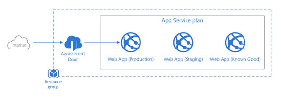

# Azure App Service deployment slot rollback

When you deploy your web app, web app on Linux, mobile back end, or API app to Azure App Service, you can use a separate deployment slot instead of the default production slot when you're running in the Standard, Premium, or Isolated App Service plan tier. Deployment slots are live apps with their own host names. App content and configurations elements can be swapped between two deployment slots, including the production slot.

## Solution overview



## Solution video

To see a video demo of the solution, see the Azure Monitor and [Azure Policy and Azure Kubernetes Service (AKS)  on Channel9]().

## Deploy the solution

Create a resource group for the Azure App Service plan, application, and slots.

```azurecli-interactive
az group create --location eastus --name app-service-slots
```

Use an Azure Resource Manager (ARM) template to deploy the Azure App Service plan, an app, and a last know good slot, loaded with the app in a known good state. To examine the ARM templates used to deploy this solution, visit the [Azure Documentation code samples repository](https://github.com/neilpeterson/samples/tree/appservice-slots-demo/OperationalExcellence/azure-appservice-slots).

```azurecli-interactive
az deployment group create \
    --resource-group app-service-slots \
    --template-uri https://raw.githubusercontent.com/neilpeterson/samples/appservice-slots-demo/OperationalExcellence/azure-appservice-slots/azuredeploy.json
```

```azurecli-interactive
az webapp list --resource-group app-service-slots -output table
```

## Demo solution

# [Azure CLI](#tab/azure-cli)

```azurecli-interactive
curl wh7srjrdniwve.azurewebsites.net
```

```azurecli-interactive
az webapp deployment slot list --resource-group slots018 --name wh7srjrdniwve -o table
```

```azurecli-interactive
az webapp deployment slot swap --slot KnownGood --target-slot production --name wh7srjrdniwve --resource-group slots018
```

```azurecli-interactive
curl wh7srjrdniwve.azurewebsites.net
```

# [Azure Portal](#tab/azure-portal)


---

### Delete solution

```azurecli-interactive
az group delete --location eastus --name app-service-slots
```


## Next steps

> [!div class="nextstepaction"]
> [Set up staging environments in Azure App Service](https://docs.microsoft.com/azure/app-service/deploy-staging-slots)
